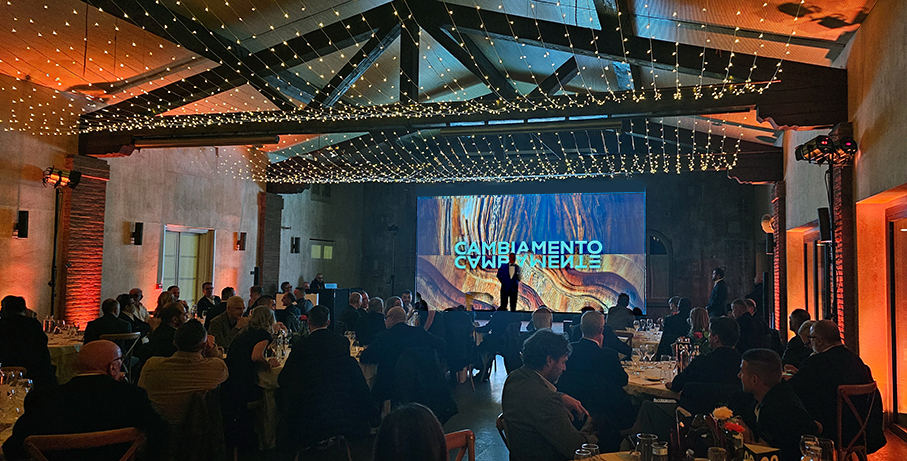

# MEG Living® | Passion, Creativity, Design

>Ieri MEG Trading, oggi **MEG Living®**: una nuova era per un’azienda italiana che **guarda avanti**

Un’azienda, un progetto, un percorso: **MEG Trading nasce nel 2016 a Endine Gaiano** grazie all’approccio unico, e al contempo visionario e pragmatico, di **Andrea Rota**, specializzato nel settore dei pavimenti in legno. Un viaggio imprenditoriale che ha permesso al suo fondatore, insieme al team che lo ha accompagnato, di **affrontare il mercato** con passione e con un occhio attento alle sue evoluzioni e ai trend, alla qualità e in parallelo ad una concreta **sensibilità verso l’ambiente**.

**Ieri MEG Trading, oggi MEG Living®**, questo è il nuovo scenario che è stato presentato in occasione dell’**evento annuale aziendale** che coinvolge anche la **rete vendita e stakeholder**. Un evento che quest’anno ha avuto un significato ancora più profondo perché Andrea Rota ha alzato il sipario sul nuovo percorso di questa azienda dinamica sulle sponde del piccolo lago di Endine. Il pay off **Passion, Creativity, Design** sintetizza in modo chiaro l’essenza di MEG Living®, un percorso rinnovato presentato nel 2025 per festeggiare il decimo anniversario nel 2026.

Partecipando all’evento e parlando direttamente con Andrea, sono stata testimone di questa sua **forte volontà di guardare avanti** per rinnovare la sua azienda, cercando di intercettare **segmenti di mercato complementari** a quelli già esplorati. Questo dedicandosi, soprattutto, alla **progettazione e produzione personalizzata**, taylor made, per clienti più esigenti o comunque più attenti al **design contemporaneo** e alla realizzazione di prodotti frutto del saper fare della grande **artigianalità made in italy**. 

Forte dei pilastri che l’hanno sempre sostenuta e caratterizzata, MEG Living® da oggi è: con un **nuovo asset aziendale** atto a definire in modo più esplicito le collezioni e i segmenti proposti; una **nuova immagine**, moderna ed elegante unita ad un **marketing più mirato**. Svelata quindi la nuova pagina ricca di obiettivi che vuole presiedere il mercato attraverso l’innovazione, partendo proprio da se stessa.

Tra i prodotti dell’azienda, **Pavimenti in legno, in SPC, melaminici, IDROWOOD** ovvero la collezione rivolta a chi ama coniugare innovazione, estetica e sostenibilità; **Wall – i pannelli decorativi da interni** e non ultimo **Ebané**, una denominazione affascinante che rimanda all’antica arte ebanista, una unit di MEG LIVING® dove il parquet diventa arte, in** legno 100% Made in Italy e lavorato con sapiente maestria artigiana**. Una punta di diamante per i clienti più esigenti che desiderano **parquet su misura**.

MEG LIVING® si rivolge a target diversi, **dall’ambiente domestico all’ufficio sino a grandi spazi commerciali e di aggregazione**. Questa miscellanea ha un comune denominatore che l’Azienda porta avanti con orgoglio: poter offrire **prodotti competitivi e performanti** e un **servizio di alta qualità**, dalla scelta del prodotto alla logistica, dalla consulenza all’assistenza tecnica e operativa.

“_Siamo esploratori con la passione per il design degli spazi in cui viviamo_” è ciò che dichiara **Andrea Rota, CEO di MEG LIVING®**. Un DNA chiaro che racconta questa new era aziendale, e prosegue dicendo: “_Questa passione è alla base della nostra filosofia e ci guida, ogni giorno, nella ricerca dei migliori produttori mondiali per selezionare le più belle collezioni di pavimenti in legno, laminati, ecoresilienti, SPC e pannelli di design per interni… Ci piace esplorare, è fondamentale la nostra ricerca rivolta a prodotti esteticamente belli e innovativi, siamo molto attenti al servizio, alla qualità e alle esigenze del mercato, con un occhio particolare alla sostenibilità_”.

Dal 2024, infatti, è in atto un progetto che testimonia il **forte legame di MEG LIVING® con l’ambiente** che nel 2026 verrà raccontato nel dettaglio del suo percorso ed evoluzione, come svela Andrea: “_Partendo da un bosco di castagne…_”.

**MEG Living®**
È una società italiana fondata da Andrea Rota nel 2016 che si occupa di design per pavimenti e pareti per casa, office, grandi spazi commerciali e hospitality. In questi anni Meg Trading ha saputo sviluppare notevoli competenze e conoscenze grazie ad una forte esperienza nel settore dei pavimenti in legno. Selezionano a livello mondiale per proporre al mercato italiano le più belle collezioni di pavimenti in legno, laminati, ecoresilienti, vinilici e pannelli di design per interni. Per i clienti più esigenti hanno creato Ebané, un laboratorio artigianale per la realizzazione di parquet su misura. MEG LIVING® è anche impegno concreto verso l’ambiente, la sostenibilità, oggi e nel futuro.

info@megliving.com

