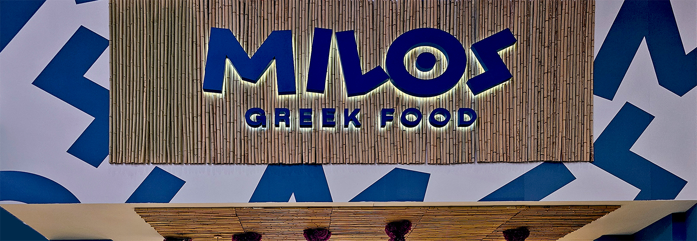
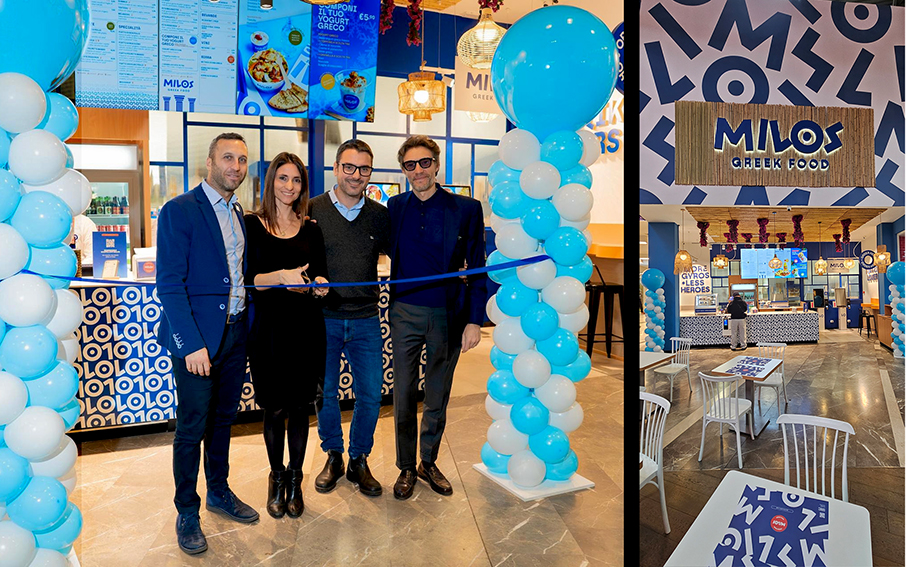
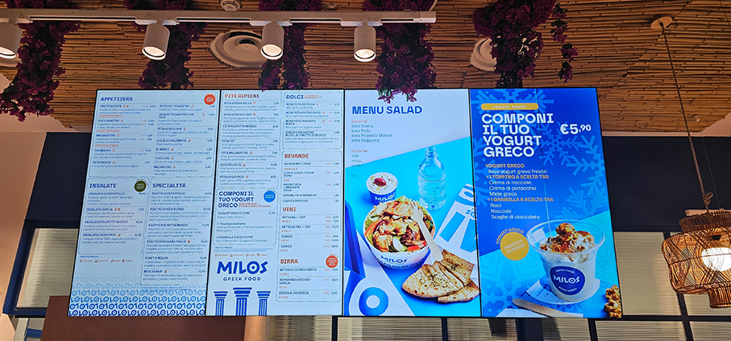
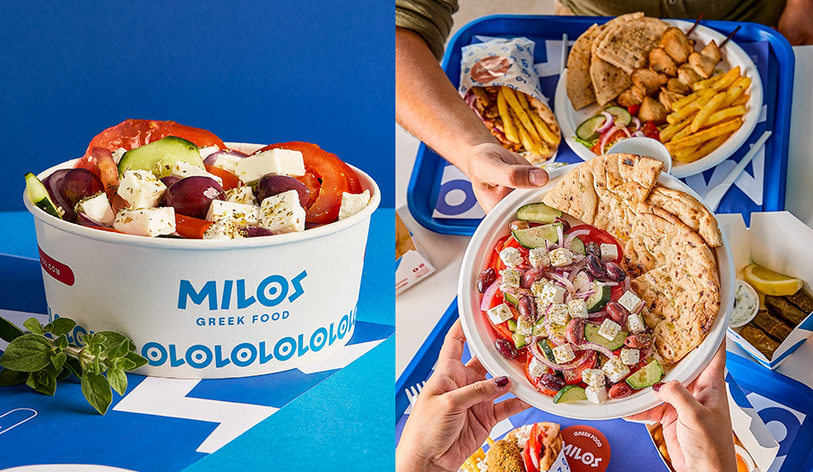

# MILOS GREEK FOOD - fast-casual in chiave Greek Chic

>**Good, Fresh, Greek**: uno slogan che racchiude ricette genuine, ingredienti autentici, prezzo accessibile 

**La cucina greca conquista Milano** con la sua anima mediterranea: fresca, sana e sorprendentemente familiare. **Sapori tradizionali, ingredienti genuini** e un format dall’estetica attuale che trasforma il fast-casual in **un’esperienza Greek chic, autentica e accessibile**. Cibo etnico/mediterraneo come alternativa alla pizza e al fast food.

**MILOS Greek Food**, giovane brand italiano nato a Roma nel 2025, approda per la prima volta nell’area Milanese, identificata fin dall’inizio come una delle piazze più strategiche, con l’apertura di un nuovo locale all’interno del **Centro Commerciale Milanofiori di Assago**. E' il primo marchio sviluppato da Milos Holding, società nata dalla collaborazione tra **Spoon Brands** e gli imprenditori **Yousef Sharafi e Giorgia Silenzi**, già fondatori di realtà di successo come La Cannoleria Siciliana, insieme a Saverio Chiostro. 

Il menu offre tutte le specialità iconiche della tradizione ellenica: **pita con gyros e souvlaki**, **insalata greca con feta DOP**, le immancabili **patates insaporite con spezie mediterranee**, **moussaka express**, una selezione di dolci ispirati ai sapori dell’Egeo e lo **yogurt greco**. Tra i prodotti più amati, le pita gyros e l’insalata greca tradizionale. Tutte le preparazioni vengono realizzate nel rispetto delle ricette originali e con ingredienti autentici, come l’olio extravergine d’oliva greco.

L’ambiente del locale richiama **l’atmosfera delle isole greche con tonalità mediterranee** interpretate in chiave contemporanea. Complice anche il packaging accattivante, sfizioso nei colori, bianco e azzurro, per sentirsi immediatamente trasportati in un angolo di Grecia, e **sostenibile nei materiali**: le olive Kalamata, l’hummus, tzatziki e melanziki vengono serviti in contenitori di carta che ricordano quelli dei gelati.

**Vini e birre sono d’importazione**, come la **Retsina** che, con il suo aroma di resina, catapulta nell’atmosfera estiva di un’assolata isola greca, senza dover prenotare un volo per Atene.

I locali MILOS sono dotati di **kiosk digitali** interattivi con touchscreen dove i clienti possono vedere il menu, personalizzare i piatti, ordinare e pagare in autonomia, senza l'intervento del personale. Si possono fare gli **ordini anche scaricando la app**,in un attimo, saltare la fila, accumulare punti, vincere premi e ricevere offerte esclusive, riservate solo ai veri intenditori di cibo greco.

