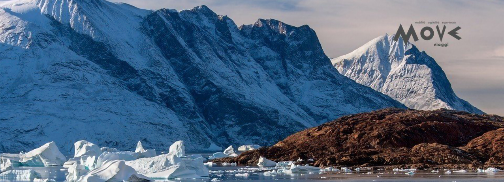
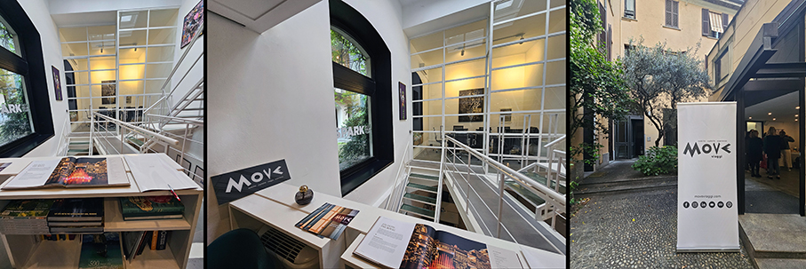
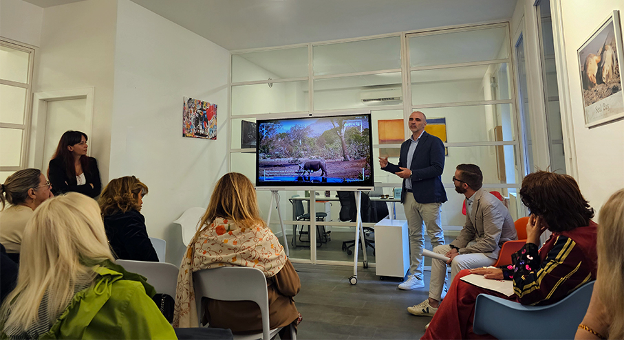
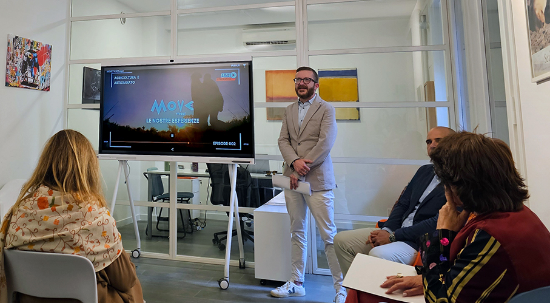

# MOVE VIAGGI – turismo di qualità 

>Un modello di **turismo ed eventi** fondato su qualità, persone e sostenibilità: Move Viaggi propone esperienze di viaggio **selezionate e personalizzate**

_di Maria Rosa Sirotti_

Fondata nel 2021, **Move Viaggi** si posiziona come una realtà imprenditoriale italiana in crescita nei **settori turismo, viaggi ed eventi**, guidata da un team di **consulenti esperienziali** altamente specializzati. La visione è chiara: offrire esperienze di **viaggio ed eventi su misura**, ad alto valore aggiunto, con attenzione concreta alla qualità e alle persone, valorizzandone interessi e passioni. Una nuova idea di turismo e di eventi: più consapevole e personalizzata.
Il know-how multidisciplinare, che spazia dall’operativo al finanziario e amministrativo nei **settori leisure e business**, converge in un unico obiettivo: proporre un modello innovativo che superi i limiti degli standard tradizionali. 

La vera novità introdotta da Move Viaggi è il **ruolo centrale del consulente** che diventa un partner strategico, accompagnando il cliente in ogni fase, dalla progettazione all’assistenza, garantendo **personalizzazione, competenza e supporto** ben oltre le logiche del fai-da-te digitale. 
Questo approccio si articola in quattro direttrici: **Design** progettazione su misura, **Access** accesso a esperienze esclusive, **Execution** coordinamento impeccabile dall’idea alla realizzazione e **Continuity** una relazione continuativa con il cliente.
Per assicurare tale eccellenza, Move Viaggi si avvale di un **network globale di brand di luxury hospitality**, istituzioni culturali, fornitori privati ed esperti locali, operando senza limiti geografici o esperienziali. 
Con una struttura articolata e in evoluzione, si conferma piattaforma integrata di consulenza e servizi, capace di **connettere persone, esperienze e territori** attraverso un approccio distintivo e orientato al futuro.

L’**area Mobilità** presidia il segmento del business travel, puntando sulla qualità e sulla cura dell’esperienza. Move Viaggi **supporta le aziende nella gestione delle trasferte** con soluzioni di **Private Transport & Travel Planning**, dall’aviazione privata alla logistica di terra. 
L’offerta nel travel management viene ulteriormente rafforzata dalla nascita di **BT Move**, società sviluppata in collaborazione con BTM.

Il Viaggio rappresenta il cuore dell’azienda, che si posiziona come brand premium consulenziale specializzato nella creazione di esperienze uniche attraverso **Travel Advisory & Experience Design**. Ogni proposta, dall’enogastronomia all’arte, dalla musica allo sport, punta a creare momenti memorabili, supportati da un’**assistenza operativa 24/7**.

L’**area Eventi** completa l’offerta, con servizi per meeting, convention, viaggi incentive e progetti speciali. Il **MICE & Strategic Consulting** progetta retreat e programmi di incentive ad alto impatto. Dal 2024, **Spark società interna a Move Viaggi**, gestisce eventi creativi end-to-end, dal concept alla realizzazione.

Oggi il brand conta **otto filiali nel Nord Italia, la sede centrale a Milano** e una rete di agenzie associate. Opera nel mercato B2C, con clientela italiana di f**ascia medio-alta**, e nel B2B, collaborando con aziende e agenzie di viaggio, tramite un marketplace che consente loro di accedere a contratti, accordi commerciali e servizi.

Attiva nell’outgoing e nel supporto a viaggi incoming in Italia, l’azienda sviluppa esperienze internazionali e valorizza il territorio nazionale. I numeri a fine 2025 confermano la solidità del modello: un giro d’affari di oltre 21 milioni di euro annuo, più di 20.000 clienti serviti, oltre 500 Global Partners e più di 400 esperienze tailor-made realizzate nei settori sport, musica, arte, cultura e food & wine.

Move Viaggi è una **società benefit**, con un impegno concreto a generare un impatto positivo attraverso iniziative sociali, piani di benessere aziendale e la promozione di un turismo responsabile. La **sostenibilità ambientale, sociale ed economica** rappresenta un pilastro strategico ed è integrata nel modello di business, con il supporto di Assobenefit, per gli aspetti normativi e strategici. 

**MOVE SRL** società benefit
Via Palermo 20 – 20121 – Milano
**www.moveviaggi.com**

