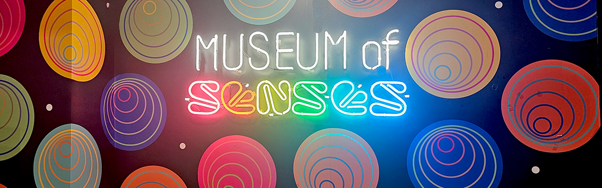
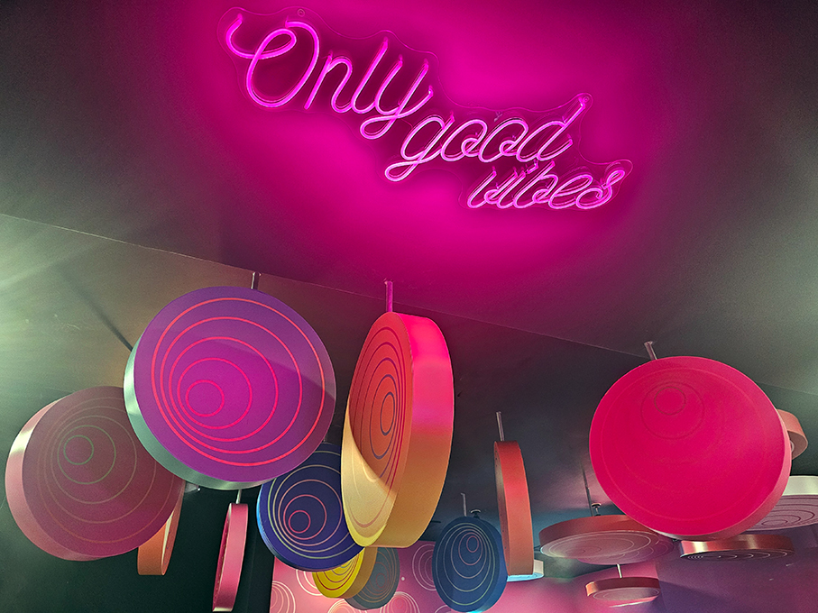
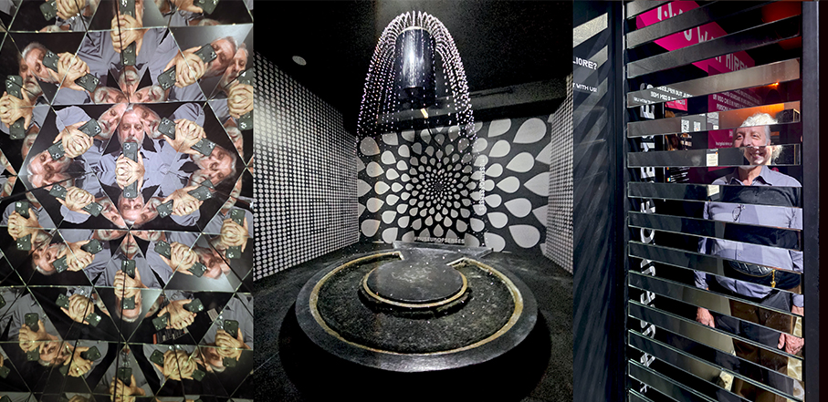
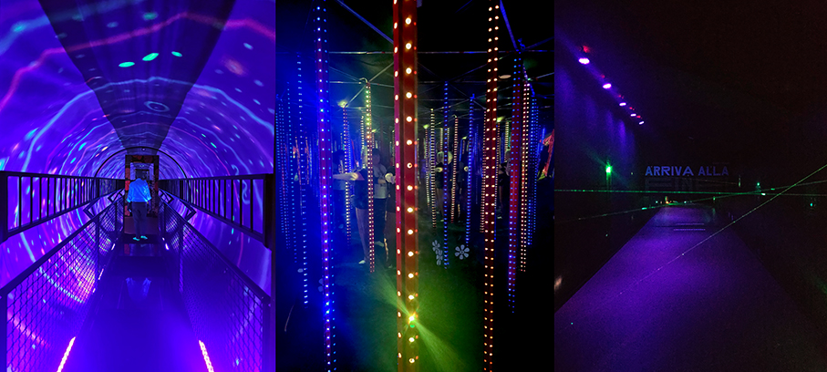
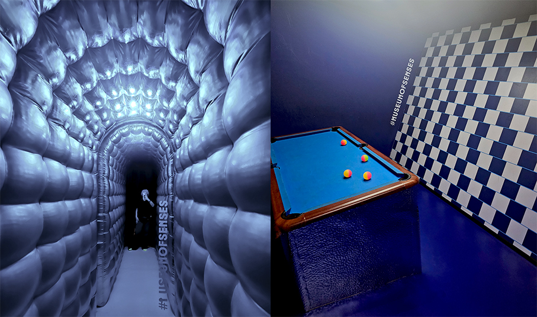
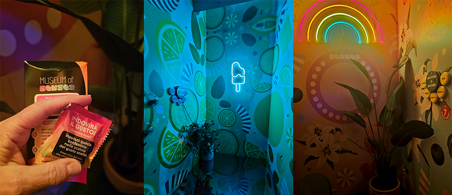
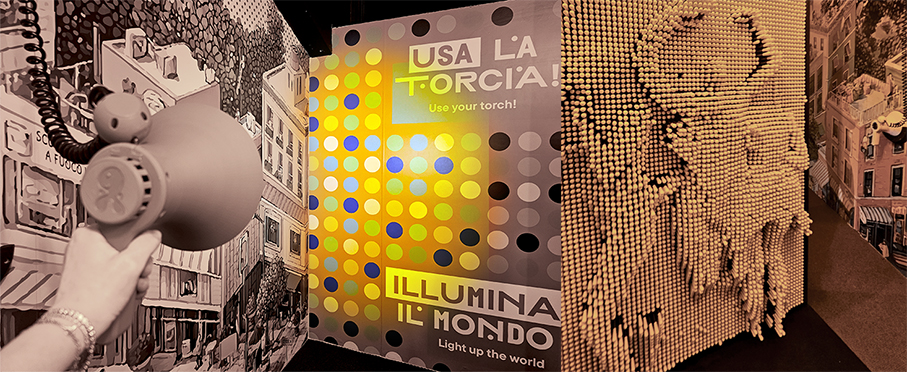
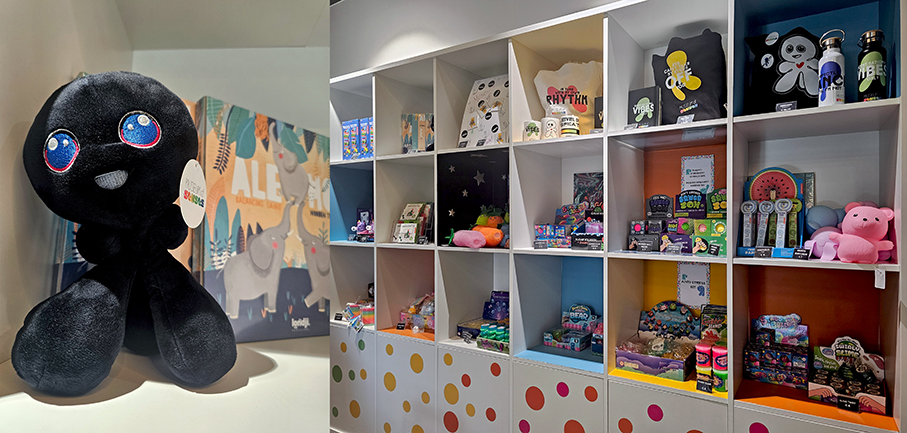

# Museum of Senses - Milano

>Un museo interattivo per **ingannare il cervello e stimolare i sensi** divertendosi

Il **Museum of Senses** di Milano, situato in Viale Monte Grappa 10, rappresenta un'evoluzione dei **musei interattivi contemporanei**. Inaugurato a marzo 2025, si sviluppa su uno spazio di tre piani dedicato all'esplorazione dei limiti della **percezione umana attraverso la scienza e il gioco**. Un centro esperienziale che combina **neuroscienze, fisica e psicologia** per sfidare la realtà quotidiana. 

La visita, della durata di circa **60-75 minuti**, non è solo un'esperienza visiva ma coinvolge tutti i sensi, inclusi l'equilibrio e la propriocezione. E’ **consigliato per le famiglie con bambini e per le scuole**, con percorsi didattici personalizzati che collegano le installazioni ai programmi di fisica e biologia. Il museo **organizza feste di compleanno** per gruppi di 10 bambini. 

Il museo ospita oltre **50 installazioni** progettate per ingannare il cervello e stimolare i sensi. Tra queste: 

• **Acqua Levitante**: Un'illusione fisica dove l'acqua sembra scorrere dal basso verso l'alto sfidando la gravità.
•	**Labirinto di Specchi**: Un intricato gioco di riflessi che altera la percezione della profondità e dello spazio.

• **Stanza di Ames e Stanze Sottosopra**: Ambienti inclinati o invertiti che trasformano le proporzioni umane o l'orientamento spaziale, ideali per contenuti visivi creativi.

• **Tunnel di Vortice**: Un cilindro rotante che genera una forte illusione di instabilità, testando il senso dell'equilibrio.
• **Labirinto Laser**: Un test di agilità e coordinazione dove i visitatori devono evitare fasci di luce.

• **Esperienze Monocromatiche*+: Zone che alterano temporaneamente la visione dei colori, mettendo alla prova la retina.

Per alcune installazioni è obbligatorio l'uso di calzini specifici antiscivolo per garantire sicurezza e igiene. **SenseKit**: spesso incluso nei biglietti acquistati online, comprende i calzini  antiscivolo (obbligatori per le superfici tattili) e una Taste Box per l'area del gusto. 

Il percorso termina in un **Gift Shop** specializzato in puzzle, giochi ottici e gadget legati al mondo dei sensi. 

**Orari di Apertura**:
Lunedì - Venerdì: 10:00 – 20:00
Sabato - Domenica: 09:00 – 20:00

_Ph. Credits: Maria Rosa Sirotti_
