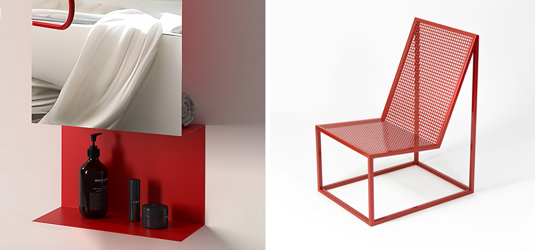
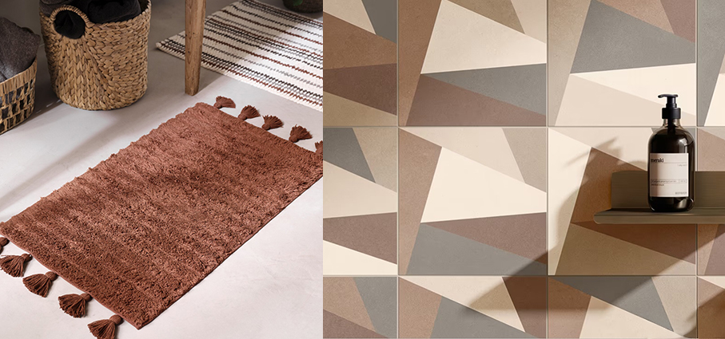
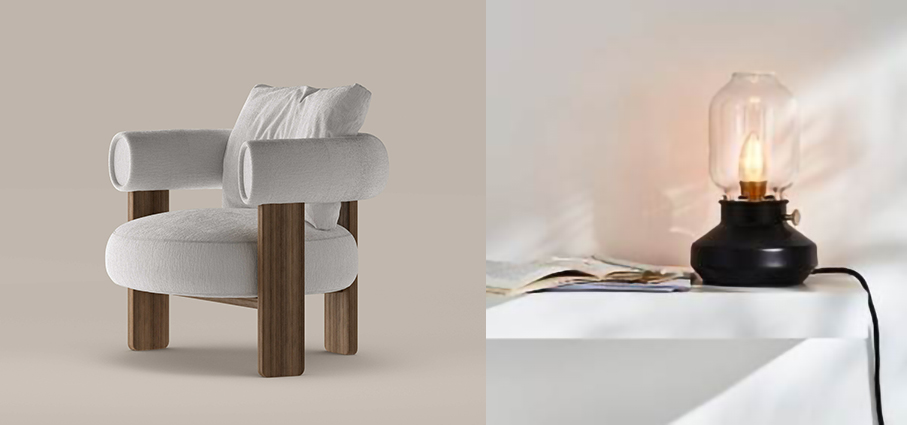
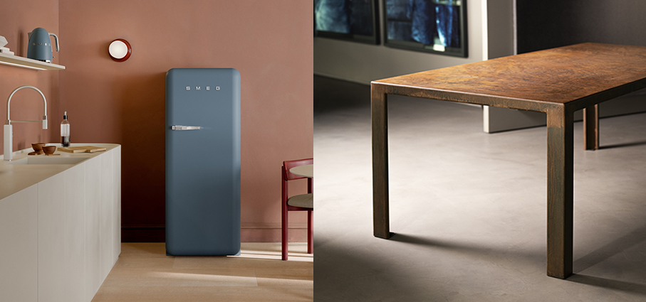
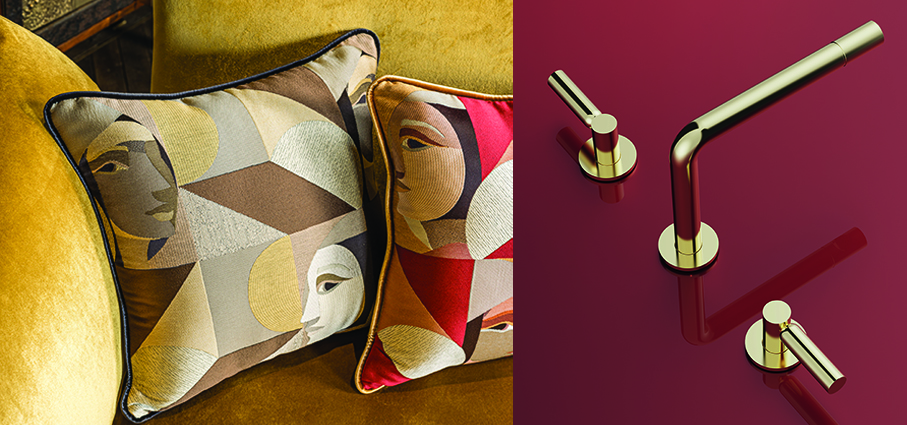
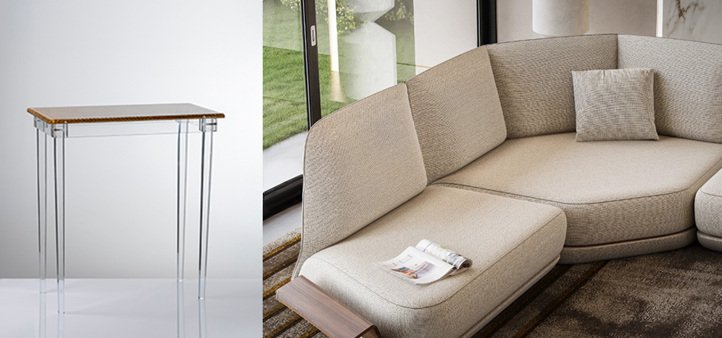
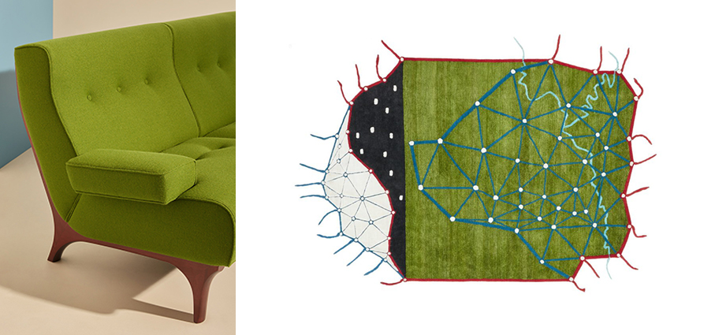

# Natale con arredi e complementi di design

>A Natale **regaliamo arredi e complementi** per rendere la nostra casa e quella dei nostri cari sempre più confortevole e personalizzata

**Old - Progetto Group** oggetto, contenitore, riflesso. Nasce da una semplice piega, ma racchiude una sofisticata logica funzionale: Fold è lo specchio contenitore progettato da Bruna Rapisarda per rispondere alle esigenze dei bagni piccoli, contemporanei, dinamici. Il rosso diventa materia progettuale, tra suggestioni vintage e visione pop contemporanea.

**Sedia 225 - Be(Forma)** firmata da Matteo Francesco Greco. La seduta si veste di rosso per accendere l’atmosfera natalizia. Linee essenziali ispirate dalle idee della scuola del Bauhaus, rielaborate in chiave contemporanea, linee semplici e senza orpelli, elementi spaziali che si alternano in equilibrio. Un oggetto funzionale dalla struttura leggera e un’anima artigianale, che si fondono in una sedia di design per raccontare l’eleganza del quotidiano. Perfetta come proposta regalo per le feste, dona carattere agli interni e si trasforma in un dettaglio scenografico che celebra la convivialità. 

**Nordic Mood – Svarte - JYSK** Il trend nomade trae ispirazione dalle tonalità calde e terrose della natura. Colori bruciati come argilla e sabbia scura, combinati con dettagli metallici dorati, creano un’atmosfera quasi sensuale in bagno. Tappetino bagno con morbide frange in color argilla rossa.
 

**Terrae – Casalgrande Padana** nata dall’incontro tra artigianalità e innovazione,  si ispira al fascino senza tempo delle terrecotte. Coniuga l’essenza e la classicità della terracotta rivisitata in chiave moderna con la forza e praticità del gres porcellanato di ultima generazione. Colori vibranti, luminosi, avvolgenti e rigeneranti, colori delicati, discreti, riservati e accoglienti, le nuances terrose dal forte impatto decorativo tornano protagoniste dell’interior design.

**Bull – Bonaldo** è un dialogo armonioso tra opposti: la solida struttura in legno massello a tre gambe si contrappone alla morbidezza accogliente dello schienale, dando vita a due anime complementari che fondono forza e delicatezza. La seduta rotonda fa da contrappunto all’elemento tubolare a sezione ellittica, che si estende con continuità da schienale a bracciolo in una forma fluida e avvolgente. Il cuscino dello schienale, con la sua marcata morbidezza, introduce una nota di rilassatezza.

**Tärnaby -  Ikea** Ispirata alle tradizionali lampade a cherosene, la lampada da tavolo diffonde una luce calda e regolabile che crea un’atmosfera intima e rilassante. Perfetta sul comodino o su un tavolino accanto alla poltrona, aggiunge un tocco di charme e comfort a ogni angolo della casa, invitando a rallentare e godersi la quiete delle sere invernali.

**Frigorifero Storm Blue – Smeg** l'iconico frigorifero colorato dal design d'ispirazione 50's style si tinge del nuovo colore Storm Blue. Con cella freezer interna, perfetto per dare carattere alla cucina o al living senza rinunciare alle performance di raffreddamento e alla comodità di interni pratici e funzionali. Il sistema Multiflow garantisce una distribuzione uniforme dell'aria fredda all'interno del frigorifero. La classe climatica SN-T rende l'apparecchio idoneo per funzionare a temperature ambiente tra i 10°C e i 43°C. Il compressore inverter diminuisce i livelli di rumore e vibrazioni, per un ambiente silenzioso e confortevole.

**Novo - Dodi.** Linee pulite, struttura solida e leggerezza visiva: il tavolo in corten che unisce sobrietà e raffinatezza con un’anima decisa La collezione in corten rappresenta un incontro perfetto tra design essenziale e materia viva. Il nome stesso, Corten, racchiude le sue principali caratteristiche: deriva dalla combinazione delle parole inglesi CORrosion resistance (resistenza alla corrosione) e TENsile strength (resistenza a trazione). Si tratta di un metallo ‘vivo’, che non teme gli agenti atmosferici; al contrario, trova la sua massima espressione negli spazi aperti grazie alla sua straordinaria capacità di autoproteggersi dalla corrosione. Nel tempo, la tonalità della sua superficie evolve, assumendo un raffinato colore bruno.

**Iside & Osiride - Alessandro Bini** un capolavoro di tessitura su disegno d’artista, dedicato a decorazioni lussuose e contemporanee. Manufatto di grande pregio, prosegue il progetto “Dai fasti del passato verso scenari futuri” iniziato nel 2024 e originato dal prezioso tessuto lampasso “Berenice” con una figura di donna dell’antico Egitto. L’eleganza raffinata dei filati e del disegno, il fascino della seta e le elaborate texture Jacquard a lampasso mixate in sofisticate geometrie fanno di questi tessuti la massima espressione dell’alta artigianalità e del know-how di Alessandro Bini.

**Side – Rubinetterie Stella** un prodotto sofisticato e con un elevato livello di personalizzazione grazie a lavorazioni meccaniche eseguite in piccoli lotti, con controlli a ogni passaggio e un elevato tasso di artigianalità. Un design essenziale e sofisticato, possibilità di scegliere tra numerose personalizzazioni: partendo dal classico PVD, le opzioni spaziano tra pregiati marmi le cui venature creano interessanti sfumature e la nuova speciale finitura Soft Touch, piacevole e morbida al tatto.

**Invisibili – Mario Luca Giusti** la prima collezione di complementi di arredo prodotta in edizione limitata. Il progetto si sviluppa in una serie di oggetti per l’arredamento che soccorrono il mobilio classico di ogni abitazione, interpretati come invisibili punti di appoggio per i piccoli accessori della vita quotidiana e pensati per spazi contemporanei e minimali. Il concept della collezione si racconta attraverso l’elegante consolle, nella variante rettangolare James o quadrata Bond, he combina cristallo sintetico trasparente con un piano di paglia di Vienna intrecciato dall’effetto retrò.

**Orizzonte - Pininfarina per Reflex** un divano componibile che offre un’ampia varietà di moduli e accessori: dalla seduta tradizionale, alla curva, fino alla doppia seduta e all’isola. Ogni modulo può vivere autonomamente o combinarsi con gli altri, creando soluzioni su misura. L’elemento distintivo è una linea orizzontale che attraversa ogni pezzo, separando la parte superiore da quella a terra. Questo non solo crea un fil rouge visivo tra i vari elementi, ma introduce anche un’innovativa funzione: nella sezione laterale del taglio è possibile inserire inserti in legno, trasformandoli in side tables rialzati o tavolini di connessione tra due moduli. 

**Sir 73 – Exto** poltrona e divano, disegnati nel 1965 da Eugenio Gerli, antesignano del grande successo del design italiano e proiettato nel futuro per creare design iconici, vengono oggi rieditati da Exto, in accordo con gli eredi. Questi progetti di Gerli vogliono rappresentare il “made in Italy” nel mondo, sia per il design che per la qualità dei mobili. Struttura esterna e gambe in massello di mogano e struttura interna in multistrato e ferro. Seduta, schienale e braccioli imbottiti con cinghie di gomma, in diverse densità.
Rivestimenti esterni in pelle o tessuto.

**Topographie Imaginaire – Nodus** appartiene alla collezione High Design Rugs.  La topografia di un territorio immaginario è il tema di questo tappeto moderno in lana, seta di bambù, canapa e lino. Nella parte alta del manufatto è riconoscibile una zona montuosa. Nell’ampia parte bassa è posizionata una pianura solcata da corsi d’acqua. In tutto il disegno sono rappresentati alberi, uniti tra loro in una rete immaginaria di capillari. Un tappeto dalla forma irregolare che è un omaggio alla bellezza della natura e un monito a preservarla intatta.

