# Nausika Group – il Lago di Como più esclusivo e autentico

>Nausika Group è un ecosistema integrato che unisce **marina, servizi nautici e ospitalità di alta gamma** nel cuore dell'Alto Lario del **Lago di Como** e in **Costa Smeralda**
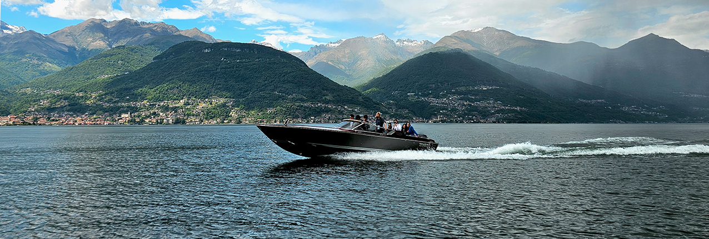

Un gruppo imprenditoriale italiano oggi attivo nei **servizi nautici, marina & storage management, servizi di noleggio e vendita di imbarcazioni**, oltre **all'ospitalità di alta gamma**. 
La storia inizia nel 1971 quando la **Famiglia Giardelli** fonda il **Centro Nautico Alto Lario di Colico**, evolutosi nell'attuale struttura che oggi festeggia 55 anni. Grazie a una visione moderna, si configura come uno **Yacht Club** con servizi sempre più specializzati, trasformando Colico in uno dei principali hub nautici dell'Alto Lario e il più strutturato del Lago di Como.

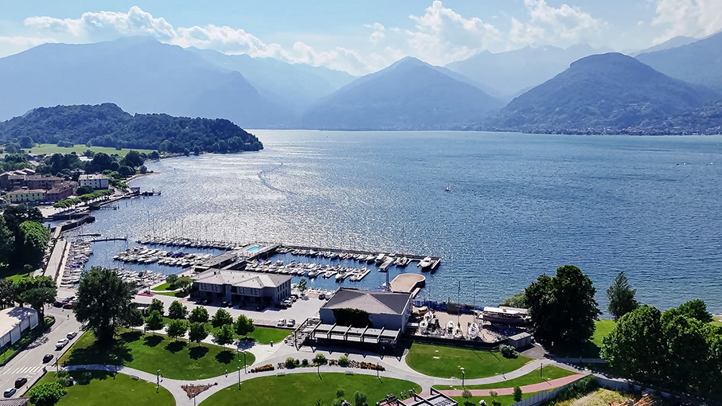

_Nausika Group opera attraverso tre principali asset strategici_ - racconta **Giada Giardelli**, proprietaria del gruppo -: _la marina e i servizi nautici di Nausika Lake Como (dove si sviluppano anche le experience sul lago con i servizi di boat rental e tour in barca) e Nausika Costa Smeralda, a cui si affianca l'offerta hospitality di Lago Dorato Marina Lodge, Villas & Apartments, presente in esclusiva sul Lago di Como_.

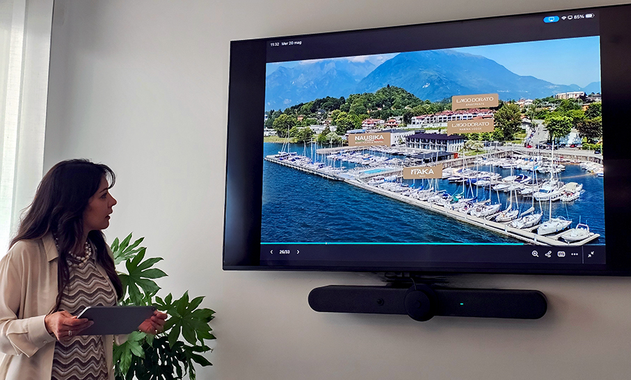

Il cuore delle attività si trova a **Colico**, dove il gruppo gestisce **Nausika Lake Como**, storico yacht club dell'Alto Lago e oggi una delle marine di riferimento per la nautica del Nord Italia. Reduce da un totale rinnovamento nel 2025, la struttura offre **200 posti barca fino a 18 metri** con finger galleggianti, uniti a un pacchetto completo di servizi annuali: **ormeggio, manutenzione avanzata, noleggio, tour guidati e vendita di imbarcazioni**. Il gruppo è partner ufficiale di brand nautici di prestigio come **Comitti, Invictus e Capoforte**, di cui cura anche il service tecnico autorizzato.

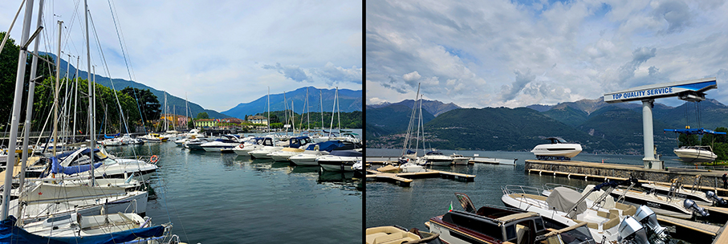

Il cuore operativo e tecnologico è il **Colico Work Center**, un centro logistico che ospita un'officina meccanica, reparti di rimessaggio e un'area di 260 mq dedicata esclusivamente alla verniciatura. 
Grazie a questi standard elevati, Nausika Group attrae **diportisti da tutta Italia e d'Europa** alla ricerca di **alta qualità, esperienze autentiche e massima professionalità**, consolidando la sua forte attrattività verso **armatori provenienti da Svizzera, Germania, Olanda e Polonia**.

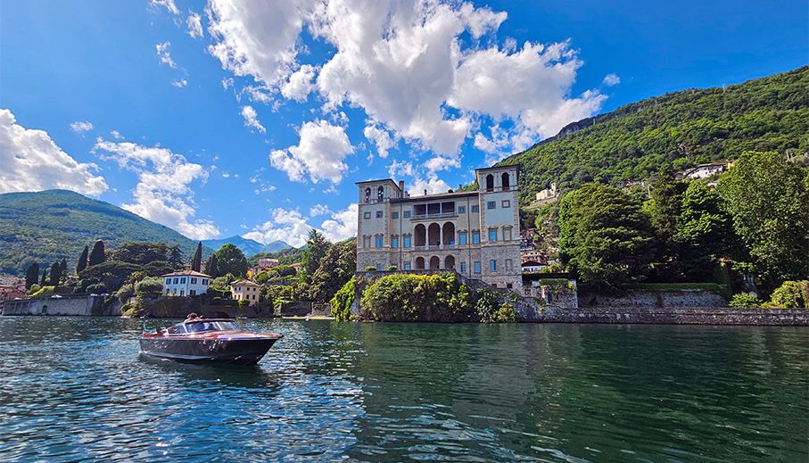

**Turismo Nautico di Pregio: l'Offerta Experience**

Oltre ai servizi di gestione e assistenza, il Gruppo si posiziona come partner chiave nel **turismo nautico di fascia alta attraverso** la divisione Experience, dedicata ai servizi di **noleggio e tour personalizzati** sul Lago di Como. L'offerta si distingue per l'**estrema flessibilità** degli itinerari studiati per valorizzare la cultura, la storia e il paesaggio locale e per l'**eccellenza della flotta**. 

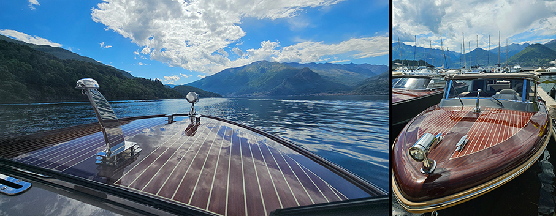

Quest'ultima è stata integralmente rinnovata per la stagione 2026 con l'introduzione di **unità custom, configurate appositamente per le escursioni**. Il servizio prevede formule di **noleggio con skipper o in modalità "self-drive"**, accessibili sia a possessori di patente nautica sia a diportisti amatoriali. 

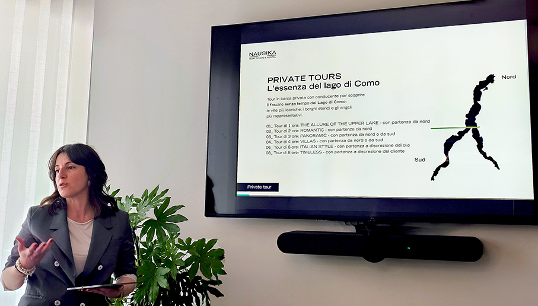

I pacchetti coprono escursioni di varia durata sull'intero bacino lacustre e includono esperienze integrate, capaci di coniugare la navigazione a **percorsi tematici sul territorio, come tappe enogastronomiche, visite culturali e attività** per famiglie.

**Un modello di business integrato tra marina, lifestyle e hospitality** 

Nausika ridefinisce il concetto di **accoglienza nautica** attraverso un modello integrato che unisce **infrastrutture portuali, servizi hospitality** e risposte d'alto livello al segmento lifestyle. La marina non è più solo hub tecnico, ma centro di un network di servizi premium progettato per una **clientela globale esigente**.

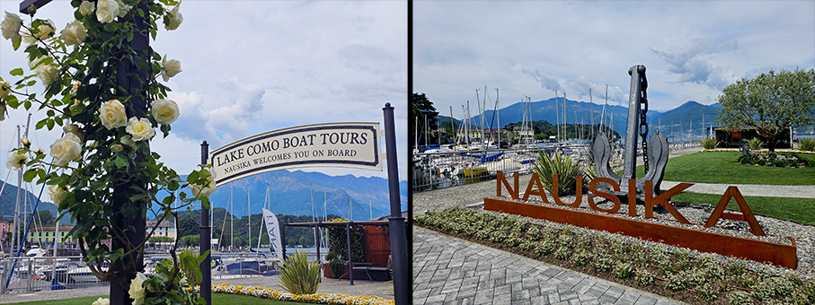

**Itaka Lakeside Lounge Bar e Bistrot**, all'interno dello Yacht Club è strategico sia per i clienti interni (armatori e ospiti delle strutture ricettive) sia per l'utenza esterna, grazie a una **proposta gastronomica ricercata** e a un dehors panoramico fruibile in ogni stagione dell'anno.

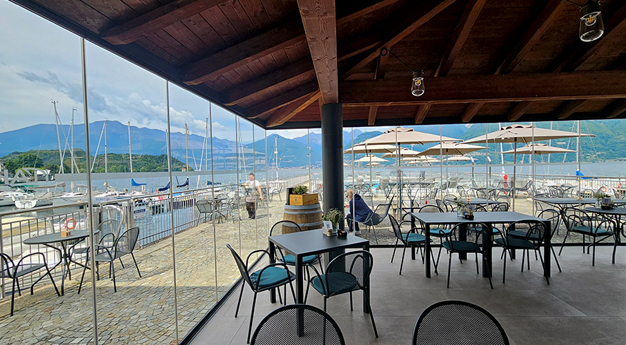

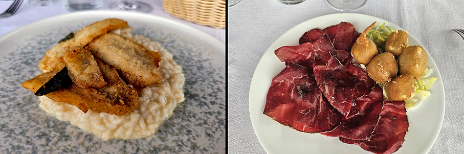

L'estensione naturale dei servizi di accoglienza si realizza nel brand **Lago Dorato – Marina Lodge, Apartments e Villas**, un ecosistema ricettivo che diversifica l'offerta:

•	**Marina Lodge**: inaugurato nel 2025 all'interno dello Yacht Club, coniuga turismo leisure e segmento business attraverso 10 lodge e suite che beneficiano della massima prossimità ai servizi della marina.

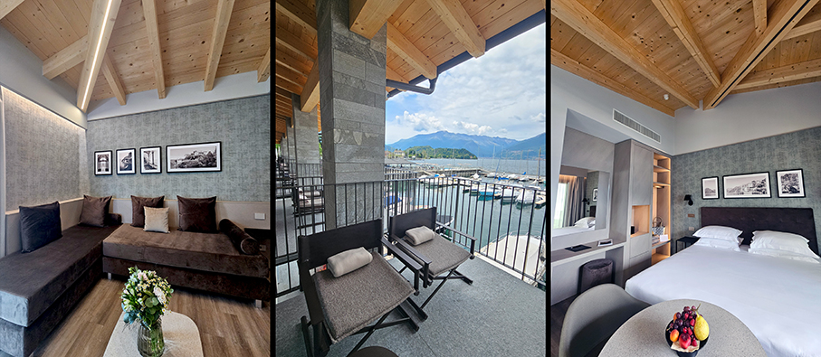

•	**Lago Dorato Apartments**: Soluzioni immobiliari di design di recente costruzione, dedicate a chi ricerca un'esperienza di soggiorno contemporanea e indipendente, senza rinunciare a finiture di pregio.

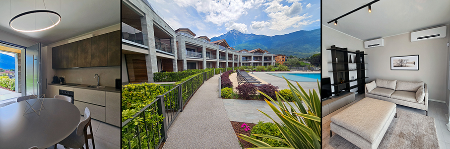

•	**Le Ville**: Tre dimore esclusive alto di gamma (storiche e moderne), dislocate nei punti più panoramici del lago (Cremia, Olgiasca, Colico centro) per intercettare la domanda di luxury hospitality e garantire la massima riservatezza.

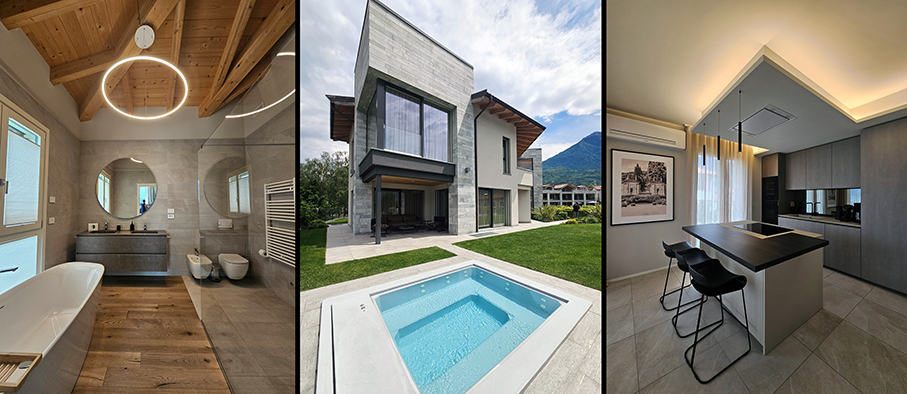

L’interior design delle proposte hospitality è stato curato personalmente da **Sabrina Giardelli**, proprietaria del gruppo: “_Ho pensato principalmente al benessere degli ospiti, che devono trovare un ambiente confortevole e accogliente e, soprattutto, rilassante. Per questo ho scelto colori neutri e morbidi, che facciano risaltare la bellezza della natura e del lago che emergono dalle ampie vetrate perfettamente insonorizzate. I materassi sono di alta gamma ed è disponibile un menù cuscini, per garantire il massimo comfort_". 

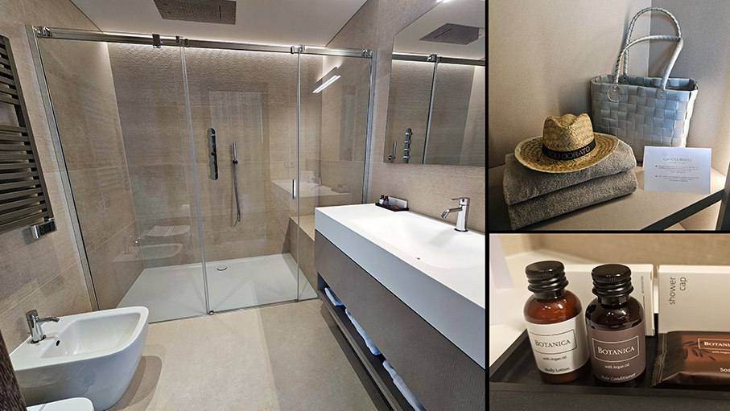

"_Ho pensato anche a una linea di amenities dedicate_ - continua Sabrina - _contenenti olio di Argan e ad alcuni cadeau sempre molto apprezzati: un cappello in paglia per schermarsi dal sole, una shopper impermeabile da portare in barca e durante le escursioni e passeggiate, un prodotto per le labbra contro il vento e il sole_”. 

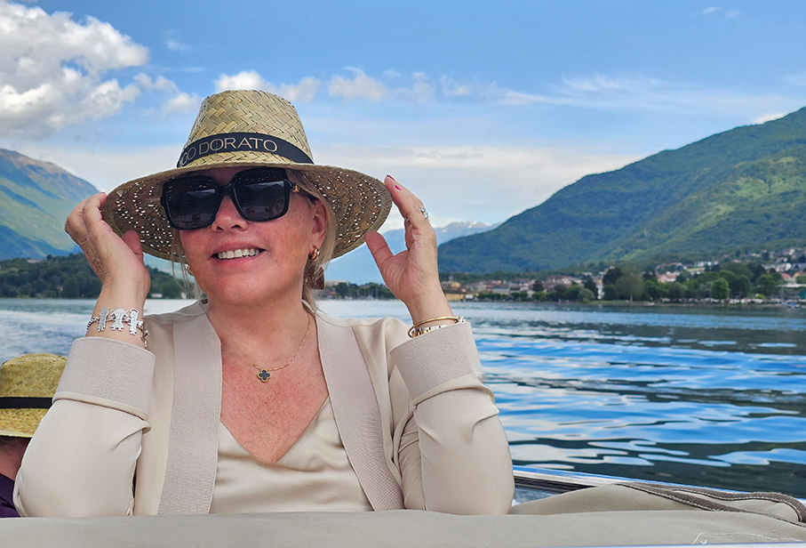

**L'Alto Lario**: 

Il Gruppo consolida così la propria visione di **Stay & Cruise Experience**, un modello integrato che unisce **accoglienza, nautica ed esperienze su misura**, offrendo l'opportunità di vivere il Lago di Como non come semplice meta, ma come **un'esperienza immersiva** a 360 gradi tra **acqua, territorio e lifestyle**.
Nel panorama del Lago di Como, l'**Alto Lario** e **Colico** emergono oggi come territori chiave per lo sviluppo di **modelli turistici evoluti**. Grazie a una posizione geografica strategica e **facilmente accessibile** sia dalla rete aeroportuale milanese sia dai flussi provenienti dal Nord Europa via terra, Colico rappresenta il perfetto punto di congiunzione **tra l'area lacustre, la Valtellina e l'Engadina**.

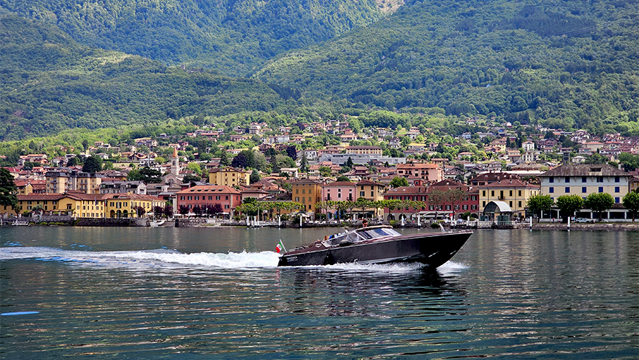

La destinazione si distingue per la capacità di intercettare i macro-trend del turismo contemporaneo, combinando la **sostenibilità ambientale con l'offerta sportiva più avanzata**. Accanto alle discipline d'acqua e ai percorsi cicloturistici, il territorio vanta un'eccellenza nell'intrattenimento sportivo: il **Lario Motorsport**. Struttura di proprietà del Gruppo, si attesta come il **kartodromo indoor/outdoor leader nel Nord Italia**, offrendo un'infrastruttura d'avanguardia per l'utenza privata e il segmento incentive aziendale.

Questo mix competitivo consolida il ruolo di Colico come meta d'elezione per una **clientela internazionale esigente**. Il risultato è un territorio attrattivo sia per il **segmento del lusso sia per il mercato business**, capace di esprimere valore e qualità dell'accoglienza **in ogni periodo dell'anno**.

_Ph. Credits: Maria Rosa Sirotti_

Per maggiori informazioni: **www.nausika.it**

**Nausika Group srl**
Via Montecchio Nord, 21
23823 Colico (LC) | Italia
info@nausika.it
