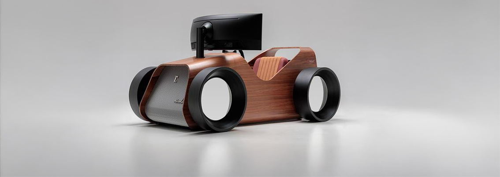
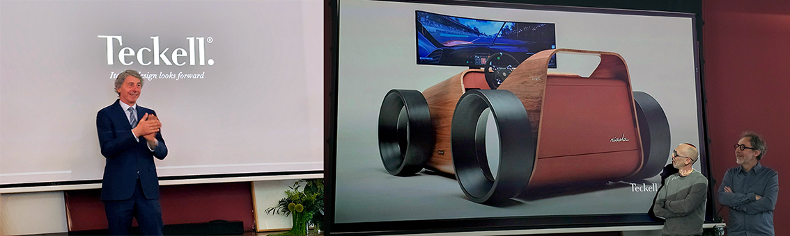
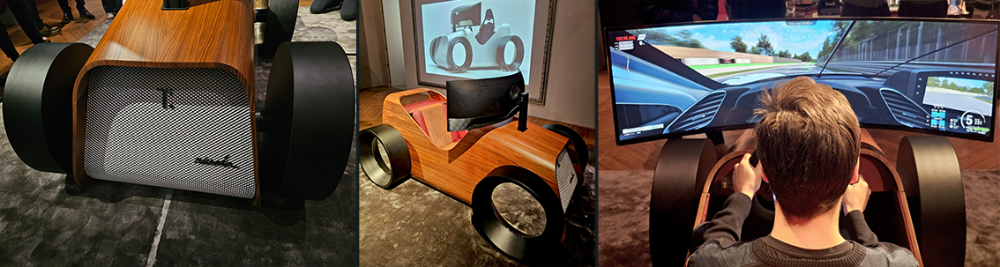
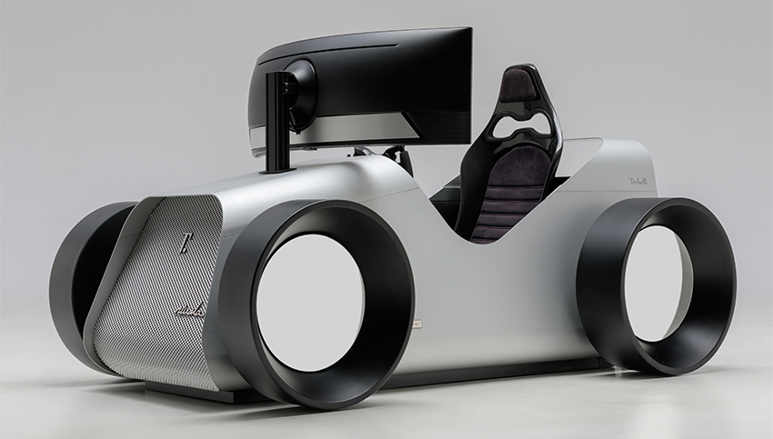
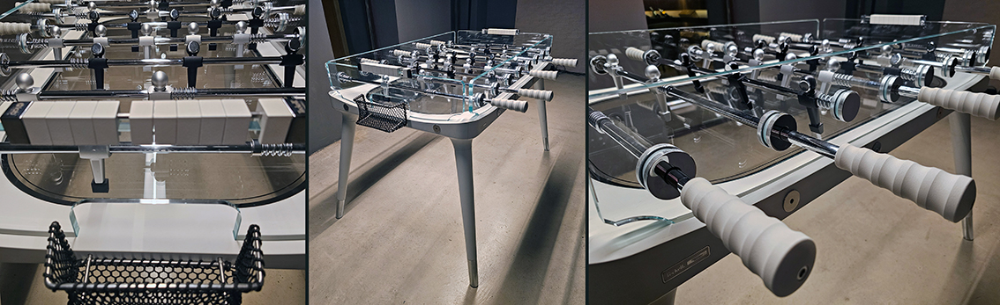
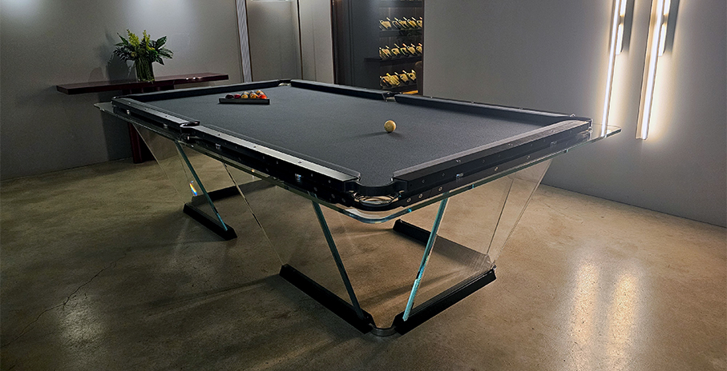

# Nivola by Teckell - simulatore di design 

>Per anni i simulatori di guida hanno parlato il linguaggio della tecnica, **Nivola introduce finalmente quello del design**

Teckell ridefinisce il futuro della simulazione di guida e svela in anteprima stampa la nuova icona del design contemporaneo: **Nivola, il primo simulatore capace di unire elevate prestazioni tecniche e valore estetico** in un’unica straordinaria esperienza. Un’opera che ridefinisce radicalmente i confini del settore del gaming di lusso. 

Fondato nel 2007 da **Gianfranco Barban**, Teckell è un brand italiano specializzato nella creazione di **oggetti di design ludici di lusso**, dove la tradizione artigianale del Made in Italy incontra un’estetica raffinata, una leggerezza visiva, una solidità strutturare e tecnologie d’avanguardia. Il marchio si è affermato a livello internazionale per la sua capacità di **trasformare il gioco in un’esperienza sensoriale e culturale**, reinterpretando oggetti iconici da collezione in chiave contemporanea. 

Firmato dallo **studio Adriano Design, fondato da Gabriele e Davide Adriano**, in collaborazione con **Gianfranco Barban, CEO e Creative Director di Teckell**, Nivola segna un punto di svolta nel mondo dei simulatori con un progetto interamente concepito, disegnato e realizzato in Italia. Nivola si caratterizza per una scocca dalle linee dinamiche e scultoree ispirate alle macchinine da gioco ed è progettata con una curvatura che esalta leggerezza e movimento. L’utilizzo di **materiali pregiati come legno e alluminio**, unito a **lavorazioni artigianali italiane**, come le **sedute in cuoio con finiture cannettate o semipunturate**, valorizzano l’attenzione ai dettagli, espressione di eccellente qualità. La griglia frontale e le ruote con specchiatura completano il progetto, conferendo al prodotto un’estetica sofisticata e senza tempo. Non solo un simulatore, ma anche un **oggetto da vivere e da ammirare**: anche quando non è in uso, la sua sola presenza plasma lo spazio, generando esperienza, conversazione ed emozione.

Disponibile in tre edizioni: **Heritage** è la versione in legno di noce canaletto multistrato curvato, ottenuto da pannelli sagomati con precisione per integrarsi armoniosamente in ambienti raffinati; **Aero** è la linea in alluminio che esprime leggerezza e innovazione contemporanea; **Racing** è la terza variante in alluminio verniciato e omaggia il mondo delle corse vintage con colori vivaci e dettagli distintivi. Ogni modello è **altamente personalizzabile** grazie a configurazioni bespoke, sedute, sistemi di sterzo e upgrade opzionali, mantenendo una produzione limitata e sartoriale che ne esalta l’esclusività.
I sistemi avanzati di **connettività WiFi e il software di gioco** sono sviluppati in Italia, pensati per consentire **esperienze multiplayer** e prendere parte a gare online, garantendo prestazioni professionali ottimali e per essere utilizzati in allenamento da piloti professionisti, permettendo così il raggiungimento di una performance realistica. 

Le collezioni di Teckell includono **tavoli da gioco di design — biliardi, calcio balilla, ping-pong e scacchi** — insieme a oggetti per la casa e orologi scultorei, realizzati in **vetro temperato**, elemento distintivo delle creazioni Teckell, **combinato con marmo, legni massello pregiati e alluminio** lavorati con precisione ingegneristica. 
Perché un oggetto può essere funzionale, ma anche sorprendere e divertire.

_Ph. credits: Maria Rosa Sirotti_