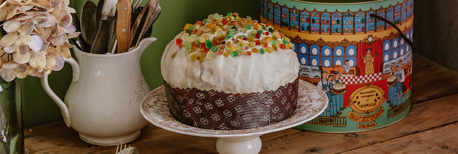
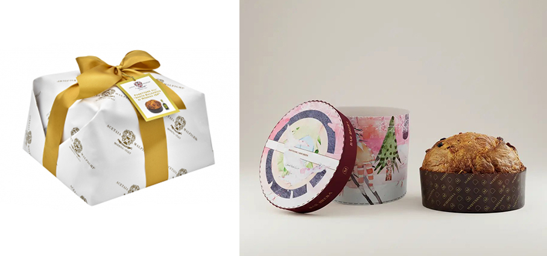
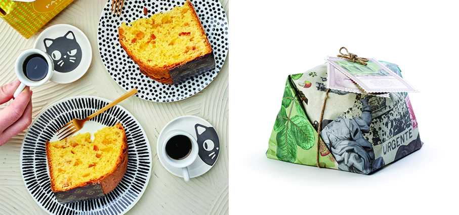
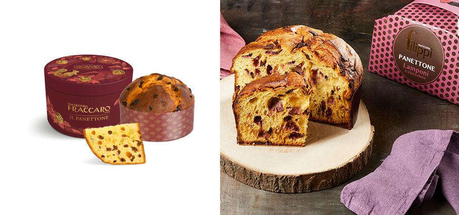
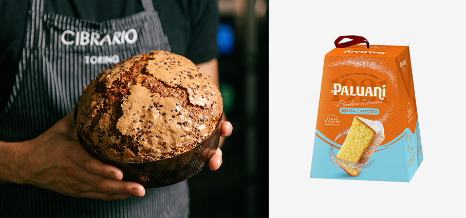
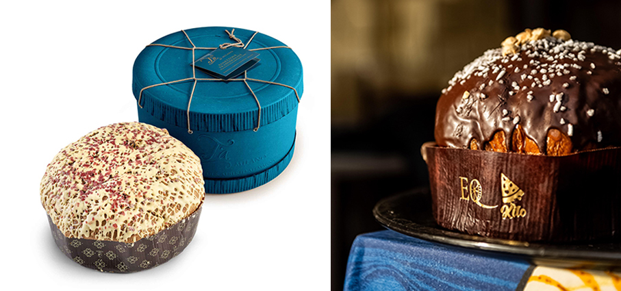
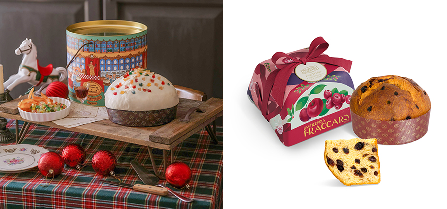
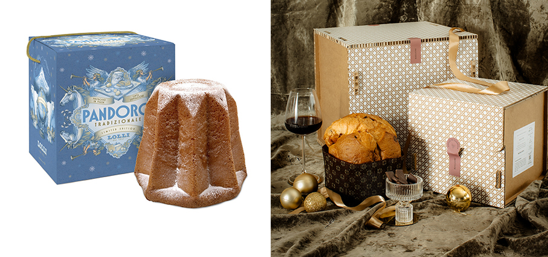

# Panettone che passione

>Non è mai troppo presto per pensare al **panettone o a un dolce alternativo** per concludere in bellezza un pasto natalizio perché, più sono buoni, prima finiscono!

**Panettone all' 'Aceto Balsamico di Modena IGP - Acetaia Malpighi** appartiene alla Christmas Collection, ideale per celebrare le festività con il gusto inconfondibile delle eccellenze modenesi e per un regalo originale e di alta gamma. Il Panettone, la cui fragrante morbidezza è arricchita da golose uvette e farcitura al sapore di Aceto Balsamico di Modena IGP, è una ghiottoneria per intenditori.

**Panettone dell’Arte 2025 - Bar Brera e Pasticceria Martesana** un progetto che torna a unire eccellenza artigianale, arte contemporanea e spirito di condivisione, grazie alla collaborazione con l’Accademia di Belle Arti di Brera, e che si inserisce nel più ampio racconto di una Milano creativa, olimpica e profondamente identitaria. Quest’anno il tradizionale dolce meneghino è avvolto in una raffinata cappelliera, che omaggia le prossime Olimpiadi Invernali, illustrata da Gherardo Quadrio Curzio, giovane artista dell’Accademia di Belle Arti di Brera. All’interno, un impasto soffice e fragrante, impreziosito da arancia siciliana candita, uvetta australiana 6 corone e vaniglia Madagascar pura in baccelli: una combinazione di ingredienti d’eccellenza che esalta il savoir-faire artigianale di Pasticceria Martesana.

**Panettone Limone e Cioccolato Bianco – Pasticceria Filippi** un panettone che si capisce già dalla confezione, di un colore giallo limone. Il cioccolato bianco, dolce e vanigliato si fonde con il sapore leggermente acidulo dei cubetti di scorza di limone canditi. Delicato e delizioso.

**La Santa - Vincente Delicacies** un inno a Sant’Agata, patrona di Catania e all’oro verde di Sicilia. Un omaggio dolce alla fede e alle tradizioni locali, La Santa celebra l’eccellenza del Pistacchio Verde di Bronte DOP, vero re della pasticceria isolana. Ricoperto di cioccolato bianco e granella di Pistacchio Verde di Bronte DOP, farcito con una generosa crema al pistacchio, racchiude in sé tutta la bontà e la devozione della nostra terra. Un impasto a lievitazione naturale, soffice e fragrante, ottenuto con ingredienti di prima qualità, acqua surgiva e il lievito madre curato giorno dopo giorno, per un risultato che conquista per sofficità e digeribilità.

**Cappelliera Premium Rossa – Pasticceria Fraccaro** unica nel suo genere rispetto al resto della gamma tutta in verde. Decorata con illustrazioni realizzate a mano e raffinati dettagli in lamina dorata, custodirà al suo interno un panettone preparato con una ricetta esclusiva – pensata appositamente per questa Special Edition – il Panettone Antico, realizzato con lievito madre vivo e impastato a mano, lievitato 48 ore e arricchito con canditi di arancia e cedro, uvetta australiana e miele.

**Panettone Lamponi e Cioccolato Fondente - Pasticceria Filippi** presenta la sua ultima creazione: un incontro perfetto tra la vivacità del lampone e la profondità aromatica del pregiato cacao Criollo e Trinitario. La farcitura del nuovo panettone, ricca e armoniosa, abbina la dolcezza acidula dei lamponi disidratati all’intensità del cioccolato fondente al 60% ottenuto da cacao Trinitario e Criollo. Quest’ultimo, proveniente dalla regione Chachi Cayapas in Ecuador, è una varietà rara e pregiata, frutto di un lavoro sostenibile e rispettoso delle comunità locali, perfettamente in linea con i valori etici di Pasticceria Filippi, certificata B Corp. 

**Persi Pien - Cibrario Forno Contemporaneo** riprende il più classico dei dolci della tradizione: panettone cioccolato, pesca e amaretto. Prende spunto dalle piemontesissime pesche ripiene, riproponendone una versione creativa in cui alla morbidezza del panettone si unisce la dolcezza della pesca e una nota piacevolmente amara e pungente del connubio classico di cioccolato e amaretto. 

**Pandoro Senza Lattosio – Paluani**  tutta la bontà del Pandoro Paluani in una nuova versione pensata anche per chi ha intolleranza al lattosio. Preparato secondo la tradizione del pandoro di Verona, è realizzato con solo burro delattosato, per garantire leggerezza, sofficità e un gusto delicato, adatto a tutti i consumatori. Senza lattosio, con tutto il gusto di sempre.

**Panettone lamponi e crema di pistacchio ricoperto di cioccolato bianco - T’a Milano** celebra le feste con un dolce che unisce tradizione e creatività: il Panettone in Cappelliera nella raffinata versione con lamponi e crema di pistacchio, impreziosita da una copertura di cioccolato bianco. Una reinterpretazione contemporanea di un grande classico che conquista con la sua soffice fragranza e l’equilibrio perfetto tra dolcezza e freschezza. Dietro ogni fetta c’è la storia di una famiglia che ha fatto della pasticceria milanese un’arte: Tancredi e Alberto Alemagna, pronipoti di Gioacchino Alemagna, portano avanti una tradizione di eccellenza che unisce artigianalità, passione e gusto autentico.

**Panettone Chinotto di Savona, basilico e cioccolato bianco ligure - Jacopo Chieppa** lo chef e lievitista presenta una speciale Limited Edition 2025 è di nuovo un omaggio alla Liguria e ai suoi sapori: un panettone con Chinotto di Savona e basilico, due ingredienti tipici della cucina ligure in perfetto equilibrio tra dolcezza e aromaticità, per un Natale sontuoso e che profuma di mare.

**Panettone Agrumi Siciliani - Caffè di Sicilia 1926 - Coin** la nuova collaborazione tra Alessandro Enrique e il marchio siciliano di caffè e pasticceria. Insieme presentano una collezione limitata di dolci natalizi che unisce moda, gusto e tradizione, con il come protagonista assoluto e una selezione di dolci siciliani rivisitati in versione gourmet. Soffice e fragrante, il panettone artigianale è farcito con una delicata crema agli agrumi, ricoperto da una glassa di cioccolato bianco e impreziosito da frutta candita. Il panettone è racchiuso in una cappelliera illustrata con l’iconica stampa di Alessandro Enriquez “Pasticceria”, in cui è raffigurata la nonna dello stilista all’interno di una classica pasticceria siciliana di una volta decorata con motivi liberty palermitani.

**Panettone Ciliegia di Marostica IGP e Mirtilli – Pasticceria Fraccaro** panettoni e pandori realizzati con 3 giorni di lavorazione, 48 ore di lievitazione con lievito madre impastato a mano. Un omaggio al borgo di Marostica in Veneto, celebre per le sue deliziose e dolci ciliege. Un panettone dal gusto intenso e fruttato, che regala un tocco d’estate e un profumo di sottobosco anche nei mesi invernali.

**Pandoro Tradizionale - Lolli Liquori** preparato con metodo artigianale e lasciato lievitare lentamente in modo naturale, conquista per la sua straordinaria sofficità. Perfetto per accompagnare i momenti più dolci delle feste, è l’alleato ideale per un pomeriggio in famiglia o una serata speciale. Ogni morso regala un’esplosione di gusto pensata per i palati più esigenti. Grazie alla lievitazione naturale e all’uso di ingredienti di alta qualità, il Pandoro Lolli è molto più di un semplice dolce: è una coccola che scalda il cuore e rende ancora più magiche le giornate di festa.

**Narciso Panettone Artigianale - Buglioni** panettone in edizione limitata e numerata con gocce di cioccolato e gocce di Recioto. Nato dalla collaborazione con un laboratorio artigianale di Verona, il Panettone prende il nome proprio da Il Narcisista Recioto della Valpolicella Classico DOCG di Buglioni (vendemmia 2021) utilizzato per creare la gelée che impreziosisce il lievitato.

