# Per tutte le Mamme

>Ogni mamma è un mondo a sé e occorre un **regalo dedicato e personalizzato** per esprimerle il nostro affetto
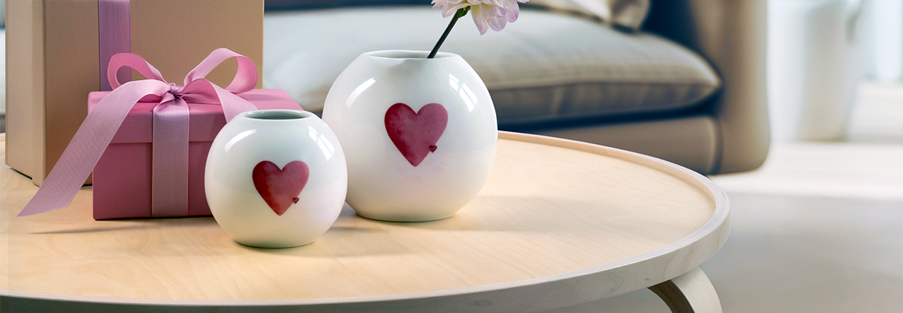

**Love Supreme - Rito X Zhor** è amore puro per sé stessi, gli altri, la vita. Già dal suo incipit con Litchi, Lampone e Ciliegia, questa fragranza colpisce e fa girare la testa. Seguono Accordo Champagne, Rosa Marocchina e Mandorla Amara: così l'amore esplode tra bollicine frizzanti e una profondità inaspettata. Prima di diventare eterno con le note di fondo di Ambra, Vaniglia Bourbon, Miele e Cuoio che scaldano la pelle senza mai andare via. Per la prima volta nel flacone rosso trasparente sfumato, con verniciatura bianca all'interno, e tappo scultura dorato. 

**Maschera Per Capelli - Allycore Hair** trattamento nutriente che dona morbidezza e idratazione senza appesantire. L'olio di cocco mantiene la chioma morbida, mentre l'acqua di riso valorizza la forma naturale dei capelli, perfetta per ricci e mossi. Formula delicata adatta anche alla cute sensibile.

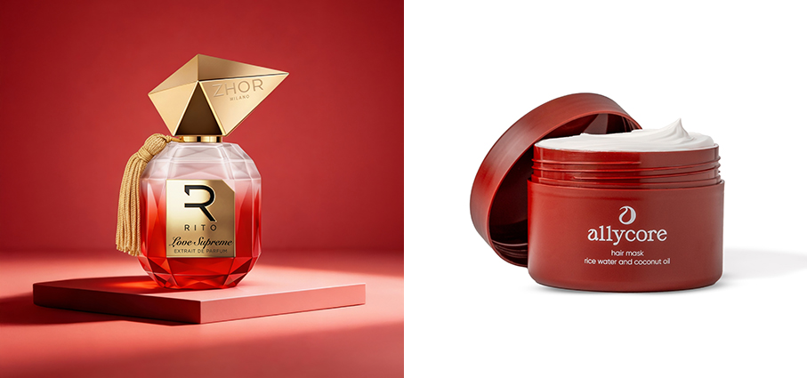

**Spark - Suunto cuffie open-ear** a conduzione aerea per le persone attive che esigono comfort, chiarezza e connessione con l’ambiente circostante, in particolare per i runner. Il design open-ear permette al suono di raggiungere l’orecchio senza ostruirlo, consentendo di restare vigili al traffico, agli altri corridori o ai segnali ambientali, continuando ad ascoltare musica, podcast o effettuare chiamate. Oltre alla consapevolezza situazionale, Spark trasforma l’ascolto quotidiano in un’opportunità di allenamento più efficace. Le funzioni integrate per la salute e il training aiutano gli utenti a monitorare cadenza, meccanica della corsa e postura del collo. 

**Flex - Staray** sneaker streetwear futuristica stampata in 3D, il futuro delle calzature performanti: realizzate con precisione per chi si muove con determinazione. Il design adattivo si modella al piede, offrendo un supporto impeccabile e un comfort che dura tutto il giorno, in una silhouette slip-on ultramoderna.

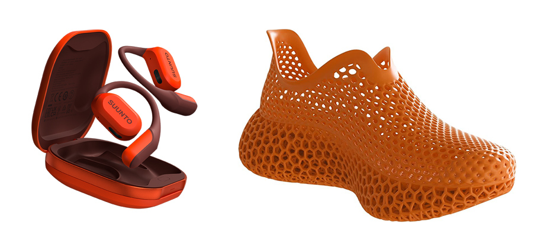

**Luisant Haze - Thomas De Monaco Parfums** amplia la Gold Collection di con una fragranza che ridefinisce la dolcezza attraverso una lente luminosa e contemporanea. Al centro, una tuberosa reinterpretata – morbida, diffusa, luminosa. La dolcezza si esprime in una nuova forma: ariosa invece che densa, radiosa invece che indulgente. Note di fragolina di bosco, zucchero filato e fava tonka si elevano grazie a muschi bianchi e sfaccettature ambrate, creando una struttura trasparente che resta vicina alla pelle.

**Solais Repleneshing Hand Serum - Aesop** un nuovo gesto illuminante per la cura delle mani. In questo siero leggero e di facile assorbimento, la Niacinamide, la radice di Tarassaco e l'LHA agiscono in sinergia per ridurre la comparsa delle macchie scure, illuminare e uniformare l'incarnato. In combinazione con un detergente e un balsamo Aesop, Solais (pronunciato SOL-aish e che significa “di luce” in irlandese) forma un regime simile a un trattamento viso per le mani.

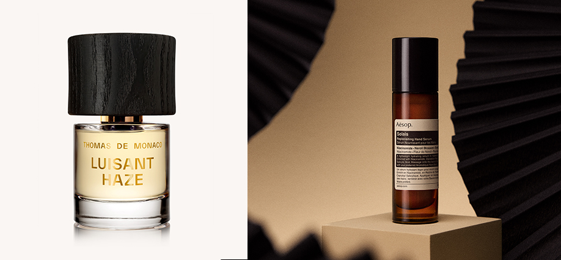

**Trendology - Remington** il primo styler 5 in 1 del marchio americano dotato di ben cinque accessori intercambiabili: ferro stretto da 13 mm in ceramica (per creare ricci molto stretti o definire i ricci naturali), il ferro da 33 mm in ceramica (per creare ricci morbidi e onde spettinate), ferro conico da 13-25 mm (per creare ricci definiti dall’aspetto naturale), ferro triplo per onde da 22 mm in ceramica e spazzola rotonda da 38 mm in ceramica (per aggiungere volume ai capelli e creare onde grandi e voluminose).  L’intercambiabilità degli accessori risulta facile e intuitiva grazie al pulsante di rilascio.

**Beauty da viaggio e pochette - Thun** la borsa weekend Eleganza Esotica, decorata con motivi floreali eleganti, grazie alla sua capienza è perfetta per portare con sé il necessario per un piacevole fine settimana. Madrina della collezione è Rose, il fenicottero rosa in ceramica decorata a mano: elegante su una sola gamba, sorride e si gode i colori in allegria.

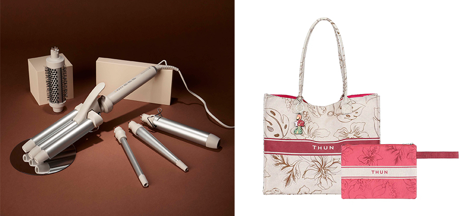

**Supersonic™ Travel - Dyson** nuovo asciugacapelli progettato per soddisfare le esigenze di chi viaggia senza compromettere la salute dei capelli né i risultati di styling. In una stanza d’hotel, in palestra o in una qualche destinazione lontana, l’asciugacapelli garantisce risultati impeccabili ed è compatibile con i diversi voltaggi internazionali.

**Tornelilla – Jysk** portagioie in velluto a coste. Pensato per i viaggi, il portagioie offre un modo elegante per proteggere e trasportare i propri accessori grazie ai comodi scomparti.

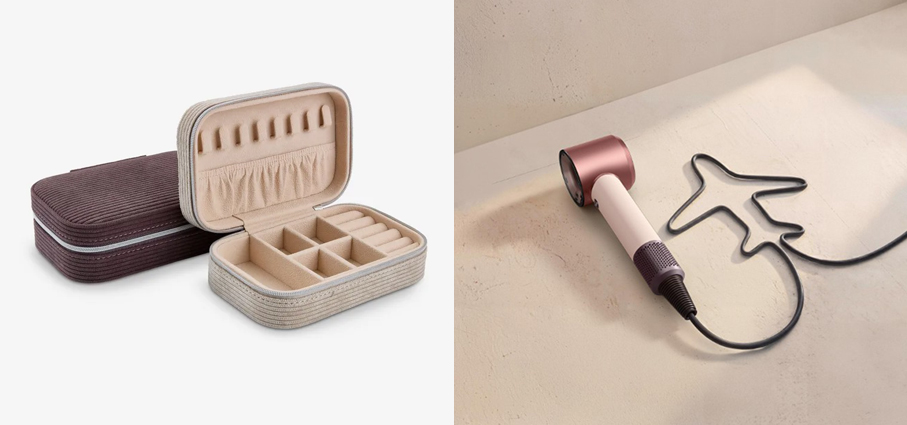

**Rosa canina - Tassotti** una fantasia ispirata a uno dei fiori spontanei del paesaggio europeo in cui le sfumature delicate dei petali e la semplicità del fiore selvatico restituiscono un’eleganza misurata e senza tempo, declinata su carta decorativa e biglietti.

**Brocca - Rice** brocche che diventano vasi e viceversa per il marchio di décor d'interni danese noto per i suoi accostamenti di colore arditi e irriverenti. Un invito a osare, abbinare con fantasia…e con un occhio alla funzionalità.

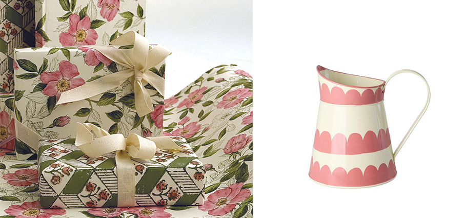

**Hydra+Hyaluronic Siero Stick Viso Idra-Rimpolpante - RoC Skincare** una formula idratante e anti-età per contrastare il dehydrAGEing, il fenomeno di disidratazione che si accentua con il passare del tempo e contribuisce ad accelerare la comparsa dei segni visibili dell’invecchiamento. Combina 7 forme concentrate di acido ialuronico associando anche un polipeptide pro-collagene e di un bio-peptide blu a base di rame pro-elastina (ecco il perché del colore dello stick: non è colorato, ma il colore proprio del peptide), per un effetto rimpolpante intenso e per aiutare a contrasta Ispirato ai filler antirughe.

**Bium & Chaeum - Vidan** direttamente dalla Korea, questo set composto da shampoo 300 ml e trattamento 250 ml è una routine quotidiana studiata per rimuovere polvere, sebo in eccesso e residui accumulati a causa dell'esposizione quotidiana, per poi arricchirla con un balsamo nutriente che dona al cuoio capelluto e ai capelli un aspetto sano. Questo set include shampoo e trattamento. Entrambe le formule condividono un approccio di cura basato su PDRN + peptidi. https://vidan-korea.com/

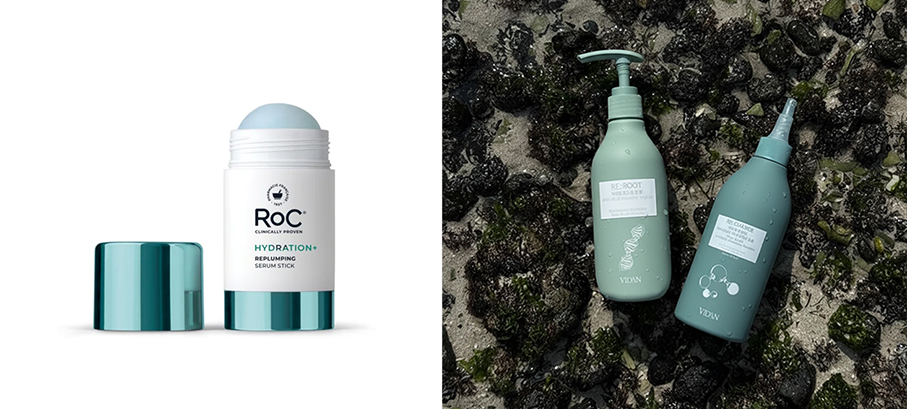

**ClamoRosa - Laboratorio Olfattivo** diffusore Una rosa clamorosa, una rosa croccante, brillante e diffusiva. Il suo cuore floreale, avvolgente e sensuale è sollevato da spezie ed agrumi ma, un fondo legnoso ambrato rivela un lato misterioso, lievemente dark. Una fragranza intrigante, ammaliante ma che racchiude anche dolcezza e raffinatezza. Non si resta indifferenti a ClamoRosa, il suo diffondersi nell’ambiente è presenza ed eleganza. Disponibile qui https://www.laboratorioolfattivo.com/prodotto/diffusore-clamorosa/  

**Metallic - Silver Puffy - Loqi** borsa spesa in poliestere rivestito è una splendida alternativa ai sacchetti di plastica monouso e un vero e proprio colpo d'occhio. La piccola tasca interna con cerniera è pratica per riporre chiavi o monete. Idrorepellente e certificata OEKO-TEX.  Distribuito da Schönhuber.

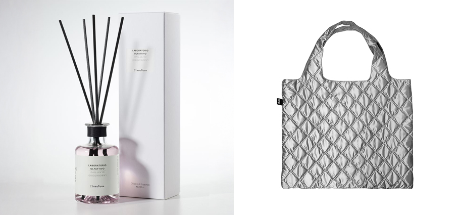

**Ice Cream Maker Chilluxe™ Stone - Russell Hobbs** grazie alle sette funzioni automatiche, si potrà scegliere tra diverse preparazioni: oltre al gelato (anche in versione “leggera”, con latte scremato e agave al posto dello zucchero), sarà possibile gustare deliziosi sorbetti, frappé, gelati artigianali, frozen yogurt, mix-in per incorporare i topping in tutta comodità tra le mura di casa. Con una potenza da 800 Watt, la macchina è dotata di funzione per mantecare e rendere ogni preparazione ancora più cremosa. Si prepara il gelato partendo da alimenti congelati in meno di quattro minuti. Le parti a contatto alimentare, rimovibili e lavabili in lavastoviglie, sono privi di BPA. Due i contenitori in dotazione con coperchio.

**Montalatte elettrico - Bocca della Verità** brand nato a Roma nel 1958, propone il caffè in un’esperienza che va oltre il gusto e amplia il proprio universo portando nelle case degli italiani – e non solo – l’essenza del rituale dell’espresso, con una nuova linea di accessori pensati per chi vive la pausa come un momento autentico, personale e senza tempo come il montalatte elettrico che  crea una schiuma vellutata, degna della migliore tradizione italiana.

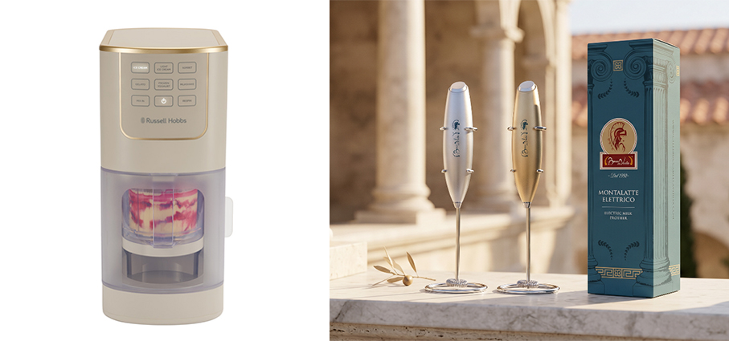

**Fizz&go™ - Sodastream** funzionalità e design in una gamma di borracce termiche da 900 ml realizzate in acciaio inossidabile con doppio strato isolante. Mantengono la temperatura fredda fino a 12 ore, e permettono di gasare l’acqua direttamente nella bottiglia per portarla sempre con sé. Compatibili con la maggior parte dei gasatori Sodastream di nuova generazione (a eccezione di Sodastream Gaia® and Crystal®), sono dotate di chiusura ermetica, pratico manico per il trasporto e sono lavabili in lavastoviglie,

**Cimaï Collab Sports Bra W - Millet** con taglio crop top, questo top sportivo si estende fino all’altezza dell’ombelico per poter essere indossato anche da solo. Realizzata in poliestere con un elegante intreccio di spalline incrociate sulla schiena, offre un’eccellente traspirabilità durante l’attività. Frutto di una doppia collaborazione con la nostra atleta Naïlé Meignan per lo stile e Cami Berni per l’illustrazione, garantisce un sostegno efficace ed è al tempo stesso molto femminile grazie alla stampa floreale su tutto il tessuto.

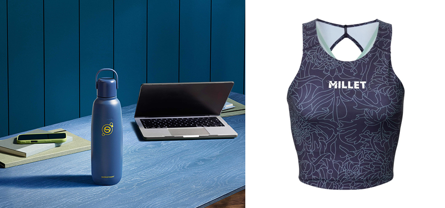

**Pititeri - Iolei** vino Moscato bianco passito. Al palato è dolce ma non stucchevole, anzi, vi è un ritorno degli aromi percepiti inizialmente, come miele e albicocca disidratata. Ha una notevole persistenza che ne richiama un sorso dopo l’altro. Al naso si presenta con eleganti note floreali, intensi aromi di miele e frutta matura, ma anche pesca gialla e fiori d’arancio. Abbinamenti: Dolci tipici della tradizione sarda, ma anche formaggi erborinati e stagionati.

**Panza - Mario Luca Giusti** bicchiere da vino trasparente in cristallo sintetico e melamina per una tavola di primavera elegante e che prende ispirazione dai colori di stagione. 

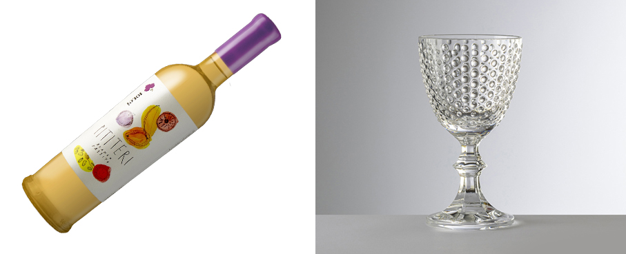

**Anemone - Le Creuset** tegame basso con coperchio a fiore in ghisa vetrificata Ispirato al fiore francese, il decoro realistico e delicato dei petali sul coperchio di questo versatile tegame mostra una eccezionale maestria artigianale. I manici garantiscono una presa sicura, mentre il pomolo al centro dei petali non è solo un tocco di stile, ma anche sicuro in forno fino a 260 °C.

**With Love - Villeroy & Boch** per le mamme più romantiche, una nuova selezione di contenitori della linea With Love dove ogni elemento è un regalo che parla al cuore. 

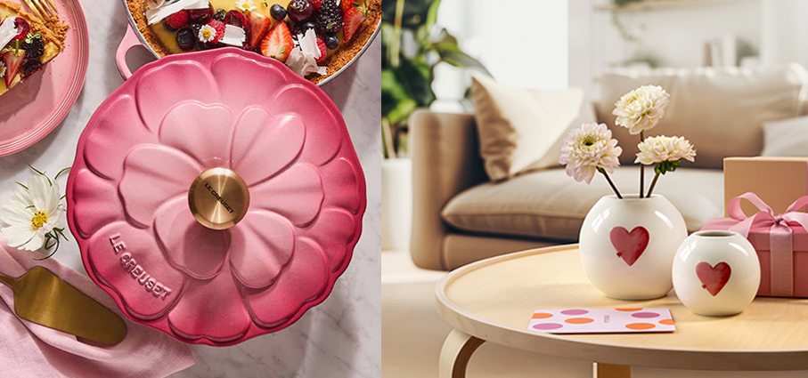

**Lavanda E Melatonina - Bottega Verde** la linea si compone di cinque prodotti che regalano un appagante e distensivo benessere di corpo e mente: Bagnodoccia, Crema Mani e Olio Corpo, con Lavanda e Melatonina, per una body skincare profumata, efficace e distensiva, Eau de Toilette Lavanda, nuova fragranza che interpreta in modo inedito e gourmand uno dei fiori simbolo dell’estate mediterranea con un bouquet di note avvolgenti e delicate e Body Mist Lavanda, una nuvola di leggerezza e serenità che si diffonde su corpo e capelli. La formula include la Melatonina. 

**Travel Kit - Madeleine Rose - Locherber Milano** Una fragranza intensa e sensuale alla Rosa di Damasco che si apre con note fruttate di cassis, limone, fragola e arancia, evolve in accenti fioriti e leggermente balsamici di rosa, foglie di viola ed eucalipto, e si chiude con un fondo dolce di fico e vaniglia, arricchito da sfumature legnose. Il kit comprende un eau de parfum 10ml e un sacchettino profumato.

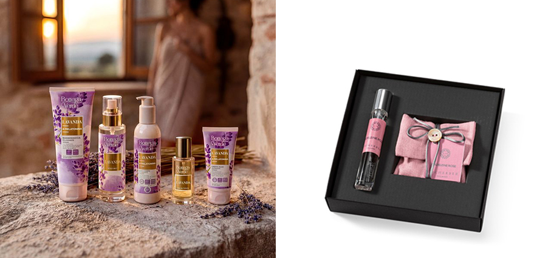

**Baume de Rose Lip Care - By Terry** un balsamo labbra intensamente nutriente. La sua formula iconica, ricca di vitamine, combina proprietà idratanti, rigeneranti e protettive. Al cuore del trattamento, una preziosa miscela concentrata a base di cera essenziale di rosa, nota per la sua azione lenitiva e riparatrice, è ideale per contrastare secchezza e screpolature. Arricchito con burro di karité nutriente, vitamina E antiossidante, ceramidi e microsfere di acido ialuronico. Disponibile qui https://perfumology.it/products/baume-de-rose-balsamo-labbra-1

**Ciroa Strawberry - Euracom** gel doccia che trasforma la doccia quotidiana in un'autentica evasione fruttata grazie a una schiuma ricca e rinfrescante che deterge senza seccare la cute. Formulata per esfoliare delicatamente, levigare e illuminare, questa linea è ricca di antiossidanti che lavorano per idratare e ammorbidire in profondità, lasciando la pelle visibilmente radiosa.

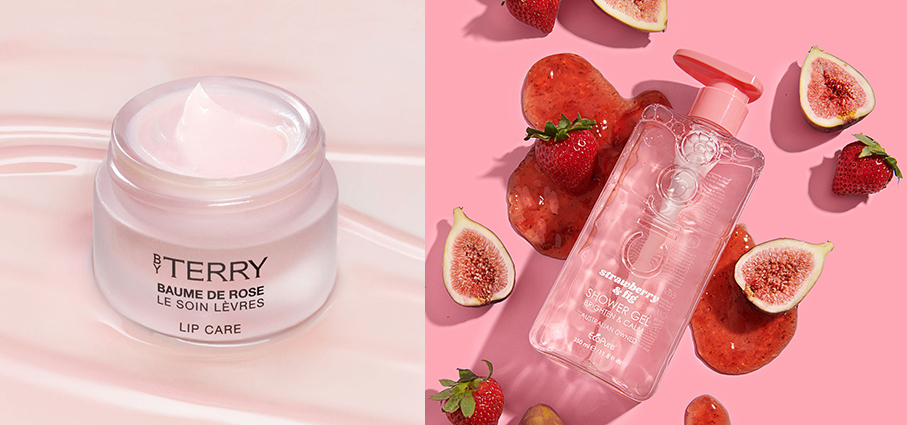
