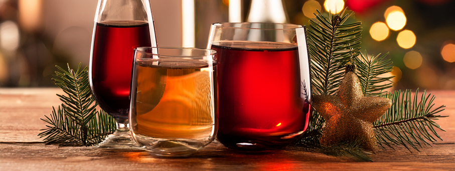
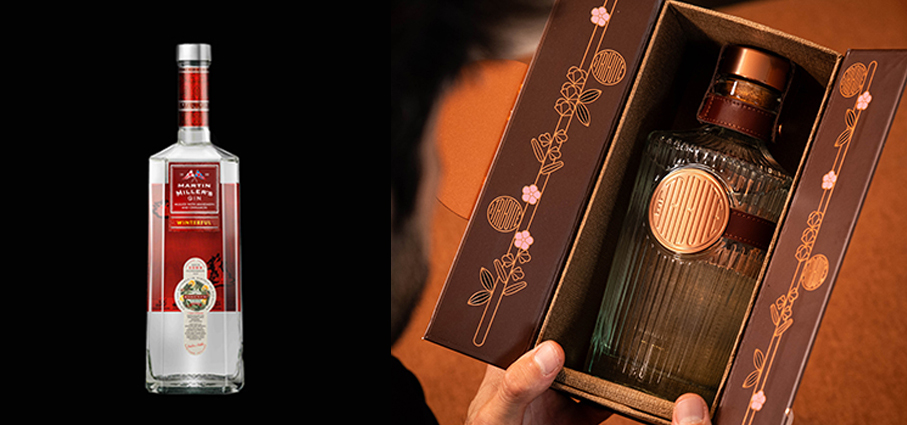
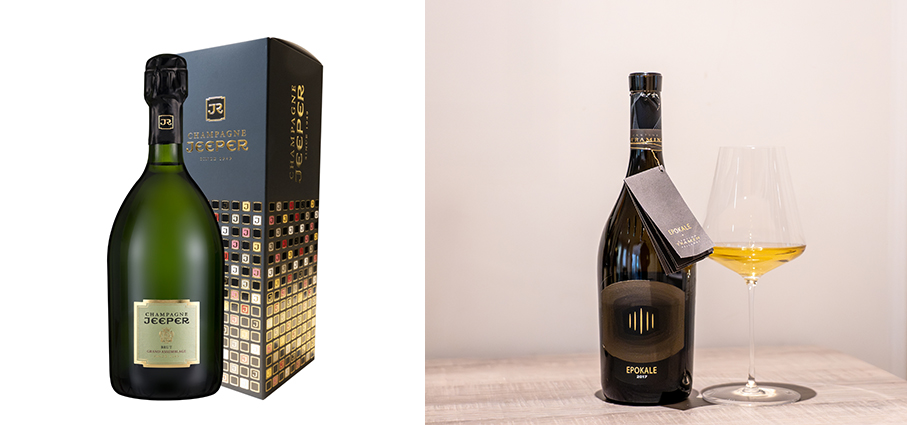
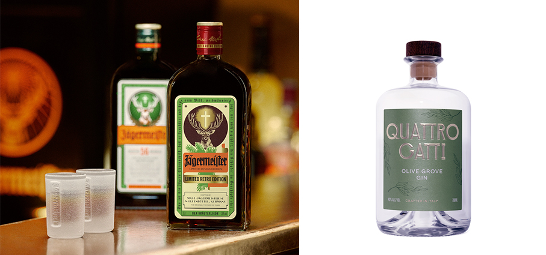
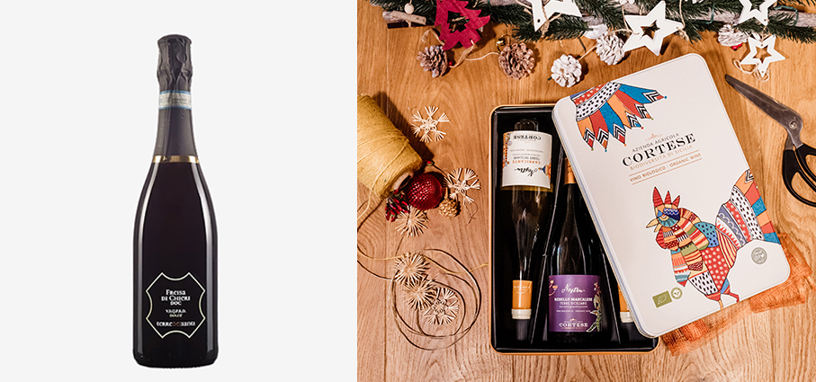
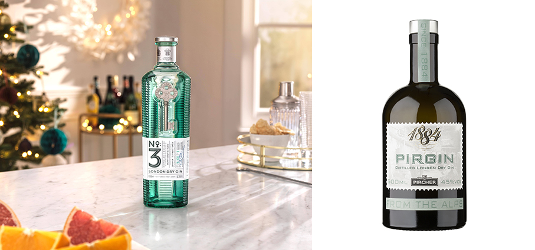
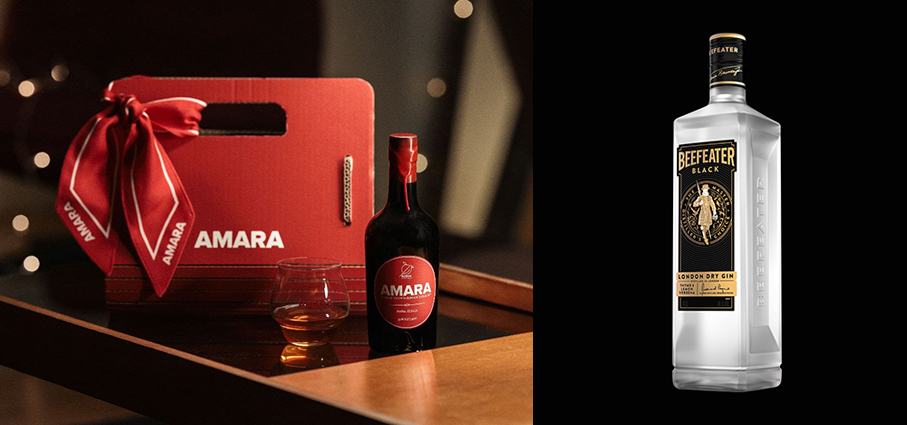
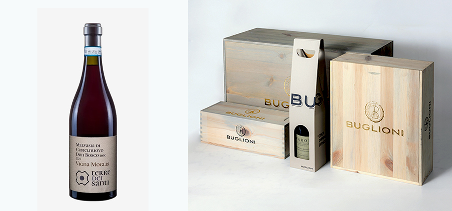
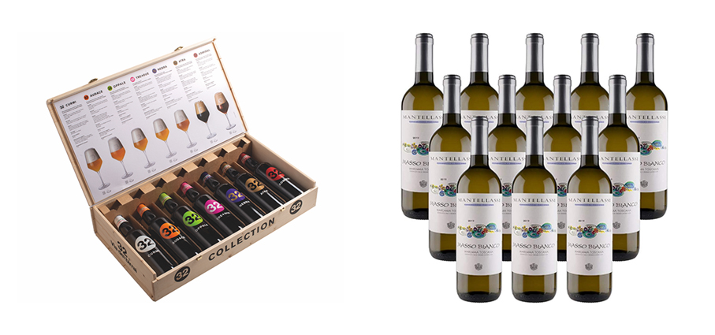

# Per un Natale spiritoso!

>Tempo di pranzi e cene, aperitivi e digestivi… C’è sempre una buona occasione per **scaldarsi brindando e festeggiando** insieme

**Winterful - Martin Miller’s Gin** l’edizione invernale del brand premium di gin, pioniere del distillato in Inghilterra e affinato con l’acqua più pura d’Islanda, pensata per avvolgere i sensi in un abbraccio aromatico e celebrare la bellezza della stagione più fredda, con i momenti e gli aromi più distintivi che la rendono speciale. Un omaggio al calore conviviale, ai profumi delle spezie e alle atmosfere avvolgenti che scandiscono i mesi più freddi e le celebrazioni più tipiche della stagione. Ottenuto tramite una terza infusione a freddo di cannella e buccia di mandarino, è ispirato agli ingredienti usati comunemente nelle ricette del Vin brulé in Inghilterra e in Islanda (dove è conosciuto come Jóla glögg), valorizzando il carattere invernale del distillato.

**Le Tribute Countryside Luxury Gin -  le Tribute Countryside** è un gin in edizione limitata che si ispira alla campagna idilliaca che circonda la distilleria catalana in cui viene prodotto. Lavanda, fiori di malva e salvia sono alcune delle botaniche locali che definiscono il suo carattere insieme al cardamomo nero, spezia rara, esotica e aromatica. È un’esperienza di gusto unica e complessa, ricca di sfumature. Un vero regalo per i sensi. Distribuito in esclusiva da Anthology by Mavolo.

**Amaro Zerotrenta**  è la nuova giovinezza di una grande tradizione. L’accurata selezione delle botaniche è esaltata da una ricetta erboristica molto equilibrata che sottolinea di ognuna le proprietà più caratteristiche. La sua assoluta naturalità è completata dall’impiego di estratto d’agave e distillato di zucchero di canna. Al palato esprime con decisione note eteree e leggermente balsamiche. Distribuito in esclusiva da Anthology by Mavolo.

**Freisa Di Chieri - Enrico Rubatto** - Azienda Agricola Rubatto Guido La Freisa piemontese ha mille volti, a seconda del territorio si esprime su toni diversi. Enrico Rubatto plasma la sua Freisa di Chieri DOC in versione secca e ferma, esaltandone non solo i profumi di lampone, ma anche il piacevole sapore asciutto, caratterizzato da ottimo corpo.

 
**Jeeper Grand Cuvée Grand Assemblage** -  la famiglia Dubois possiede più di cinquanta ettari di vigneti su terreni ideali (Montagne de Reims, Côte des Blancs, Valle della Marna e Valle di Ardres), nei dintorni di villaggi che hanno fatto la storia dello Champagne. Questa eccezionale cuvée è equilibrata, corposa e fruttata con leggere note di pane. Consistenza cremosa, bollicine fini. Il suo colore dorato e brillante è già una meravigliosa festa. Distribuito in esclusiva da Anthology by Mavolo.

**Epokale 2017 - Cantina Tramin** presenta la nuova annata del vino nato per ridisegnare i canoni stilistici ed espressivi del Gewürztraminer sfidando le aspettative evolutive sulla varietà. Uno dei pochi vini bianchi capaci non semplicemente di conservarsi a lungo, ma di potenziarsi e impreziosirsi nel tempo. 
Epokale, al suo esordio con l’annata 2009, è l’unico vino bianco italiano ad aver conquistato i 100/100 punti di Robert Parker-The Wine Advocate. La prospettiva di invecchiamento di oltre vent’anni, la peculiarità di affinamento in miniera, il numero estremamente limitato di 2.150 bottiglie e la distribuzione selezionata lo rendono un vino raro e prezioso, ricercato dai collezionisti.

**Retro Limited Edition - Jägermeister** riprende gli elementi chiave della prima bottiglia. Ispirata alla versione originale creata da Curt Mast, che non solo sviluppò la ricetta segreta ma ideò anche il packaging e ne testò la resistenza agli urti, presenta l’iconica forma dalle spalle squadrate in vetro trasparente, l’etichetta vintage, un tappo in stile retrò coordinato e un dettaglio speciale: l’incisione in rilievo del leggendario cervo con la croce luminosa tra le corna, simbolo del marchio, ispirato alla storia di Sant’Uberto, patrono dei cacciatori e omaggio alla tradizione venatoria tedesca. 56 ingredienti naturali, erbe, fiori, radici e frutti provenienti da tutto il mondo, lavorati in quattro macerati distinti e lasciati maturare lentamente nelle botti di rovere, per un equilibrio unico tra dolce, amaro e speziato.

**Olive Grove Gin - Quattro Gatti** un gin secco distillato con foglie di olivo, olive e olio d’oliva provenienti da antichi uliveti italiani. Terroso, elegante e silenziosamente complesso, è stato creato come il gin da martini per eccellenza, portando profondità sapida e struttura al bicchiere. Al naso si apre con note di sottobosco, pietra bagnata dalla pioggia e la freschezza verde delle verdure appena colte. Con il tempo emergono sentori floreali, come fiori al crepuscolo o l’aria di una serra.

**Freisa Di Chieri D.O.C. Spumante Dolce – Terre Dei Santi** Vitigno coltivato esclusivamente in Piemonte, il Freisa di Chieri D.O.C. trova nella Collina Torinese la zona classica di produzione. Profumo: Floreale, fruttato caratteristico, intenso tipico dell’uva di origine che evocano frutti a bacca rossa lampone e la ciliegia ed in annate più calde frutti neri, ribes. Sapore: Dolce, con una bollicina fine, non invadente, delicato, persistente e non stucchevole. Nel finale emergono le sensazioni di frutti rossi percepiti con l'olfatto. Perlage: Fine e persistente, grazie ad una lenta presa di spuma. Abbinamenti: Con dolci e dessert in genere, con paste secche come ad esempio la tipica focaccia di Chieri o i classici dolci delle feste quali panettone e colomba.

**Selezione Nostru in Latta Vintage - Azienda Agricola Cortese**  interpreta i vitigni autoctoni dell’isola con la freschezza e la verticalità delle sue amate Dolomiti. Un elegante cofanetto di latta contiene tre perle della Sicilia meridionale: un rosso, Nostru Nerello Mascalese 2023, e due bianchi, Nostru Catarratto Lucido 2024 e Nostru Carricante 2024. Una collezione di tre vini biologici e vegan che parlano la lingua del consumatore moderno: vini freschi, giovani, versatili, capaci di accompagnare momenti informali quanto esperienze più ricercate, con l’immediatezza di un sorso che racconta la Sicilia contemporanea senza rinunciare alla sua storia. 

**Gin No 3 London Dry con Bicchiere - Berry Bros**. & Rudd confezione regalo con bottiglia di No 3 London Dry Gin più lo speciale bicchiere in vetro brandizzato. Il numero 3 richiama le botaniche e le spezie contenute: Il ginepro, dall'Italia, non solo dà il suo nome al gin, ma anche l'inconfondibile gusto con sentori di pino e lavanda. La dolce scorza d'arancia spagnola dona freschezza sotto forma di agrumi puliti e croccanti. Buccia di pompelmo per dare un tocco in più agli agrumi. 3 Spezie La radice di angelica aggiunge una qualità terrosa e aiuta a rendere il gin asciutto. Il seme di coriandolo marocchino rilascia un aroma di limone durante la distillazione e aggiunge un finale leggermente piccante a un gin ben fatto. Baccelli di cardamomo che aggiungono un morso speziato, aromatico, ma caldo.

**Pirgin Distilled London Dry Gin – Pircher** il gusto è secco ed è caratterizzato dalla bacca di ginepro. I botanicals di Pircher, siano essi erbe aromatiche, spezie o agrumi, accompagnano e completano il gusto del ginepro, senza sopraffarlo né dominarlo. L’azienda ha saputo modernizzare le antiche ricette tradizionali ottenendo così liquori dai gusti esotici e dalle note più morbide e moderne, utilizzando sempre tecnologie innovative e all’avanguardia.

**Xmas Pack - Amara** Amaro Amara lancia un cofanetto elegante e sostenibile: una borsa in cartone riciclato dal design raffinato e riutilizzabile, che custodisce la bottiglia da 50 cl dell’iconico liquore alle Arance Rosse di Sicilia IGP, nato dall’incontro con il suolo vulcanico dell’Etna, e un esclusivo foulard modello twilly. Il foulard è realizzato con un tessuto eco-luxury nato dal riuso creativo delle bucce d’arancia, trasformate in filati setosi e luminosi grazie a un processo brevettato da Orange Fiber, la start up catanese che dal 2014 ha rivoluzionato il mondo del tessile con fibre pregiate e sostenibili, già adottate da maison internazionali.

**Beefeater Black – Beefeater** omaggia la ricetta originale dalle 9 botaniche di Beefeater Dry, a cui si aggiunge un twist inedito attraverso due ingredienti selezionati con cura: timo, e verbena al limone, che donano una nuova sfumatura al profilo agrumato del gin. Un gin premium che combina equilibrio, freschezza e personalità e celebra le sue origini con una veste inedita: il classico mattone londinese a cui si ispira la silhouette della bottiglia come tributo alla città di Londra, incontra una sofisticata etichetta nera e oro, simbolo di eleganza e raffinatezza, richiamando tra antico e moderno il fascino senza tempo della capitale inglese.

**Box Amarone - Buglioni Heritage** l’eleganza dell’Amarone in una box. Un viaggio nel tempo attraverso le annate più iconiche dell’Amarone Classico della Valpolicella di Buglioni. Le box in legno, disponibili in versione da 6 o 12 bottiglie, propongono una selezione delle migliori annate combinabili in un mix match customizzato sui gusti del fortunato che riceverà questo dono. Per chi ama condividere, o semplicemente regalare o regalarsi un “grande” piacere enologico, è possibile personalizzare la box scegliendo anche i grandi formati.

**Malvasia Di Castelnuovo Don Bosco D.O.C. Vigna Moglia – Terre Dei Santi** un vino tipicamente rosso, dolce e particolarmente aromatico, prodotto con Malvasia Nera Lunga, vitigno aromatico a bacca rossa. Floreale, fruttato, intenso ma soprattutto aromatico, tipico dell’uva di origine che grazie ad una attenta vinificazione consente di mantenerne inalterati gli aromi che evocano la rosa canina e la fragolina di bosco. Sapore: Dolce, vivace, delicato, persistente e non stucchevole, grazie ad un lungo finale di mandorla. Perlage: Fine e persistente. Con dolci e dessert in genere, con paste secche come ad esempio le tipiche paste di meliga (mais) piemontesi o anche per bagnare una macedonia di fragole. Eccellente come base per cocktail.

**Confezioni regalo - 32 Via dei Birrai** si caratterizza da sempre non solo per i suoi prodotti d’eccellenza, pluripremiati, ma per il fatto di proporli anche in fantastiche versioni regalo. Ossia, in confezioni così belle, divertenti e persino utili, da rendere l'acquisto e il dono piacevoli a prescindere. Poi, dentro, ci sono anche birre di qualità. Birre di altissimo pregio in packaging giocosi e festivi. 

**Massobianco Maremma Toscana DOC - Fattoria Mantellassi** dalle uve a bacca bianca di antica tradizione della viticoltura collinare della Maremma Toscana si ottiene il Masso Bianco. E’ l’evoluzione dei vini bianchi, preparati nel passato nelle fattorie maremmane; è molto apprezzato per le sue note di profumo e di freschezza, di gradevolezza del gusto, di eclettismo sulla tavola. Vitigni: Trebbiano Toscano, Vermentino, Sauvignon.

