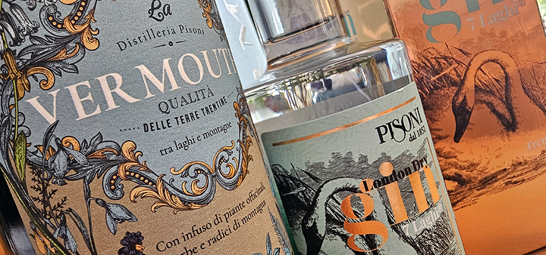
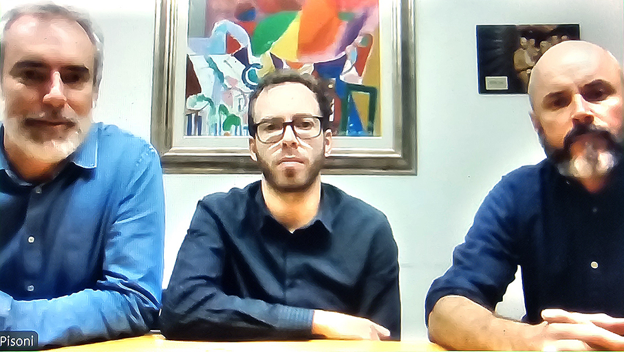
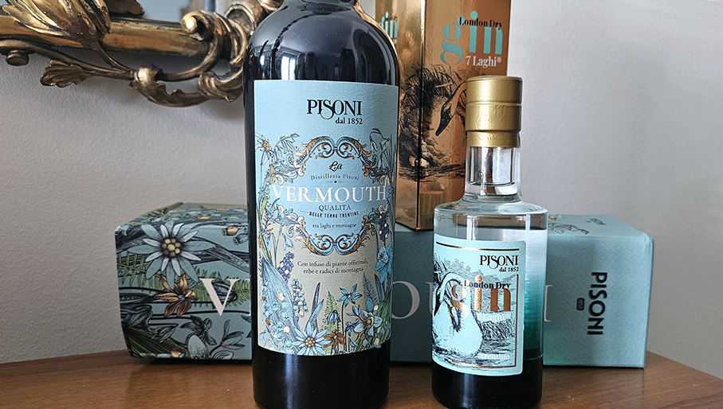
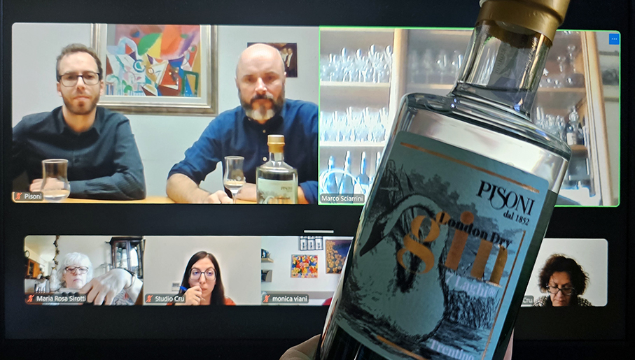
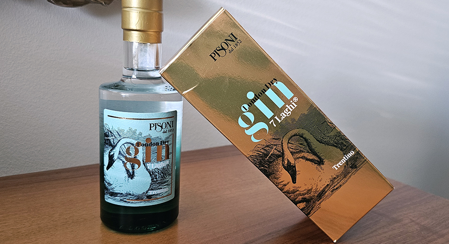
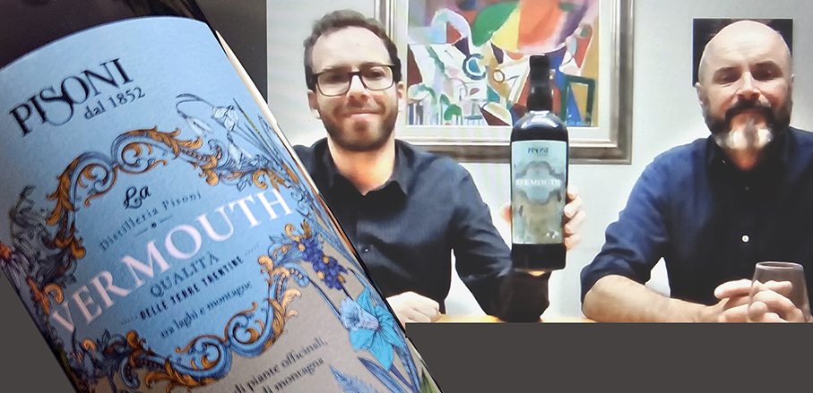
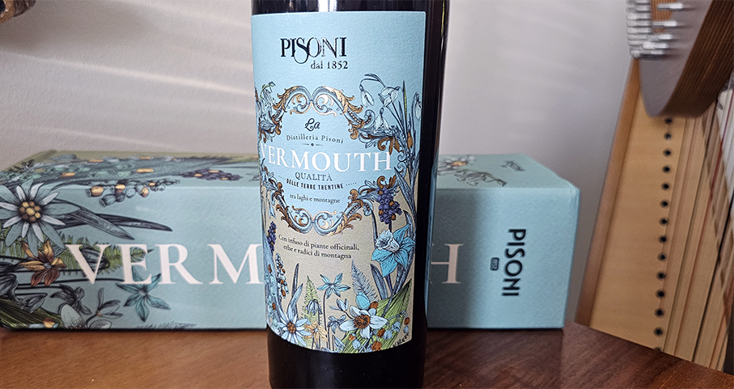

# Pisoni 1852: Gin e Vermouth 7 Laghi 

> I fratelli **Pisoni** presentano la **linea 7 Laghi**, composta dal **Gin** e dal nuovo **Vermouth** 
 

La distilleria **Pisoni 1852 nasce nel 1852  nella Valle dei Laghi**, un luogo, tra le montagne trentine dove l’acqua incontra i colori e i profumi delle Dolomiti. L’azienda è guidata da **Andrea, Elio, Francesco, Giuliano, Matteo e Simone Pisoni**, quarta e quinta generazione della famiglia che **distilla le botaniche del Trentino** e lo spirito del territorio. L’azienda si trova a Pergolese, in una zona particolarmente vocata per la produzione di vini e distillati, circondata dalle Dolomiti e mitigata dal vicino lago di Garda. 

Le condizioni climatiche, l’altitudine dei vigneti situati tra i 300 e i 500 m s.l.m. e la vicinanza a tesori naturali come i laghi e le splendide vette montane, permettono **l’alternarsi di forti escursioni termiche** che conferiscono all’uva **freschezza e acidità**, caratteristiche che contraddistinguono le etichette Pisoni.

Ci presentano i due prodotti **Elio Pisoni** - Amministratore Delegato Pisoni 1852, **Giuliano e Matteo Pisoni** - Mastri Distillatori.

Come racconta **Matteo Pisoni**: _“Siamo distillatori e, oltre alle grappe, da qualche anno abbiamo introdotto 2 prodotti nuovi, vermouth e gin. La vinificazione del Trentino è di qualità perché legata alla montagna e viene caratterizzata da acidità, freschezza e profumi floreali fruttati”_.

**Il Gin 7 Laghi® nasce dall’antica arte del metodo London Dry**, distillato negli storici alambicchi di rame “Tullio Zadra”. _”Il gin è un London dry fatto in alambicco con ginepro, artemisia asperula, menta, rabarbaro, genziana, centaurea, liquirizia, calamo e china. Un insieme di ingredienti che dona al Gin un carattere fresco, balsamico e autenticamente montano. Siamo nella valle dei laghi, tra il lago di Garda e il Brenta, cu un clima mediterraneo ma alpino che conferisce un taglio fresco ai prodotti che facciamo. Il vermouth per noi è una novità, un elemento che unisce l'anima enologica e quella distillatoria. Utilizziamo Muller Thurgau semi aromatico”_. 

La distillazione di una buccia solida è la più complessa per il **Gin**. La macerazione delle bacche di ginepro avviene direttamente in alambicco. La bacca deve essere rotta senza essere macinata, avviene tra 2 rulli distanti per non schiacciare ma rompere e far uscire gli oli essenziali. Vengono estratti dall'alcol come idrocarburi prima di essere intaccati meccanicamente.

La **distillazione london dry** avviene secondo disciplinare europeo può essere prodotto solo distillazione il ginepro insieme alle altre ere in un’unica distillazione, e alcol con purezza e gradazione superiore a 96 gradi. Il gin non deve essere inferiore a 70 gradi e poi diluito con acqua. Viene praticato il taglio delle teste per togliere alcuni elementi volatili.

La salivazione diluisce il prodotto in bocca con una piccola ulteriore distillazione. Per questo, per una degustazione ottimale, va tenuto un po’ in bocca. Il **ghiaccio va a liberare i composti aromatici** e abbassare leggermente la gradazione alcolica. Si consiglia di **bere a temperatura ambiente**, utilizzando un bicchiere mezzo tulipano.

**Il Vermouth è la new entry della collezione 7 Laghi**. Il prodotto viene illustrato da **Giuliano Pisoni**: “_Utilizziamo vino bianco con aggiunta di zucchero caramellizzato per rendere scuro il colore. La caratteristica che vogliamo sempre mantenere è la freschezza. Alcune erbe che crescono qui a 1000 metri, insieme alla menta, donano caratteristiche balsamiche perchè si combinano nella estrazione e assumono il sentore balsamico che altri prodotti prendono dal pino muro o dal cirmolo, che qui non ci sono. È un equilibrio chimico che conti un a spostarsi. Inoltre, non è un caso che le distillerie di grappa siano vicine a buone sorgenti. L'acqua è importantissima per le sue componenti minerali e giusta composizione di sali._”.

Un Vermouth dal carattere unico: qui il **Müller Thurgau della valle**,  fresco e aromatico, valorizza un infuso di botaniche selezionate con cura: **assenzio, rabarbaro, menta piperita, centaurea, asperula, ginepro, genziana, calamo, china, liquirizia e arancio amaro**. 
Il risultato è un profilo aromatico elegante e stratificato: **note floreali e balsamiche di montagna** si intrecciano con sfumature erbacee e amaricanti, offrendo al palato un equilibrio sottile tra freschezza, dolcezza e un finale amarognolo lungo e persistente.
La struttura del vino si unisce così alla ricchezza botanica per creare un vermouth dal **carattere alpino**. Ideale da gustare a temperatura ambiente, liscio, con ghiaccio o come ingrediente protagonista di cocktail autentici e dal gusto raffinato. Consigliato un piccolo ballon o un calice da vino bianco.

_Ph. credits: Maria Rosa Sirotti_
