# Pitti Fragranze 2025

> Dal 12 al 14 settembre 2025 la **Stazione Leopolda di Firenze** ha ospitato la 23ª edizione di **Pitti Fragranze**

_a cura di Claudia Braschi e Elena Braschi_

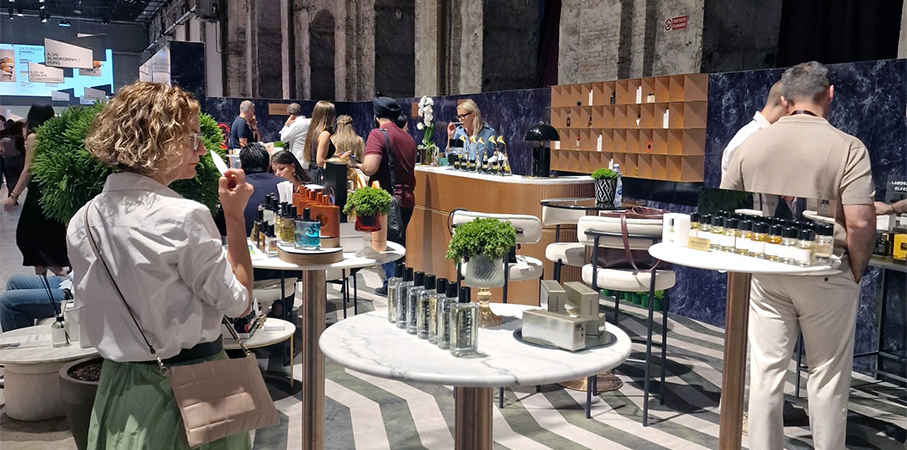

Per l’edizione 2025 di Pitti Fragranze, il **tema-guida “Composition”** ha sviluppato molti percorsi olfattivi da parte dei brand, grazie all’ **idea di accostamento, contrappunto e costruzione delle fragranze**.
Con i suoi **258 marchi**, Pitti Fragranze è l’appuntamento di riferimento per scoprire le **novità della profumeria di ricerca e del mondo beauty**, e l’occasione in cui si lanciano le **tendenze della cultura olfattiva** sulla scena internazionale.

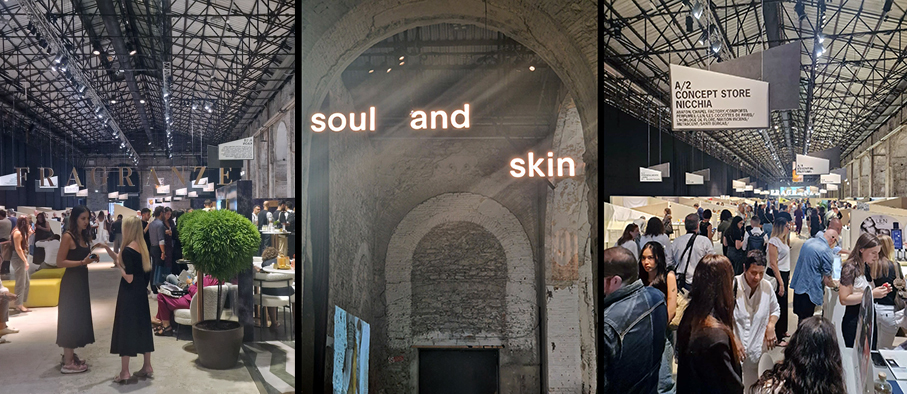

Quasi 2.200 compratori arrivati a Firenze per il **salone in forte crescita (+32%)** rispetto a un anno fa, con presenze di operatori di altissima qualità e sempre più internazionali. **Spagna, Germania, Francia e Svizzera in testa** alle presenze estere, forte aumento anche per i compratori italiani.
I **trend del momento** sono apparsi chiari: giocare con **note gourmand e insolite** come pop corn, pistacchio e ciliegia, accesi da note di vaniglia. L’intento è quello di stupire, creando **mix di note olfatti decisamente originali** e non appartenenti alla profumeria classica. Molte maison hanno costruito i loro lanci attorno all’idea di **contrasti** (dolce e amaro, naturale e artificiale).

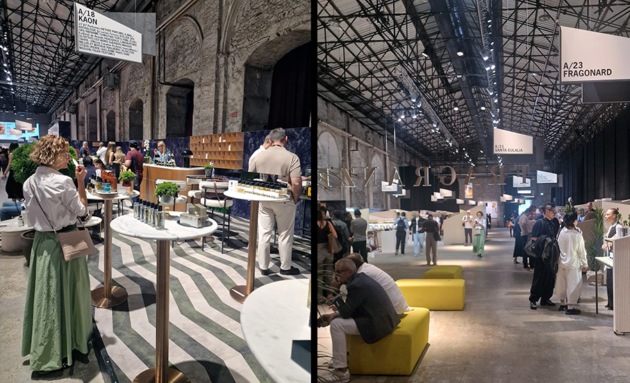

Allo stesso tempo è emersa con forza una nuova area dedicata alla cura della pelle, **Soul & Skin**, che porta al centro dell’attenzione prodotti skincare con un **approccio sia scientifico sia rituale**. Si consolida infatti l’idea che **skincare e profumeria si contaminino**, con prodotti che propongono **efficacia tecnica e narrazione sensoriale** e molti nuovi lanci skincare lo confermano.

**FRAGRANZE**

Per questa sezione, abbiamo selezionato alcune **new entry** insieme a **marchi consolidati** particolarmente rappresentativi.

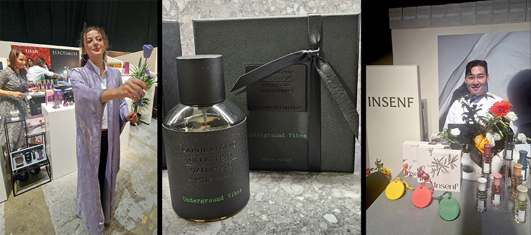

**Anfasic** è espressione perfetta del mondo arabo e della Dubai contemporanea. Si distingue per la fusione di tradizione e innovazione, incarnando l'arte senza tempo dell'incenso arabo con un tocco moderno. Radicata nel patrimonio culturale ma realizzata per il mondo contemporaneo, ogni fragranza racconta una storia, catturando emozioni e ricordi.

**Insenf**: fragranze ispirate ai cocktail (sviluppate in collaborazione con bartender) e un diffusore solido realizzato in gomma speciale, una delle proposte originali del salone. Per la maison, un profumo può dare inizio alla giornata, sollevare lo spirito o persino rivelare un lato di sé che non si è ancora incontrato. Soprattutto, una fragranza ha il potere di liberare le persone.

**Laboratorio Olfattivo** ha presentato la sua novità: Underground Vibes, nuova creazione firmata Antoine Lie. Nasce dal cuore pulsante dei rave, e vuole catturare  l’anima vibrante dei party underground che illuminano le notti delle metropoli. Trasporta chi lo indossa nell’elettrizzante atmosfera dei ritrovi segreti, dove muri di cemento post-industriali e labirinti di parcheggi sotterranei risuonano di battiti ipnotici. racchiude le note avvolgenti dell’essenza di cannabis che si intrecciano con il mistico oud del Vietnam, mentre l’assoluta di elicriso aggiunge un tocco di eterea aromaticità.

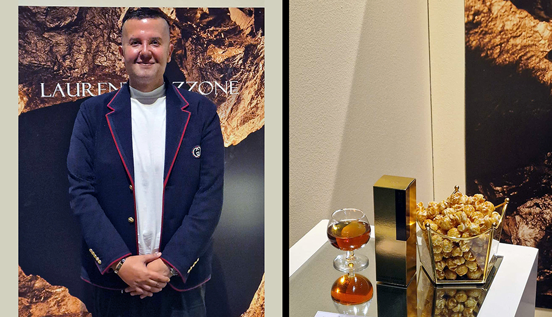

**Laurent Mazzone**: un mito della profumeria artistica di alta gamma, propone profumazioni inedite dall’anima gourmand. Lineam, il nuovo extrait de parfum, contiene note di popcorn caramellato, vaniglia Bourbon, frutta candita, praliné e rum e racconta una serata al luna park attraverso un accordo gourmand. Come un enfant terrible, Laurent Mazzone stravolge le regole tradizionali della profumeria artistica francese e li interpreta in modo personale. La sua personalità ricercata ed elegante rappresenta l’ispirazione di un mondo dove la ricerca stilistica approda in creazioni sempre uniche e dal forte potere emozionale.

**Le Persona** è un marchio di profumi di nicchia sudcoreano, fondato nel 2022, che trae ispirazione dal concetto di "persona" come maschera dell'anima. Nell'antica Grecia, gli attori indossavano maschere che chiamavano "persona" per conferire personalità ai personaggi che interpretavano. Fragranze unisex che raccontano storie uniche.

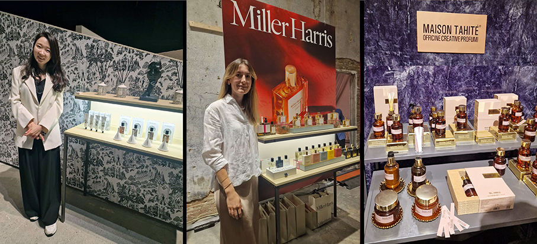

**Maison Tahité** è un laboratorio creativo che esplora materie prime iconiche della profumeria, cercando di rappresentarle ogni volta in modo originale e contemporaneo. Le fragranze firmate si distinguono per la qualità delle materie prime e delle composizioni. Dolci e sorprendentemente originali, sono una celebrazione dell’essere autenticamente umani. L’obiettivo di questo progetto è quello di rivolgersi a un pubblico eticamente intelligente e raffinato.

**Miller Harrys** è l’espressione dello stile irriverente ed eclettico della Londra moderna. L'estetica dei suoi profumi è stata ispirata da storie, ricordi e ingredienti naturali molto raffinati. Un perfetto connubio tra la tradizione inglese ed il savoir-faire francese che scopre continuamente nuovi terreni di ispirazione. Legato, la nuova fragranza della Stories Collection, racconta l’intensità dei legami e la sensualità delle notti londinesi. Un Eau de Parfum avvolgente, seducente e dolce, un’interpretazione moderna della vaniglia gourmand, con un’essenza di ciliegia accompagnata da legno di sandalo e muschio.

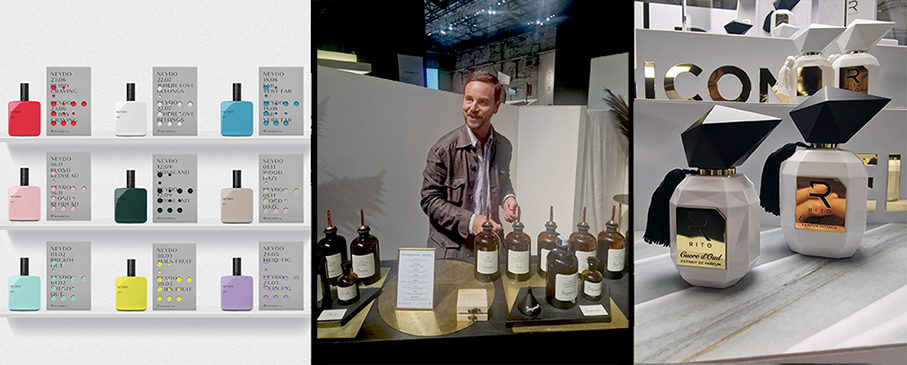

**Neydo**: nuovo marchio di fragranze ispirato ai sogni olfattivi. Questo concetto unico reinventa i profumieri come acchiappasogni che estraggono i profumi dal nostro subconscio. Il risultato è una collezione di fragranze ultraterrene che hanno la straordinaria capacità di far sentire a chi le indossa come se le loro fantasie avessero preso vita.

**Rito®** è un marchio esclusivo di profumeria artistica interamente realizzato in Italia. Esiste una magia nascosta nelle piccole cose della vita, come il gesto di mettersi un profumo, un segno con un inestimabile senso di identità, "un vero e proprio rito". E' il legame che unisce gestualità, pensieri ed emozioni, creando un collegamento fra il corpo e lo spirito. Il tappo, una scultura di arte contemporanea dai tratti aerodinamici, è un tratto distintivo unico del marchio.

**The Essential Blend** The Essential Cocktail è la nuova linea di drink d’autore ispirati alle più prestigiose materie prime e famiglie olfattive della profumeria che Campomarzio70 ha sviluppato insieme a Be Barman Eventi, da tempo beverage partner degli eventi del brand. Un progetto in cui l’alta profumeria sposa il mondo della miscelazione di ricerca per creare un’ampia palette di sfumature sensoriali e un’armonia perfetta. I sapori interpretano i profumi in una narrazione sensoriale coerente: otto vere e proprie fragranze da bere, in cui la nota olfattiva è dichiarata e caratterizzante. La collezione si compone di otto signature cocktail: Rosa, Bergamotto, Sandalo, Neroli, Vaniglia, Fava Tonka, Floreale e Legnoso che ruotano attorno a cinque materie prime e a due famiglie olfattive.

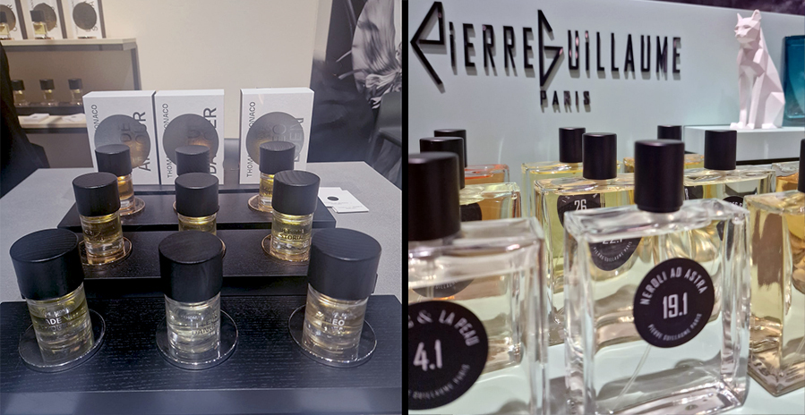

**Pierre Guillaume** ha a disposizione un suo laboratorio personale e un vasto archivio di materie prime e da 20 anni lavora e crea in totale libertà artistica, in netto contrasto con le logiche di massa delle fragranze commerciali. Crea opere profumate dalle personalità olfattive uniche e originali. Trae la sua ispirazione culturale dai suoi viaggi e dall’arte contemporanea di cui è appassionato e collezionista.

**Thomas De Monaco Parfums** mette al centro della nuova collezione i profumieri, presentando The Artist con fragranze come Fleur Danger, Jade Amour e Neo Eden. Una maison di fragranze indipendente dove creatività, artigianalità ed emozione definiscono una visione moderna della profumeria. Si ispira a un profondo impegno verso i valori artigianali e alla convinzione che il profumo non sia soltanto un prodotto, ma un’intima opera d’arte. Più che lusso, queste fragranze sono rare opere di artigianato, in cui pazienza ed emozione rappresentano la vera firma.

**SOUL & SKIN**

Una nuova sezione creata per l’edizione 23 del salone, dedicata allo **skincare, con attenzione alla ricerca, alle formule, agli ingredienti per viso e corpo**. Viene enfatizzato il “rituale” rivolto al benessere con una componente sensoriale oltre che cosmetica. Attenzione non solo alla provenienza ma anche a purezza, texture, fragranza, tatto e sensazioni. Il tutto sotto il segno di efficacia e **sinergia tra natura e scienza**. Lo skincare è visto come momento di cura, relax, connessione con se stessi, nutrendo la mente e non solo la pelle. Specializzazione + innovazione: formule specifiche, attivi di nuova generazione, specialità per corpo e viso, prodotti che rispondono a bisogni molto mirati.

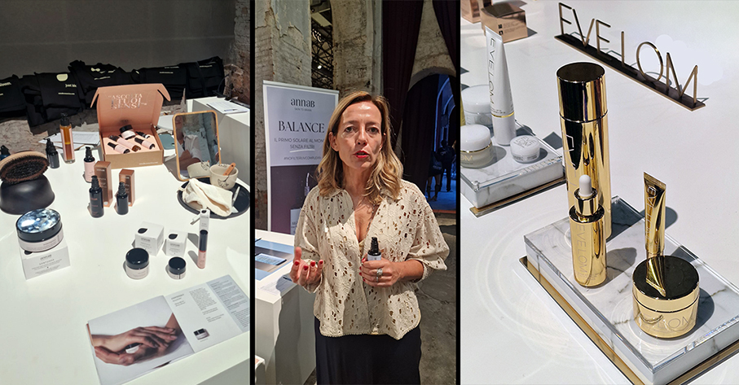

**Annab Cosmetics** presenta Balance, la prima crema SPF+30 “senza filtri” (NOfilter UV complex®) che difende da UVA/UVB e dalla luce blu, combina microalga antismog, semi di lampone e alghe marine upcycled, con funzioni idratanti, illuminanti e rigeneranti. Ex giornalista di cronaca nera, cerca di dedicarsi alla bellezza e al tempo per se stessi, per raggiungere un benessere fatto di ingredienti naturali.

**Eve Lom** ha portato la sua gamma Time Retreat e le novità legate alla linea anti-age/essence (es. Time Retreat Restorative Skin Essence) presentate in ragione del posizionamento “healthy ageing” del marchio.

**Evidens de Beauté** unisce ricerca francese e know-how giapponese. Combinando l’eleganza tipicamente francese e la più avanzata ricerca giapponese, i prodotti di EviDenS de Beauté sono formulati da un team di ricercatori d’eccezione, sfruttando le più avanzate tecnologie e solo ingredienti di altissima qualità. Come secondo i dettami dell’antica filosofia Kaizen, che consiste nella ricerca della perfezione, l’obiettivo è quello di continuare a migliorarsi.

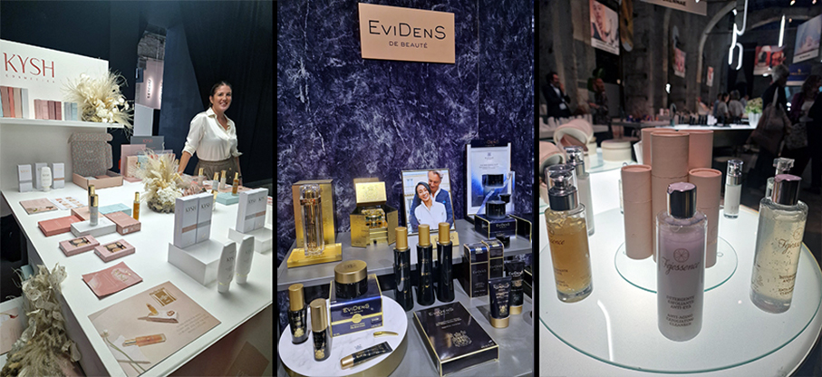

**Fejessence** Nella Colombia degli anni quaranta, lussureggiante di natura ma priva di tecnologia e con una cultura molto rigida la nonna della fondatrice, Milena Salazar, volle tramandare il segreto di bellezza della famiglia, con una crema di bellezza personale. I prodotti sono realizzati con Polpa Fresca di Feijoa proveniente dalla Colombia. La Feijoa è un frutto dal profumo gradevolissimo che annovera e vanta tante proprietà salutari e benefiche per l’organismo dell’uomo e per l’equilibrio dietetico.

**Kysh Cosmetics** è il primo premium brand di skincare intima d’Italia specializzato nella creazione di prodotti cosmetici efficaci ed innovativi per la cura della zona intima femminile. Privi di ormoni ed estrogeni e quindi utilizzabili anche durante l’assunzione di una terapia ormonale, dal pH ottimale e non irritanti per la pelle e le mucose. Sono impreziositi da una fragranza esclusiva, un bouquet floreale.

**Insìum** produce cosmetici con formule high-tech, clean e vegan. Regalano un effetto antietà, grazie ad un mix di ingredienti biotecnologici/ high-tech scientificamente avanzati e attivi naturali. Il potente ed esclusivo Insium Booster Complex (Neuroguard e Tripeptide-2) offre un'azione anti-age globale con ingredienti biotecnologici che lavorano in sinergia per risultati veloci e visibili.

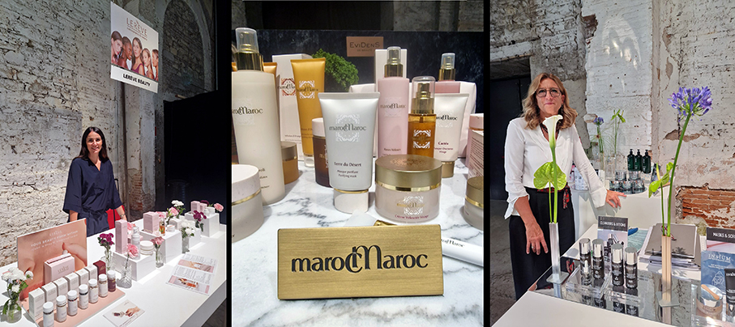

**Lerève Beauty**: progetto di nutricosmetica naturale, crea integratori e cosmetici che lavorano in sinergia partendo dall’innovativo mix di principi attivi botanici: “doni della natura” e “sapere della scienza” i fondamenti dell’approccio olistico al benessere, per una cura della pelle più completa ed efficace .

**marocMaroc** prendendo ispirazione dalla grande tradizione dell’hammam, reinterpreta gli ancestrali rituali di bellezza marocchini. In una ricca gamma di prodotti per il corpo, il viso e i capelli, si riflette la millenaria storia del Marocco. Attraverso texture setose e fragranze inebrianti, ogni prodotto è un invito a viaggiare attraverso i sensi. Argan, Rosa e Mandorle: ingredienti naturali tipici del territorio, di eccezionale qualità, pregiati e performanti, per una pelle morbida e setosa.

_Ph. credits: Elena Braschi e Claudia Braschi_ 
 
 

