# Pitti Fragranze 2026 - olfatto d'autore

>Pitti Fragranze 2026: La Stazione Leopolda a **Firenze** torna a essere la **capitale mondiale dell'olfatto d'autore**

_di Elena Braschi_
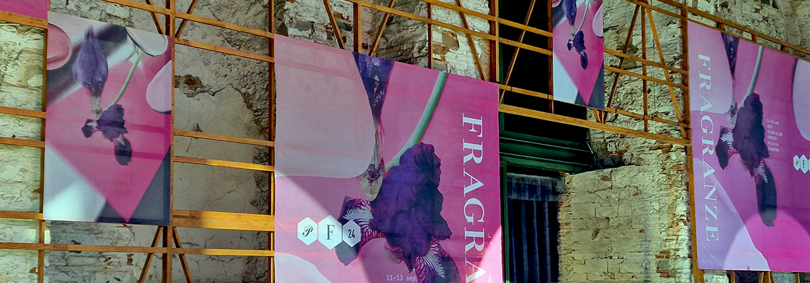

La Stazione Leopolda ha ospitato la **24a edizione di Pitti Fragranze**, confermandosi come il punto d'incontro d'elezione per nasi, creativi e appassionati della profumeria artistica internazionale. Il fil rouge di quest'anno ha celebrato la **sinergia tra materia prima e narrazione emotiva**.

Installazioni interattive e talk di approfondimento hanno tracciato le future linee guida: **sostenibilità nei processi estrattivi, ritorno a materie prime ancestrali e un'audace sperimentazione di accordi inediti**.

**FRAGRANZE** 

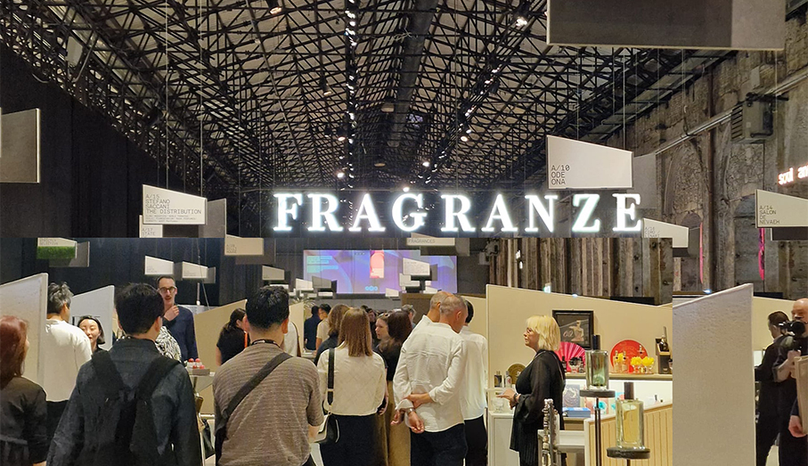

**RARA AVIS**

Se la profumeria artistica è, per definizione, la ricerca dell’inconsueto, il brand **Rara Avis** ha letteralmente dato forma e ali a questo concetto.Un'operazione di design di straordinario impatto visivo: la boccetta di profumo, da semplice contenitore geometrico, si trasforma in una scultura a forma di uccello.

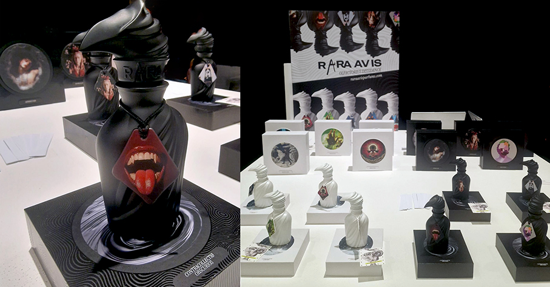

Il nome stesso è una espressione latina che indica una rarità preziosa e fuori dal comune. L'uccello diventa così **un custode di vetro e metallo che racchiude essenze altrettanto singolari**. Linee sinuose, quasi aerodinamiche, dove il becco, le ali e il piumaggio stilizzato guidano la mano nell'atto della vaporizzazione, trasformando il gesto quotidiano in un rituale sciamanico.  Le composizioni esplorano la libertà dell'aria e della natura incontaminata, combinando **note eteree, ozoniche e boschive**, capaci di evocare l'altezza dei cieli e la profondità delle foreste inesplorate. Un oggetto del desiderio da collezionare ed esporre.

**THOMAS DE MONACO**

**Thomas De Monaco**, noto fotografo di moda e direttore creativo internazionale, porta a Firenze la sua filosofia della slow perfumery: creazioni nate da una riflessione profonda, che sfidano i ritmi frenetici del mercato per farsi vere e proprie opere d'arte senza tempo. 

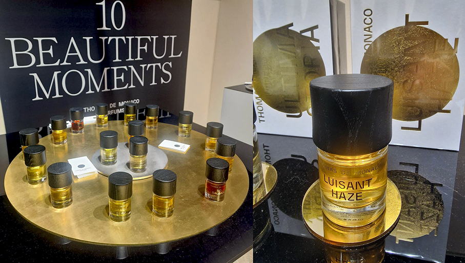

**Luisant Haze**, la novità presentata, è firmata dal celebre naso Karine Chevallier. Un Extrait de Parfum che ridefinisce completamente i canoni del mondo gourmand**, esordendo con un connubio delicato, dove la dolcezza spontanea della fragolina di bosco incontra la vivacità speziata del pepe rosa e del cardamomo. Al centro della composizione brilla una tuberosa completamente reinterpretata. Lontana dai toni opulenti del passato, si rivela morbida e vellutata, attraversata dalle sfumature metalliche della Safraleine e dalla leggerezza impalpabile dello zucchero filato. La chiusura è sigillata dal muschio bianco, dalle sfaccettature avvolgenti della fava tonka e dalla persistenza dell'Amber Xtreme.

**CARTHUSIA**

Dalla solarità delle sponde di Capri a una dimensione notturna ed intima, **Carthusia** svela il nuovo capitolo della sua Collezione Intenso: **Intenso di Nero**. Per questa creazione, la storica maison rinnova la felice collaborazione con il **maestro profumiere Meo Fusciuni**, affidandogli il compito di esplorare il lato più profondo, misterioso e magnetico dell'universo del brand attraverso un vero e proprio manifesto di contrasti. 

La preziosa tensione speziata dello zafferano si fonde con le sfumature scure e fruttate del cassis, mentre un tocco materico di cioccolato avvolge l'esordio conferendogli una personalità immediata e nettamente distintiva. Nel nucleo, una sontuosa rosa incontra legni e spezie, mentre sottili accenti floreali ricreano una perfetta armonia tra sensualità e profondità. La chiusura rivela note preziose di fava tonka assoluta e vaniglia assoluta, sigillate dal calore resinoso del benzoino. **Composizione cuoiata e gourmand che si posa sulla pelle come un velo vellutato e persistente**, dimostrando come anche il buio più fitto possa rivelare, lentamente, la propria straordinaria luce.

**BYRON PARFUMS**

Parliamo di **Byron Parfums**, il brand francese d'avanguardia fondato dall'eclettico naso e artista **Larchitect**. Conosciuto per la sua capacità di fondere la street culture parigina con la sontuosità delle materie prime orientali, il marchio ha letteralmente ipnotizzato i visitatori cona un pezzo da collezione, un prezioso e iconico **vasetto dorato impreziosito da un'elegante e sinuosa grafia araba** incisa sulla superficie lucida. 

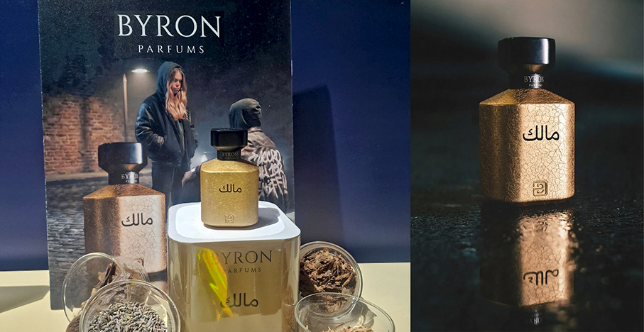

Un richiamo ai fasti mediorientali, concepito non solo per custodire l'estratto, ma per farsi scultura da esposizione. Al suo interno batte il cuore di una fragranza densa e dall'incredibile persistenza sulla pelle pensata per chi ama distinguersi attraverso scie audaci. Un esordio speziato e fruttato cede il passo a un cuore ricco e stratificato, in cui accenni di cuoio si intrecciano alla dolcezza della vaniglia e del patchouli. 

**JEROBOAM**

Un nome che ha fatto del paradosso il suo punto di forza: **Jeroboam**. Fondato da François Hénin e guidato dall'estro olfattivo del naso Vanina Muracciole, il brand parigino deve il suo nome alle **monumentali bottiglie di champagne da tre litri**. Se l'identità del marchio si è sempre espressa attraverso flaconi scuri o dorati, l'edizione di Pitti Fragranze 2026 segna una **svolta cromatica audace con un flacone rosso scarlatto e setoso**, che abbandona ogni rigore minimale per farsi manifesto visivo di passione. 

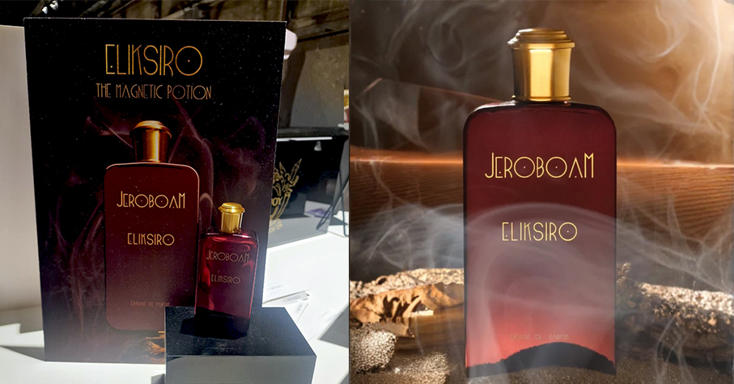

Si tratta della veste scelta per presentare **Eliksiro**, una pozione d’amore liquida nata per essere, letteralmente, un magnete sensoriale. L'apertura unisce la freschezza del mandarino al calore di zafferano e legno di guaiaco. Nel cuore pulsante si svela una tensione sensuale tra la rosa e un accordo di cuoio e oud, rinfrescati da sfumature di cardamomo e pepe rosa. Il fondo custodisce la firma leggendaria del brand: l'inimitabile cocktail di muschi enigmatici che qui si intreccia alla dolcezza finale di lampone e vaniglia per una persistenza infinita sulla pelle.

**STEPHANE HUMBERT LUCAS**

Profumiere parigino sinesteta: Il pittore e poeta Stéphane Humbert Lucas studia pittura nel sud della Francia con un maestro fiammingo. Convinto che ogni colore avesse un profumo, scopre la sua **sinestesia, un fenomeno percettivo per cui la stimolazione della vista attiva simultaneamente anche l'olfatto**. Mescolare i colori diviene quindi un modo per padroneggiare profumi nuovi e unici. La costante ispirazione tratta dalla pittura, dalla letteratura e dalla musica definisce il tono e impone una selezione delle **materie prime più pregiate dell'alta profumeria**.

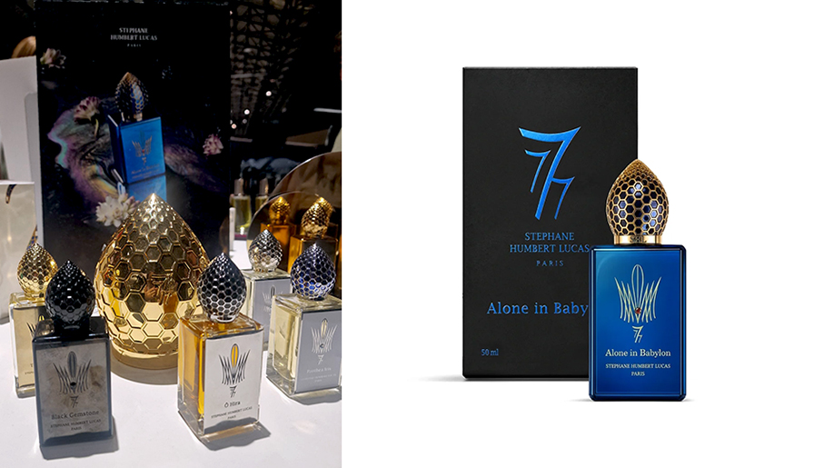

**Alone in Babylon** è un profumo contemporaneo con una scia magnetica e giocosa. Reinterpreta **opulenza e seduzione delle leggendarie corti babilonesi**, traducendole in un estratto moderno dal forte impatto sensoriale. Un'apertura speziata e vibrante con zafferano e cardamomo, un cuore ricco e avvolgente legni caldi e resine pregiate che evocano l'atmosfera dei giardini pensili e delle carovane di spezie. Sul fondo, una scia di ambra e vaniglia sensuale assicura una **persistenza epidermica eccezionale e ipnotica**. Per chi ricerca un profumo capace di raccontare una storia fin dal primo sguardo al flacone.

**PEOSYM**

Il viaggio sensoriale approda all'intrigante proposta di **Peosym**, il brand australiano fondato da Purvi Joshi che **fa convergere l'eredità culturale indiana con un'estetica visiva e olfattiva contemporanea**. la maison presenta **Mithai**, una fragranza contenuta in un flacone dalle linee pulite e geometriche, sormontato da un tappo in legno naturale. **L'ispirazione è dichiaratamente gourmand ma lontana dai cliché: un omaggio al Kaju barfi, il tradizionale dolce indiano** a base di anacardi che celebra i legami più preziosi. 

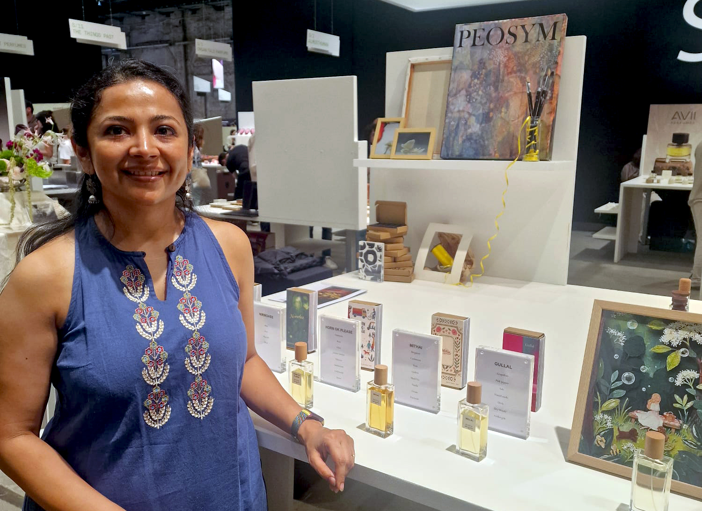

La freschezza agrumata del bergamotto si intreccia al calore speziato del cardamomo verde. Nel cuore, la struttura si evolve verso una complessità vellutata e inedita: un bouquet di rose delicate incontra l'intensità aromatica del tè nero e la burrosa cremosità della nota di anacardo, avvolta da una dolcezza zuccherina mai invasiva. La combinazione di vaniglia e panna montata crea una texture ricca, bilanciata magistralmente dalle sfaccettature terrose del patchouli, **posandosi sull'epidermide come una nuvola aromatica** dal dry-down incredibilmente intimo e persistente.

**SOUL AND SKIN**

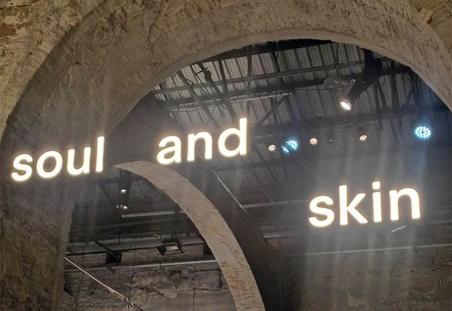
 
Oltre i confini delle esperienze olfattive, la fiera si fa interprete di un nuovo concetto di **cura della persona globale**. Soul and Skin, l'esclusivo spazio dedicato al panorama internazionale della skincare di nicchia, presenta una visione d'avanguardia in cui il gesto di indossare un profumo si unisce alla gestualità quotidiana e rigorosa dei trattamenti per il viso e per il corpo, confermando una tendenza ormai consolidata: il **legame sempre più stretto tra le fragranze d'autore e la cura profonda della pelle**. 

**PETIT AMIE**

All'interno di questo scenario di ricerca spicca la proposta di **Petite Amie Skincare**, il beauty brand indipendente che ha conquistato l'attenzione dei visitatori per il suo **approccio fortemente sostenibile ed etico, ma dall'estetica decisamente dirompente**. Il marchio rompe infatti il rigore minimalista del settore introducendo confezioni molto vivaci, colorate e divertenti, capaci di portare una sferzata di ironia e gioco nel rituale della cura del viso. 

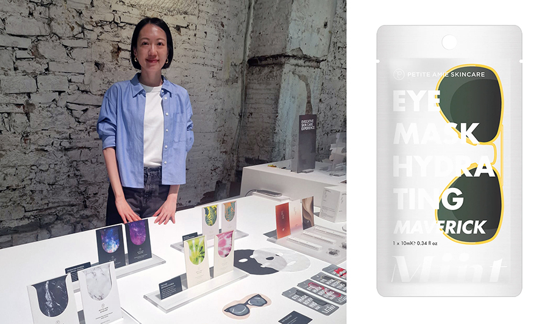

Il brand eleva l'esperienza del trattamento domestico presentando la sua nuova **maschera in foglio dall'effetto velluto**, un trattamento intensivo pensato per regalare alla pelle la sensazione avvolgente, soffice e lussuosa del velour. Il packaging pop e d'impatto visivo immediato custodisce una formula rigorosa e ad altissima concentrazione di attivi botanici. **La maschera si adatta all'epidermide come una seconda pelle**, rilasciando gradualmente un siero rigenerante che leviga la texture cutanea e la lascia morbida e compatta al tatto proprio come il tessuto da cui prende ispirazione.

**WAREW**

La cura di sé si trasforma in un vero e proprio rituale meditativo grazie a **Warew**, il brand di aging care che incarna l'**essenza della filosofia estetica ed erboristica giapponese**. Si distingue per un'eleganza sofisticata, con flaconi dalle linee pulite che evocano l'armonia interiore. La formula presentata si muove nel perfetto **punto d'incontro tra la millenaria tradizione e la biotecnologia moderna**, con formule composte per oltre il 97% da ingredienti di origine naturale e piante officinali autoctone. 

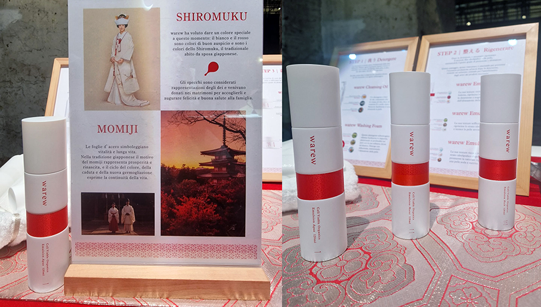

Un approccio fisiologico studiato per stimolare il **ciclo naturale di rigenerazione cellulare**, operando in totale armonia con la pelle. La sua texture fluida penetra istantaneamente nell'epidermide, lasciando il viso incredibilmente compatto, elastico e protetto dagli stress ambientali.
 
**PUREPEAK**

**Purepeak** è un brand di bellezza coreano che progetta la **skincare come oggetto pensato per muoversi** naturalmente con la vita di ogni giorno. Nato per uno stile di vita in movimento, Purepeak **trasforma la skincare solida in oggetti indossabili**. Le idee tratte dalla natura vengono raffinate attraverso la scienza e plasmate dal design in oggetti del quotidiano. Eliminando il superfluo, si concentra su ciò che conta davvero. 

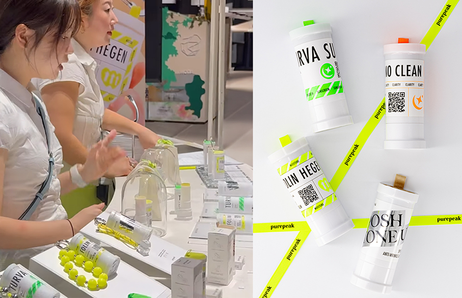

La **linea Purepeak Beauty Solid** rappresenta un nuovo tipo di prodotti di bellezza essenziali in stick per chi viaggia: **solido, senza acqua, legale da portare in cabina, nessun problema con il limite dei 100 ml**. Il case hanging si aggancia ovunque e si applica direttamente sulla pelle senza passare attraverso le mani. Così la pelle rimane idratata protetta sempre e ovunque. Il **tappo ermetico a molla** elimina eventuali perdite, la formula si espande durante l'uso e ogni prodotto fa una cosa sola: cleanse, nourish, protect o perfect. Coperto da brevetto.

**BY TERRY**

La perfetta unione tra make-up e trattamento cosmetico si compie con l'inconfondibile tocco parigino di **By Terry**, che presenta un'innovazione pensata per le pelli mature ed esigenti. Sfidando il classico tabù delle polveri che tendono a segnare il viso, la maison svela la sua **rivoluzionaria cipria formulata rigorosamente senza talco**. Il packaging, elegante e curato nei minimi dettagli, racchiude una texture finissima, leggera come un soffio d'aria. 

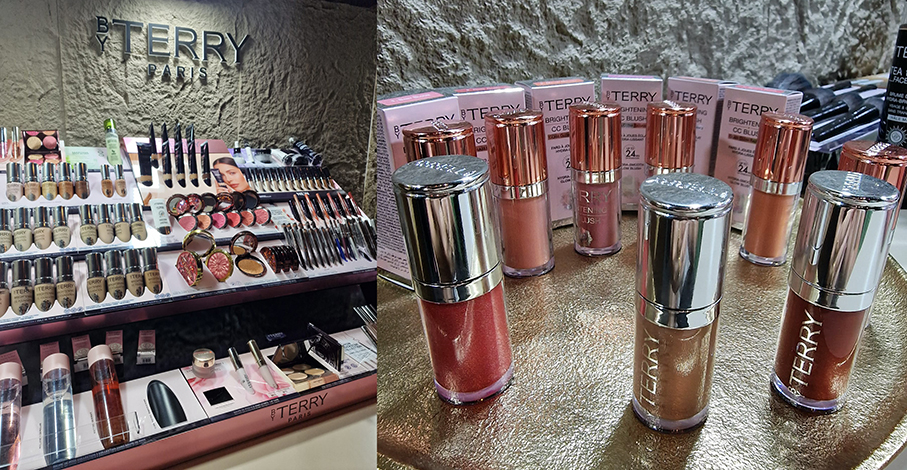

Il vero segreto della formula risiede nel mix di una tecnologia a base di **otto tipi differenti di acido ialuronico**. Questo ingrediente attivo non si limita a fissare il trucco, ma lavora come un vero e proprio **scudo idratante e rimpolpante, capace di riempire visivamente le rughe**, attenuare le linee sottili e minimizzare i pori senza mai inaridire l'epidermide. Il risultato sul viso è una finitura vellutata e invisibile, che regala istantaneamente un aspetto levigato, radioso e disteso.

**GOTō ESSENTIALS**

A chiudere questo viaggio nella purezza è **gotō essentials**, il brand d'avanguardia nato per rispondere alle esigenze delle **pelli più reattive e sensibili**. Ispirato alla maestria e al **rigore della cosmetica giapponese**, il marchio si presenta con un design spiccatamente minimalista, pensato per rispecchiare l'idea di una **routine essenziale ma ad altissima efficacia**. 

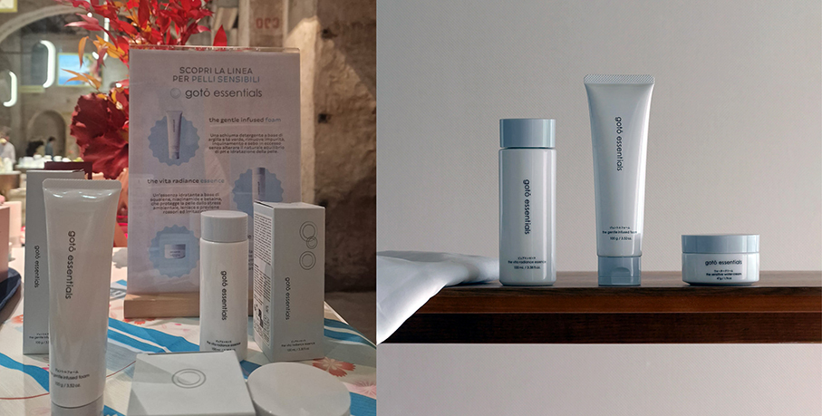

La grande novità portata in fiera è una **combinazione mirata di attivi a concentrazioni scientificamente provate e consistenze ultra-leggere**, dove spiccano ingredienti preziosi come i fermenti di pera e la niacinamide. Tra le proposte più ammirate, la loro **emulsione idratante a base d'acqua che si fonde a contatto con la cute** senza lasciare traccia, offrendo uno scudo protettivo immediato che calma i rossori e restituisce un viso riequilibrato, luminoso e dall'aspetto visibilmente sano.

