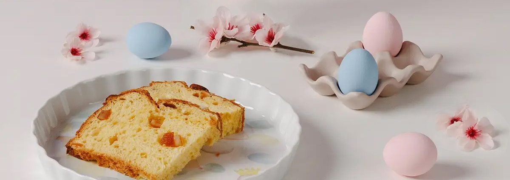
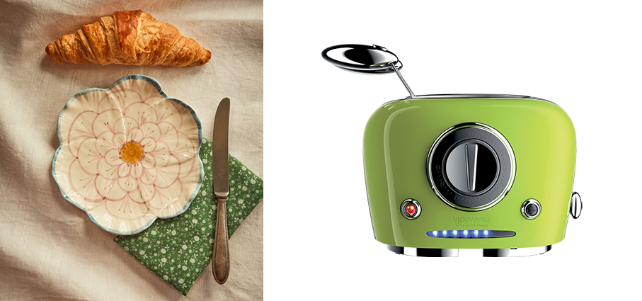
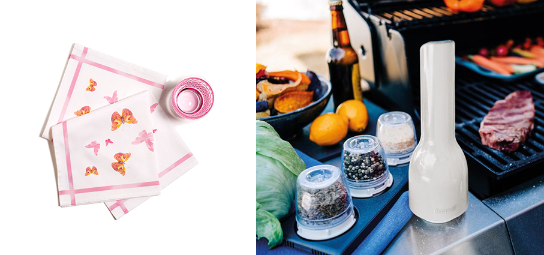
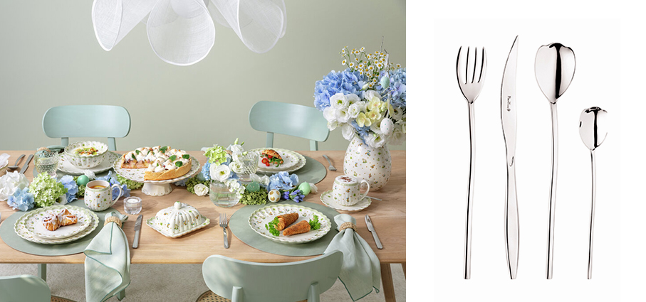
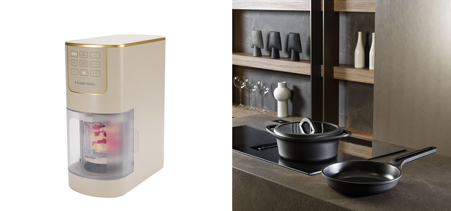
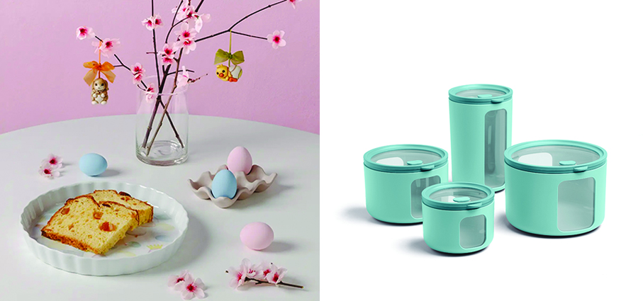
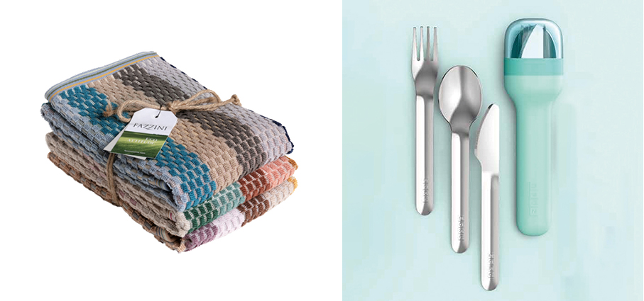
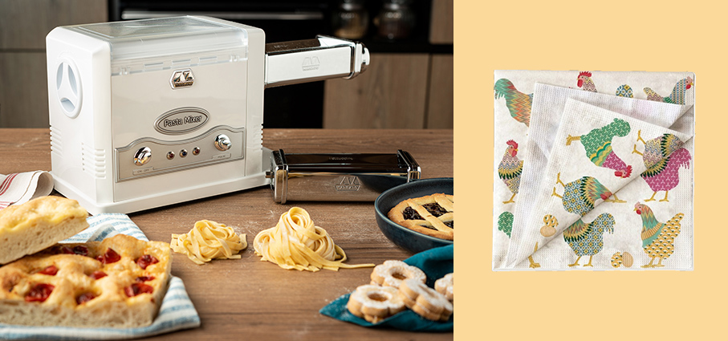
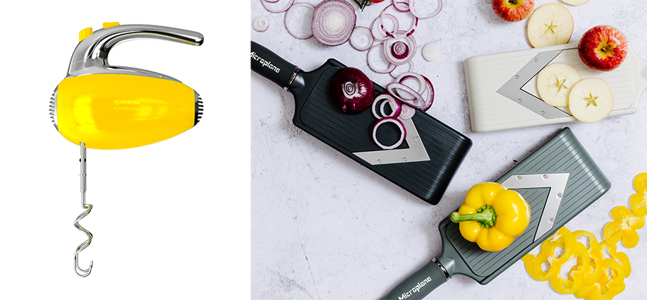
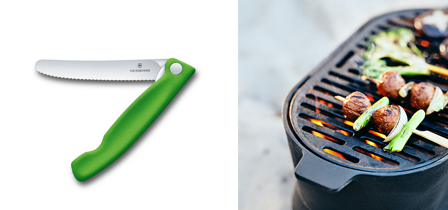

# Primavera in tavola e in cucina

>La primavera ci porta **tante novità colorate** per aiutarci in cucina e per allestire una tavola allegra e fiorita

**Piatto da dessert** - **Rice** In ceramica a forma di fiore con bordo blu Porta i fiori in tavola e ammira la bellezza della lavorazione dipinta a mano: progettato in Danimarca e dipinto a mano in Portogallo da un gruppo di donne di grande talento. Ogni pezzo ha un tocco distintivo, a seconda della mano che lo ha dipinto. Pezzi abbinabili per creare una collezione personale, ma anche per integrarli altre ceramica di casa. Diametro 19,5 cm.

**Per Tipi Toast** - **Viceversa** Il tostapane con pinze dal design di carattere, a firma Luca Trazzi, lo rende un alleato in cucina e un bell’oggetto da mostrare. Arricchito dal corpo in acciaio inox e dalle due pinze in acciaio con manici in ABS cromato, è dotato di funzione di scongelamento, riscaldamento e stop e di luci Led per evidenziare il tempo residuo. In otto differenti varianti colore, è dedicato a chi cerca efficienza e rapidità.

**Tovagliolo In Cotone Flower** - **Caleffi** Appartiene alla Kitchen Collection, il cui sapore floreale è interpretato attraverso stampe bucoliche per una stagione estiva informale ma suadente e sofisticata. Una ricca collezione interamente made in Italy fatta di prodotti tessili che raccontano storie di convivialità e passione, così come da sempre creatività e buon cibo accompagnano il vero italian style. In drill di cotone con stampa digitale per una definizione perfetta di disegni e cromie.

**Finamill** - **Künzi** Dare un tocco di sapore con le spezie preferite a carne e verdure è semplice anche in mezzo a un prato con i nuovi macina spezie elettrici ricaricabili con cavo USB, in grado di macinare tutte le spezie in modo facile e veloce, anche fuori casa. Il Kit è venduto abbinato a due capsule Fina Pod  PRO Plus dove inserire le spezie da macinare, anche quelle più oleose.

**Easter Delight** - **Villeroy & Boch** La nuova collezione pasquale che porta in tavola la primavera grazie ad un’estetica raffinata e colorata. Realizzata in porcellana Premium, la linea celebra i ricordi d’infanzia attraverso delicate illustrazioni che raffigurano giocattoli d’epoca, quadrifogli e bucaneve, accompagnate da tonalità che richiamano i primi prati in fiore. I decori sono impreziositi da uova dorate che donano alla mise en place luce ed eleganza. Infine, le forme armoniose che caratterizzano l’intero set sono ulteriormente valorizzate dai bordi ondulati dei piatti che, ispirandosi alla bellezza dei fiori sbocciati, conferiscono alla tavola un raffinato tocco floreale.

**Tulipani** - **Pinti** In acciaio inox, le posate sono un tributo al fascino della natura, con forme uniche, affusolate e delicate, che rendono omaggio alla grazia e alla delicatezza del mondo floreale. Queste posate portano in tavola forme di steli e boccioli di un fiore affascinate e molto amato e trasformano la tavola primaverile in un’esperienza sensoriale, coniugando la freschezza della stagione all'eleganza del design contemporaneo.

**Ice Cream Maker Chilluxe™ Stone** - **Russell Hobbs** La nuova gelatiera che, grazie alle sette funzioni automatiche, può preparare gelati (anche leggeri, con latte scremato e agave al posto dello zucchero), sorbetti, frappé, gelati artigianali, frozen yogurt, mix-in per incorporare i topping. Con una potenza da 800 Watt, la macchina è dotata di funzione per mantecare e rendere ogni preparazione ancora più cremosa. Il gelato si prepara partendo da alimenti congelati in meno di quattro minuti. Le parti a contatto alimentare, rimovibili e lavabili in lavastoviglie, sono privi di BPA. Due i contenitori in dotazione con coperchio.

**Fusioni** - **Pinti** Collezione di pentole e padelle che nasce fondendo in un unico elemento armonico e organico due elementi normalmente separati, il contenitore e la maniglia,  con un richiamo a elementi della cultura giapponese. In alluminio pressofuso con fondo full induction e rivestimento antiaderente, disponibile anche in versione PFAS free con rivestimento EcoTech. La collezione è completata da coperchi in vetro piatto con guarnizione in silicone e ponticello in bakelite, e da presine in feltro di lana fornite in dotazione. Le presine svolgono una triplice funzione: presina per il servizio in tavola, sottopentola e separatore tra le pentole e le padelle durante lo stoccaggio.

**Tortiera** - **Thun** Appartiene alla linea Incanto di Pasqua. Creato per rendere indimenticabili le giornate di festa, questo elemento in porcellana aggiunge un tocco di eleganza alla tavola. I suoi colori tenui evocano la primavera e la magia sincera della Pasqua. Questo oggetto in ceramica dipinta a mano rappresenta l'unicità e la cura dei dettagli tipica di ogni creazione Thun.

**Peek Box Tondo** - **Blim Plus** è la nuova serie di contenitori per alimenti in polipropilene, dotati di coperchio e finestre laterali in LumiceneTM trasparente, che consentono di verificare immediatamente contenuto e quantità senza aprirli né applicare etichette. Disponibili in diverse misure, possono essere riposti uno dentro l’altro con un pratico effetto matrioska, ottimizzando lo spazio. Perfettamente sovrapponibili, sono ideali sia in frigorifero per alimenti umidi sia in dispensa per quelli secchi. Lavabili in lavastoviglie. La pulizia manuale è agevolata dall’assenza di angoli, studiati per assicurare la massima igiene e praticità. Disponibile in una palette di sei colori pastello.

**Set posate da pic-nic** - **Zoku** Mangiare all’aperto con un occhio di riguardo alla sostenibilità, grazie a questo set di posate è facile e piacevole. Il coltello, la forchetta e il cucchiaio sono contenuti in una pratica custodia, un formato pocket che permette di infilare il set in una borsa frigo, in una tasca dello zaino o in un cestino da pic-nic. Posate sono in acciaio inox. Custodie disponibili in tre colori: rosa, turchese e grigio. 

***Set 3 strofinacci da cucina** - **Fazzini** Realizzati in spugna Eco Attitude in morbido cotone naturale con un design colorato e moderno. Pratici, assorbenti e resistenti, questi strofinacci sono ideali per l’uso quotidiano, garantendo asciugatura perfetta, comfort e lunga durata. Dimensioni 70 x 50 cm

**Pasta Fresca** - **Marcato** Con l’arrivo della Pasqua, momento da dedicare alla convivialità e alle ricette della tradizione, l’impastatrice si conferma l’aiutante indispensabile in cucina per la preparazione di pasta fresca e impasti duri o semiduri, come pizza, pane e biscotti, permettendo di affrontare con semplicità anche i menù più articolati delle feste. Dalla sfoglia fatta in casa per lasagne e cannelloni al forno, perfetti da abbinare a ingredienti primaverili come ricotta, spinaci e asparagi o ai più classici e saporiti ragù di carne, fino alla preparazione del pane, ma non solo, Pasta Fresca è ideale anche per realizzare impasti per dolci come pastiere, crostate e torte della tradizione, da completare con gli accessori Marcato.

**Galli & Galline** - **Tassotti**  Per vestire la tavola con eleganza e tradizione artigianale,  una collezione di tovaglioli di carta in svariate fantasie, perfetta per il periodo pasquale. Realizzati in cellulosa sbiancata con l’ossigeno e stampati con colori a base d’acqua, i tovaglioli in carta Tassotti sono disponibili in confezioni da 20 tovaglioli (33x33 cm, a 3 veli). Rappresentano un vero e proprio tocco decor, capace di impreziosire e rallegrare i momenti passati in famiglia e con gli amici.

**Zero Sbatti** - **Viceversa** Lo sbattitore elettrico dal corpo in acciaio inox robusto e pratico. Sono quattro le velocità con l’aggiunta del tasto Pulse e quattro le fruste (due per impastare e due per montare) per la massima duttilità in cucina. Il design distintivo di Luca Trazzi e le varianti in 8 colori rendono questo piccolo elettrodomestico simpatico e divertente.

**PureCut** - **Microplane** La nuova affettatrice consente di affettare ogni tipo di frutta e verdura in modo preciso e senza sforzo. Grazie alla lama a V è possibile tagliare con estrema facilità cibi a pasta compatta come pomodori, cetrioli, mele, peperoni o cipolle, per realizzare insalate e piatti dall’estetica impeccabile, ma anche più coriacei come le arance con la buccia da utilizzare nei dolci o come decorazione. Il taglio risulta netto e perfetto anche con gli alimenti più sugosi, come i pomodori maturi, garantendo risultati sempre perfetti. Ad esempio, per una perfetta parmigiana di melanzane. Lama regolabile con un semplice gesto e in tutta sicurezza per spessori da ultrasottili fino a 8 mm.

**Swiss Classic** - **Victorinox** Furba ed efficiente la collezione di coltelli nella versione prêt-à-porter pieghevole. Manici coloratissimi che fanno da scrigno alla lama ondulata super tagliente. Uno strumento per tagliare carne e verdure in tutta sicurezza grazie proprio alla massima funzionalità della lama.

**Barbeque Soluppgång** - **Ikea** Motivo ispiratore di questa collezione è il concetto nordico della friluftsliv, l'amore per i momenti della vita quotidiana trascorsi all'aperto, dal trekking ai picnic fino al semplice piacere di godersi una boccata d'aria fresca. Il tutto unito allo stile del design giapponese ispirato alla vita metropolitana e alla natura con cui vivere appieno l’esperienza all’aperto.

