# Profumo, un regalo sempre gradito

>Regalo sempre gradito, **il profumo è un classico** che non tramonta, per donna, per uomo e genderless, la scelta è veramente ampia

**The Sides of the Moon - Abaton** Exceptional Luxury Brands: tre fragranze che raccontano  e sfumature visibili e nascoste della luna, simbolo di rinascita, mistero e continua trasformazione. Luminous Darkness ha un tappo bianco con venature grigie e nere, simbolo dell’equilibrio perfetto degli  opposti.  Moonlight Shadow possiede un tappo scuro che si riveste di riflessi brillanti, promessa di luce anche nel buio più profondo. Fruit of the Moon ha un tappo bianco animato da colori vivaci, emblema di gioia e vitalità. I tappi in resina porosa, sferici e leggermente ruvidi, assorbono la fragranza, diventando “mini profumatori” d’ambiente e piccole lune che rappresentano emozioni diverse.

**Blanche Bête Limited Edition - Liquides Imaginaires** è la fragranza che apre le porte di un giardino incantato, dove vaga una creatura mitica. Con note di fiori bianchi e luce opalina, ci si lascia incantare dalla sua presenza sfuggente in un flacone immacolato in edizione limitata, che conduce con la sua magia in un mondo oltre l’ordinario.

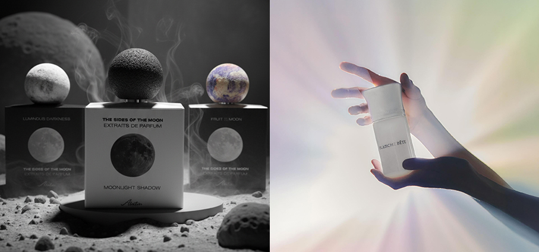

**Blue Talisman Extrait de parfum – Ex Nihilo** è concepito come un viaggio immersivo, affascinante e poliedrico in un gioiello prezioso. l Gelsomino Sambac si fonde con il Fiore d'Arancio in un connubio sensuale, rivelando tonalità calde, rotonde e solari. Il fondo, arricchito da Vaniglia e Sandalo, diventa più materico e avvolgente, esaltando l'intensità della fragranza e creando una scia irresistibilmente magnetica.
Note olfattive Testa: Pera e Bergamotto Cuore: Fiori d'arancio e Gelsomino Base: Vaniglia, Sandalo, Muschi, Ambrofix™, Legni ambrati.

**Neo Eden – Thomas De Monaco Parfums** un audace salto nel surreale. Un giardino oltre la logica, dove i colori si fondono, i fiori mutano e tutto pulsa di vita ultraterrena. Con un istinto fresco e un uso audace delle molecole, Augustin Lemiere ha dato forma a qualcosa che sembra sia digitale che emozionale. Neo Eden non è solo un profumo: è un mondo in movimento.

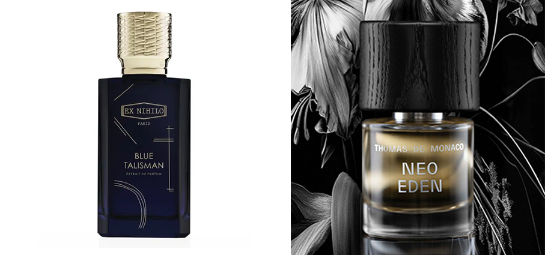

**Luna - Khayali** Edp combina note fruttate, floreali e muschiate, offrendo un'esperienza olfattiva che risveglia i sensi e accompagna in ogni passo. Le note di testa presentano una deliziosa combinazione di mela e pesca, seguite da affascinanti note di ananas e rosa, per concludere con l'eleganza morbida del muschio e un tocco speciale di patchouli. Luna dona una sensazione misteriosa, dove tutto sembra sospeso tra realtà e immaginazione.

**Gift Set - Legno di Cedro e Cashmere Edp 30 ml + Rosa e Lampone Edp 30 ml -Essenza** vi accoglie e vi invita a scoprire le sue profumazioni vegane e genderless più prestigiose racchiuse in eleganti cofanetti regalo. L’abbraccio avvolgente degli Eau de Parfum di Legno di Cedro e Cashmere abbinato a Rosa e Lampone. Intense se usate singolarmente, sorprendenti se combinate fra loro.

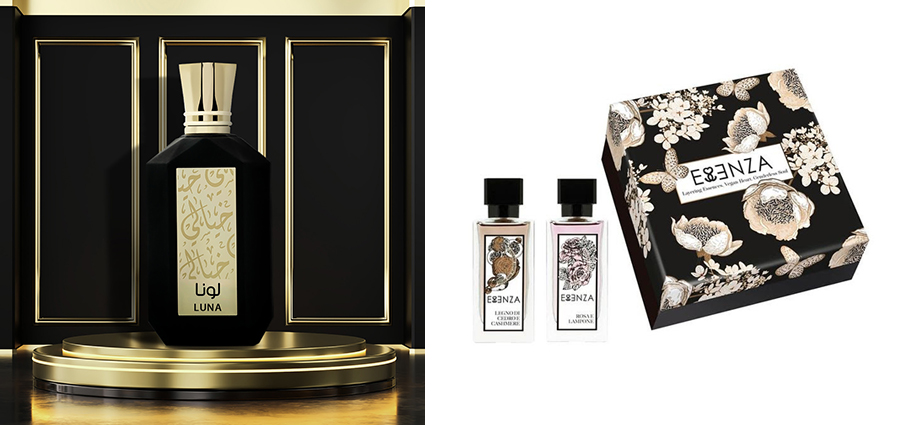

**Ambre Cristal - Nectar Olfactif** la sua anima nasce dalla suggestiva storia del più antico fossile di ape scoperto in Myanmar e risalente a cento milioni di anni fa. Imprigionata nell'ambra, questa piccola creatura è testimone di un tempo remoto, un simbolo di mistero e immortalità che si riflette nelle sfaccettature calde e vellutate di questa fragranza preziosa. Un equilibrio raffinato di spezie, fiori e accenti orientali che avvolgono i sensi in una scia dorata e senza tempo.

**Nuit Calme - Mémoires d’Amour** Edp realizzata dalla profumiera Philippine Courtière. Questa composizione olfattiva è pensata per evocare la serenità e la tranquillità di una notte calma, offrendo un'esperienza sensoriale avvolgente e rilassante.

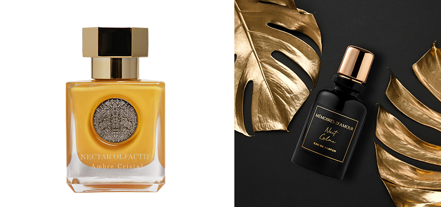

**Moonlight in Chiangmai - Parfums Dusita** Edp fragranza notturna e misteriosa, si ispira alla dualità tra luce e ombre dipingendo una meravigliosa scena di una notte in una città bagnata dalle luci dei lampioni.
Note di testa: Yuzu. Note di cuore: Gelsomino. Note di fondo: legno di Teak.

**Lineam - Laurent Mazzone** Extrait de Parfum. Un invito a lasciarsi accarezzare da una scia gourmand e luminosa, perfetta per le feste, dove la raffinatezza incontra la tentazione. Il profumo si apre con la dolcezza opulenta della frutta candita, accarezzata da un accordo di popcorn che gioca tra innocenza e provocazione. Il rum, intenso e liquoroso, vibra come un ricordo proibito, elevando la composizione con un tocco caldo che inebria i sensi. La vaniglia, pura e sensuale, si distende come un drappo di velluto sulla pelle, mentre mirra e benzoino del Siam scolpiscono una scia resinosa e profondamente evocativa. 

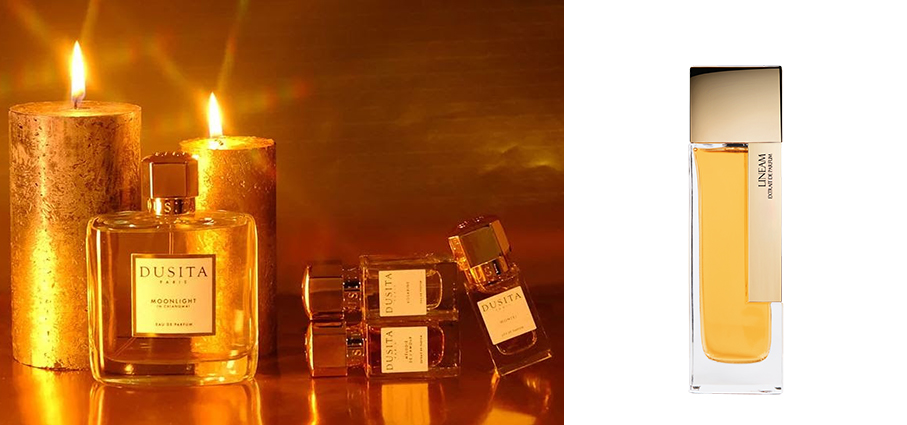

**Cuir De Russie – L.T. Piver** Edp un tempo, i soldati dello Zar trattavano il loro cuoio con catrame di betulla per proteggerlo dalle intemperie, conferendogli un profumo così distintivo da attraversare steppe e mari, ormai parte della raffinata memoria olfattiva d’Europa. Da questa pratica nacque in profumeria l’accordo cuoiato, caratterizzato da aromi affumicati, legnosi e coriacei. Questo carattere deciso incontra si rivela in questa fragranza dopo una fresca apertura di agrumi e un cuore speziato.

**Mandarino - Laboratorio Olfattivo Parfum** Cologne l’espressione olfattiva della luce mediterranea: una fragranza unisex in cui il mandarino italiano – radioso e vivace – apre il sipario. Al cuore vibra il ribes nero, mentre il fondo rivela un muschio bianco pulito e avvolgente. Una creazione essenziale ma sofisticata che racchiude l’allegria e l’eleganza del vivere all’italiana.

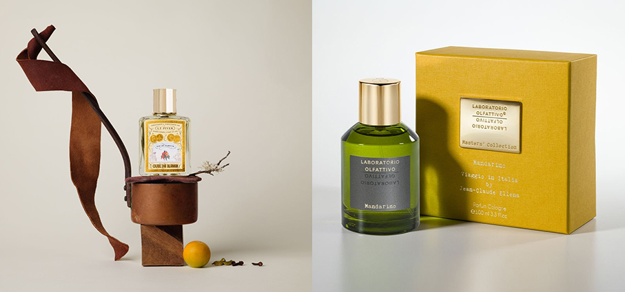

**Novae Vanilla - Atelier Des Ors** Edp una vaniglia insolita, con una freschezza minerale e stellare. Un trio di vaniglie rare, ciascuna con caratteristiche uniche, illuminato dallo splendore dorato della mimosa - il “fiore d’oro”, che dona alla composizione una dolcezza solare e luminosa.

**Gran Gala - Collezione Icon – Rito** Parfum Intense e Extrait de Parfum pensata per evocare quell’enigmatica attrattiva di eventi esclusivi e affari glamour, questa collezione si erge come un faro di distinzione, una scelta riservata a coloro che cercano la massima raffinatezza ed eleganza. È il profumo della felicità, che restituisce un senso di raffinata eleganza ma al tempo stesso trasporta chi lo indossa in un mondo effimero, immerso nell'energia e nella creatività di un festival musicale. Con note di Palissandro, Gardenia, Tuberosa, Cocco, Vetiver, Tabacco, Fava Tonka, Ambra grigia, Muschio e nuance animaliche. Note Olfattive. Testa: Palissandro, Gardenia. Cuore: Tuberosa, Cocco. Base: Vetiver, Assoluta di Tabacco, Fava Tonka, Ambra Grigia, Muschio, Note Animali.

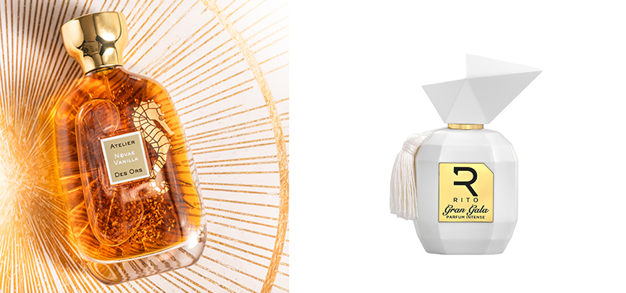

**Tabacco 1815 10Th Anniversary Perfume – Teatro Fragranze** Uniche celebra un decennio di stile, tradizione e autenticità. Tabacco 1815 si presenta con un nuovo look, pur rimanendo fedele al suo profumo caratteristico: intenso, evocativo e inconfondibile. Ispirata alla nascita del leggendario sigaro toscano, la fragranza rende omaggio al valore delle origini e al piacere di riscoprirle.

**Cumbawa Wood – Sensatio** l'ispirazione nasce dall'uso sapiente della Cumbawa, una specie di agrume simile al lime, con una buccia di colore verde fortemente increspata e irregolarmente bombata. Originaria dell’Asia, da molto tempo si coltiva anche nelle zone costiere del nord del Madagascar. La sua scorza è ampiamente utilizzata in cucina per aromatizzare una varietà di piatti, sia dolci sia salati, esaltandone il sapore. Fresca e misteriosa, la fragranza rivela note agrumate e frizzanti, offrendo un’intensità e una persistenza irresistibili.

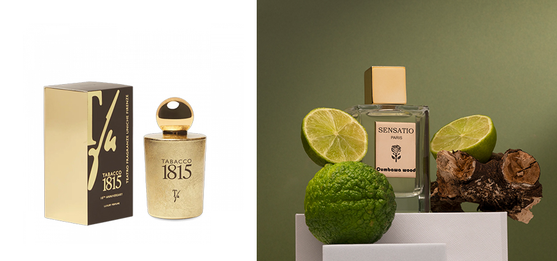

**Len Fragrances – Nasra** Edp questa è una fragranza che non si dimentica: una esclusiva composizione orientale di spezie fresche e prugna sensuale nelle note di testa. Prezioso zafferano mischiato con profonde note di cuoio e ricca davana che si trasforma in una base persistente composta da lussurioso legno di cashmere, note di ambra che si diffondono in una squisita vaniglia.

**Blonde Amber - Clive Christian** questa fragranza raffinata, densa e sofisticata combina la dolcezza di un’ambra opulenta con il cuore pulsante e suntuoso del tabacco biondo, creando un’esperienza olfattiva che evoca in chiave moderna l’eleganza e fascino dell’Art Deco.  

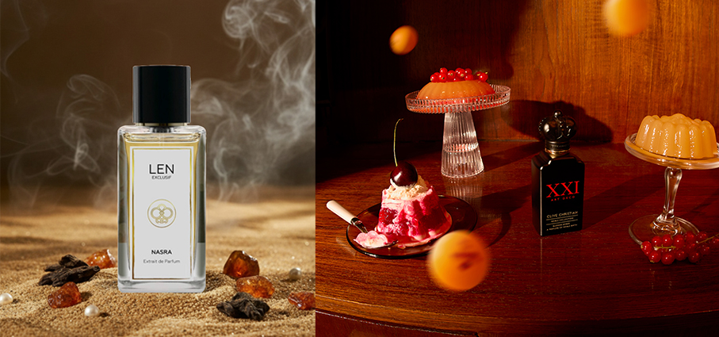

**Flaming Red – Santi Burgas** Edp un inno alla passione segreta, un sentimento puro e ardente che resiste alle regole e alle convenzioni. La protagonista è la rosa bulgara, fiore simbolo dell’amore eterno, esaltata dalla dolcezza fruttata del frutto della passione e dalla profondità sensuale dell’oud del Laos. Iris toscano, ambra e vaniglia bourbon completano la composizione, creando una scia raffinata e magnetica che vibra come un battito di cuore innamorato. Regalare questa fragranza significa celebrare l’amore autentico.

**Mini-Set Enigma – Metascent** Edp 3 x 10 ml Tre fragranze. Infinite emozioni. Un solo enigma in versione travel: un elegante cofanetto con tre Eau de Parfum da 10 ml, pensato per chi ama viaggiare leggero senza rinunciare all’intensità delle emozioni. Tre fragranze sofisticate che raccontano una storia sensoriale avvolgente e multisfaccettata, capaci di svelare le sfumature più intime e contraddittorie dell’animo umano. Love Affair, Adrenaline e Gaslight compongono questa trilogia affascinante: ogni profumo è un frammento di emozione, un ricordo vivido, un brivido sulla pelle. 

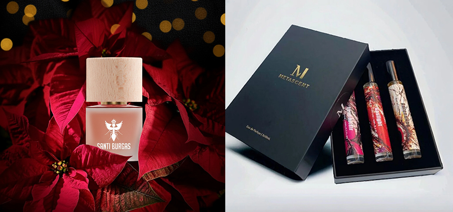

**Volupté Noire - Pierre Guillaume Paris** Edp un omaggio al miele di Euforbia e alla sua natura selvaggia. Volupté Noire fonde luce e ombra in un equilibrio raffinato di fiori bianchi, legni preziosi e sensualità ambrata.

**Voyage Kit True Connoisseur – Locherber Milano** contiene tre prodotti iconici del brand. Come il Kashmir, terra dal fascino millenario che viene raccontata attraverso le note calde, speziate e lievemente cipriate di Azad Kashmere, fragranza inebriante e persistente. Il viaggio olfattivo prosegue in Italia, tra le antiche botti del Clinto, eccellenza enoica nota solo ai veri intenditori, dal profondo colore violaceo e dall’intenso profumo fruttato; da questa golosa ispirazione nasce Klìnto1817, profumo entusiasmante e vivace, che evoca le atmosfere gioiose della vendemmia. In Etiopia ci si immerge nella foresta di Gori Gesha, lì dove si trovano le piantagioni di caffè Gesha: una delle varietà di arabica più pregiate al mondo, raccolta rigorosamente a mano, ispirazione per Café Satin che avvolge i sensi come una carezza vellutata e setosa.

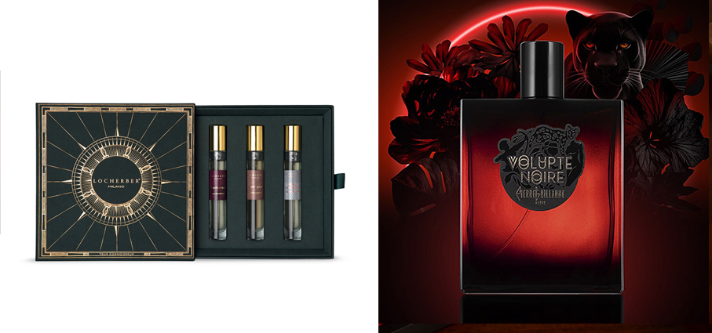

**Magnetic Magma - Agarthi Scent Core** EdP 25% una sensualità profonda e vibrante, un’eco primordiale che riscalda la pelle come un abbraccio di luce e materia. L’aria è intrisa di avventura e di promesse sconosciute. Un viaggio olfattivo tra terre misteriose e acque incantate, dove ogni profumo racconta la forza ancestrale della Terra. Una collezione che parla di energia, mistero e luce interiore: il dono perfetto per chi ama l’intensità e la profondità dei profumi che raccontano una storia. Legnoso - Fruttato - Speziato

**20 Iconic Feminine  - Clive Christian** torna alle origini del concetto di “icona” con una nuova edizione limitata. Nate per la prima volta nel 2019 – in occasione del ventesimo anniversario della maison – queste creazioni non celebrano solo il passato: rappresentano una continuità, un dialogo tra eredità e visione futura. Un’esplosione di rosa, regina dei fiori, incontra la ricchezza dello zafferano e un seducente tocco di prugna. Un profumo che brilla e avvolge, che racconta una femminilità allo stesso tempo radiosa e segreta tra fiori cristallini e ambre.

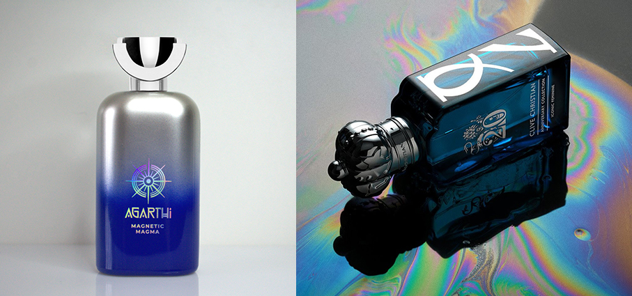

**Queening - Soulmate Collection – Mind Games** La collezione Soulmate invita a distinguersi in modo potente e senza rivali, offrendo la gamma più completa di esperienze aromatiche. Accende i sensi con questi profumi passionali per scoprire la migliore versione di sé stessi. Queening è la celebrazione del raggiungimento dei propri obiettivi, un viaggio attraverso le sfide e il superamento degli ostacoli da cui uscire più forti e rinnovati. Questa squisita fragranza combina il profumo reale dell'iris con la dolcezza della vaniglia, creando un'apertura solida, seguita da rum invecchiato e zafferano. Famiglia: Ambrato-Legnoso-Vanigliato. 

**Cofanetti Acqua dell’Elba** la proposta 2025 si arricchisce con le fragranze della Linea editerranea: Riviera, Essenzamare e Stella.Tre interpretazioni del mare che riflettono la sua varietà di colori e di emozioni: Riviera, fresca e luminosa; Essenzamare, profonda e avventurosa; Stella, calda e speziata. Tutte create in collaborazione con il profumiere indipendente Luca Maffei per celebrare i venticinque anni di Acqua dell’Elba. 

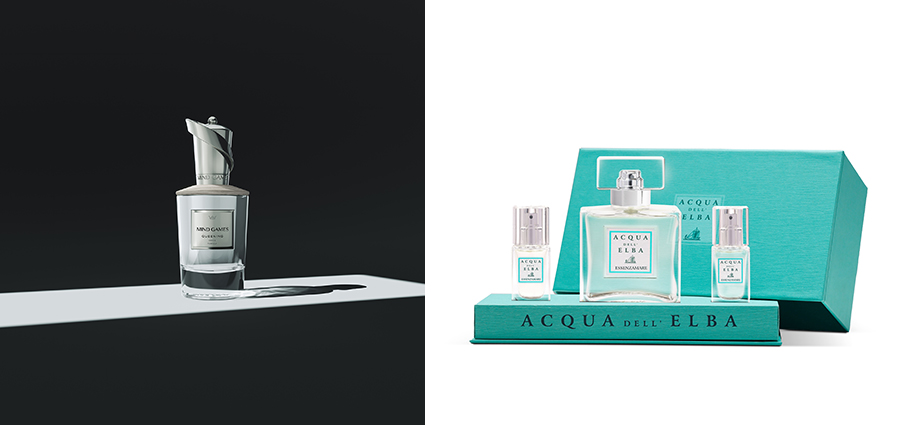
