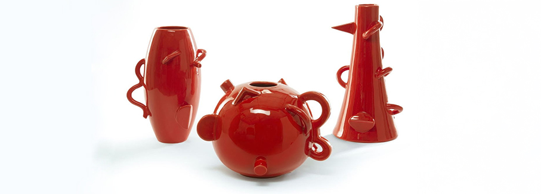
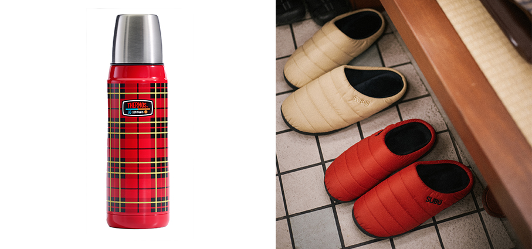
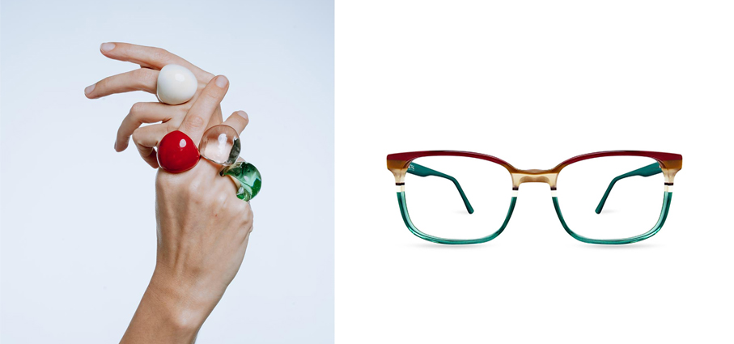
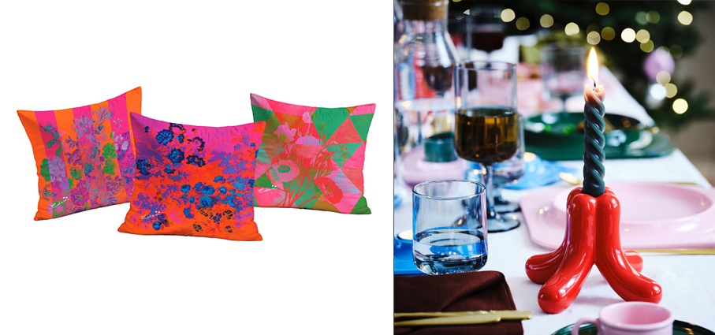
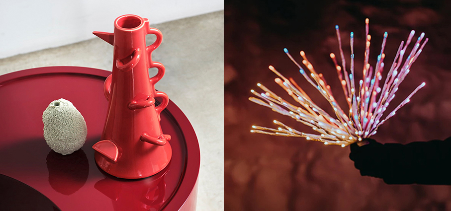
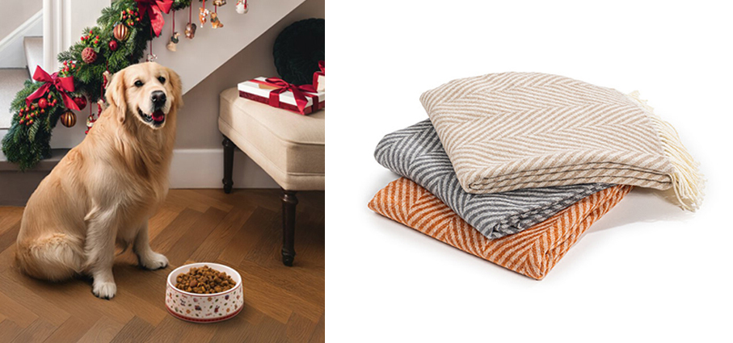
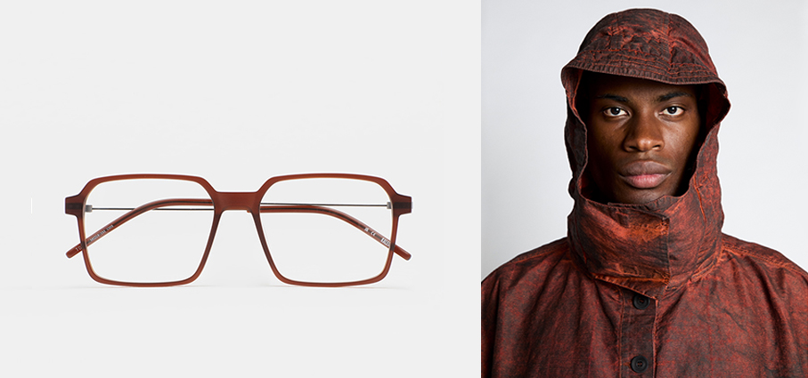
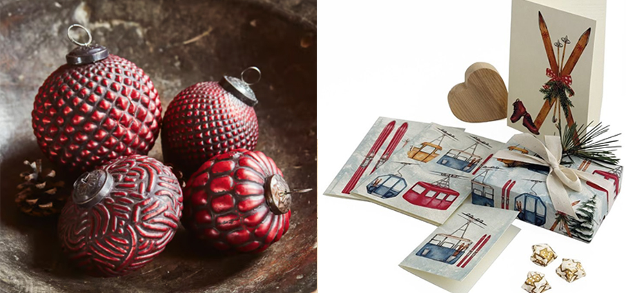
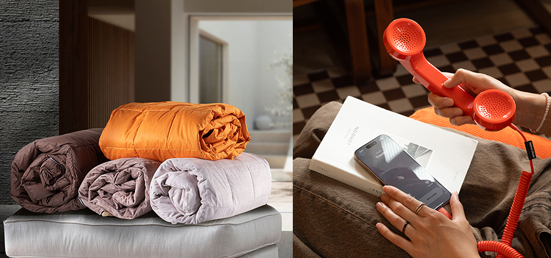

# Qualcosa di rosso…

>Per una perfetta atmosfera natalizia non c’è nulla di più magico che **regalare qualcosa di rosso**, il colore della fortuna

**Oca Vili – Jysk** nel colore avorio/rosso, questa oca natalizia arriva con una sciarpa rossa e un cappello da Babbo Natale. Questa graziosa decorazione natalizia crea un'atmosfera accogliente durante il periodo natalizio. Le sue dimensioni la rendono adatta da posizionare sul pavimento.

**Pollitt II- Kaleos** dopo quasi otto anni con l'iconico Pollitt I, è arrivato il momento di un'evoluzione ed ecco che nasce Pollitt II, affinato, modernizzato e pronto a raccogliere l'eredità del suo predecessore. In acetato translucido, è disponibile in ben 28 varianti colore. Aste perfezionate: ancora più confortevoli. Lenti aggiornate: ora adatte anche a lenti graduate. Frontale ridisegnato: una silhouette rinnovata per un'estetica più contemporanea.

**Sandali - Subu** è il celebre brand giapponese di sandali invernali. Anche quando fa freddo, possono essere infilati a piedi nudi uscendo all’istante. Con un esterno imbottito effetto piumino e inserti interni a quattro strati, oltre alla nuova tecnologia HEXMAX INSOLE™, offrono supporto, stabilità e funzionalità, perfetti per chi è alla ricerca di uno stile di relax originale e senza sforzo. Distribuito in esclusiva da Moroni Gomma.

B**orraccia Vintage - Thermos** per chi ama oggetti dal fascino senza tempo, propone la in edizione limitata nata per celebrare il 120° anniversario del brand. Con il suo design vintage che riproduce l’originale Modello 18 a quadri, è un regalo capace di raccontare una storia. Non solo un accessorio pratico ma un oggetto da collezione. Grazie alle performance termiche di altissimo livello, è il regalo perfetto che combina praticità, storia e stile. 

**Glass Ring Cupola – Corte Glass**  realizzato a mano con la tradizionale tecnica del vetro soffiato a lume, questo anello presenta un design giocoso ma elegante, capace di catturare l’attenzione senza risultare eccessivo. Disponibile in colori trasparenti e opachi, ogni anello è una piccola opera d’arte. La sua forma arrotondata a cupola si ispira alle classiche linee muranesi, reinterpretate in chiave fresca e contemporanea.  Nonostante l’aspetto deciso, il Glass Ring Cupola è sorprendentemente leggero e confortevole. Le sue curve morbide si adattano facilmente al dito, rendendolo ideale da indossare tutto il giorno, con qualsiasi outfit. Ogni pezzo è inoltre temperato in forno, un processo che aumenta la resistenza. 

**Corvara - Ultra Limited** è un occhiale da vista unisex che si distingue per il suo design squadrato, pensato per chi cerca uno stile deciso e contemporaneo. Realizzato in acetato di alta qualità, offre un perfetto equilibrio tra robustezza e comfort, garantendo una vestibilità leggera e resistente. La montatura squadrata dona un tocco di modernità e si adatta a vari tipi di viso, valorizzando ogni espressione. Disponibile in quattro eleganti colorazioni: Blu, Havana, Nero e Verde. Ogni variante di colore è progettata per aggiungere un tocco distintivo al tuo look, mantenendo l'eleganza e la versatilità che contraddistinguono il brand

**Eden - Decor Firenze** quando i fiori diventano cuscini. In casa, in giardino, sul divano e sul letto. Fermarsi tra fiori coloratissimi e morbide sensazioni. Momenti per rallentare, giocare, fiorire e rifiorire.  Coloratissime federe in velluto poliestere per cuscini 50x50 a tema floreale, dall'arte del passato a un design contemporaneo. Fantasie da mixare in libertà.

**Vinterfint – Ikea** candeliere rosso. I candelieri del designer Gustaf Westman, caratterizzati da forme solide e tondeggianti e colori vivaci, conquistano la scena. Grazie alle gambe svasate, sono molto stabili e si abbinano perfettamente ad altri articoli dello stesso designer. Materiali: Terraglia, Vetrina colorata.

**Vasi Dealbata - Zanotta** la riproposizione dei tre vasi in ceramica Dealbata è un omaggio alla creatività senza tempo di Mendini. Questi oggetti non sono solo semplici vasi, ma vere e proprie opere d'arte che combinano estetica e funzionalità.I vasi in argilla smaltata, disponibili in bianco o arancione lucido, con dettagli decorativi applicati che esprimono  perfettamente il linguaggio estetico del grande architetto, sono testimonianza della maestria artigianale e della ricerca estetica che caratterizzano il lavoro di Mendini.

**Spritzer – Twinkly** luci LED smart che aggiungono una brillante luminosità a qualsiasi ambiente. Che si tratti di decorare per Natale, festeggiare il Capodanno o semplicemente aggiungere un tocco creativo agli spazi esterni, queste vivaci luci offrono la massima personalizzazione. Mappare le luci utilizzando la fotocamera del tuo smartphone e l’app Twinkly, sbloccando effetti colore e opzioni di raggruppamento personalizzabili all’infinito. Per uso interno ed esterno.

**Grenoble, Chalet e Chamonix - Caleffi** Per una casa dal look accogliente, i nuovi plaid dalla mano calda e avvolgente uniscono la leggerezza disinvolta delle frange a colori brillanti e sempre attuali e sono realizzati in misto lana o in misto cotone: presentano fantasie a quadri, a spina di pesce o eleganti sfumature degradè.

**Toy’s Delight - Villeroy & Boch** le nuove ciotole della collezione sono dedicate agli amici a quattro zampe. Pensate per chi desidera offrire il meglio ai propri animali domestici, sono realizzate in pregiata Porcellana Premium. Decorate con l’inconfondibile design natalizio che caratterizza la linea, sono disponibili in esclusiva nello shop online di Villeroy & Boch.

**Toth - Kaleos** una montatura unisex, definita da un design contemporaneo che unisce una parte anteriore in acetato ad alta densità con aste sottili in acciaio inossidabile. Il modello "Toth" è noto per la sua estetica raffinata, la lavorazione artigianale di alta qualità e la funzionalità, come le cerniere senza viti e i naselli integrati in acetato. 

**Origin of Line** un brand italiano che intreccia design, innovazione e rispetto per l’ambiente. Una realtà che parte dalla terra e dalle fibre naturali, con un progetto che unisce ricerca scientifica, artigianalità e una visione progressista della moda contemporanea. La canapa: una fibra antica per un futuro sostenibile Made In Italy. Cuore pulsante del progetto è la ricerca sulla canapa tessile, una materia prima nobile e rigenerativa. Grazie a tecnologie all’avanguardia e alla collaborazione con i migliori partner del settore, il brand valorizza le qualità intrinseche della canapa — termoregolatrice, traspirante, igroscopica e antibatterica — dando vita a tessuti dall’alto contenuto tecnico e sensoriale. Lo studio della manipolazione dei materiali e la collaborazione con tecnici esperti consentono di realizzare lavorazioni speciali come spalmature, resinature e laminature, sempre con materie prime di altissima qualità e processi a basso impatto ambientale.

**Ringas - Lopberon** set di 4 decorazioni natalizie dal gusto vintage con motivi assortiti a rilievo. Soffiato a bocca. Vetro con finitura lucida e occhiello in ferro.

**Funivie – Tassotti** per un Natale incantato, tra le nuove fantasie di carte regalo e accessori, spicca le funivie per lasciarsi trasportare tra le vette innevate dell'inverno, un omaggio alle Alpi e alle tradizioni montane, dove il bianco della neve e il calore delle cabine colorate si fondono in un disegno che evoca l'aria frizzante delle vacanze sulla neve.

**Pop Phone di NativeUnion – Moroni Gomma** un ricevitore telefonico con presa USB compatibile con smartphone, laptop e tablet. Un oggetto iconico che unisce nostalgia e innovazione, rendendo la tecnologia un gesto semplice e quotidiano. Reinterpreta il classico ricevitore telefonico in chiave contemporanea: linee essenziali, materiali riciclati, otto colori pope un design che invita a rallentare, per riscoprire il piacere delle conversazioni autentiche. Privo di Bluetooth e batterie, si collega direttamente via USB-C a smartphone, laptop e tablet. Ideale anche per videochiamate e riunioni online grazie al microfono e all’altoparlante di alta qualità. 

**Plaid in piuma - Cinelli Piume e Piumini** regali eleganti, all’insegna di comfort, morbidezza e qualità, per rendere ogni momento della giornata speciale. Perfetti per momenti di relax, disponibili in due varianti: Plaid Soft e Plaid Piper, quest’ultimo con rivestimento in velluto sopra e cotone sotto.

