# Regali scelti con cura

>Ogni anno a Natale si pone sempre lo stesso problema, ovvero cosa regalare… L’importante è **un dono pensato con cura** per chi è destinato a riceverlo

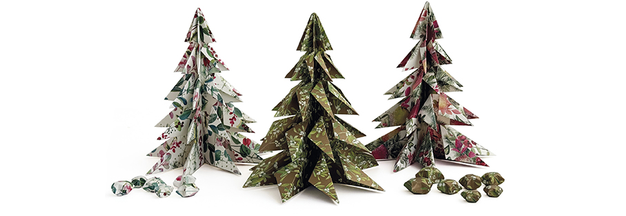

**Cycloflame Wall - Tenderflame** un camino da parete dove la silhouette cilindrica e linee arrotondate si sviluppa per dare alla fiamma una verticalità affascinante. Esalta la sua forma con l’oro che decora la parte interna abbinata all’esterno con finitura nera. La collezione è disponibile anche nella versione total black dove in questo caso le volute della fiamma risultano ancora più in risalto. Design e sicurezza sono il binomio sul quale si fonda il marchio norvegese che ha saputo sviluppare e brevettare un sistema di camini a fiamma sicura e sostenibile. Complementi d’arredo che non necessitano di canna fumaria, sono alimentati dal liquido Tenderfuel da loro inventato e in grado di ridurre al minimo il consumo di CO2: brucia in modo pulito, è atossico e non emette fuliggine e odori. Tenderfuel è sicuro perché è stato concepito per bruciare solo a contatto con lo stoppino Tenderflame.

**Chinotto Gourmand Profumatore Ambiente - Abaton** un raffinato oggetto di design che unisce estetica ed esperienza sensoriale: una preziosa sfera colorata, impreziosita da bastoncini in legno di bambù naturale, diffonde negli ambienti la fragranza Chinotto Gourmand, avvolgente e golosa come l’atmosfera di una pasticceria. Le note dolci–amare del chinotto maturo si intrecciano con fiori d’arancio, mandorla tostata, caramello e vaniglia, sprigionando un bouquet gourmand–agrumato, caldo e confortante. Una profumazione che evoca biscotti appena sfornati e ricordi autentici di festa. 

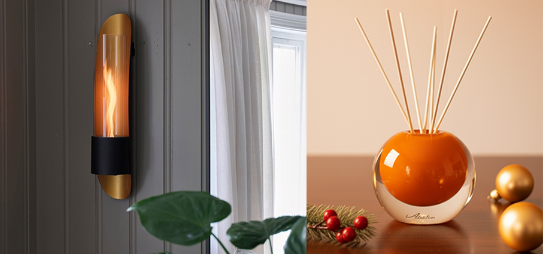

**Toldrà - Etnia Barcelona** occhiali da vista della linea Pellicer che incarna l'eccellenza artigianale. Realizzato in pregiatissimo acetato giapponese con dettagli in titanio, questo modello geometrico nella calda tonalità verde  è un pezzo da collezione in edizione limitata, pensato per chi ricerca l'esclusività senza compromessi sul comfort e sulla qualità costruttiva. Serie numerata in tiratura limitata. Naselli ergonomici ispirati a design retrò. Le aste presentano eleganti incisioni che testimoniano la cura maniacale per i dettagli. Il risultato è un prodotto che migliora con il tempo, sviluppando una patina unica che ne esalta il carattere.

**Biz2Go – Samsonite** è uno zaino nelle eleganti tonalità cromatiche Sage e Ocean/Lava, creato per esaltare ogni esperienza all'insegna del comfort e della spensieratezza. Caratterizzato da dettagli riflettenti all'esterno e numerose e pratiche tasche, diventa l’underseater must-have per tutti i viaggiatori.

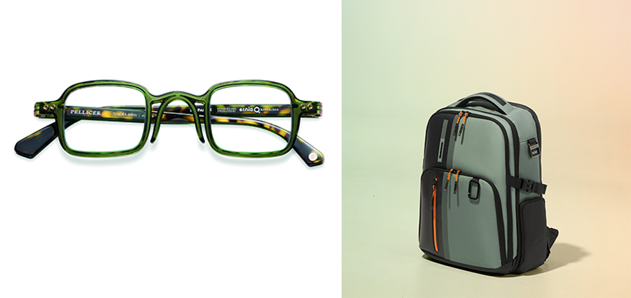

**BareMe rifinitore viso 2in1 – Remington** il rifinitore 2in1 per una rimozione facile dei peli del viso. Include: rasoio delicato per il viso che rimuove con sicurezza la peluria leggera, testina di precisione per sopracciglia con illuminazione LED integrata, cappuccio contenitore per riporre un accessorio. 100%  resistente all’acqua, fino a 80 minuti di autonomia, carica USB-C, carica rapida in 90 minuti.

**Cromatismi - Fazzini** pensa anche agli ambienti del benessere con le spugne della collezione. Proposte nelle tonalità calde dei rossi, dell’arancio e delle terre oppure in quelle fredde dei verdi, con accenni bronzo, giocano con le geometrie. L’effetto compatto e vellutato è dato dalla lavorazione jacquard. 

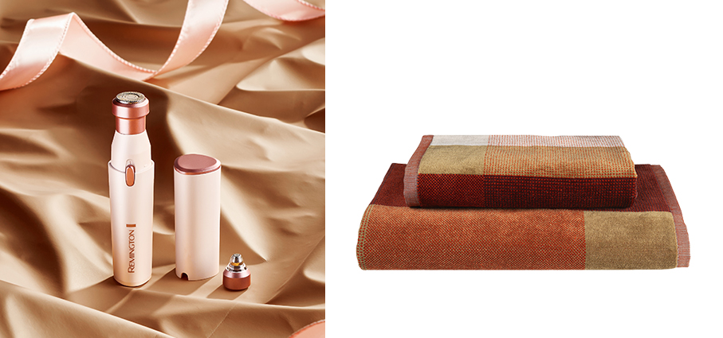

**Revive - Russell Hobbs®** una soluzione piccola ma geniale, che strizza l’occhio alla sostenibilità. Il levapelucchi Revive è in grado di riportare i tessuti a nuova vita ed è dotato di carica USB-C (non necessita di batterie) ed è facile da usare e da pulire. Con un design leggero e compatto, vanta una autonomia di 90 minuti e una ricarica completa di tre ore. Il display a LED indica l’autonomia residua e il blocco viaggio.

**Snoopy Ski – In The Box** calze lunghe da uomo con stampa Snoopy Peanuts allover giallo scuro. Il materiale è un mix di cotone, poliammide ed elastan per garantire comfort, elasticità e resistenza.

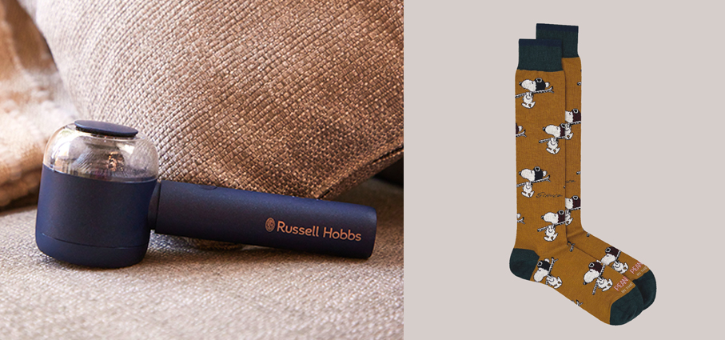

**Porter Green – Kaleos** è un occhiale da sole dal design aviator con incisioni dettagliate su tutta la parte frontale. Realizzato in acetato nero sia per la parte frontale che per le aste, è dotato di lenti nere sfumate di categoria 3 con base 2, che offrono una protezione UV al 100% e un trattamento antiriflesso. I naselli integrati in acetato e la lavorazione artigianale garantiscono comfort e raffinatezza.

**Albero Decorativo - Tassotti** ideale per il set up natalizio di interni e tavole festive. Questo oggetto, disponibile in tre fantasie natalizie, ritagliato e piegato interamente a mano e completo di busta regalo coordinata, è pensato anche come regalo benaugurante, dall’essenza eco chic e riutilizzabile.

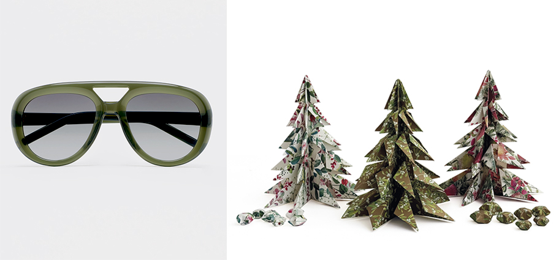

**Airvive EC8930 – Remington** asciugacapelli con tecnologia ad aria ionica e micro particelle che si attivano con il calore e che vengono rilasciate sui capelli tramite il flusso d’aria, per una protezione anti-crespo che dura tutto il giorno. Il sensore termico di protezione regola di continuo la temperatura dell’aria proteggendo i capelli dai danni da calore estremo. Il motore digitale da 110 mila giri al minuto garantisce una asciugatura rapida grazie anche alle dodici combinazioni di calore e velocità.

**Felci – Fazzini** appartiene alla nuova collezione, l’accappatoio a tre teli con scialle in spugna in puro cotone jacquard cimata. 

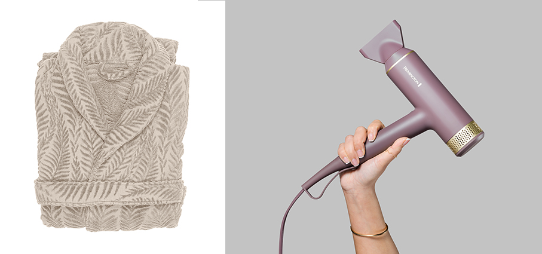

**Filante SLR ID2 - Wilier Triestina** l’ultima evoluzione della bicicletta da corsa aerodinamica della casa veneta, frutto della collaborazione con il Groupama - FDJ Cycling Team. Il nuovo sistema Aerokit, sviluppato in collaborazione con Elite Cycling, e il cockpit F-Bar ID2 a geometria ottimizzata, confermano l’approccio sistemico di Wilier: tutto è pensato per armonizzare forma, funzione e comfort. Dalla forcella al reggisella, ogni elemento contribuisce a migliorare la penetrazione aerodinamica, ridurre la fatica e aumentare il piacere della pedalata. Il carbonio Toray e le oltre 420 configurazioni possibili di fitting fanno della Filante SLR ID2 un vero abito su misura per il ciclista moderno.

**Jaquard - In The Box** le calze lunghe a fantasia jaquard da uomo sono un concentrato di sapienza nell'uso dei tessuti e di ricercatezza nella realizzazione dei dettagli. I disegni delle calze fantasia sono così ricchi, colorati e pieni di dettagli che è un mondo intero quello che si riesce a mettere ai piedi: basta scegliere la fantasia che più si sposa con la propria personalità.

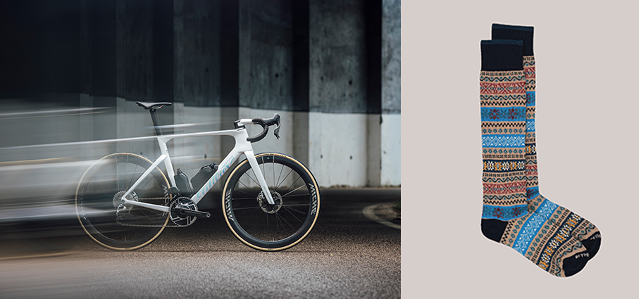

**Car Fragrance Nero Divino - Teatro Fragranze Uniche** la nuova Car Fragrance trasforma ogni viaggio in un’esperienza sensoriale sofisticata, pensata per chi apprezza gusto ed eleganza. Un design essenziale e contemporaneo, studiato per integrarsi con stile e discrezione negli interni dell’auto. Trasforma ogni viaggio in un rituale esclusivo.

**Philosopheyes PHP-824 - Thema Optical a Family Factory** occhiale da vista colore Havana da donna, in acetato e dal design geometrico raffinato e minimalista che si adatta a qualsiasi occasione. Realizzati con materiali di alta qualità, combinano comfort e classe, migliorando il look con facilità. Linee pulite e dettagli eleganti creano un'estetica sofisticata. Materiali resistenti e confortevoli: creati con una struttura solida e comfort duraturo. Stile versatile: occhiali dalle forme casual e formali, si integrano perfettamente a qualsiasi look. 

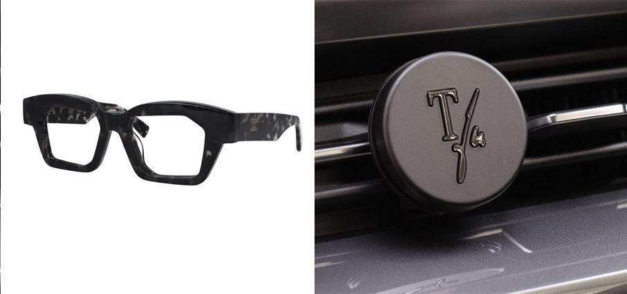

**Climber Winter Magic 2025 – Victorinox** l’edizione annuale è realizzata con guance in legno di pero decorate con un minuzioso disegno di alberi e stelle realizzato a laser. Il nuovo modello si ispira allo storico Climber Pocket Knife - il coltellino svizzero originale, che segnò l’esordio nel mondo della coltelleria di Victorinox. Realizzato in soli 10.000 pezzi in tutto il mondo e presenta 12 diverse funzionalità. Un gioiello di tecnica e materiali naturali come il legno. Un regalo perfetto per chi ama la natura, le sue stagioni e la rinomata precisione svizzera.

**Echo - Izipizi** distribuito in Italia da Moroni Gomma, è il nuovo modello che celebra i 15 anni del brand ed è disponibile in un’edizione limitata di 400 esemplari presso i migliori rivenditori internazionali, tra cui Moroni Gomma. Questo modello pantos è una raffinata reinterpretazione dell’iconica montatura #D, con angoli sofisticati e uno spessore deciso, per una silhouette moderna e sicura di sé: realizzato in acetato biosourced e riciclato, e presentato nelle due colorazioni Golden Nougat e Sepia Glow. 

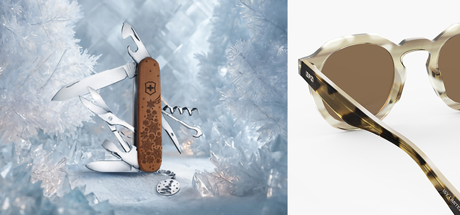

**Videocamere Dom-e - Beghelli** un occhio smart per la tranquillità della famiglia (pet inclusi). Gestibili a distanza in qualsiasi momento tramite smartphone con l’app Dom-e gratuita, sono progettate per sorvegliare in tempo reale quello che accade dentro le mura domestiche. Grazie alla risoluzione Full HD catturano ogni dettaglio, mentre la visione notturna permette di "vedere" al buio fino a 10 metri di distanza, garantendo una protezione continua anche nelle ore meno illuminate. Dotate di sensore di movimento, sirena interna, vivavoce e rilevamento animali (ideali per controllare a distanza anche gli amici a quattro zampe), funzionano con gli assistenti vocali Alexa e Google Home. Inoltre, la scheda di memoria MicroSD a colori può essere integrata con la modalità di registrazione continua su cloud (opzionale).  

**Encens de Fumigation Ceremonia - Chapel Factory** una composizione di 25 resine e piante fumiganti i cui profumi riempiono l'atmosfera. Brucia su un bruciatore di profumi e riempie l’ambiente. Vieni a viaggiare indietro nel tempo con questo profumo magico unico nel suo genere.

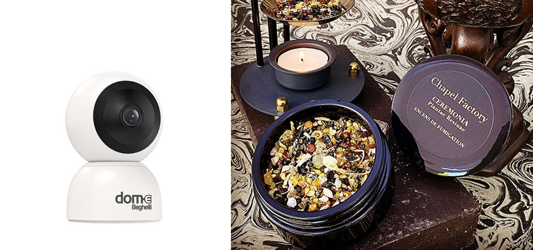

**Arctis Nova Elite - SteelSeries** le prime cuffie wireless certificate Hi-Res per il gaming che offrono prestazioni rivoluzionarie con un suono di elevata qualità grazie alla trasmissione a 24 bit/96 kHz su 2,4 GHz e Bluetooth. Sono alimentate da altoparlanti in fibra di carbonio che offrono nuovi incredibili livelli di precisione, riproducendo frequenze da 10Hz fino a 40kHz per la più ampia gamma di suoni. Altre caratteristiche includono l'app Arctis con oltre 200 preimpostazioni audio specifiche per i giochi che possono essere modificate velocemente in tempo reale; la migliore cancellazione attiva del rumore (ANC) nel gaming; microfoni con commutazione automatica a 32 kHz/16 bit con la tecnologia AI Noise Rejection in grado di bloccare fino al 97% del rumore di fondo, e un sistema di alimentazione che fornisce una durata illimitata con un sistema a doppia batteria.

**Viterbo Sun - Ultra Limited** occhiale da sole colore Havana realizzato a mano combinando il sapere artigiano del distretto bellunese a tecnologie d’avanguardia. Assemblaggio di 12 lastre di acetato di cellulosa, lavorate per più di 41 giorni in diverse fasi: selezione, incollaggio, stagionatura, pressa, forno, taglio, burattatura, finitura e lucidatura. Esemplare unico e non ripetibile nella sua combinazione di colori. Personalizzabile con il proprio nome, firma o simbolo.

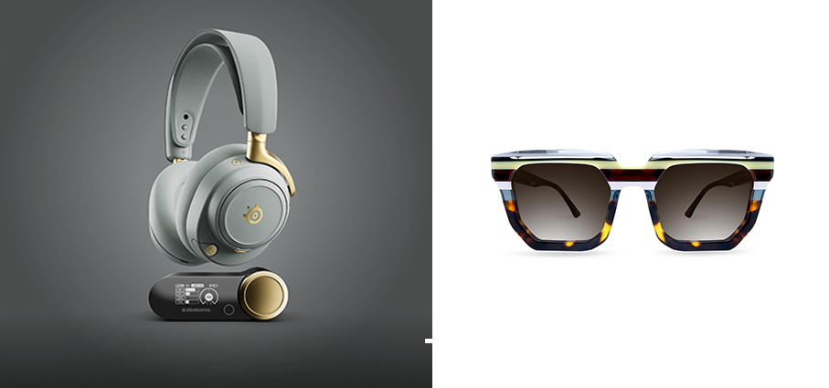

**Botanicals Cactus in fiore (11509) - LEGO®** delizia gli amanti della natura con il set pensato per bambini e adulti dai 9 anni in su. Ricco di dettagli autentici, questo set creativo permette di costruire due vivaci modelli di cactus: uno grande in piena fioritura con un fiore rosa dal centro giallo, e uno più piccolo decorato con boccioli rosa in diverse fasi di crescita. Ogni cactus presenta tonalità verdi realistiche ed è esposto in un elegante vaso color azzurro pastello, che lo fa diventare un pezzo di arredamento divertente e stiloso una volta costruito.

**Didò Blocks - F.I.L.A.** è la nuova linea che unisce la morbidezza della pasta per giocare Didò al divertimento delle costruzioni. Con i salsicciotti Didò, la maxi-formina e il babytablet con le sagome stampate, costruire coloratissimi soggetti 3D è facile, coinvolgente ed educativo. In due simpatici soggetti, Trenino o Bassotto, insegna ai più piccoli a riconoscere forme e colori modellando. Il regalo ideale per stimolare creatività, coordinazione e pensiero logico. Un regalo 3+.

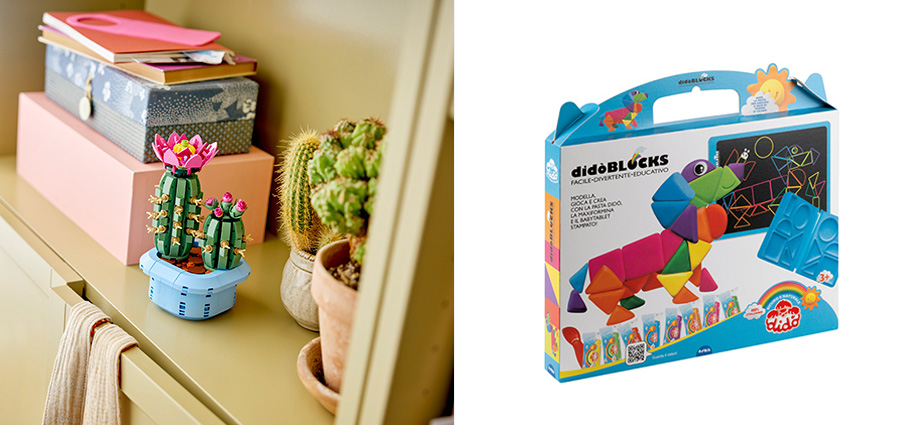
