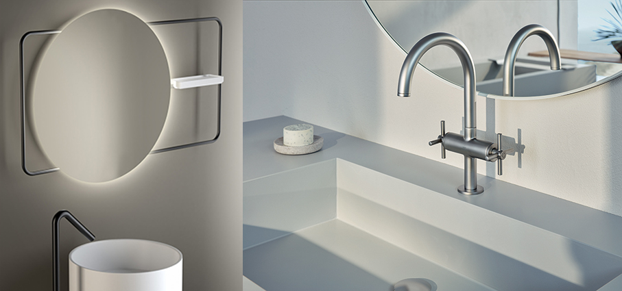

# Relax nell’ambiente bagno

> Il nuovo ambiente bagno è sinonimo di relax per tonificanti momenti da dedicare a noi stessi
 

**Lucrezia** è la collezione completa per l’ambiente bagno in ottone di **Frattini** dal sapore antico che rivisita in chiave moderna la classica rubinetteria tre fori con la maniglia a croce. E’ protagonista sul lavabo per la sua bocca di erogazione dell’acqua slanciata ad arco governata da maniglie a croce leggermente spioventi su corpi alti e snelli: il suo design geometrico reinterpreta il classico attraverso un gusto spiccatamente contemporaneo. Una palette di 5 preziose soluzioni colore valorizza la collezione: cromato; oro rosa; dorato; oro rosa antico; oro antico.

La vasca ovale freestanding **Selina** è proposta da **Alice Ceramica** ed è realizzata in cristalplant, una tipologia di solid surface, risultato per il 60% da cariche minerali, principalmente triidrati di alluminio e per il 40% da resine naturali Biobased®, ottenute da mais coltivato in fonti controllate.

**Samo** propone **Open** un sistema di box e pareti doccia che vanta elementi strutturali ridotti al minimo che garantiscono massima stabilità e durevolezza.  La sua struttura è facilmente coordinabile con vari elementi e stili dell’ambiente bagno, sia in ambito residenziale che contract, grazie all’ampia gamma di finiture disponibili. La proposta si arricchisce con nuove raffinate cromie della collezione Atelier e con l’intera palette della collezione DolceVita, per una ancor più ampia personalizzazione.

**Palazzani**, ultracentenaria realtà italiana nella rubinetteria di design, presenta **Qadra**, la nuova collezione disegnata dalla Palazzani Design Unit che fonde rigore formale e minimalismo estetico. Utilizza le sue più avanzate tecnologie di finitura, come, ad esempio, il Cromo ZERO (privo di sostanze dannose per l’essere umano), la PVD Color Technology (per conferire ai prodotti livelli di brillantezza e durabilità straordinari) e l’innovativa finitura HRP Technology (High Resistance Paint) in grado di garantire ai prodotti una protezione superiore contro la corrosione, gli agenti chimici, l’abrasione e l’usura.

**Dressholder** di **Arcom** con struttura in metallo, reinventa il servomuto grazie all’ampia gamma di colori laccati del catalogo con cui può essere realizzata. In più, i ripiani possono essere a loro volta personalizzati grazie all’ infinita possibilità cromatica delle tonalità in tinta o a contrasto offerte dall’Azienda, spaziando tra le finiture laccate e quella materica in Rovere. I modelli più alti diventano perfetti per sostituire gli appendiabiti tradizionali.

La vasca ovale **Vega** di **Alice Ceramica** è proposta in tre soluzioni: d’appoggio a parete dalla forma ampia e armoniosa con uno dei due bordi si trasforma in pratico piano d’appoggio portaoggetti. Le due varianti corner rappresentano, destra oppure sinistra, hanno il pratico piano d’appoggio su due lati.  Sono realizzate  in cristalplant, una tipologia di solid surface, risultato per il 60% da cariche minerali, principalmente triidrati di alluminio e per il 40% da resine naturali Biobased®, ottenute da mais coltivato in fonti controllate.

**ZEROsedici** di **Progetto Group** è un sistema multifunzione a parete che integra specchio, mensola e portasalviette in un solo elemento. Realizzato su un profilo tubolare da Ø 16 mm punta su leggerezza visiva e funzionalità compatta. Il nome stesso richiama il gesto progettuale alla base della collezione: un elemento unico, intuitivo e trasversale, pensato per ambienti bagno moderni e sofisticati.

Con la nuova finitura **Satin** nelle due varianti cromatiche, Cromo Satinato e Grigio Antracite Satinato, **Grohe Spa** crea uno stile sofisticato e personalizzato grazie alle molteplici soluzioni di design. Disponibile per le linee di rubinetteria **Allure e Atrio**, oltre che per le docce e gli accessori coordinati, la nuova finitura eleva l’estetica della stanza da bagno aggiungendo una piacevole sensazione tattile.

Nuova palette cromatica **Artis** di **Villeroy & Boch**. La collezione si arricchisce di quattro nuove finiture opache – Pure Black, Almond un caldo beige avvolgente, Nightfall e Teal – che seguono la tendenza dei colori intensi e profondi. Queste nuance, oltre a conferire carattere agli spazi, aggiungono un tocco distintivo, perfetto per un bagno elegante e contemporaneo. Realizzati in TitanCeram, un materiale di alta qualità che garantisce eccezionale resistenza e stabilità.

**Geberit** propone il mobile specchio **Option**, elemento indispensabile in ottica salvaspazio. Un contenitore dotato di ante e ripiani interni per ricavare un maggiore spazio dove riporre gli oggetti. Si inserisce perfettamente nella parete attraverso delle mensole interne nascoste.

**Kerid** è la nuova vasca freestanding di **Victoria + Albert**. Si ispira agli onsen giapponesi ma prende il nome da un cratere vulcanico islandese perché sperimenta e coniuga il potere del caldo o del freddo. Compatta e alta, ha la seduta integrata che avvolge il corpo completamente, ideale sia per un bagno caldo rilassante sia per una terapia a immersione fredda energizzante. Il bordo inclinato assicura comfort ergonomico a collo e testa. Realizzata in Quarrycast™, esclusiva miscela di pietra vulcanica e resina ad alte prestazioni, è adatta anche all’uso outdoor, non ingiallisce al sole, resiste al freddo e può essere ripristinata in caso di danno accidentale. Garantita 25 anni.

**Koi** di **Globo** è una linea di lavabi che offre grande libertà compositiva. Le linee fluide e il bordo morbido esaltano l’eleganza della ceramica, offrendo al contempo praticità e funzionalità. Il colore neutro e le superfici opache del bianco matt o lucide della collezione Riflessi di Luce permettono combinazioni armoniose con diverse soluzioni di arredo, impreziosite anche dalla possibilità di avere il lavabo tondo nella versione con piano rubinetteria integrato.

**Arpa** è il termoarredo® che nasce dall’esperienza **Irsap**. Combina un’estetica armonica e melodiosa, come suggerito dal nome, a una straordinaria funzionalità che permette di apportare il giusto calore in locali di varie metrature e altezze. Ricca di soluzioni in versione orizzontale e a sviluppo verticale, la gamma si compone di differenti proposte che si distinguono per la dimensione del diametro dell’elemento tubolare e di conseguenza per l’idoneità a riscaldare locali molto diversi fra loro.

**Kaldewei** presenta una nuova interpretazione della sua iconica vasca freestanding con la **Meisterstück Classic Duo Oval**, ora proposta in una versione più leggera. Il bordo più sottile esalta la bellezza essenziale della forma ovale, mentre lo stile minimalista conferisce alla vasca un’eleganza senza tempo. Realizzata in un unico pezzo e in acciaio smaltato di alta qualità, questa vasca rappresenta la sintesi perfetta tra estetica raffinata, lavorazione impeccabile e comfort duraturo.

**Finion All Black** è la nuova proposta per il bagno di **Villeroy & Boch**. Linee fluide, ceramica in finitura Pure Black e materiali innovativi come TitanCeram e Quaryl® definiscono una visione d’arredo bagno essenziale e scenografica, dove ogni elemento – dai lavabi, alle vasche freestanding fino ai mobili in nero opaco – diventa protagonista. Un progetto dallo stile deciso e contemporaneo, pensato per trasformare il bagno in uno spazio di design autentico.

**Rubinetterie Treemme** presenta **Fly** in acciaio inox 316L. Il design è immediatamente riconoscibile per la borchia a parete con una curvatura conica ampia e avvolgente. Attraverso un meccanismo innovativo, la collezione Fly si presenta con un allineamento perfetto delle leve, senza la presenza di grani visibili, mantenendo intatto il valore estetico dell’insieme.

