# Rifiorire in bellezza

>Dopo il freddo invernale e le giornate buie e tristi, arriva **il momento di rifiorire** anche in bellezza
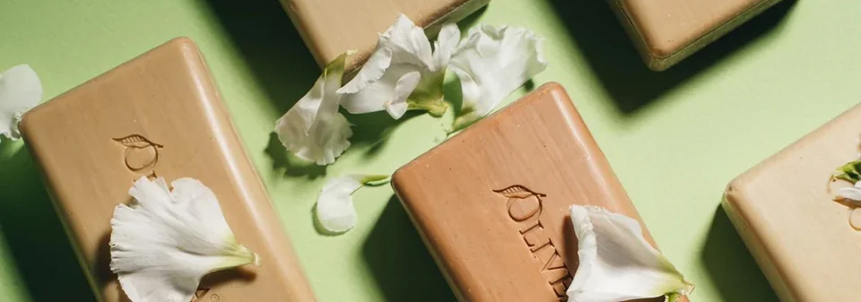

**Siero Viso Anti-Age** – **Milace**  All’interno di una texture in gel dall’azione levigante istantanea, un concentrato di attivi che distende le linee sottili e migliora la compattezza cutanea, restituendo al viso un aspetto profondamente rigenerato. E' l'unico marchio skincare al mondo che sfrutta l'intero fiore di Zafferano Bio Italiano coltivato in Brianza, grazie all'esclusiva Zaffran Ultra-Technology® che unisce estrazione a ultrasuoni per gli stimmi e processi di iper-fermentazione per i petali. In sinergia con tutta una serie di attivi inusuali, evoluti e di ultimissima generazione.

**Âme De Fleur** - **Liquides Imaginaires** Edp Una nuova fragranza woody floral, ispirata al fiore di anemone, simbolo di amore eterno e metamorfosi. La fragranza affonda le sue radici nella mitologia greca. Si narra infatti che l’anemone sia nato dalle lacrime di Afrodite, dea dell’amore, versate per la perdita dell’amato Adone.

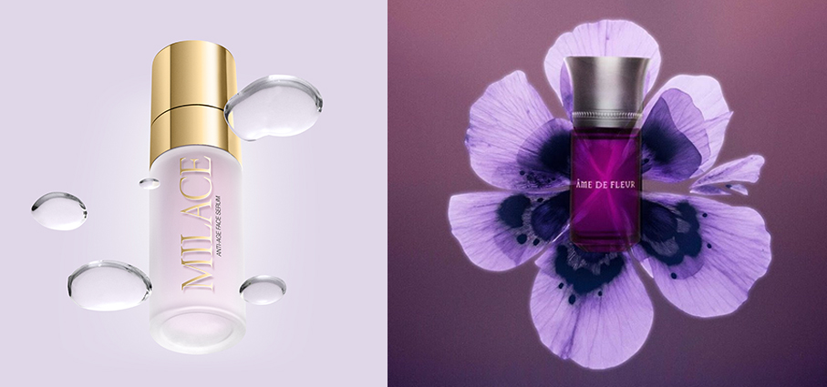

**Eat my Cherry** - **Extrait Ordinario** è un profumo provocante e audace che abbraccia il significato sensuale del piacere. Si apre con una nota floreale che evoca l’immagine di petali di ciliegio che si aprono lentamente, rivelando la dolcezza tentatrice delle ciliegie mature. Questo richiamo al frutto suggerisce un invito seducente a esplorare il piacere in tutte le sue sfumature. Distribuiti da Maison Group

**Stick Giorno Plumping Glow** - **Phergal Laboratorios** Fa parte della linea Volumax Plump It che rappresenta il trattamento perfetto per prendersi cura delle labbra durante tutta la giornata e in ogni stagione. Questo stick dona un effetto volume con un tocco di luce. La sua formula idratante esalta morbidezza e comfort, lasciando un finish brillante, naturale e ultra valorizzante. Può essere applicato da solo o sopra il rossetto. Un effetto filler e luminoso in una sola passata.

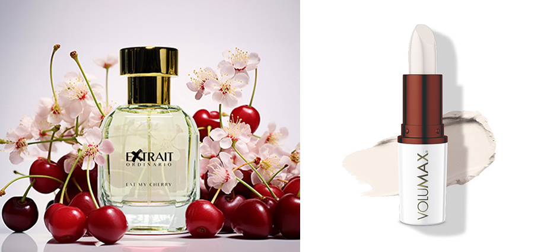

**Love Supreme** - **Rito** la nuova fragranza nata dalla collaborazione con **Zhor Parfums**. Già dal suo incipit con Litchi, Lampone e Ciliegia, questa fragranza colpisce, rivelando quel suo lato carnale e vibrante che fa girare la testa. Seguono Accordo Champagne, Rosa Marocchina e Mandorla Amara, prima di diventare eterno con le note di fondo di Ambra, Vaniglia Bourbon, Miele e Cuoio. Per la prima volta, il tappo scultura si veste d'oro lucido e porta impresso il marchio Zhor; il flacone multisfaccettato si veste di un colore che esce dagli schemi del brand: il rosso passione. Il vetro  presenta una verniciatura interna bianca, simbolo di purezza, che protegge la fragranza, mentre una sfumatura trasparente di rosso passione sale dal basso verso l’alto.

**Liftactiv Collagen Specialist 16 Eye Serum Anti-Ageing** - **Vichy** Il siero contorno occhi anti-età offre un trattamento mirato e leggero alla delicata zona del contorno occhi. Formulato con proxylane, un complesso pro-collagene, niacinamide e vitamina C, il siero rinfresca e illumina l'incarnato, contribuendo ad attenuare la comparsa di rughe sottili. Una miscela di peptidi e ramnosio favorisce una pelle più liscia e tonica, donando al contorno occhi un aspetto visibilmente più liftato nel tempo.

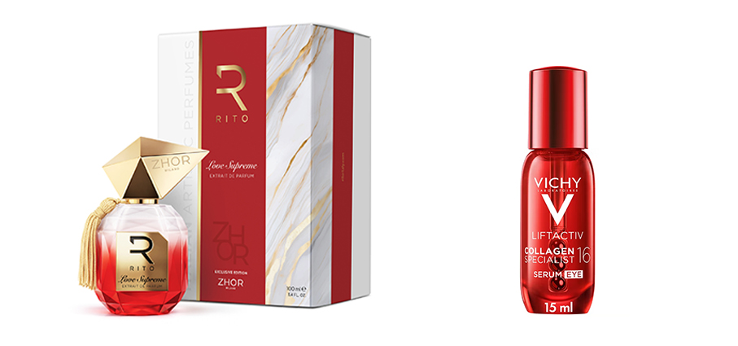

**Phoebe** - **Liberty London LBTY** Atomizzatore da viaggio ricaricabile con capacità 5 ml. E’ decorato con la stampa Thorpe e avvolto nel tessuto di cotone Tana Lawn™ di Liberty. Componenti in metallo dorato. Può essere riempito facilmente con la fragranza preferita direttamente dal flacone. Distribuito da Campomarzio70.

**Rose Magnetic** - **Essential Parfums** Il più sensuale tra tutti i fiori svela in questa creazione ogni sua sfaccettatura: giocosa, irresistibile e al tempo stesso moderna. Un accenno di pompelmo amaro e menta fresca crea un contrasto vibrante. Strati di litchi, legno di cedro naturale, muschi e baccello di vaniglia naturale ne amplificano il fascino inebriante. Nel cuore si intrecciano Rosa essenziale Naturale LMRTM e Assoluta di Rosa Turca Naturale LMRTM, entrambe certificate “For Life”. Distribuito da Campomarzio70.

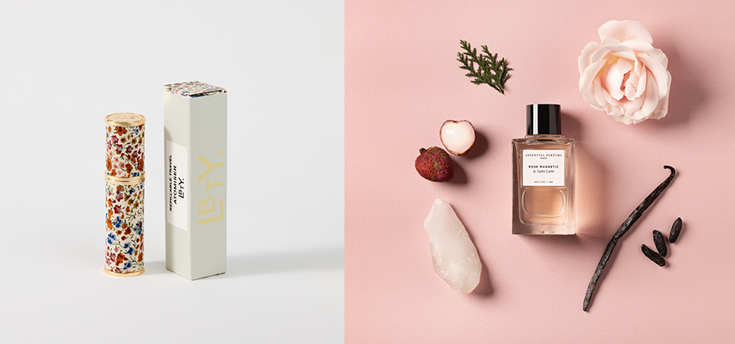

**Flying South** - **Floraïku Paris** è un viaggio verso il Sud del Giappone, dove l'estate non finisce mai e il tempo sembra rallentare in una morbidezza senza fine. La vivacità di limone e mandarino, ammorbiditi dagli accordi di cocco e melone, freschi e sensuali come una brezza tropicale. Il cuore esplode nell'accordo di hibiscus e nel georgywood. Il fondo di ambra e muschi avvolge tutto in una scia morbida. Un lento sospiro di muschio avvolge i sensi nella luminosità del Makuwa Melon, irradiando calore floreale e sensualità. Distribuito da Campomarzio70.

**Tobacco Memories** - **Chambre52** EdP Note olfattive: Zafferano, Ginepro, Amarena Assoluta di Tabacco, Asssoluta di Iris Incenso, Muschio di quercia, Vaniglia. Uno spazio intimo in cui le esperienze si traducono in profumi e ogni creazione dialoga con il mondo, tra memoria e rivelazione, tra se stessi e l’altro. Intrisa di dolce malinconia, l’evoluzione del tabacco, l’opulenza dello zafferano e dell’iris per momenti intimi che, col tempo, svaniscono lasciando spazio a nuove emozioni. Distribuito da Campomarzio70.

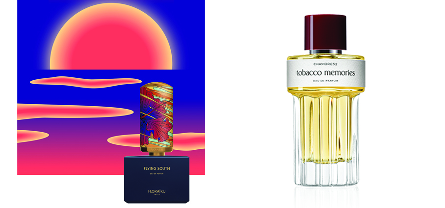

**Blackout** - **Rito** Dedicato alla poesia dell’assenza di luce, questo jus cattura l'essenza di quel momento prima della creazione. Offrendo così ispirazione a coloro che lo indossano, con l’augurio che qualcosa di straordinario accada subito dopo il primo spruzzo. Note Olfattive: Testa: Mexican Dry Gin, Pepe Nero, Chiodo di Garofano Indonesiano. Cuore: Bakhoor, Labdano Assoluto, Ambra, Cuoio, Balsamo del Perù. Base: Vetiver di Haiti, Ambra Grigia, Mandorla Amara, Vaniglia.

**Resolute Facial Concentrate** - **Aesop** segna un'evoluzione nella Cura del Viso Aesop, essendo la prima formulazione del marchio con un Retinoide. Il cuore della formulazione è l'idrossipinacolone retinoato (HPR): un sofisticato Retinoide che sostiene la pelle. In combinazione con lo Squalano e il Cedro dell'Atlante, che rinforzano la barriera cutanea, questo ingrediente senza precedenti costituisce la base di un nuovo siero oleoso che stimola il rinnovamento superficiale, rafforza la pelle e aiuta a perfezionarne l'aspetto.

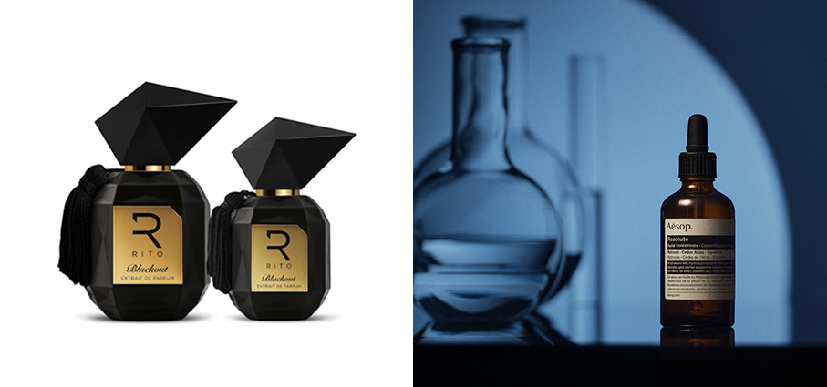

**Mathilde** - **Rancé 1795** Edp La fragranza fa parte della Collection Impériale pour femme che riunisce le fragranze più sofisticate del marchio e si ispira a personaggi storici realmente esistiti durante l’era imperiale francese, al loro carattere e ai loro valori. L’armonia del narciso, le pennellate di frutti esotici e i tocchi di iris e vaniglia delineano il ritratto di Matilde Letizia Guglielmina Bonaparte (1820-1904), nipote di Napoleone I e cugina del futuro Napoleone III, mecenate delle Arti e artista ella stessa. 

**Confident by G Gentlemen** - **Australian Gold**  Un preparatore studiato per la pelle maschile, che aiuta a migliorare l’aspetto dell’incarnato, favorendo un colorito uniforme e luminoso. Formulazione ad assorbimento rapido con infusione di natural bronzer quali guscio di Noce Nera ed estratti di Semi di Annatto che donano un immediato e superficiale colore naturale. Il complesso Dashing & Dignified Complex nutre, idrata e tonifica. L’Acqua di Cocco rinfresca, rivitalizza e ammorbidisce. La tecnologia brevettata ColorGuard™ Tattoo Technology idrata in profondità aiutando a prevenire lo scolorimento dei tattoo.

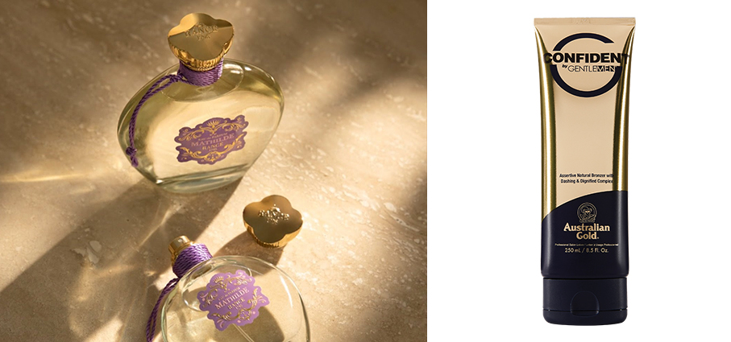

**Bathing Collection** - **Perfumer H** Sapone liquido per le mani, detergente doccia, sapone liquido e lozione corpo delicatamente profumati con una delle fragranze più iconiche del marchio: Rain Wood. Scelta per le sue proprietà olfattive che richiamano i contrasti sensoriali di un bagno nella natura, mentre evoca la riva di un fiume terroso attraverso una base umida e legnosa di ginepro e cedro con foglie di patchouli. Le note di testa di galbano ed elemi si fondono con la fresca luminosità del pepe per evocare lo scintillio della luce del sole che brilla sull'acqua. Distribuito da Campomarzio70.

**Figuerie** - **Trudon** celebra il fico in tutte le sue sfumature: vegetale, legnoso e luminoso. Ispirata al Giardino Reale di Versailles e alla sua celebre Figuerie, la collezione evoca l’arte della coltivazione francese del XVII secolo. Tra il calore delle serre, i raggi riflessi dal château e
la freschezza delle prime foglie, i fichi del re maturano tutto l’anno, sprigionando un profumo unico di foglie verdi, terra umida e resine delicate. Una fragranza che cattura l’essenza storica, vegetale e raffinata di un frutto regale. Distribuito da Campomarzio70.

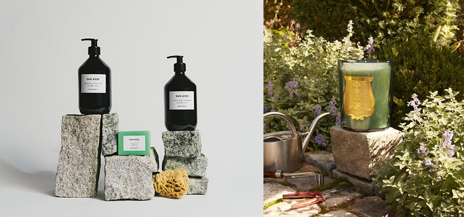

**Firming Serum Stick** - **RoC** Il primo siero liftante al retinolo in formato stick, formulato con un principio attivo (THPE: Micro Lifting Cellulare) che aiuta a rigenerare l’epidermide stimolando la produzione di acido ialuronico, collagene ed elastina. Accelera il rinnovamento cellulare in superficie, aiutando a proteggere la  pelle dalle aggressioni ambientali causa di invecchiamento. Il pratico formato stick consente l’applicazione su viso, collo, décolleté e dorso delle mani e la sua efficacia è potenziata dal massaggio durante l’applicazione.

**ProfuMINI Uovo di Cioccolato** – **Bottega Verde** Edp Niente è più irresistibile del Cioccolato, anche se è solo il suo profumo. Una cascata di cioccolato fondente, gocce di Vaniglia e soffice Brownie. Un autentico inno alla gioia, che conquisterà tutti. Testa: Bergamotto, accordo di Cappuccino, frutta secca. Cuore: Cioccolato fondente, Brownie, Ylang-ylang. Fondo: Vaniglia, Muschio, Patchouli.

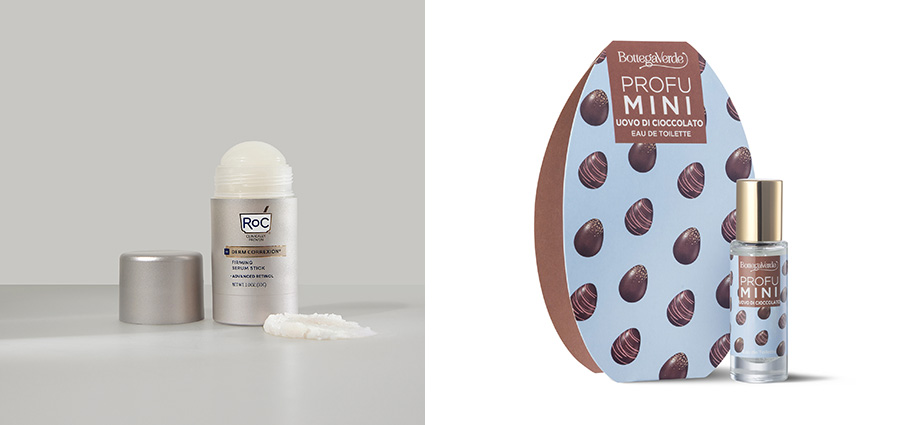

**Travel Beauty Bag** - **Carthusia** Travel bag in pelle nel formato large. Un beauty case in pelle pregiata che unisce funzionalità e raffinatezza: spazi organizzati per flaconi, accessori e prodotti, con il tocco inconfondibile del logo Carthusia impresso. Eleganti compagni di viaggio che profumano di Capri anche lontano dall’isola.

**Beauty Remedies** - **Lepo** La nuova beauty routine idratante pensata per offrire alla pelle di tutta la famiglia ciò di cui ha bisogno per mantenersi morbida, elastica e protetta, giorno dopo giorno. Texture soffici che si fondono con la pelle, formule biologiche certificate che nutrono senza appesantire, garantendo un’idratazione profonda e un comfort immediato anche alle pelli più secche e sensibili. Ogni applicazione diventa un gesto di attenzione che avvolge e protegge.

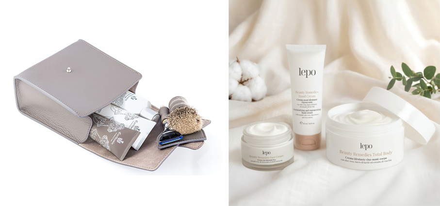

**Set Handcare** - **L:A Bruket** Contenuto in una confezione compatta e riutilizzabile, con un motivo di impronte di mani che rappresentano l'eredità delle mani di un custode, che tramanda un mestiere, una passione, ai propri cari. La crema per le mani ha una texture ricca e confortante che si fonde con la pelle, lasciandola lenita e profondamente. Il siero leggero per le mani offre una miscela concentrata di principi attivi per idratare, levigare e proteggere la barriera cutanea. Distribuito da Campomarzio70.

**Angelica Florae** - **Roos&Roos** Edp L'Angelica è l'erba degli angeli, una pianta verde che porta con sé un'aura di benefici. Questa fragranza ha voluto catturarne l'essenza. Nelle note di testa, i semi di Angelica sono combinati con l’anice stellato per creare una fragranza fresca e verde. Un duo di pepe rosa e nero subentra per creare un cuore floreale, sublimato da un’assoluta di gelsomino dalle sfaccettature iridescenti. La vivacità di una fragranza floreale verde. Distribuiti da Omnia Luxury Trade

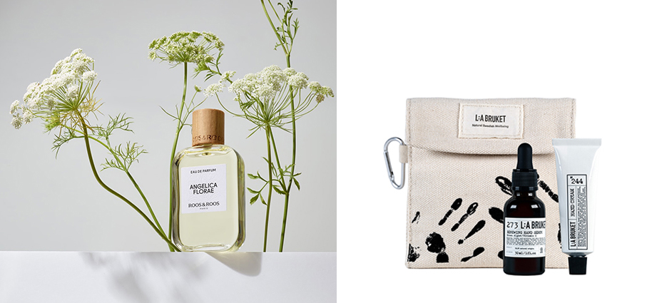

**Beautyegg** - **Bottega Verde** trasforma il classico uovo di Pasqua in un’esperienza di bellezza tutta da scoprire. Una confezione in metallo racchiude una selezione di prodotti delle linee Papavero e Collagene o Camelia e Retinolo. Ogni scrigno contiene 4 prodotti: Eau de Toilette, Bagno Doccia, Crema Corpo e Crema Mani. Un rituale di benessere che combina l’ingrediente naturale con attivi cosmetici riconosciuti per la loro grande efficacia, dando vita a un trattamento bodycare che diventa esperienza di piacere sensoriale.

**Sapone all’Olio di Oliva** - **Olivella** Una formula essenziale composta da soli tre ingredienti, resa possibile da un processo produttivo brevettato che preserva le componenti funzionali dell’olio vergine. L’olio vergine ultra-purificato impiegato nelle formulazioni viene stabilizzato per garantire affinità cutanea e performance nel tempo. La sua composizione, naturalmente compatibile con la barriera idrolipidica, sostiene l’equilibrio della pelle rispettandone la fisiologia. 

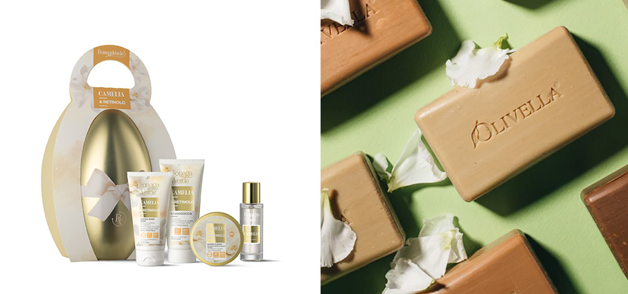

**Papaia Ibisco** - **Teatro Fragranze Uniche** il nuovo Luxury Perfume Spray per la persona, racconta di un luogo che non ha coordinate, dove il tempo rallenta, lasciando spazio a uno stato di benessere puro e spontaneo. È un mix che sa di vacanza anticipata e di natura che si risveglia e la mente inizia a viaggiare verso mete esotiche. 

**Hydra Body Serum** - **FaceD** nuovo siero corpo idratante per un’idratazione efficace senza rinunciare alla leggerezza. Impalpabile e fresco, ideale anche quando si ha poco tempo e si vuole vestirsi immediatamente dopo l’applicazione, grazie a una texture ultra-sottile ed evanescente che, a contatto con la pelle, si trasforma in un velo d’acqua. Un’innovativa struttura fosfolipidica che combina Glicerina e Acido Ialuronico a 4 pesi molecolari per un’idratazione multilivello.

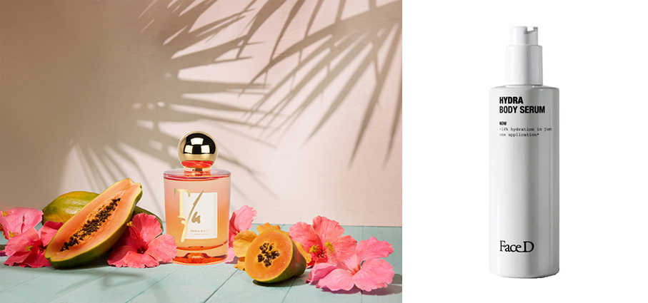