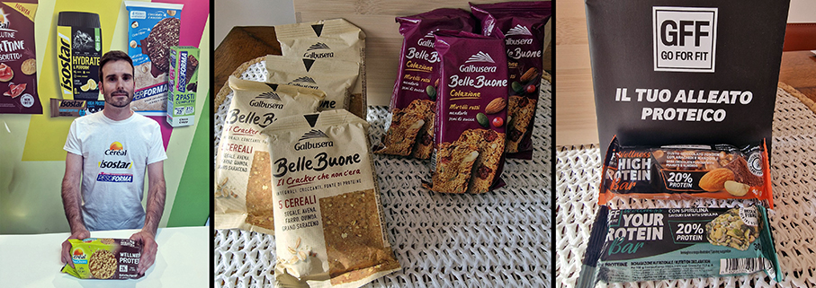

# RiminiWellness 2025 

> La 19ª edizione di **RiminiWellness** è il più grande evento italiano dedicato al **benessere, al fitness e alla sana alimentazione**

_a cura di Elena Braschi_

 

Al **Rimini Expo Centre** si è svolta **RiminiWellness 2025** la fiera convention che ha celebrato il wellness come **sinergia tra alimentazione, fitness, tecnologia e lifestyle**. Con oltre 170.000 m² di superficie, 28 padiglioni dedicati e migliaia di ore tra allenamenti, convegni ed eventi ha unito 6 settori tematici principali: **Fitness, Active, Foodwell, Health, Wellness e Steel**.

L’evento ha offerto anche **una panoramica completa dei trend e delle soluzioni per tornare in forma**, anche con proposte fitness per riprendere tono dopo la pausa estiva: attrezzature all’avanguardia, come quelle di **Technogym Checkup**, sistema di intelligenza artificiale per analisi fisiche e cognitive, con programmazione su misura; **Panatta** con palestra “live” per testare nuove attrezzature e incontrare leggende del bodybuilding come Ronnie Coleman, Lee Haney e Phil Heath; **Matrix** con la nuova linea cardio Onyx e la gamma Magnum di macchine pilate-loaded, pensate per boutique gym o home wellness center.

**Panatta** è l’azienda italiana più longeva nel settore fitness e l’unica a produrre macchinari interamente Made in Italy. Fondata 60 anni fa da Rudy Panatta, affonda le sue radici nella cultura fisica. Con oltre 600 macchine e più di 2.000 combinazioni colore, Panatta offre una personalizzazione senza pari.

Quello di **Diamond** è un impegno quotidiano, un complesso lavoro di team condotto da Jacopo Castellani per creare attrezzature professionali per il fitness che rappresentino il perfetto equilibrio tra funzionalità bio-meccanica e design elegante e ricercato. Una realtà italiana con comprovata esperienza che punta ad offrire la miglior esperienza di fitness professionale.

Il marchio **Swy** produce principalmente abbigliamento sportivo e da attività ricreative, tra cui leggings, tute, top, pantaloncini e t-shirt, insieme a integratori alimentari e prodotti per l’alimentazione sana, come barrette proteiche e collagene, oltre ad accessori correlati.

**Xenios USA®** è un marchio focalizzato sullo sviluppo, produzione e commercializzazione di attrezzature professionali per CrossTraining, Functional Training, Weightlifting e Powerlifting. Fondata nel 2009, ha attrezzato più di 10.000 centri di allenamento in 42 paesi nel mondo, dalla Finlandia alla Polinesia. Assistiamo diverse tipologie di clienti, come chi desidera aprire il suo primo Box CrossTraining o Studio PT, ampliare una Fitness Boutique o aprire una seconda Palestra.

Tutte queste novità sono ideali per chi sta pensando di **iscriversi a una palestra di fascia alta**, cambiare struttura o anche **progettare un ambiente domestico** funzionale e professionale per il fitness.

L’ **Area FoodWell** ha raccolto oltre cinquanta brand innovativi in collaborazione con grandi marchi dell’alimentazione funzionale e ha offerto un ventaglio completo di proposte: dalla pasta proteica alla cucina ketogenica, dalle acque funzionali agli snack vegani, passando per show cooking, workshop e presentazioni guidate.

Una straordinaria occasione per chi desidera approcciarsi al wellness post vacanze (e non solo) con strumenti concreti, scelti e motivati. **FoodWell** ha mostrato come **nutrizione e piacere gastronomico possano convivere**.

Tra i talk con nutrizionisti, fisioterapisti e specialisti sui temi come dieta sportiva, nutraceutica e performance personalizzata segnaliamo quello di **Giuseppe Healthy**, il fit influencer da 1,3 milioni di follower . Il 23enne Giuseppe Maiello, in arte Giuseppe Healthy, è uno dei più popolari fit influencer italiani:  ogni giorno propone ricette light e suggerimenti alimentari per restare in forma. Il suo sito nasce come diario alimentare che lo ha aiutato a uscire dai disturbi legati all’alimentazione. Ha condiviso sui social la sua intera esperienza cercando di aiutare chi aveva lo stesso problema. Nel suo team ci sono nutrizionisti che controllano e approvano tutti i post prima della pubblicazione.

Aggirandoci tra gli stand dell’**Area FoodWell**, abbiamo trovato **brand e prodotti interessanti**:

**Barilla Protein+**: pasta ad alto contenuto proteico

**Danone HiPRO** & **BuddyFit**

**FunnyVeg / Kioene** (Gemme): pasta fermentata e gnocchetti leguminosi ad alto contenuto di fibra e proteine

**Ketobar**: cucina chetogenica, showcooking sportivo e low-carb

**Heinz**: condimenti funzionali come Mayo Veg e Ketchup Zero

**Novi, Fage, Valsoia, Ventura, Bekind, Mielizia**: snack, cioccolato a basso zucchero e miele bio

**Risibisi (Valledoro**): snack biologici croccanti a base di piselli e riso

**Acque funzionali**: (Levissima+, Sant’Anna PRO, San Benedetto con Aquaprotein, Aquavitamin, Skincare ed Energade Protein; Lauretana)

**Rigoni di Asiago / Natù**: confetture bio senza zuccheri aggiunti e referenze proteiche vegetali

**I Love Kefir (Nestlé** – Lactalis Nestlé Prodotti Freschi Italia): kefir funzionale ricca di fermenti attivi naturali e nutrienti, perfetta per chi vuole integrare il benessere intestinale nel wellness quotidiano

**Zespri: kiwi** (SunGold, Green, RubyRed), fonte di vitamina C, fibre e energia naturale

**Mr Bean: snack** naturali e salutistici salati e dolci a base di farine 100 % di legumi italiani: ricchi in proteine e fibre, senza glutine, grassi ridotti, non fritti e OGM-free

**NamedSport**: prodotti per dieta, massa muscolare, resistenza e concentrazione, recupero

Tutto per **un’alimentazione wellness inclusiva e orientata all’attività fisica**: dalle confetture biologiche senza zuccheri aggiunti alle nuove linee proteiche plant-based, fino agli snack antiossidanti e alle acque funzionali. Un mix perfetto per tornare in forma con energia, gusto e consapevolezza.

Le aree **Fitness e Active** hanno illustrato come **riprendere o iniziare un percorso post vacanze** con il piede giusto. Le novità tecnologiche e la varietà di attrezzature e metodologie presentate sono un vero trampolino per chi vuole rimettersi in forma dopo agosto con consapevolezza e motivazione.

Ma come trasformare le scelte FoodWell in un **percorso wellness post vacanze**?

•	Sperimenta nuovi sapori funzionali: kefir per la salute intestinale, kiwi per la vitamina C, snack leguminosi, marmellate Natù.

•	Alterna alimentazione e movimento: pasta proteica, snack plant-based e acque funzionali come supporto durante il training.

•	Prova discipline bilanciate: functional training, pilates, HIIT, yoga, con il supporto di coach professionali e abbonamenti trial.

•	Vai oltre le vacanze: scegli palestre dotate di attrezzature Technogym o Matrix, con check-up personalizzati e programmi di allenamento su misura.

•	Mantieni l’idratazione intelligente: preferisci le acque funzionali per reintegro minerale e recupero energetico.

•	Preferisci snack funzionali: marmellate senza zucchero Natù, snack di legumi o barrette proteiche Bio.

•	Idratati bene: scegli acqua funzionali, ricche di sali minerali e proteine.

•	Diversifica i pasti: integra proteine vegetali e fermentate per equilibrare l’alimentazione.

•	Scegli una disciplina ben calibrata: pilates, functional, HIIT o circuit training ben supportati da trainer.

•	Valuta palestre innovative: macchinari di fascia alta, corsi inclusi, servizi di check-up personalizzati.

•	Inizia gradualmente, uscendo dal torpore delle vacanze: test prima di abbonarti, scegli formule flessibili come trial oppure pacchetti mensili.

_Ph. credits: Elena Braschi_