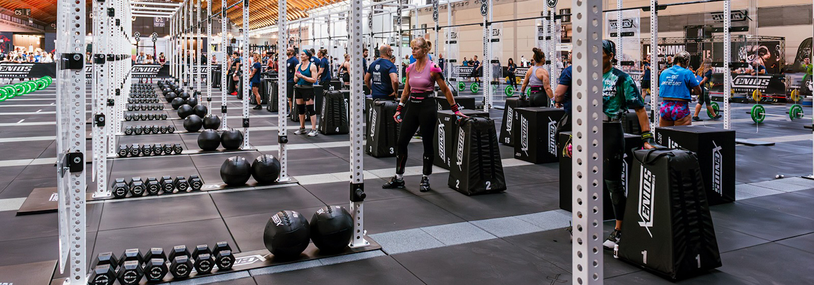
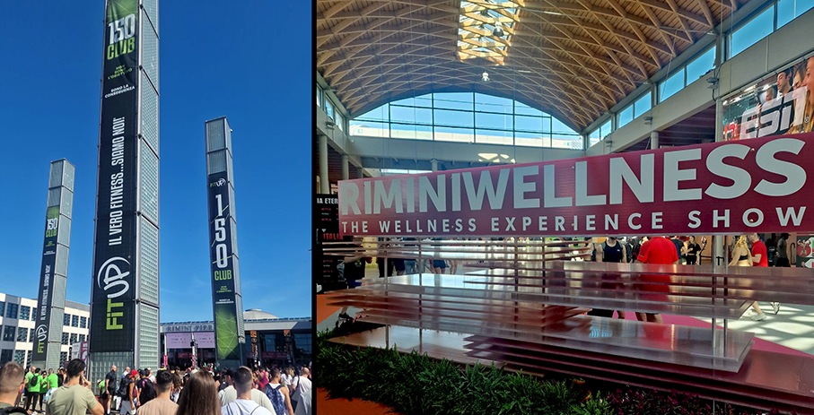
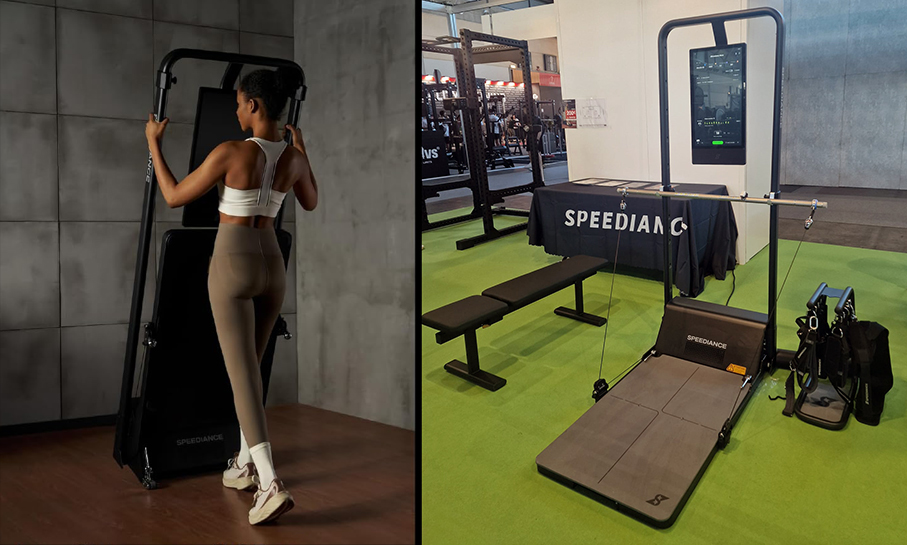
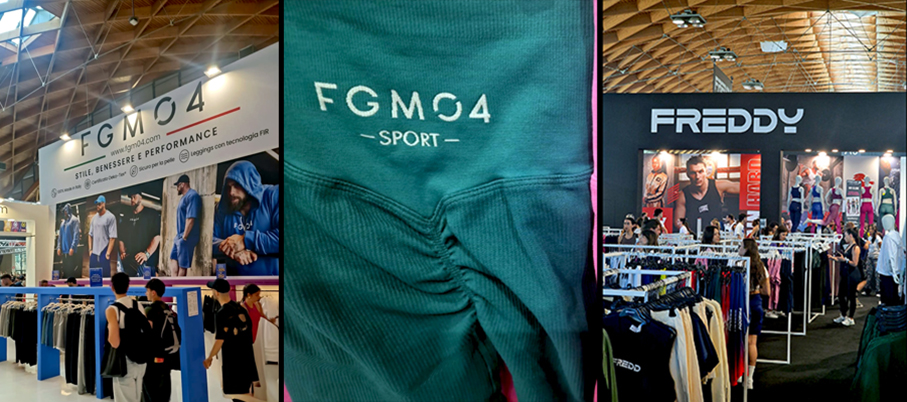
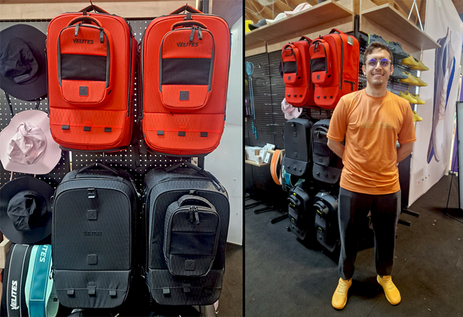
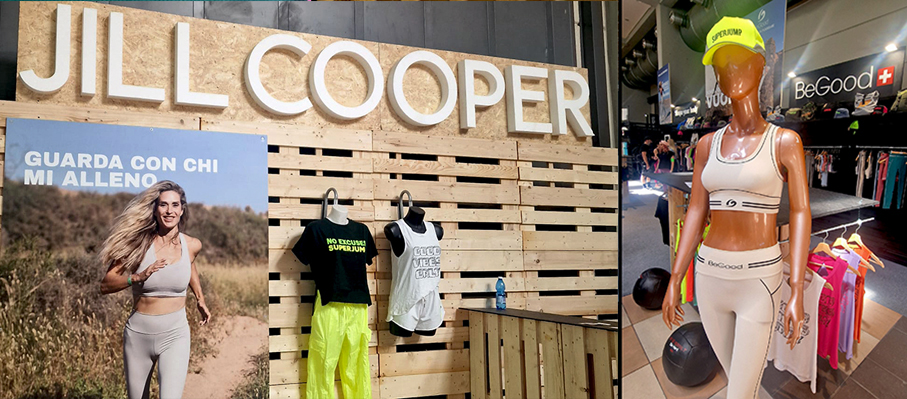
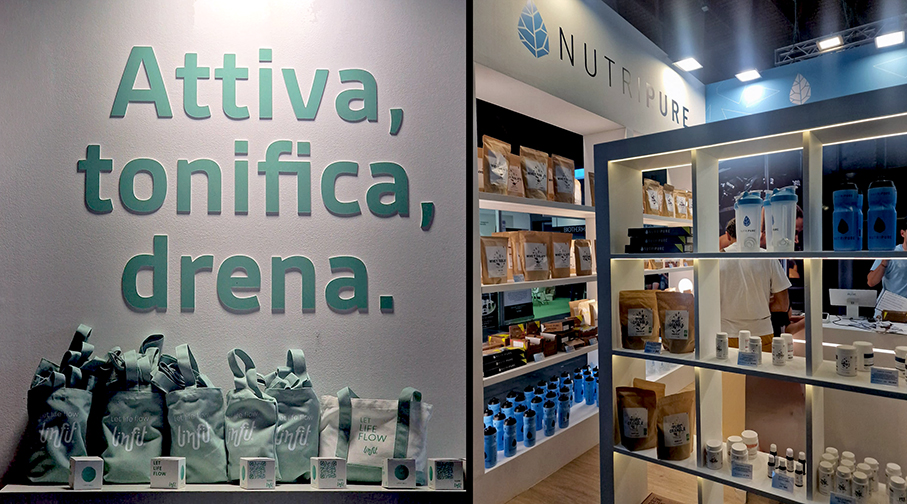
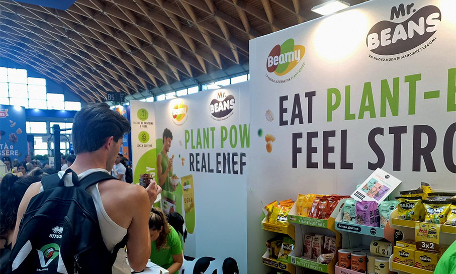
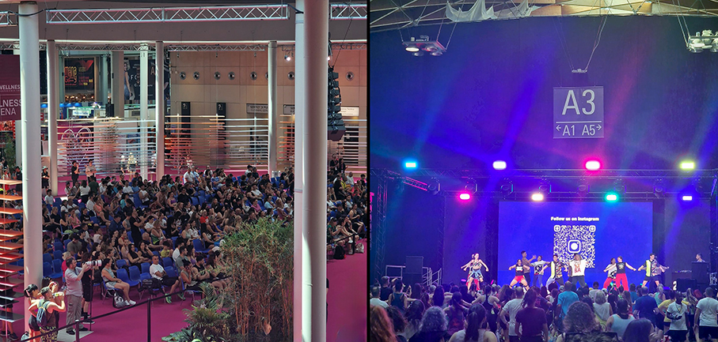

# RiminiWellness 2026 - Activewear e Home fitness 

>Per il 2026, la manifestazione consacra una tendenza irreversibile: la **fusione tra arredo di design, alta tecnologia e abbigliamento tecnico** sportivo

_di Elena Braschi_

La ventesima edizione di **RiminiWellness 2026**, l'appuntamento internazionale di **Italian Exhibition Group** (IEG), dal 28 al 31 maggio ha trasformato la fiera di Rimini e l'intera Riviera nel cuore pulsante del benessere mondiale.

**Home fitness: connesso e di design**

Il claim di questa edizione, **Go Through**, si rivolge all'abitazione, che non accoglie più semplici attrezzi da riporre in un angolo, ma elementi d'arredo integrati nel living o nella zona notte. 

Brand come **Speediance**, uniscono performance tecniche e ricercato design.**Jamie Li**, Bd Director, risponde alla nostra domanda su come i nuovi macchinari si integrino con soluzioni modulari salvaspazio senza rumori e vibrazioni nelle abitazioni, mostrandoci in anteprima **Gym Monster 2**: “_Si tratta di una stazione multifunzionale intelligente, una palestra digitale “all-in-one” con una resistenza magnetica gestita da motori digitali. Il tutto in pochissimo spazio, 0,25 mq chiuso e 0,84 mq aperto,senza fissaggio a parete. Algoritmi di intelligenza artificiale creano schede e piani di allenamento su misura, suggerendo in tempo reale anche le correzioni posturali necessarie_”.

**Abbigliamento sportivo: tessuti tecnici intelligenti e lifestyle**

La rivoluzione dell’Home Fitness trasforma anche l’abbigliamento che esce dai borsoni da palestra per entrare stabilmente nel guardaroba quotidiano e domestico (athleisure). 

**FGM04** utilizza la Tecnologia F.I.R. (Far Infrared Rays): il tessuto integra minerali naturali bioattivi che assorbono il calore corporeo per restituirlo sotto forma di raggi infrarossi. Insieme all'effetto scrunch push-up sul lato B, modella le forme e favorisce il benessere cutaneo. A spiegarci le novità è Eduardo: “_Contro la monotonia dei classici capi da palestra, puntiamo su tonalità vibranti e iper-femminili:verde smeraldo e rosa fuxia, per outfit grintosi e d’impatto_”.

**Freddy** presenta in anteprima mondiale il nuovo leggins con tecnologia brevettata NS Noslide, per risolvere il fastidioso problema dei pantaloni sportivi che scivolano durante l’attività sportiva. Come ci ha spiegato **Alessandro Costa**: “_La particolarità del brevetto è l'inserimento di due inserti interni laterali in silicone che creano un grip leggero e invisibile sulla pelle, assicurando  il leggins in posizione_".

**Blor** propone tessuti dermocompatibili e traspiranti arricchiti con minerali che riflettono l'energia termica del corpo, migliorando la microcircolazione. **Evora Fitness** punta su accessori tecnici curati nei minimi dettagli estetici per coordinare l'outfit personale ai propri attrezzi.

**Velites** lancia la linea di zaini modulari **Storm**, nell'impattante tonalità arancione magma. Il partner manager **Nicolò Benni** ci spiega: “_Questi zaini sono veri e propri strumenti tecnici:  il Wodbag è una tasca frontale magnetica rimovibile che permette di separare gli accessori essenziali (corde, nastri e paracalli) dal resto del carico. Agganciata sulle strutture metalliche del box (i rig), tiene l’attrezzatura sollevata da terra e sempre a portata di mano_”.

Il successo riscosso da Velites a Rimini si inserisce perfettamente nel boom verticale di discipline come l'**HYROX**, che quest'anno ha registrato numeri record e i cui atleti cercano prodotti versatili, capaci di colmare il divario tra il viaggio, l'ufficio e il campo di gara.

**Jill Cooper** ha letteralmente infiammato il pubblico della fiera: nel suo stand si sono svolte intense sessioni di allenamento oltre al debutto della linea di abbigliamento **BeGood**, composta da cosmetotessili modellanti e snellenti di cui Jill è il volto e la guida promozionale. La Dermofibra Cosmetics è un filato brevettato che unisce i bio-infrarossi alla cosmesi microincapsulata, garantendo un'azione drenante, idratante e tonificante.

**Novità e trend**

La Beauty Area è uno spazio interdisciplinare dove la cura della persona si lega allo sport a conferma di come il benessere stia diventando un rituale olistico da coltivare quotidianamente tra le mura di casa. La salute della pelle, infatti, riflette direttamente l'equilibrio interno dell'organismo.

**Vichy Laboratoires**, del gruppo L'Oréal, ha debuttato nel settore della nutrizione integrata alla skincare con **Liftactiv Collagen** abbinandoli al siero **Liftactiv Collagen Specialist 16**, un trattamento combinato per contrastare la naturale perdita annua dell'1% di collagene che si verifica dai 25 anni in poi.

**Nutripure** ha catturato l’attenzione con **Pure Elettroliti**, una formula in polvere studiata per apportare 5 minerali essenziali e 3 vitamine fondamentali. “_Il marchio_ - ci spiega Lea Mangeot - _è nato con una missione precisa: offrire integratori alimentari privi di additivi nascosti_“. Grande successo anche per le pratiche **Compresse per l’idratazione Elettroliti**, da sciogliere direttamente in borraccia durante il workout. 

**Linfit**  si presenta come disciplina di allenamento dedicata interamente al sistema linfatico e circolatorio, riconosciuta dal Coni. Il messaggio Attiva, tonifica, drena impresso anche sullo stand, è chiaro e d’impatto. LinFit, su App Store, permette di seguire i programmi video di automassaggio e attivazione metabolica direttamente da casa. Dettagli corsi e guida post-fiera sono disponibili su www.linfit.it.

**I trend della nutrizione: Benessere, Innovazione e Longevità**

Il benessere si costruisce anche con un approccio olistico e scientifico a tavola e nella cura del corpo. La sezione **Nutrizione** ha confermato la grande richiesta di prodotti ad alto contenuto proteico e funzionali. 

**Mister Beans** propone i suoi snack e prodotti rivoluzionari a base di legumi. 
**Beamy**, brand di MartinoRossi SpA, ridefinisce il concetto di alimenti vegetali con una gamma di prodotti 100% plant-based proteici e senza glutine. 
 

Non resta che darci appuntamento all’edizione del prossimo anno, dal **27 al 30 maggio 2027** per la prossima edizione di RiminiWellness!

