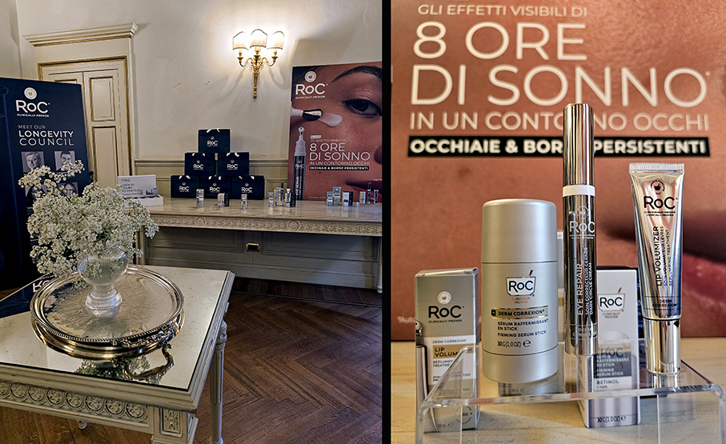
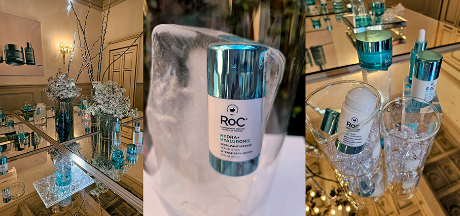
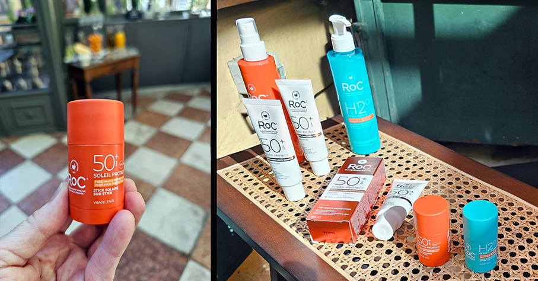
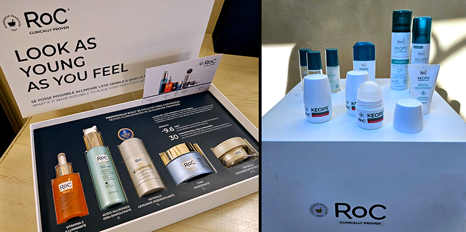

# RoC® - tutte le novità idratazione, freschezza e sole

>Presentate alla stampa di settore **tutte le novità Primavera/Estate 2026** firmate RoC 

Fondata nel 1957 in una farmacia francese, RoC® Skincare ha avuto fin dall’inizio una missione chiara: **collaborare con i dermatologi** per rendere la cura della pelle una vera scienza, capace di andare oltre i confini della cosmetica tradizionale. Questa **filosofia legata all’innovazione** ha dato origine al primo prodotto solare RoC® ad ampio spettro, ad essere **tra i primi a lanciare trattamenti ipoallergenici** e alla prima formula con retinolo stabilizzato.

Il brand dispone di **oltre 45 brevetti su retinolo, vitamina C, acido ialuronico e peptidi pro-collagene**, per offrire il meglio dell’anti-age in farmacia. Le formule RoC® non accettano compromessi e combinano **efficacia, sicurezza ed etica**: il 100% dei prodotti è clinicamente provato, testato su pelle sensibile e certificato cruelty-free.

**NUOVA LINEA IDRATANTE: HYDRA+**

Questa linea è stata sviluppata dai ricercatori RoC® in collaborazione con i dermatologi e con l'obiettivo di creare una **formula idratante e anti-età per contrastare il dehydrAGEing**, il fenomeno di disidratazione che si accentua con il passare del tempo e contribuisce ad accelerare la comparsa dei segni visibili dell’invecchiamento.

In particolare il **siero in Stick** ha una formula concentrata con **7 forme di acido ialuronico di diversi pesi molecolari**, capaci di penetrare fino a 10 strati dell’epidermide per reidratare la pelle in profondità.
Associando anche un **polipeptide pro-collagene e di un bio-peptide blu a base di rame pro-elastina**, per un effetto rimpolpante intenso e per aiutare a contrasta. E’ proprio questo ingrediente che regala al prodotto una bellissima colorazione azzurra, tipica del peptide utilizzato.

**NUOVI SOLARI**

RoC® rinnova la sua protezione contro i raggi UVA e UVB con un duo vincente: **2 stick solari** senza profumazione, testati su pelli sensibili, perfetti per proteggere durante il giorno e riparare la sera le zone esposte. 
**Per il giorno: Soleil Protect – Stick Solare Spf 50+ Vitamina C + Vitamina E** offre una protezione molto alta ed è resistente all’acqua.

**Per la sera: Soleil Repair – Stick Doposole Aloe Vera + Burro Di Karité** – Lenitivo & Riparatore – Freschezza Express. L’innovazione **RoC®, unico brand che attualmente offre un doposole in stick**, è arricchita con Aloe Vera lenitiva & Burro di Karité riparatore. La sua formula rinfrescante idrata intensamente la pelle e aiuta a riparare i danni cutanei causati dal sole. Risultato: fin dalla prima applicazione, **la pelle è idratata e lenita**. La sua texture a base d’acqua, leggera e invisibile, si fonde con la pelle **senza lasciare un finish unto**.

**NUOVO DEODORANTE KEOPS**

Keops è la linea di deodoranti firmata RoC® pensata per chi non cerca solo un deodorante, ma **una soluzione realmente efficace contro la sudorazione eccessiva**, anche nelle situazioni più intense: giornate stressanti, cambi di stagione, allenamenti, caldo intenso. Grazie alle formule ad **alta tollerabilità, testate dermatologicamente** e senza ingredienti superflui, è ideale per tutti i tipi di pelle , comprese le pelli più sensibili, offrendo sempre freschezza duratura e comfort. 

Disponibile in diversi formati - **stick, spray, roll-on, crema** - risponde a tutte le esigenze specifiche, garantendo una freschezza di 48H. Da maggio 2026, la famiglia Keops composta da 7 prodotti, si arricchisce con una **importante novità: Anti-Perspirant Roll-On**. Grazie a un sistema di **rilascio continuo di polveri micronizzate altamente assorbenti**, a un agente protettivo anti-traspirante con **amido di oryza** (riso) e ingredienti dermo-protettivi, previene la sudorazione eccessiva e controlla il sudore per 7 giorni consecutivi. Ha una texture fresca (per un assorbimento rapido), è privo di alcol (0%), è senza profumo e non lascia né macchie né residui.

_Ph. Credits: Maria Rosa Sirotti_
