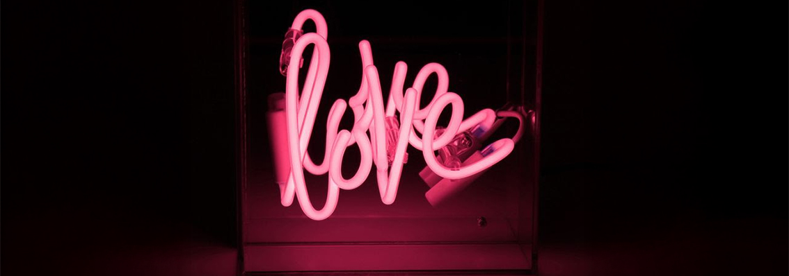
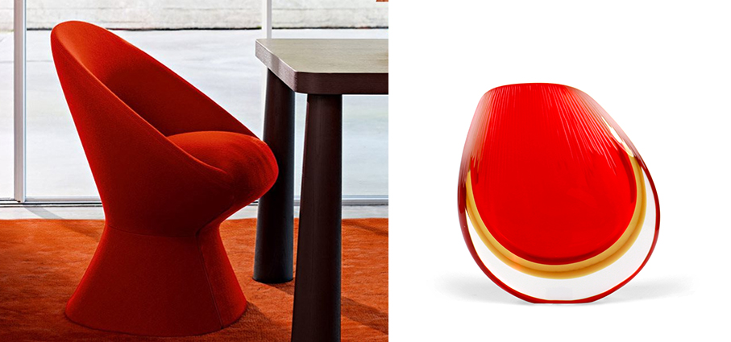
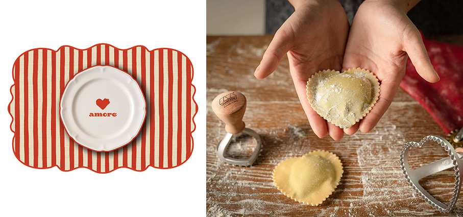
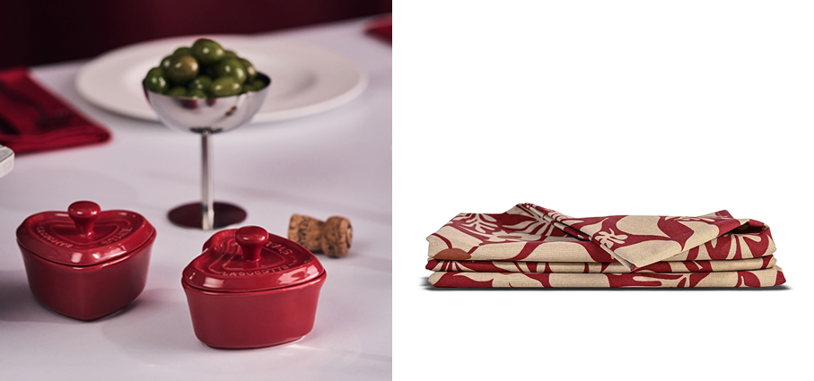
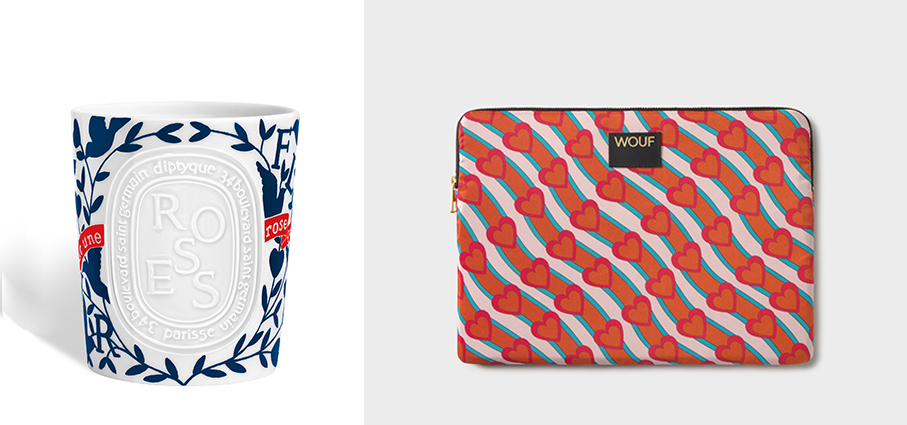
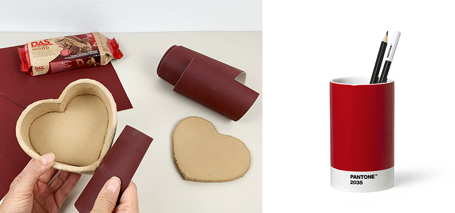
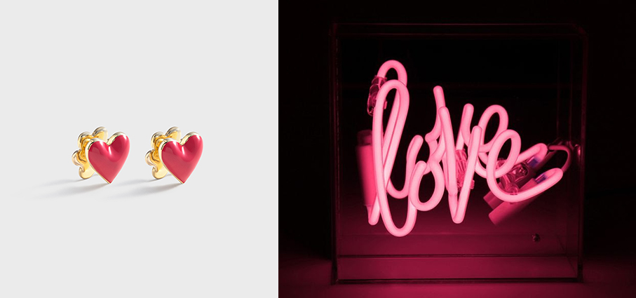

# Rosso Cuore 

>A forma di cuore o di colore rosso, per un regalo che celebra amore e passione, ma anche tanta energia e allegria 

**Giuno – Zanotta** Totalmente rivestita in tessuto, la poltroncina offre un grande comfort grazie alla sua seduta avvolgente con un accenno di bracciolo, elemento che la rende particolarmente confortevole come sedia da pranzo. La versione con base rotante aggiunge un elemento di praticità senza compromettere la purezza delle forme.

**Seguso Vetri d’Arte** presenta la nuova selezione di oggetti in vetro, pensati come opere d’arte accessibili, in grado di intercettare un pubblico più ampio e una nuova generazione che desidera avvicinarsi al mondo del vetro d’arte veneziano, senza rinunciare all’eccellenza esecutiva e al valore del fatto a mano. Nascono così conchiglie, svuotatasche, vasi e piccoli oggetti che coniugano artigianalità e contemporaneità.

**Tovaglietta Buona Giornata – Amore - Moroni Gomma** Collection Un mix calibrato di romanticismo e design pop per chi ama celebrare l’amore in tutte le sue sfumature fin dalla prima colazione.

**Stampini per ravioli e biscotti - Marcato** Realizzati in alluminio pressofuso e legno massello, uniscono design ergonomico, funzionalità e cura per i dettagli. Libera la fantasia e trasformando ogni ricetta in un gesto d’amore. Un piccolo dettaglio capace di rendere speciale ogni preparazione e di raccontare una storia d’amore attraverso il cibo.

**Mini Cocotte -  Staub** in ceramica, nella versione a forma di cuore interpretano alla perfezione lo spirito poetico di San Valentino. Nell'iconica tonalità rossa, sono ideali per condividere la cena servita in porzioni individuali, dall’antipasto al dessert. Portate direttamente in tavola, aggiungono un tocco romantico, trasformando ogni piatto in un momento di intimità e piacere condiviso, arricchendo con stile la mise en place.

**Edith – Sagaform** una tovaglia elegante e senza tempo. Realizzata in cotone e poliestere riciclati, con un tessuto morbido decorato con fiori. La generosa dimensione e il design caldo creano un'atmosfera accogliente, perfetta sia per cene quotidiane che per occasioni festive.

**Roses - Diptyque** nuova versione delle candele, in modello classico e modello grande, realizzate con la tecnica dell’ingobbio. Ispirandosi ai classici servizi in porcellana è un’originale decorazione a crudo con motivi in rosso vivo e blu profondo che evocano la simbologia dell’amore. In un omaggio a Roses, la fragranza protagonista di San Valentino.

**Heartbeat portacomputer  - Wouf** appartiene alla Daily Collection questo portacomputer imbottito adatto per contenere 13''& 14''. Distribuito da Moroni Gomma. 

**DAS Wood – F.I.L.A.** con vere fibre di legno per risultati dall’aspetto naturale. Un dono creato con le proprie mani diventa un’alternativa autentica e personale, capace di distinguersi per originalità e attenzione. Con la pasta modellabile italiana auto-indurente all’aria, è possibile dare forma a idee semplici ma cariche di valore: cuori decorativi, piccoli cofanetti, oggetti simbolici pensati per custodire un messaggio o accompagnare un regalo. Creazioni facili da realizzare, anche senza esperienza, che trasformano la creatività in un gesto concreto.

**Portapenne - Pantone** appartiene alla Pantone Lifestyle Collection ed è un’idea pratica e utile da regalare, sempre in vista per ricordare il nostro amore. Distribuito da Moroni Gomma

**Love Daisy - Wouf** Orecchini a cuore smaltato della collezione Jewellery di Wouf. Distribuito da Moroni Gomma.

**Neon Love mini – Locomocean** sempre accesa, questa luce neon ribadisce in ogni momento il nostro amore. Esclusiva Moroni Gomma.

