# San Valentino - regali per tutti

>Per la festa degli innamorati, cerchiamo **un regalo su misura per chi amiamo**: sarà sicuramente felice!

**Tegame Basso a Cuore con pomolo a cuore – Le Creuset** in ghisa vetrificata. Aggiungerà un tocco di romanticismo a qualsiasi tavola. Pomolo resistente al calore (fino a 260 °C) è studiato per garantire un’ottima presa, anche utilizzando una presina per sollevare il coperchio. Un sottile strato interno vetrificato rende più facile la pulizia. Adatta al forno, al piano cottura, all'induzione o sotto il grill.

**Mävinn - Ikea** runner realizzati con materiali naturali e dettagli ricercati, perfetti per arricchire ogni tavola con eleganza e stile. Semplici, ma dall'impatto immediato, sono la scelta ideale per chi cerca praticità senza rinunciare alla bellezza. Alterna in un motivo a strisce fibre di banano e morbido cotone. 

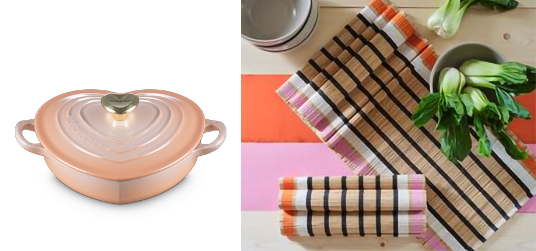

**Paestum - Blim Plus** Con la selezione di oggetti della collezione, preparare la tavola diventa un piccolo gesto d’amore, colorato e pieno di personalità. Vassoi, alzatine, caraffe, portatovaglioli e accessori diventano i protagonisti di un set romantico e raffinato, ideale per chi ama curare i dettagli. La collezione, realizzata in polipropilene e ispirata all’antica città campana dalle radici nella Magna Grecia.

**Cream Colours Plus 2S - Russell Hobbs** il tostapane con cui gustare ogni giorno i vostri toast preferiti. Le due fessure extra-lunghe assicurano una tostatura uniforme anche per le fette di pane più lunghe, mentre i 6 livelli di doratura vi permettono di controllare il grado di tostatura desiderato, dal leggermente dorato al ben cotto. E' anche possibile tostare il pane direttamente da congelato, annullare la tostatura a metà ciclo o riscaldare i toast precedentemente raffreddati. È presente anche una griglia removibile per scaldare e mantenere ben caldi toast e croissant.

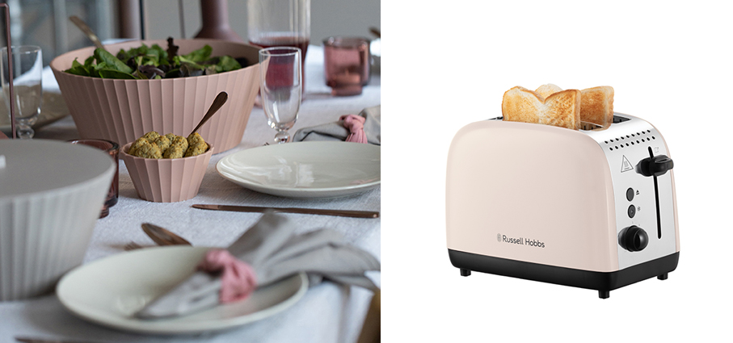

**Amadeo Figaro - Riedel** decanter realizzato a mano in vetro cristallo. Prodotto in serie numerata di 1756 pezzi, questa edizione speciale rende omaggio a una straordinaria origine condivisa: il 1756, l’anno in cui nascono l’azienda e Wolfgang Amadeus Mozart. La nuova edizione speciale presenta sui due lati della silhouette una striscia nera e una bianca ad amplificare ulteriormente questa narrazione musicale. Il loro contrasto grafico richiama i tasti del pianoforte. 

**Snow Games – Ichendorf**  i bicchieri portano sulle nostre tavole i piccoli grandi piaceri dell’inverno, sempre su neve. Sciatori, snowborder e slittini scendono con spensieratezza e portando con loro il classico spirito di del periodo invernale. Vetro borosilicato fatto a mano e modellato a lume.

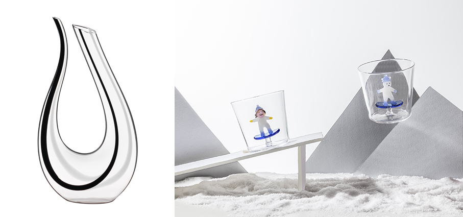

**Axia - Lodes** è una sospensione che reinterpreta l’archetipo dello chandelier trasformando i suoi bracci in un’unica linea che avvolge lo stelo centrale. Un gesto fluido che ruota attorno alla struttura e distribuisce la luce con ritmo naturale. Proposta con un rivestimento PVD, in due finiture metalliche che non ha solo un valore estetico: modifica la superficie del metallo, permettendo la conduzione delle polarità senza cavi.

**Aars/Agger – Jysk** pouf color sabbia scuro, è pratico come seduta aggiuntiva o come poggiapiedi, e personalizza con stile il salotto. In velluto a coste, un tessuto senza tempo, trend dell’inverno 2026 per arredi e complementi in equilibrio tra funzione e bellezza, tra passato e presente. Apprezzato per la sua capacità di trattenere il calore visivo e creare atmosfere accoglienti.

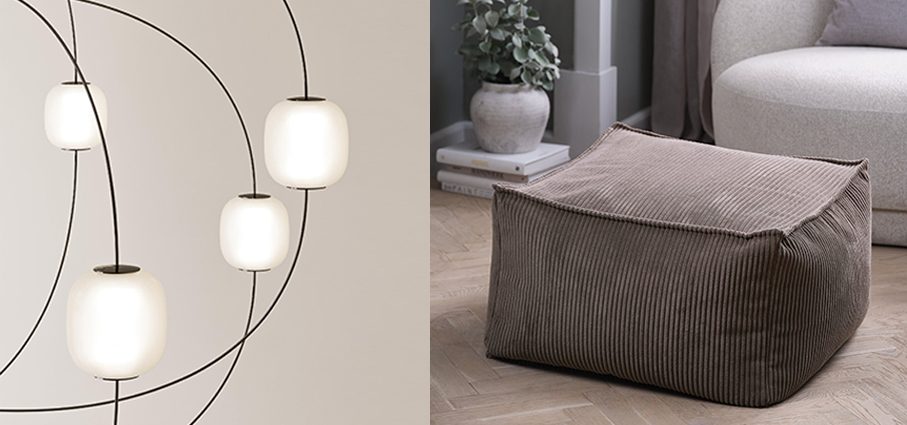

**Jotter Global Icons - Parker** celebra lo spirito cosmopolita di quattro città iconiche, Londra, Parigi, Seul e Miami. Ogni modello cattura l’essenza della propria città, dall’eleganza parigina all’energia vibrante di Seul, trasformando ogni gesto di scrittura in un viaggio. Con dettagli incisi al laser che evocano architetture, atmosfere e suggestioni urbane uniche, è il regalo ideale per lui che ama esplorare il mondo, lasciare il segno e vivere ogni parola con stile.

**Melanite Mist - Woodwick** una candela per un viaggio olfattivo unico: dal frizzante pomelo e litchi illuminati da pepe rosa, alle note minerali e fumé di vulcani e cipressi secolari, fino ai sentori nebbiosi di melonite e muschio bagnato dalla pioggia. Capace di trasformare ogni ambiente in un paesaggio sensoriale da sogno. Il regalo perfetto per lui, che può usare anche lei.

**Dagg Salvia – Ikea** copripiumino matrimoniale con 2 federe multicolore con motivo floreale. Anticipa la primavera con i suoi colori, perfetti anche per un romantico San Valentino.

**Divano Nice – Pianca** un divano dai volumi generosi, profili morbidi, uno stile senza tempo che invita al relax condiviso. Perfetto per abbracciarsi, conversare o guardare un film in due, è disponibile in diversi moduli e finiture, con un profilo in gros grain, tono su tono o a contrasto, che aggiunge una nota sartoriale di eleganza.

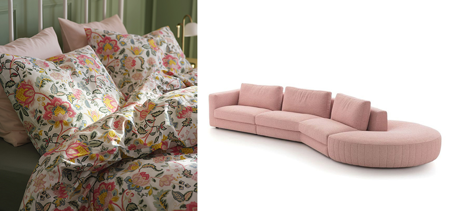

**Envelope - De Marquet** la tracolla  si distingue per il suo design iconico a forma di lettera, un richiamo romantico che rende omaggio alla magia dei messaggi d’amore. Realizzata in pelle stampata rettile dal sofisticato finish platino, racchiude in sé un’eleganza senza tempo, perfetta per chi desidera aggiungere un tocco di classe a look e occasioni speciali.

**Cherry Blossom - Yankee Candle** candela per celebrare la dolcezza e il romanticismo, dove l’incanto di accordi di ciliegi in fiore annuncia l’arrivo di una primavera magica. Vivaci note fruttate di frutti rossi e pompelmo aprono la fragranza con una freschezza scintillante, lasciando spazio a un delicato cuore floreale di rosa, fresia e fiori di ciliegio. Il finale è una carezza: note cremose e gourmand che rendono l’atmosfera accogliente, calda e assolutamente irresistibile. 

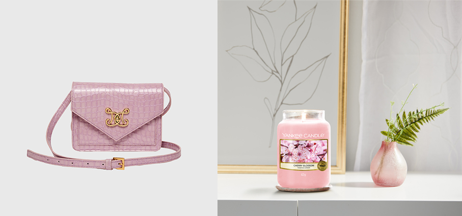

**Cuore d'Oud - Rito** celebra l'amore con un prezioso bonbon olfattivo, nel nuovo formato da 50 ml. Un Extrait de Parfum che cattura la seduzione dell'Oriente con la Rosa di Taif e la Rosa Damascena. Nelle note di fondo, l'Oud entra in scena, agendo insieme allo Zafferano come un mediatore in questa storia d’amore aromatica. Una fusione di profumi che si armonizzano splendidamente.

**Siero Viso Anti-Age, ultra-concentrato – Milace** una luxury skincare a base di Zafferano Bio coltivato sui colli della Brianza ed estratto con una tecnologia all’avanguardia che non spreca nessuna parte del fiore, esaltandone le virtù. All’interno di una texture in gel dall’azione levigante istantanea, un concentrato di attivi che distende le linee sottili e migliora la compattezza cutanea, restituendo al viso un aspetto profondamente rigenerato. Contiene:  Estratto di Zafferano Milace; Idrossiresveratrolo con la sua potenzialità schiarente; Collagene Marino per rendere la pelle più elastica.

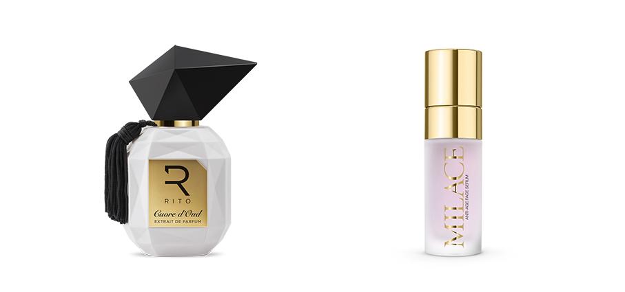

**Paisley Bordeaux - In The Box** nel colore più cool della stagione, queste calze con disegno pasley  e floreale daranno un tocco glamour a ogni outfit.

**RX7 Ultimate XR1600 – Remington** Il rasoio per tagliare i capelli corti, stile rasato, con cinque testine per ottenere uno stile buzz cut in modalità semplice e senza sforzo. Massimo contatto con la nuca e risultati rapidi (rasatura completa in meno di 2 minuti***). Le lame Dual Track sono in grado di radere fino a 0,2 mm di lunghezza, mentre la funzione Turbo Speed contrasta la crescita dei capelli più spessi per una finitura uniforme. 

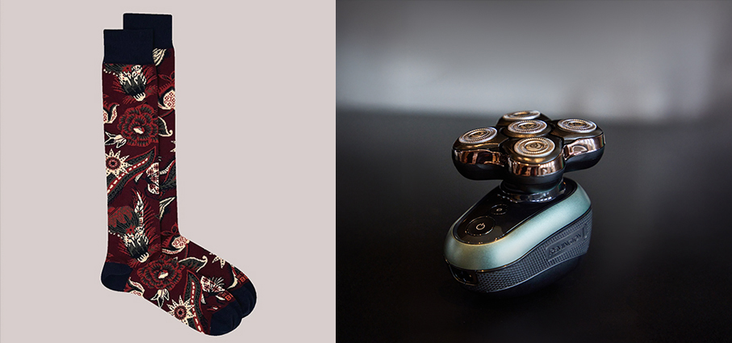

**Botanicals Parete Floreale - LEGO®** un set da costruzione da 879 pezzi elegante e altamente personalizzabile pensato per portare in ogni casa una bellezza floreale che dura per sempre. Al centro del set si trova un sistema a traliccio dotato di funzionalità modulari e di elementi floreali riposizionabili, che invita i costruttori a liberare la propria creatività e a personalizzare il capolavoro botanico. Il set presenta inoltre nuove tonalità di rosa e viola per il sistema LEGO nel 2026.

**Mävinn – Ikea** fodera per cuscino floreale, un'esplosione di colori e creatività che porta un tocco di freschezza e vitalità a qualsiasi ambiente. Ogni fodera non è solo un elemento decorativo, ma rappresenta anche un'opportunità di empowerment economico e resilienza per 305 donne giordane e rifugiate siriane che lavorano presso la Jordan River Foundation. Un prodotto che unisce design, artigianato e impegno sociale in un'unica, straordinaria creazione.

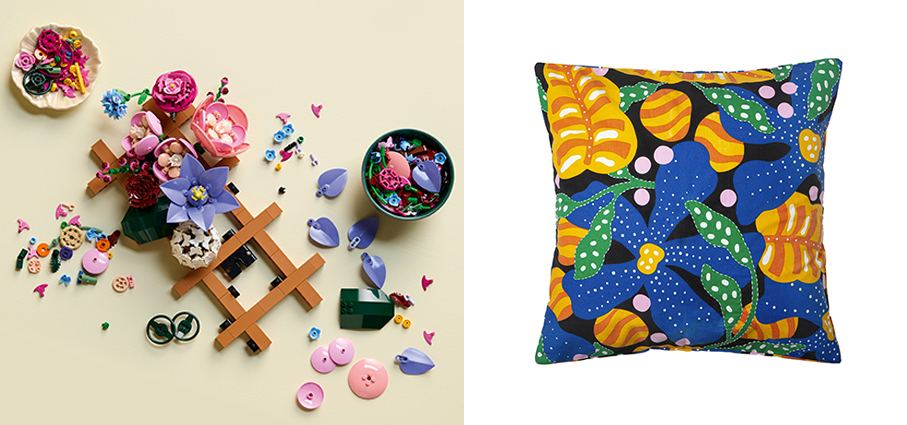

**Bronze Incense Holder – Aesop** offre agli aromi una base più duratura e agli occhi un oggetto intrigante su cui posare lo sguardo. Combinando un'arte secolare con aromi contemporanei ed evocativi, tre fragranze di incenso e un supporto abbinato offrono un formato alternativo per trasformare gli ambienti attraverso i profumi: Murasaki, Kagerou e Sarashina Aromatique Incensi.  

**Varmblixt- Ikea** lampada nella nuova versione smart, sempre a forma di ciambella ma caratterizzata da una superficie in vetro bianco opaco e da un ampio spettro di colori. Usando il telecomando Bilresa, compreso nel prodotto, è possibile riprodurre una sequenza preimpostata di 12 colori selezionati con cura da Sabine Marcelis. 

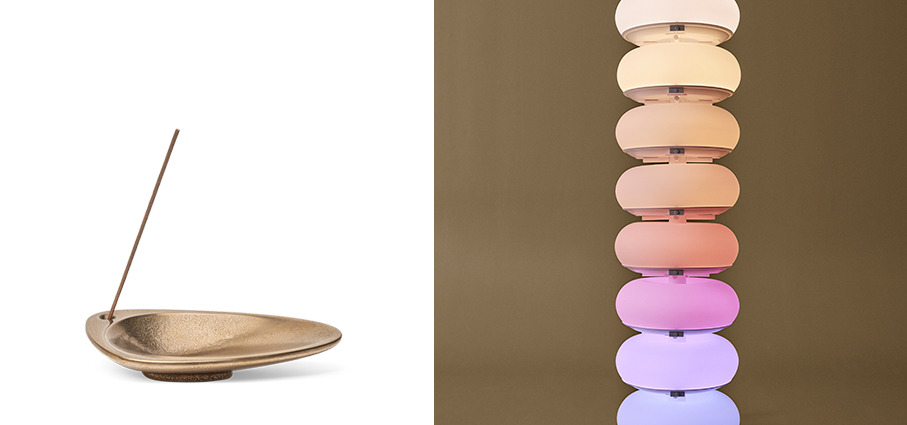

**Rival 3 Wireless Gen 2 – SteelSeries** è un mouse progettato per garantire prestazioni velocissime e reattività istantanea. Il sensore ottico True Move Air da 18k DPI offre un'esecuzione eccezionale nel gioco per i movimenti e i trascinamenti. Grazie a un'accelerazione massima di 40g e a una latenza di clic ultra-ottimizzata di soli 1,9 ms, i giocatori possono sperimentare le migliori prestazioni della categoria. La durata della batteria offre da 45 a 200 ore su 2,4 GHz, e fino a 450 ore con il Bluetooth.

**Mr Box Paris Blu - In The Box** le calze con l’iconico orsetto Mr. Box nella romantica Parigi sono perfette per l’occasione.

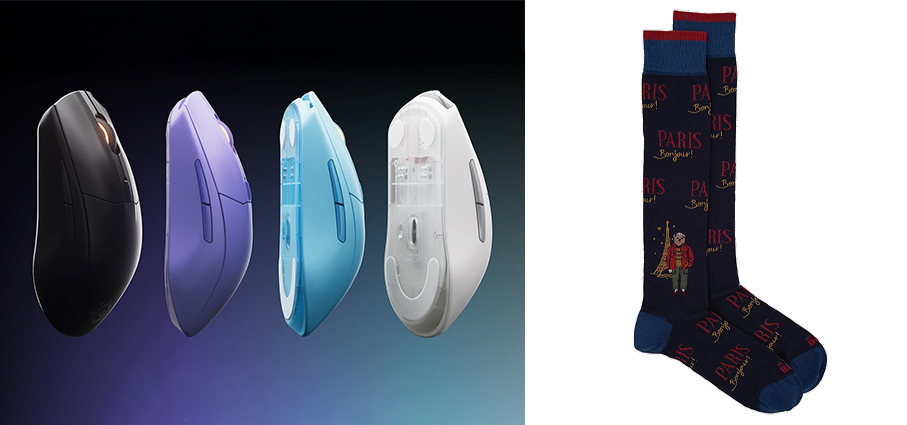

