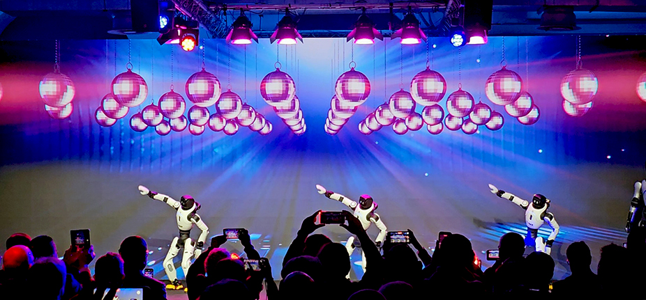
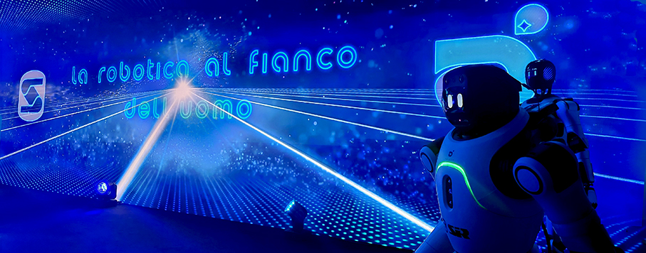
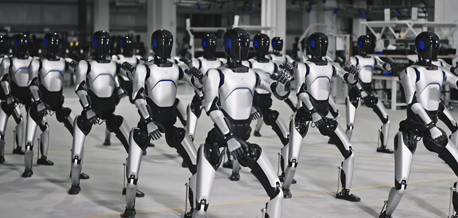
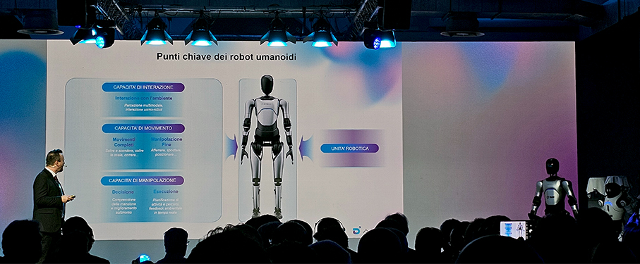
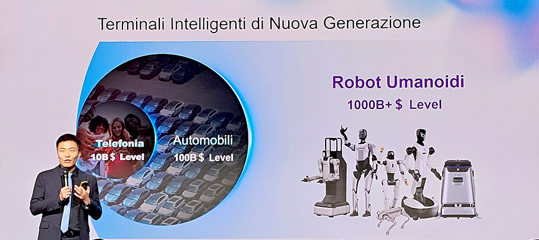
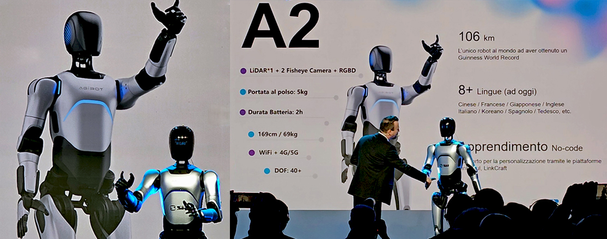
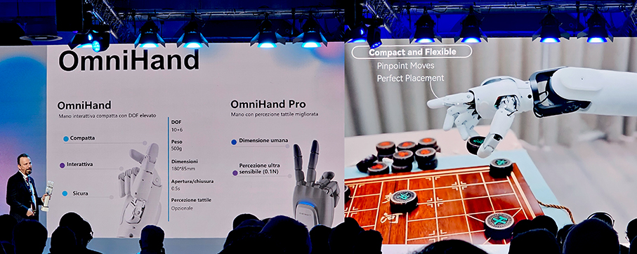
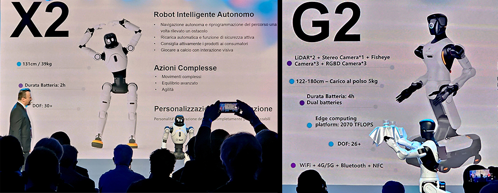
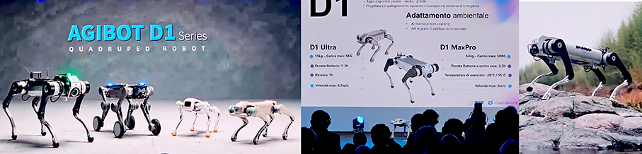
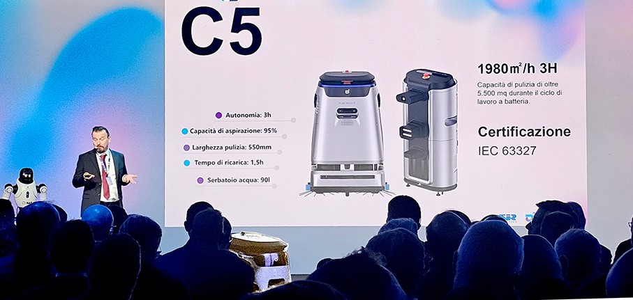

# SIR Robotics – gli Umanoidi sono qui

>E’ iniziata l’invasione dei **robot umanoidi in Italia**: dall’industria alla sicurezza, fino all’hospitality 

**l’italiana SIR Robotics** presenta una nuova generazione di prodotti dedicati a industria, sicurezza, intrattenimento e accoglienza, sviluppati grazie a un **Data Factory** e resi **tailor made** per il mercato italiano. 

È boom del mercato globale di **robot umanoidi**: nel 2025 ha superato i 2,7 miliardi di euro e crescerà enormemente nel prossimo decennio, arrivando a **70 mld entro il 2035**, pari a un incremento complessivo di oltre il 2.500%. Dall’**automazione industriale alla sicurezza, dall’hospitality alla logistica e alla sanità**, da SIR Robotics arrivano le soluzioni collaborative che rappresentano l’innovazione più avanzata, aprendo applicazioni in settori finora poco esplorati. “_Il Belpaese ha tutte le carte in regola per diventare protagonista in questo settore, qui c’è eccellenza_”, spiega il prof. **Bruno Siciliano** dell’Università Federico II di Napoli.

Nelle fabbriche di domani, **robot umanoidi assembleranno componenti con precisione millimetrica**. Negli hotel, accoglieranno gli ospiti servendo bevande e scattando foto ricordo. Nelle aree industriali, **pattuglieranno gli spazi** rilevando anomalie in tempo reale. Questo scenario, fino a ieri confinato nei laboratori di ricerca, sta diventando realtà, trasformando interi settori produttivi. 

L’Italia osserva questa rivoluzione da una posizione privilegiata: con **8.783 nuovi robot industriali installati nel 2024** e una densità di 228 robot ogni 10.000 dipendenti manifatturieri, secondo il World Robotics Report 2025 della International Federation of Robotics (IFR), il nostro Paese si colloca **al secondo posto in Europa**. La robotica umanoide rappresenta ora il salto evolutivo: non più solo bracci meccanici ancorati a una postazione, ma **veri e propri collaboratori mobili**, adattabili e capaci di muoversi negli stessi spazi delle persone.

**SIR Robotics, Global Robotic System Integrator modenese** con oltre 40 anni di esperienza e 3.900 applicazioni installate nel mondo, presenta oggi la **gamma più completa di robot umanoidi**, capaci di lavorare fianco a fianco con l’uomo. L’elemento distintivo di SIR è un sistema open source che permette ad ogni azienda di definire, costruire e disegnare le **attività dei robot in base alle proprie esigenze**. SIR accompagna il cliente dalla configurazione iniziale fino alla messa in opera finale, agendo sul software per personalizzarlo completamente. “_Abbiamo voluto portare in Italia non solo la tecnologia, ma l’intelligenza dei robot umanoidi_”, dichiara **Davide Passoni**, **CEO di SIR Robotic Solutions for Innovators**. “_Grazie al nostro Data Factory, siamo riusciti a sviluppare un ecosistema robotico che apprende, si adatta e collabora con le persone in modo naturale. Il nostro know-how italiano ci permette di offrire un supporto completo, gestendo l’integrazione sia hardware che software. Non si tratta di sostituire il lavoro umano, ma di liberare tempo e valore, restituendo centralità al talento delle persone e aprendo nuove possibilità per l’industria italiana_”.

SIR Robotics si è distinta come partner tecnologico di riferimento per l’automazione robotica industriale, sviluppando relazioni durature con importanti gruppi industriali nei **settori automotive, fonderia e metalmeccanico**. A inizio 2026 è stata presentata una linea di **robot umanoidi realizzata in collaborazione con Agibot**, segnando un ulteriore passo avanti nell’evoluzione tecnologica dell’azienda.

Le soluzioni presentate da SIR Robotics si articolano in **6 robot umanoidi e sistemi specializzati**: 

1.	**A2 Ultra** è un robot umanoide alto 170 cm e dal peso di 70 kg, progettato per l’accoglienza commerciale e l’hospitality; può scattare foto con gli ospiti, servire bevande e snack e muoversi in sicurezza tra le persone.

2.	**OmniHand 2025** è una mano robotica avanzata pensata per sistemi di automazione industriale, capace di operazioni di precisione come avvitamento, sollevamento e manipolazione di oggetti complessi.

3.	**X2 Ultra** è un robot umanoide specializzato nell’intrattenimento e nell’interazione dinamica con il pubblico, offrendo esperienze coinvolgenti e personalizzate.

4.	**D1 Ultra** è un robot quadrupede, simile a un cane, equipaggiato con sistemi di videosorveglianza intelligente e rilevamento anomalie in tempo reale, ideale per la sicurezza e il pattugliamento di ambienti interni ed esterni.

5.	**D1 Ultra W** è la versione avanzata del D1 Ultra; come robot quadrupede, dispone di capacità potenziate di videosorveglianza e rilevamento anomalie, progettata per scenari di sicurezza più complessi. 

6.	**Cleaner** è un robot speciale progettato per pulire autonomamente ambienti complessi, muovendosi con sicurezza senza bisogno di supervisione.

_Ph. credits: Maria Rosa Sirotti_