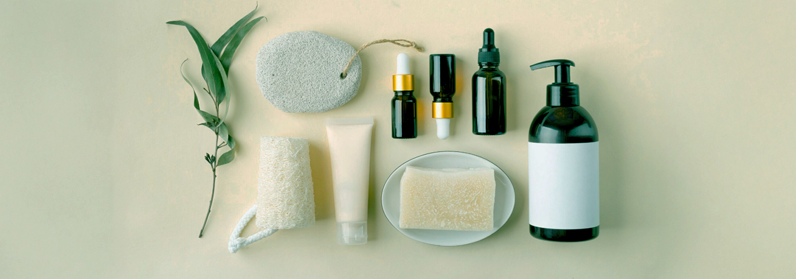
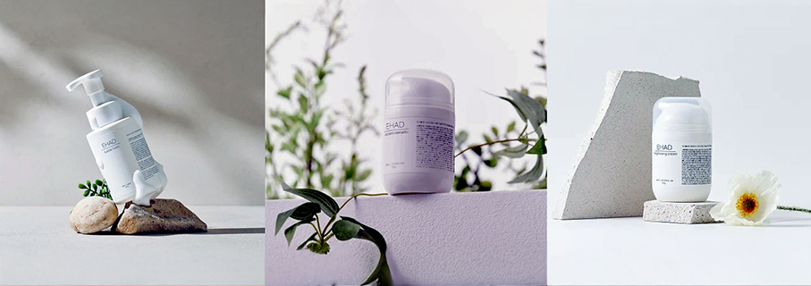
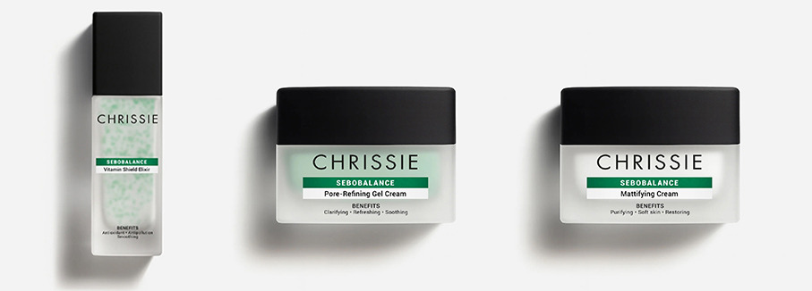
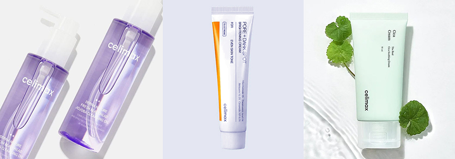
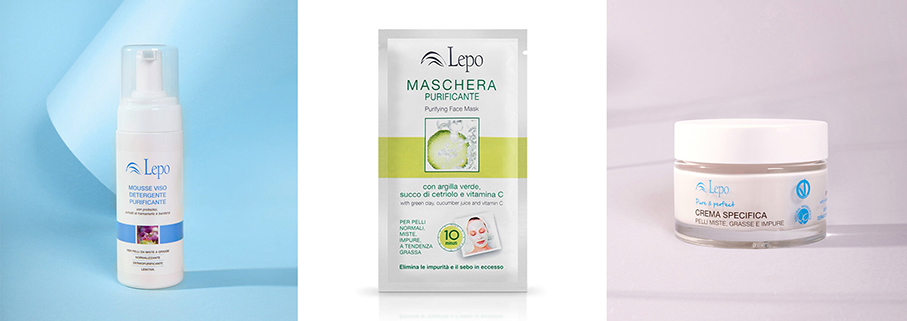
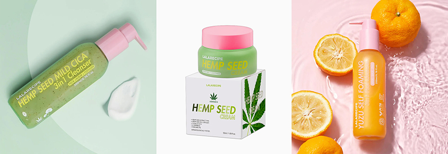
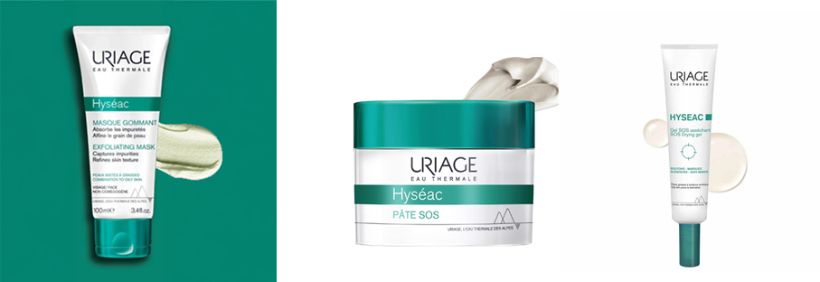

# SOS viso -  imperfezioni cutanee sotto controllo 

>La bellezza parte da una **pelle sana e idratata**: la cosmesi contemporanea unisce **trattamenti mirati** per curare e illuminare

_di Maria Rosa Sirotti_

Sempre più persone presentano problemi alla pelle del viso, da **fenomeni acneici a dermatiti e arrossamenti**: ci vengono in soccorso **beauty routine e prodotti dedicati**. Brand italiani, francesi e coreani propongono linee articolate che partono dalla detersione, fondamentale per pelli problematiche, fino a sieri, creme e maschere. 

**EHAD KOREAN BEAUTY**

Il brand dermocosmetico coreano  propone una routine quotidiana con formule ricche di attivi innovativi, come botox vegetale, collagene algico e fermentazioni di ginseng. Il marchio adotta il concept della “Beauty senza acqua”, sostituendo l’acqua purificata con acqua di legno di cedro, più ricca e funzionale. Formule dermatologicamente testate dal Korean Dermatological Research Institute e classificate come No Irritancy.

**Bubble Foam**
Questo detergente rappresenta l'eccellenza nella pulizia cutanea, pensato per tutte le tipologie di pelle, anche le più delicate e reattive. Rimuove delicatamente le impurità con una soffice e raffinata schiuma naturale derivata dagli amminoacidi della mela e deterge rispettando la barriera cutanea. L'estratto di frutta Sapindus Mukorossi offre eccellenti benefici antibatterici e antiossidanti.

**ACzero Serum**
Una soluzione mirata per il trattamento della pelle acneica. Formulato con ACzero, ingrediente brevettato, regola la secrezione di sebo, contrasta il batterio P. acnes e riduce l'infiammazione. Arricchito da estratti naturali ad azione antimicrobica: semi di Pompelmo, fusto di Bambù e foglie di Pino. Si può integrare alla routine quotidiana, mattina e sera, prima della crema.

**Brightening Cream**
Crema illuminante che aiuta a uniformare il tono della pelle e a prevenire la comparsa di macchie scure, migliorando l'aspetto della pigmentazione. Assicura un incarnato luminoso e radioso. 
_https://ehad.it/_

**CHRISSIE COSMETICS**

Con sede nella Repubblica di San Marino, questo brand di Vivipharma fonde un approccio più scientifico e performante con un’estetica urban glamour, contemporanea, sofisticata e riconoscibile, capace di rispondere ai bisogni reali della pelle. Un percorso costruito nel tempo, fatto di ricerca, sviluppo e attenzione alla qualità, con soluzioni skincare efficaci, mirate e attuali.

**Sebobalance Vitamin Shield Elixir** 
Un siero viso con microsfere verdi di cellulosa che rilasciano Vitamina E. Riequilibria la produzione di sebo e protegge la pelle dagli stress esterni, mantenendola fresca, uniforme e luminosa. Niacinamide e Zinco minimizzano la visibilità dei pori e raffinano la grana della pelle. La Caffeina dona un aspetto più tonico e riposato, la Vitamina C ravviva l’incarnato. L'Hedychium Coronarium protegge da luce blu, UV, IR, calore e inquinamento. 

**Sebobalance Pore-Refining Gel Cream** 
Crema gel dalla texture acquosa a finish mat a rapido assorbimento, per pelli miste e grasse con pori dilatati visibili. L'Acido Salicilico penetra nei pori liberandoli mentre Niacinamide e Zinco mantengono la pelle opaca e in equilibrio. Un fito-complesso contribuisce a riequilibrare microbiota e imperfezioni mentre l'Isoramnetina idrata. Pori visibilmente ridotti, produzione di sebo bilanciata.

**Sebobalance Mattifying Cream** 
Crema opacizzante dalla texture leggera a finish mat con rapido assorbimento, per pelli miste e grasse. Un trattamento idratante anti lucido senza disidratare né occludere i pori. La formula combina attivi sebo-regolatori come Niacinamide e Zinco con un pool di acidi della frutta e Acido Glicolico. Ricco di oli vegetali nutrienti e ingredienti idratanti, come Urea e Glicerina. Ideale come base make-up.
_https://chrissiecosmetics.com/_

**CELIMAX**

I prodotti coreani Celimax sono sviluppati secondo un principio di onestà: con la massima cura, dichiarando onestamente l'efficacia e guidando i clienti nella scelta migliore. I cosmetici non fanno miracoli, ma promettono onestamente una pelle migliore.

**Fresh Blackhead Jojoba Cleansing Oil** 
Olio detergente che, contatto con l'acqua, forma una sostanza leggera e leggermente schiumosa, simile al latte, che lega e dissolve il sebo nei pori, rimuovendo completamente trucco e punti neri senza  residui oleosi e irritazioni. Sei oli vegetali nutrono e idratano la pelle: bergamotto, semi di Limnanthes alba, semi di jojoba, semi di girasole,  mandorle dolci, oliva.

**Pore+Dark Spot Brightening Cream**
Crema schiarente ipoallergenica delicata, può essere utilizzata quotidianamente, sia al mattino sia alla sera. Illumina e uniforma l'incarnato con tre tipi di trattamento anti-imperfezioni: 5% di Niacinamide, 5% di Acido Tranexamico e 1% di Melazero V2. Non necessita di crema idratante aggiuntiva.

**The Real Cica Soothing Cream** 
Crema gel idratante leggera arricchita con il 73% di estratto fresco di Cica, estratto entro 48 ore dalla raccolta. La sua texture morbida si assorbe facilmente, offrendo un'idratazione rinfrescante alla pelle irritata e arrossata. Contiene: Niacinamide + Adenosina, Acido Asiatico, Asiaticoside, Acido Madecassico e Madecassoside.
_https://celimax.us/_

**LEPO**

Il brand Made in Italy che da oltre 30 anni si prende cura della bellezza con prodotti make-up e skincare naturali e biologici, sicuri per la pelle e in armonia con il pianeta. Una cosmesi di derivazione naturale e biologica, con particolare attenzione a formulazioni ultra delicate anche per pelli molto sensibili.

**Mousse Viso Detergente Purificante**  
Soffice mousse che elimina impurità e trucco dalla pelle rendendola idratata e fresca per tutta la giornata. Adatta per pelli da miste a grasse, anche tendenzialmente impure e acneiche. Arricchita con una miscela di attivi sebo normalizzanti e lenitivi e con prebiotici che favoriscono l’equilibrio del microbiota della pelle. Contiene acqua di Amamelide, estratto di radice di Bardana, Betaina, Inulina, Alpha Glucano.

**Maschera viso purificante per pelli miste ed impure**
Pulisce in profondità aiutando a contrastare acne, punti neri e arrossamenti. Con i suoi ingredienti ad azione astringente e purificante, in soli 10 minuti elimina il sebo in eccesso, rendendo la pelle pulita, fresca e luminosa. Svolge inoltre una delicata azione levigante, promuovendo il naturale rinnovamento cellulare dell’epidermide. Contiene: Argilla Verde, Succo di Cetriolo e Vitamina C.

**Pure & Perfect Crema specifica con prebiotici e probiotici, bardana e amido di riso** 
Crema specifica per il trattamento dermopurificante di pelli miste, grasse, impure, con punti neri, pori dilatati e tendenti all’acne. Ha un potere lenitivo, opacizzante e sebo normalizzante grazie all’estratto di bardana e all’amido di riso. Ingredienti ad azione riequilibrante prebiotica e probiotica, mantengono la pelle idratata, fresca e luminosa per tutto il giorno. 
_https://www.lepo.it/_

**LALARECIPE**

Il nomenasce dall’unione di “Lala”, che in Corea richiama sensazioni di gioia, e “Recipe”, la ricetta: creare formule efficaci, capaci non solo di migliorare la pelle, ma di regalare un momento quotidiano di felicità, combinando ingredienti botanici puri con tecnologie di laboratorio all’avanguardia. Texture fresche, profumazioni delicate e pack vivaci rendono ogni applicazione un’esperienza sensoriale unica. 

**Hemp Seed Mild Cica Cleanser**
Detergente 3 in 1 idratante anti-macchie con 10% estratto di semi di Canapa e Centella Asiatica, ideale per rimuovere impurità e cellule morte senza seccare la pelle. La polvere di Centella esfolia delicatamente mentre l’acido ialuronico idrata e lenisce, lasciando la pelle morbida, liscia e rispettando il pH naturale. Perfetto per pelli sensibili che necessitano di una detersione delicata ma efficace.

**Hemp Seed Cream** 
Crema viso idratante e nutriente a lunga durata (fino a 100 ore di idratazione) con 70% estratto di semi di canapa, 2.000 ppm olio di semi di canapa e 86% ingredienti naturali. Arricchita con terpineolo e 4 complessi brevettati che regolano la produzione di sebo. Previene la comparsa dell’acne e lenisce rossori e infiammazioni. una pelle revitalizzata, luminosa e fresca, con macchie scure attenuate. 

**Yuzu Vita-C Self Foaming **
Detergente esfoliante delicato 3 in 1 con funzione peeling + scrub illuminante + schiuma detergente.
Contiene estratto di Yuzu, olio di semi di Yuzu, vitamina C, complesso di 12 vitamine, AHA, BHA, PHA. 
Favorisce una pulizia profonda della pelle senza irritare. Applicato sulla pelle asciutta le micro bolle puliscono i pori e aiutano ad esfoliare delicatamente, eliminando cellule morte e punti neri.
_https://lalarecipe.it/_

**URYAGE**

Questo brand francese utilizza l’Acqua Termale di Uriage che sgorga dal cuore delle Alpi francesi,confezionata direttamente alla fonte. Attraverso i vari strati rocciosi, si arricchisce di minerali e oligoelementi, ottenendone una concentrazione unica di 11g/L. Un’Acqua isotonica che agisce come un siero fisiologico, in perfetta osmosi con le cellule cutanee. Lenitiva e idratante, rinforza la barriera cutanea. 

**Hyséac - Masque Gommant**
Può essere utilizzata come maschera per le sue capacità assorbenti e come gommage per la sua azione esfoliante, con un doppio effetto benefico grazie alle sue microsfere che non irritano. Gli agenti attivi assorbono le impurità per una cute pulita e luminosa. Leviga la grana lasciando un leggero profumo.

**Uriage Hyséac - Pasta SOS Anti-Imperfezioni Viso** 
Agisce direttamente sulle imperfezioni: grazie alla sua formula originale, associa le proprietà risananti dell’olio di scisto all’azione naturalmente assorbente dell’argilla verde con l’effetto cheratolitico dell’ossido di zinco. L’Acqua Termale Uriage permette di lenire la pelle. 

**Hyséac - Gel SOS purificante** 
Trattamento per applicazione locale con effetto "patch invisibile" da poter utilizzare tutto il giorno. Asciuga, purifica e riduce i brufoli. Isola e riduce le imperfezioni per un effetto visibile dopo solo 4 ore. L'efficacia di un patch anti-imperfezioni, ma invisibile e impercettibile al tatto. Facilita l'applicazione del trucco. 
_https://www.uriage.com/IT/it_

