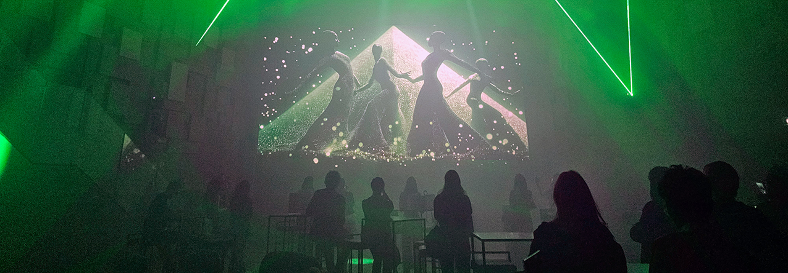
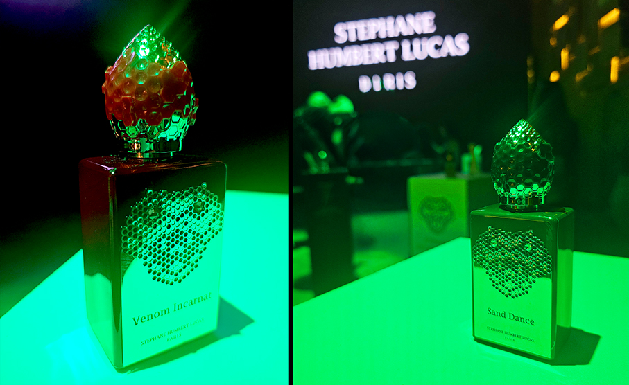
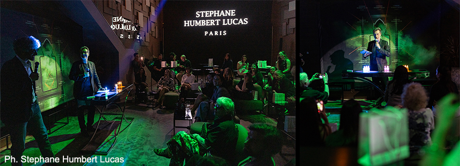
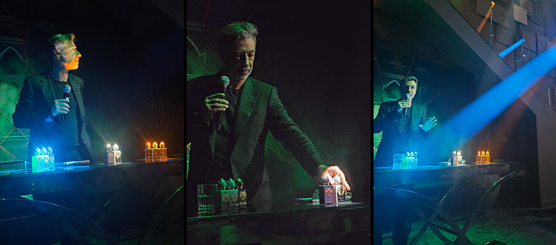
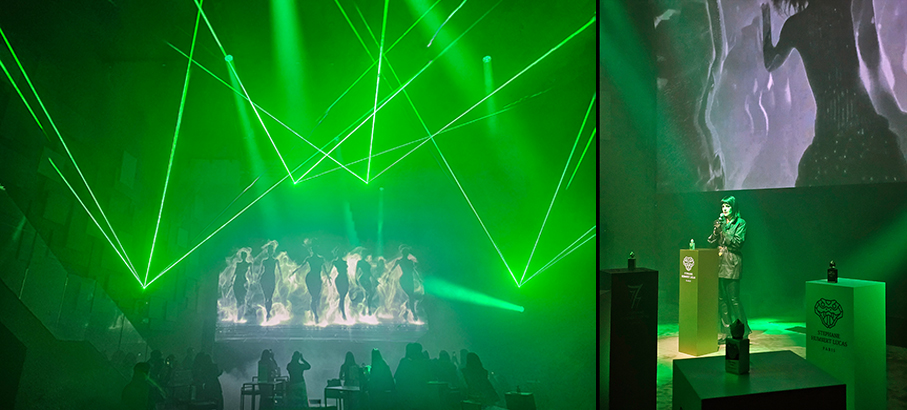
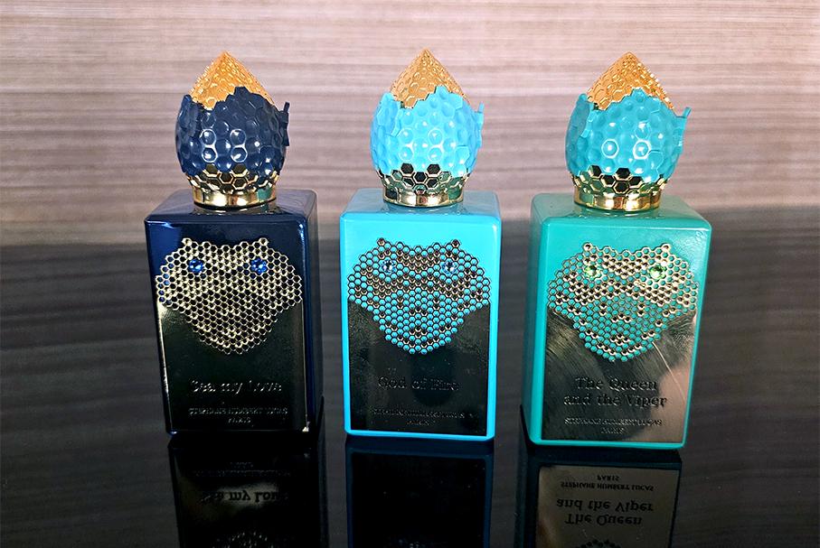
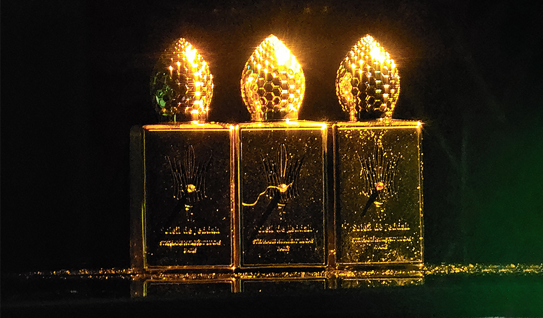
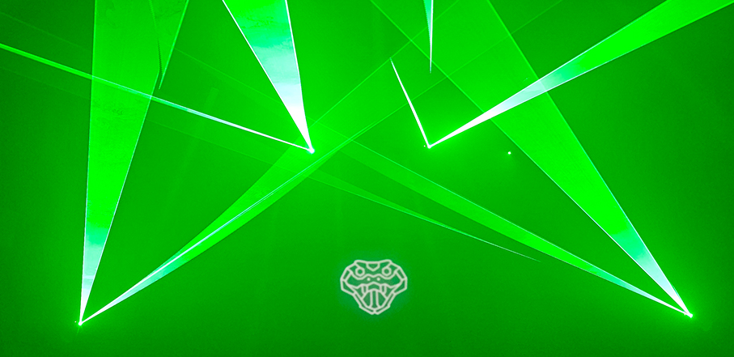

# Stéphane Humbert Lucas – Il profumiere incantatore 

>Il profumiere sinestetico svela la **Snake Collection** e la **777 Collection** in una serata d'élite tra giochi di luce, miti ancestrali e sentori estivi

_di Maria Rosa sirotti_

Luci, musica e fragranze d'autore: il **debutto rockmantico di Stéphane Humbert Lucas a Milano**.
L’alta profumeria si tinge di un’anima rock e sofisticata: lo scorso 21 maggio, l’esclusivo spazio **Philing Milano** ha ospitato l’evento firmato Stéphane Humbert Lucas, celebre maison di lusso guidata dal genio del suo fondatore sinestetico. 

Questa **maison artistica di profumi di lusso** rompe le barriere culturali per poi riunirle tutte insieme, andando sempre oltre nella **ricerca della bellezza e della qualità**.

Ogni fragranza è un **tripudio di arte, misticismo e simbologia**, che si fondono insieme per celebrare l'**opulenza del Medio Oriente** (e non solo) con un tocco di eleganza francese. Ogni profumo è una narrazione olfattiva, un’espressione di **artigianalità e lusso senza tempo**, che ha reso il marchio un punto di riferimento per gli intenditori a livello globale.

Durante la serata, l'artista in persona ha accompagnato gli ospiti in una **masterclass ipnotica tra giochi di luce, fumo ed effetti sonori**. Il momento clou? Un reveal teatrale ispirato a una **Cleopatra in chiave modern rock**, seguito da un cocktail di networking dedicato ai veri appassionati della profumeria artistica.

**The Queen and the Viper**: la seduzione regale dell'Egitto

Al centro dei riflettori ha brillato **The Queen and the Viper**, una creazione dal fascino fiero e magnetico. La fragranza si ispira al mito di Cleopatra e al suo travolgente legame con Marco Antonio, trasformando questa leggendaria storia d'amore in **poesia olfattiva**. 

Stéphane Humbert Lucas racchiude **passione e regalità** in un **flacone-gioiello color smeraldo**, che richiama le linee sinuose della sovrana e il suo tragico destino legato al veleno della vipera. Il profumo trasporta i sensi nell'antico Egitto, antico crocevia di popoli e aromi rari, svelando una **piramide olfattiva misteriosa** che gli ospiti hanno dovuto in parte scoprire e intuire e decifrare.

•	**Folgorazione (testa)**: bergamotto, agrumi, boccioli di ribes nero, menta crespa, davana, incenso e styrax.

•	**Metamorfosi (cuore)**: menta africana, salvia sclarea, vetiver, osmanto e gelsomino sambac.

•	**Quintessenza (fondo)**: tabacco biondo, datteri, labdano bruciato (idrocarboresina), zafferano e betulla.

The Queen and the Viper si inserisce all'interno della seducente **Snake Collection**, emblema di un viaggio ipnotico che attraversa leggende e miti legati al serpente, totem ancestrale di immortalità, saggezza e metamorfosi. Ogni flacone della collezione è un vero e proprio **talismano sensoriale**, pensato per **trasformare il profumo in un'opera d'arte** a 360 gradi. 

Accanto al mistero ammaliante dei serpenti, l'universo di Stéphane Humbert Lucas offre un'ulteriore **fuga sensoriale perfetta per la bella stagione** attraverso la **777 Collection**. Questa linea, nata dall'**amore per il Medio Oriente**, è sinonimo di lusso e raffinatezza, in cui **inebrianti note** si uniscono a un approccio filosofico e spirituale.

Distribuito da **Essenses Srl**

_Ph. Credits: Maria Rosa Sirotti_