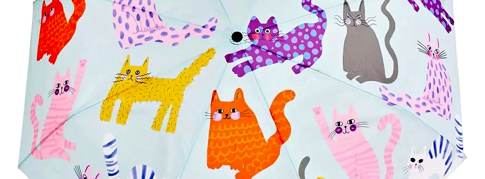
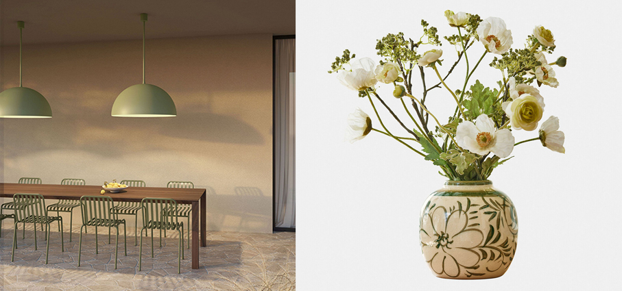
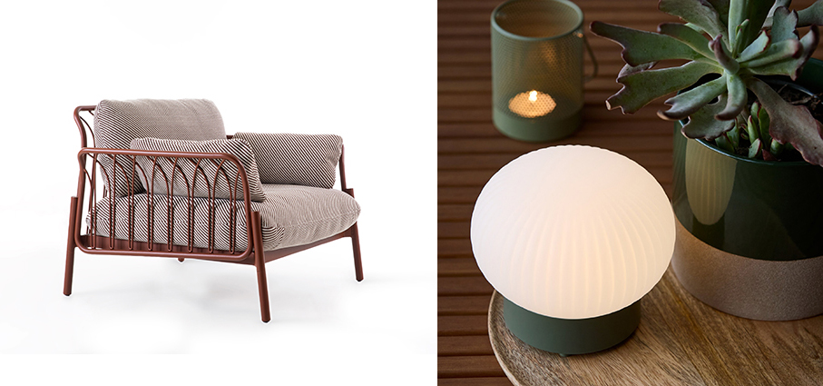
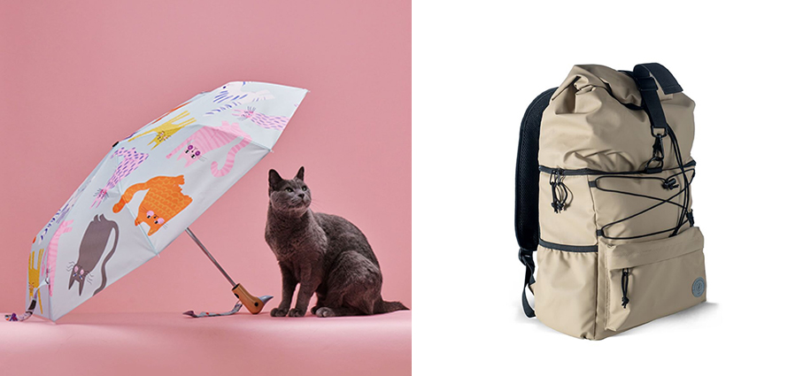
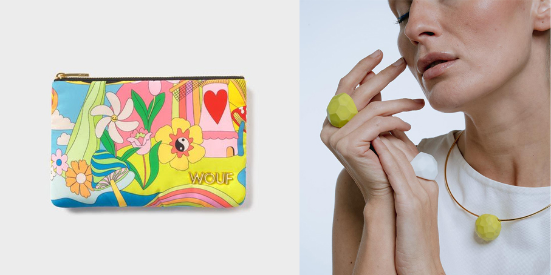
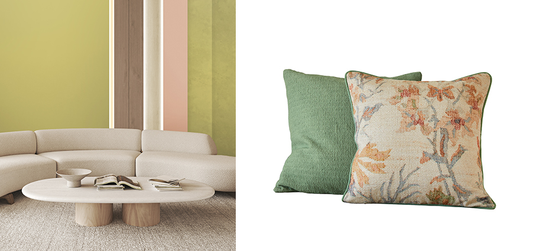
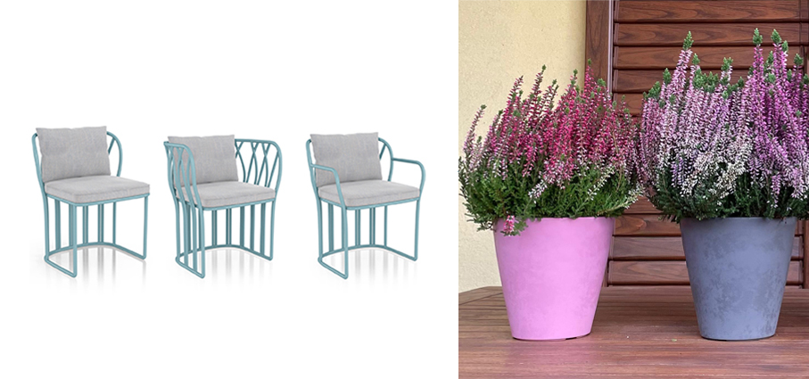
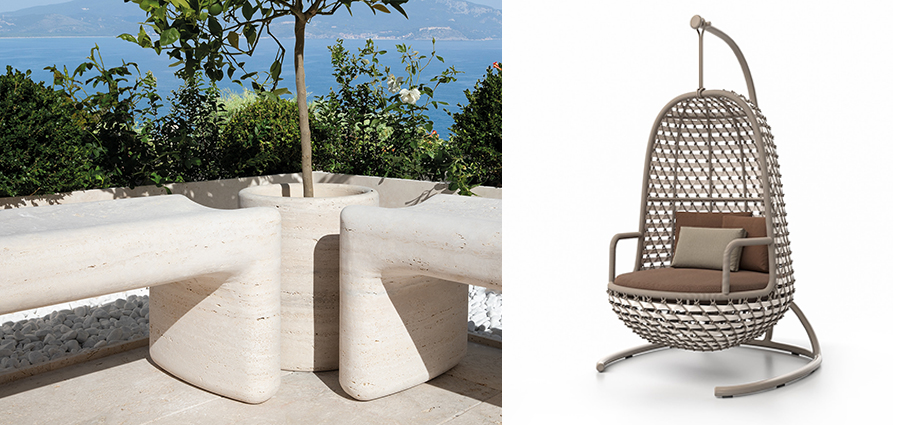
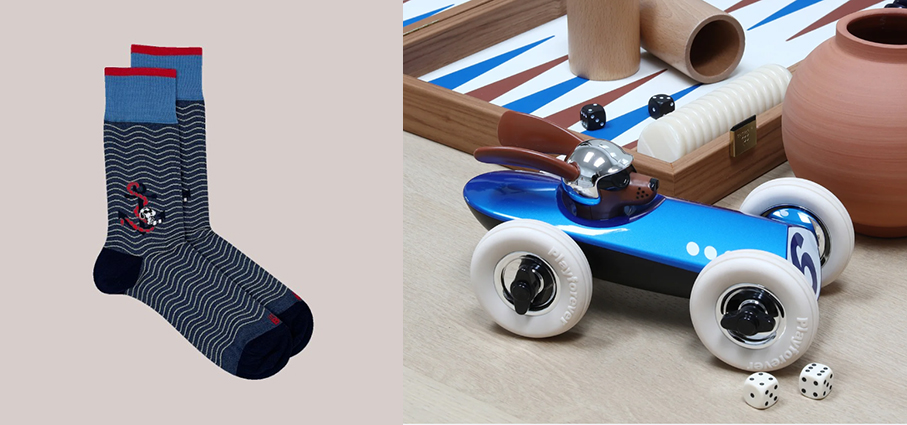

# Tante cose nuove e belle

>Accessori, Arredo e complementi, Design, Outdoor: tante le **novità verso la bella stagione**

**Amedeo** - **Zava** sospensioni outdoor progettate per essere elementi illuminanti efficienti e di grande atmosfera nelle ore serali, mentre di giorno sono godibili oggetti di arredo al pari di altri mobili e accessori. Realizzati in ferro e alluminio, nella versione outdoor sono
disponibili in due diversi diametri, Ø50 / Ø80 cm, e colori come nero, bianco, verde, sahara, blu oceano e rosso mattone. Sorgente luminosa: E27 Max 28W.

**Avignonel** - **Loberon** Vaso in grès. Lo smalto lucido conferisce alla superficie una leggera lucentezza, mentre le sottili linee craquelé conferiscono profondità e carattere. Dipinta a mano in calde tonalità naturali, la decorazione floreale attira l'attenzione senza dare nell'occhio. Che sia con fiori di prato, con qualche erba o in purezza, crea un'affascinante scenografia per composizioni naturali e si armonizza meravigliosamente con legno, lino e ceramica, per un punto focale accogliente.  

**Storfugl** – **Jysk** Lampada da tavolo ricaricabile che offre una luce accogliente per il tuo giardino o balcone. Questa lampada compatta ha una base verde scuro e una parte superiore a forma di globo con una finitura decorativa a coste. È dotata di una pratica funzione timer per l'illuminazione automatica. Le batterie ricaricabili sono da acquistare separatamente. Ø15 x H10.

**Meltemi** - **Vermobil** poltrona. Un progetto innovativo nato sull’idea di modularità e sostituibilità dei materiali. Alle strutture in alluminio infatti possono essere abbinati elementi in metallo (anche smaltato), corda, tessuto, legno o ceramica per completare il prodotto e dargli una impronta personale ed unica. Elevare il metallo fino a portarlo ad arredare gli spazi outdoor più prestigiosi è uno degli obiettivi dello sviluppo più recente del brand. Cuscini Limonta.

**Ombrello** - **Original Duckhead** Quest’anno, il brand londinese distribuito da Moroni Gomma non si distingue solo per la sua iconica impugnatura a forma di papera, ma per un universo ancora più colorato e sorprendente. La nuova collezione Arty Cats trasforma ogni giornata grigia in una esplosione di personalità. Perché la pioggia non è più un imprevisto, ma un’occasione per farsi notare.

**Zaino Termico Vide** - **Sagaform** Perfetto per escursioni e gite all’aperto, lo zaino è una soluzione moderna e pratica per ogni avventura. Diviso in due sezioni: uno scomparto  inferiore con funzione termica e uno scomparto superiore per vestiti. Distribuito da Schoenhuber.

**Magic Trip** - **Wouf** Con la collezione Studio, il brand di accessori spagnolo  distribuito in Italia da Moroni Gomma, eleva la sua identità creando accessori fashion all’avanguardia. Per la stagione SS 2026, le silhouette iconiche si combinano con stampe espressive, riflettendo un’energia psichedelica attraverso una prospettiva distintamente contemporanea. Allegria in primo piano nelle grafiche più pop. Realizzati al 100% con tessuti riciclati. 

**Anelli e collier Geometrie** - **Corte Glass** Studio Minimalismo deciso con un’anima geometrica con l'anello e la collana geometrici, gioielli minimalisti pensati per chi ama l’arte contemporanea e le linee pulite. Pezzi unici nel loro genere, al tempo stesso scultorei e facili da indossare, perfetti per l’uso quotidiano o per completare un outfit moderno e raffinato. Perla in vetro di Murano, decorata con un delicato motivo esagonale, sorprendentemente leggera e confortevole. La finitura opaca dona una texture morbida e sofisticata. 

**Secret Safari - PPG** - **Sigma Coatings** Con l’avvicinarsi della primavera, cresce il desiderio di rinnovare gli spazi, alleggerirli e renderli più autentici: Secret Safari è una vernice con una tonalità giallo-verde dalla qualità organica e minerale, capace di trasmettere energia e comfort emotivo, per chi desidera creare ambienti che parlino di equilibrio e bellezza senza tempo. Fa parte della palette Authentic, risposta cromatica a un bisogno sempre più diffuso di stabilità, sincerità e connessioni profonde.

**Osorno** - **Loberon** in puro cotone. Come una breve passeggiata in un giardino assolato: è questo l'effetto del motivo floreale di questa coppia di copricuscini, la cui morbida palette di colori spazia dal caldo albicocca al fresco verde chiaro. Entrambi sono realizzati in cotone piacevolmente morbido con una trama fine e hanno una cerniera nascosta. Sul divano, sulla poltrona o in camera da letto, questi copricuscini portano in casa una naturalezza accogliente e una grazia senza tempo.

**Koru** - **Yaaz** Sedute ispirate agli arredi di un tempo. Una poltrona e una sedia nelle versioni con e senza braccioli oppure con schienale avvolgente. La struttura è reinterpretata con un segno leggero ed etereo che acquista solidità nelle delicate intersezioni in metallo: i tondini rivelano una purezza estetica e si intrecciano per dar vita a un movimento sinuoso che sembra ricordare il linguaggio Art Nouveau. Soffici cuscini outdoor aggiungono morbidezza al rigore del metallo. 

**SWINGmood** - **Plastecnic** I vasi e coprivasi della linea Mood incarnano l'unione perfetta tra stile, funzionalità e sostenibilità, con un linguaggio autentico e contemporaneo. Realizzati con oltre il 75% di plastica riciclata. I vasi da 20 e 25 cm di diametro completano una gamma che spazia dalle misure 11 cm fino a 42 cm, con 8 varianti in diversi colori. Tonalità naturali e decise, perfette per fondersi con arredi interni ed esterni, trasmettendo emozioni e creando continuità tra ambiente e natura.

**Tinia e Lapis** - **Veltha Outdoor** Morbida nelle linee, Tinia è una panchina dagli angoli arrotondati che si distingue per fluidità ed eleganza, capace di integrarsi con naturalezza in diversi contesti architettonici. Lapis è un vaso dalla forma cilindrica pura che permette di delimitare e scandire lo spazio. Insieme, creano una composizione armonica in cui la luminosità della pietra incontra la solidità delle forme. Disponibili in Travertino e Peperino che provengono dalle cave di proprietà. 

**High Swing Koro** - **SKLD Studio** Ispirata alla cultura giapponese e al kōro, il tradizionale contenitore per l’incenso dalle forme morbide e arrotondate, la collezione fonde la sensibilità e l’eleganza giapponese con l’artigianato contemporaneo. I tessuti di alta qualità di Agora®, in fibra acrilica 100% tinta in massa, garantiscono resistenza, qualità, durata e facile  manutenzione. I cuscini sono personalizzabili in un’ampia selezione di tonalità, per adattarsi al gusto e all’ambiente circostante.

**Snoopy Waves Short Blue Jeans / Panna** - **In The Box** Le nuovissime calze della collezione Peanuts Primavera/Estate 2026. Composizione: 80% cotone, 18% poliammide, 2% elastane.

**Rufus Bertie** - **Playforever** l'auto da corsa canina più cool che abbiamo mai visto. La collezione Rufus è progettata e realizzata da Playforever a seguito della recente collaborazione con Hugo Boss. Dalla forma aerodinamica, è splendidamente progettato e costruito con materiali di altissima qualità per durare una vita.

