# Tavola e cucina si vestono a festa

>Durante le festività natalizie, tavola e cucina assumono un **ruolo importantissimo per preparare, portare a tavola, servire** e chiacchierare insieme. Vestiamole a festa!

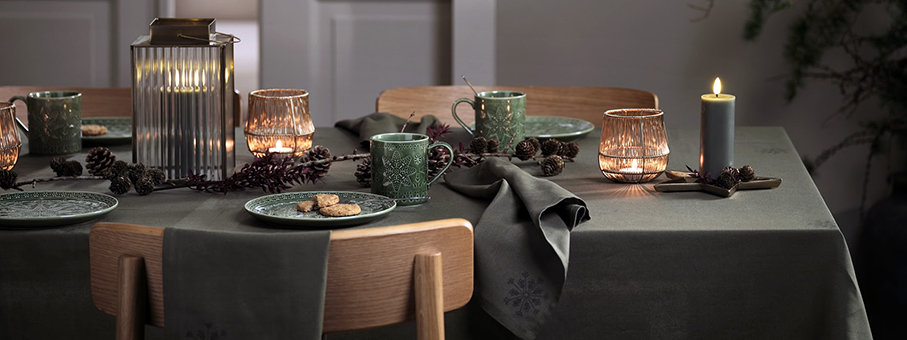

**Agorà – Blim Plus** è un’alzatina in polipropilene con piatto rialzato da piedino, cupola in polimetilmetacrilato e annessa paletta per dolci; è proposta in sei colori opachi dai delicati toni pastello: Pink Sand, Forest Medium, Brown Sugar, Carbon Black, Moka Grey, Artic White. Parte della collezione Paestum, Agorà si distingue per un design essenziale e superfici esterne scanalate che raccolgono la luce modulando l’ombra ed è studiata con la consueta attenzione al dettaglio e all’ergonomia. Può essere riposta in frigo e lavata in lavastoviglie senza che colori e qualità dei materiali ne risentano.

**Santa's Sleigh Loaf - Nordic Ware** lo stampo dove si vede Babbo Natale viaggiare con la sua slitta e le sue renne permette di dare forma ai dolci delle Feste. Il Natale con Nordic Ware ricrea la classica atmosfera delle Feste, anche come regalo perfetto per chi ama cucinare i dolci. 

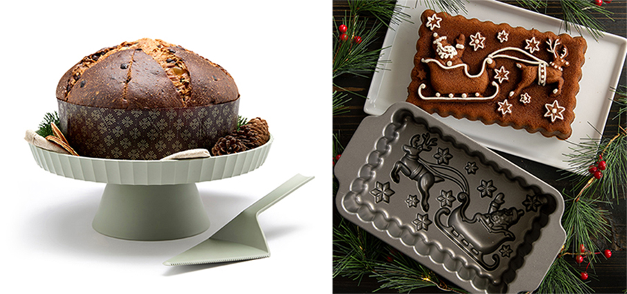

**Perlemor - Villeroy & Boch** per chi cerca un’atmosfera calda e accogliente, una collezione perfetta per portare in tavola la bellezza e la semplicità dello stile scandinavo. Le delicate tonalità naturali, il tocco autentico della ceramica, le forme armoniose e i dettagli artigianali creano un ambiente sereno e intimo, ideale per vivere il Natale con spontaneità e secondo i propri ritmi.

**Brontë Collection - Russell Hobbs®** una nuova collezione dedicata al breakfast in grado di regalare eleganza e prestanza a uno dei momenti più importanti della giornata: la prima colazione. La gamma, composta da bollitore, macchina da caffè americano e tostapane, è disponibile in due diverse colorazioni (black e stone) per incontrare il gusto estetico minimalista e adattarsi alle cucine moderne.

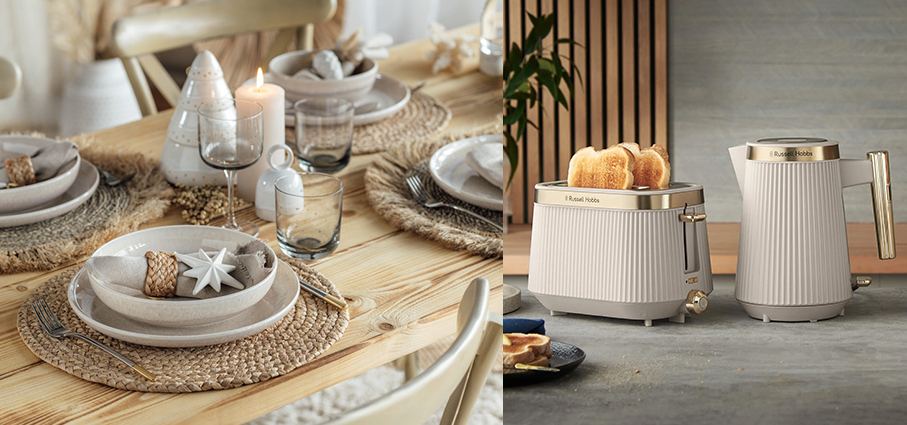

**Flamme Dorée – Le Creuset** un’icona in edizione limitata, porta il calore e la magia del Natale direttamente sulla tavola. Questo vibrante colore è un tributo all’iconico arancione, ora arricchito con una finitura brillante che ne esalta la luce, creando un effetto scintillante che cattura l’attenzione e trasforma ogni piatto in una celebrazione di eleganza e colore. Con il suo fascino brillante e il pomolo celebrativo dei 100 anni di storia, ogni elemento della collezione diventa un simbolo di stile senza tempo.

**QVac – Bora** è un accessorio pratico e un componente versatile: molto più comodo dei tradizionali macchinari a campana o dei cassetti sottovuoto, trova impiego in molte situazioni quotidiane. Il sottovuoto è ormai indispensabile per conservare gli alimenti in frigorifero e congelatore, per la cottura sous-vide e – molto apprezzato per le grigliate – per la preparazione veloce della carne marinata. Nella versione freestanding, questo potente apparecchio può essere utilizzato in maniera flessibile ovunque serva: in cucina, in dispensa o sull’isola centrale.

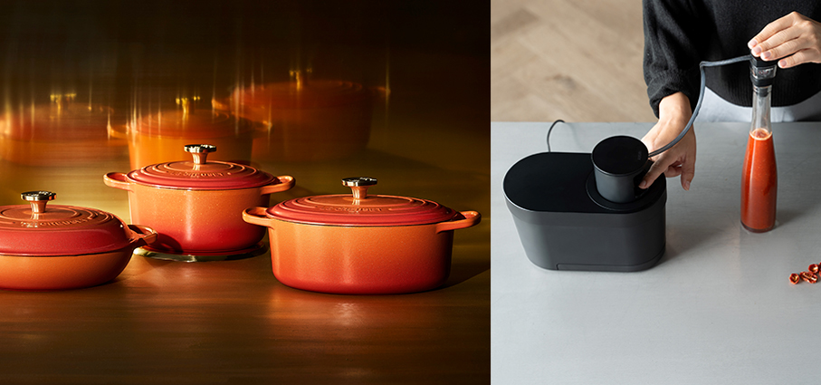

**Afina - Villeroy & Boch** per chi preferisce un Natale all’insegna della sobrietà e dell’eleganza. Linee pulite, materiali pregiati e dettagli raffinati permettono di creare tavole sofisticate e moderne. Rilievi delicati, forme particolari e l’effetto dei contrasti scuri, come quello dell’ardesia, conferiscono a queste collezioni un carattere distintivo e uno charme senza tempo, trasformando ogni tavola natalizia in un vero palcoscenico di raffinata eleganza.

**Duo 100 Idee Multicooking – Risolì** è una mini-casseruola - Ø 14 cm - che rivoluziona il modo di cucinare
grazie a un coperchio innovativo che scalda dall’alto verso il basso, trasformandola in un piccolo fornetto da tavola. Realizzata in alluminio a spessori differenziati, distribuisce il calore in modo uniforme, garantendo cotture perfette e delicate. Versatile e raffinata, è ideale per ricette classiche o creative, dal fornello al forno, fino 

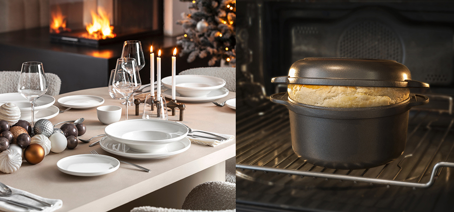

**Malakit – Jysk** tazze e piatti verdi in porcellana lucida con un design rustico e motivo natalizio. Da usare durante il periodo natalizio per caffè, tè o altre bevande calde e per servire dolci. Disponibile anche il tessile coordinato.

**Passion - Zwilling** il set di 5 pezzi è pensato per coprire ogni esigenza in cucina con stile e affidabilità. È composto da tre pentole, una casseruola con coperchio e una casseruola con manico. Le pentole sono realizzate in acciaio inossidabile 18/10, materiale igienico e resistente che non altera i sapori. Il fondo è costruito con la tecnologia Sigma Classic+, un multicore che combina il cuore in alluminio con gli strati in acciaio per ottenere una distribuzione e una ritenzione del calore ottimali. Il set è compatibile con tutti i piani di cottura, inclusi induzione, gas ed elettrico. È inoltre adatto all’uso in forno e lavabile in lavastoviglie.

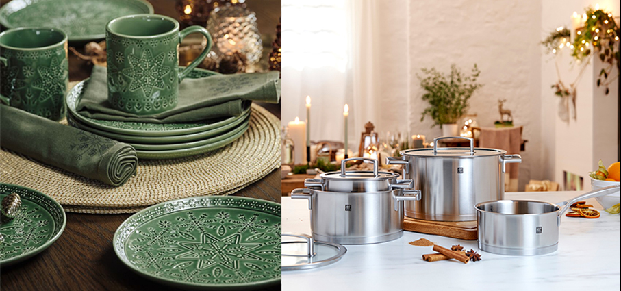

**Gustaf Westman per Ikea** ha disegnato una nuova collezione composta da 12 articoli per la tavola e la casa. Dai piatti alle tazze in porcellana, dai portacandele all’illuminazione, ogni elemento della collezione offre una reinterpretazione fresca e giocosa delle tradizioni festive. I piatti in porcellana, disponibili in verde scuro e rosa, giocano con la tensione tra la forma quadrata e la delicata cavità circolare al centro. Ogni pezzo ha una propria identità, ma è stato progettato per integrarsi armoniosamente con gli altri, come tessere di un mosaico che compongono un servizio da tavola coerente e sorprendente.

**Unlock -  Zwilling** propone una soluzione che unisce tecnologia, praticità e attenzione alla sostenibilità: un sistema che accompagna il consumatore dalla preparazione al servizio, fino alla conservazione intelligente. Possibilità di integrare la funzione di sottovuoto grazie agli appositi coperchi in vetro borosilicato compatibili con la pompetta Fresh & Save. Questo consente di anticipare le preparazioni e mantenere gli alimenti freschi fino a cinque volte più a lungo rispetto ai metodi tradizionali. Ogni coperchio è dotato di QR code scansionabile tramite l’app Zwilling Culinary World, che non solo ricorda la durata dei cibi conservati, ma offre anche una selezione di ricette per sfruttare al meglio gli ingredienti a disposizione. 

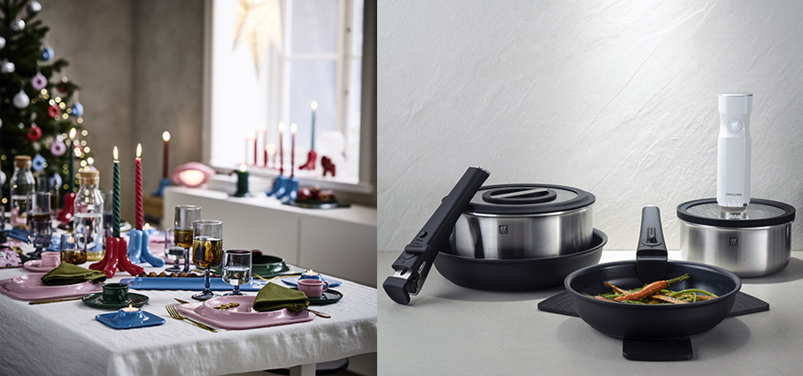

**Cats – Mario Luca Giusti** dalla profonda passione per gli animali, in particolare per i gatti, prende vita la nuova linea di piatti. Questo set completo comprende un piatto fondo, un piatto medio e un piatto per la frutta, tutti caratterizzati da disegni ludici e vivaci che catturano l’attenzione e la fantasia. L’ispirazione arriva da antiche favole per bambini tratte da vecchi libri di famiglia risalenti al ‘700, che raccontano storie magiche e senza tempo. Ogni piatto raffigura così un piccolo racconto avventurose in tre ambientazioni differenti, Treno, Sci e Vespa, rendendo il momento del pasto un’esperienza giocosa e piena di colore, perfetta per chi ama unire creatività, praticità con un tocco di nostalgia e storia.

**Storm Blue - Smeg** è un invito a portare negli spazi quotidiani intensità, carattere e raffinatezza, riletti attraverso l’eleganza del design Made in Italy. Innovazione, cura del dettaglio ed estetica si fondono per trasformare la quotidianità in autentiche esperienze di bellezza. Questa tonalità intensa racchiude la profondità del cielo e del mare, restituendo al tempo stesso l’energia della natura. A interpretare questa nuance sono il frigorifero, il gasatore d’acqua, il tostapane, le macchine da caffè - a filtro, espresso automatica e automatica con montalatte - insieme al bollitore elettrico e alla bilancia da cucina.

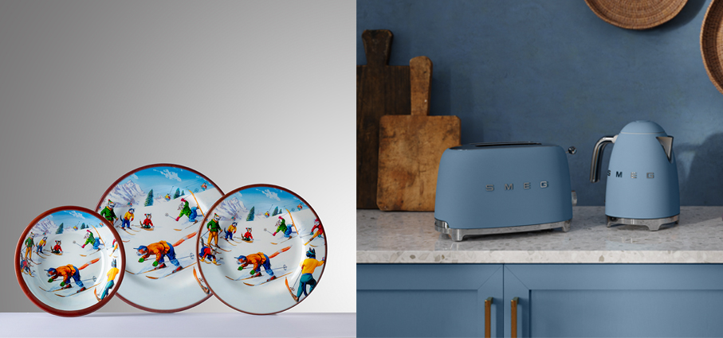

**Holly Collection – Le Creuset** una collezione in edizione limitata che racchiude tradizione ed eleganza reinterpretando i classici più amati in pieno spirito natalizio grazie a tonalità e finiture dedicate alle feste. White, Ciliegia e Verde Timo sono i colori scelti e ogni elemento della collezione - dalle iconiche cocotte e casseruole in ghisa vetrificata agli oggetti in gres vetrificato - viene impreziosito da pomoli dorati e decorato con motivi a foglie di agrifoglio, diventando così protagonista della tavola.

**Decanter Amadeo – Riedel** si rinnovato con una collezione dedicata ai colori delle bandiere del mondo, che ne percorrono con eleganza la silhouette interna. Un omaggio all’universalità del gusto e della convivialità, con tonalità che vogliono celebrare anche le culture enologiche più amate, inclusa quella italiana, con il suo inconfondibile tricolore. Ma, tra le versioni più in sintonia con l'atmosfera natalizia, spicca senz’altro quella austriaca, con le sue striature rosse e bianche che richiamano i colori del Natale.

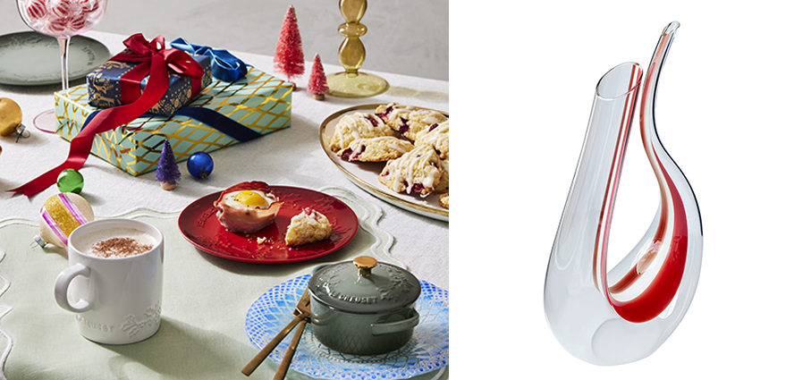

**Ensō - SodaStream** il nuovo gasatore premium disegnato dal designer giapponese Naoto Fukasawa: il vero must-have da regalare, ideale per chi ama arredare con dettagli ricercati, che uniscano bellezza, innovazione e sostenibilità. L’elegante corpo in acciaio inox disponibile in due finiture, brillante cromo e nero satinato, è pensato per offrire un’esperienza d’uso semplice e intuitiva, grazie al cilindro CQC ad aggancio rapido da inserire e il sistema Snap-Lock, che permette di agganciare la bottiglia con un gesto veloce e sicuro.

**Natalotto -  Villa d’Este Home Tivoli 1996** è la nuova linea natalizia VdE Tivoli 1996 che porta in casa allegria e tenerezza. Simpatici cagnolini in versione festiva decorano tazze, tovagliette, sottobicchieri ma anche accessori e para spifferi, per un Natale ancora più caldo e accogliente. Set 3 pezzi tavola in feltro. Il set si compone di tovaglietta, sottobicchiere e porta posate. Decoro bassotto natalizio.

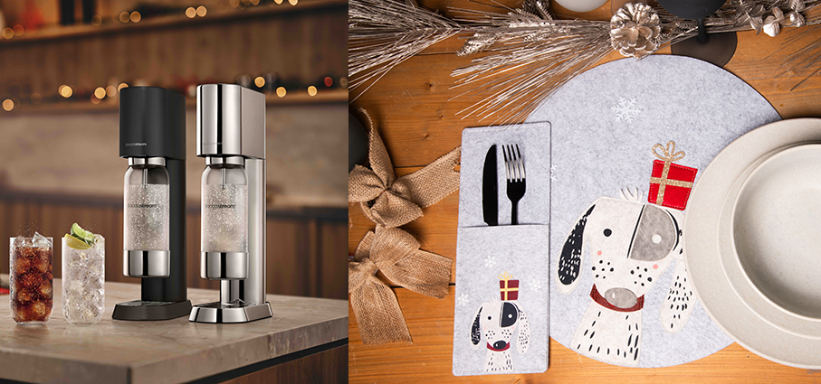

**Air Fryer 6L - Zwilling** è una friggitrice ad aria di ultima generazione con sistema di doppio riscaldamento superiore e inferiore, che assicura una cottura uniforme e risultati croccanti senza bisogno di preriscaldamento. La tecnologia Water Spray nebulizza automaticamente piccole quantità d’acqua per preservare la morbidezza dei cibi e garantire un perfetto equilibrio tra croccantezza e succosità. Dotata di 12 programmi automatici e di una modalità manuale per personalizzare tempo e temperatura. L’oblò trasparente con luce interna consente di monitorare la cottura in ogni momento, mentre il cestello da 6 litri con rivestimento antiaderente in ceramica assicura praticità e facilità di pulizia.

**Lin – Jysk Tazza** in gres porcellanato color avorio decorata con allegri rametti di vischio. Adatta alla tavola di Natale per servire bevande calde. La tazza è lavabile in lavastoviglie.

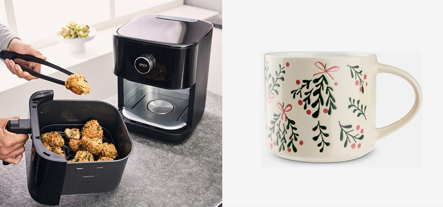

**Grattugia rotante -  Microplane®** perfetta per sminuzzare i tradizionali formaggi a pasta dura, ma adatta anche a cioccolato e frutta secca come noci, nocciole o mandorle, con i quali arricchire ogni ricetta: dalla pasta alle insalate, dai frullati alle macedonie. Un risultato che è possibile ottenere grazie all’impiego della celebre lama in acciaio inossidabile fotoincisa e made in USA Microplane® che, affilata e precisa, grattugia alla perfezione ogni ingrediente senza lacerarlo, mantenendo così inalterati aromi, sapori e proprietà. 

**Gift Box Party - Pinti Selection** contiene 18 piatti, 18 forchette, 18 coltelli, 18 cucchiai Use&Reuse, tutti in acciaio inox, leggeri, resistenti e lavabili in lavastoviglie. Ideali per ogni occasione, all’aperto o in casa, senza plastica e senza sprechi. Appartiene alla collezione Gift Box, una selezione di 7 tipologie di prodotti confezionati in una box regalo dedicata: cocktail, cake, pizza, sushi, coffee, party, ice cream. Pensieri semplici, individuati con cura e attenzione, da dedicare a coloro che amiamo, conoscendone gusti e passioni. All’interno di ogni gift box sono contenuti gli accessori necessari per gustare appieno speciali momenti del giorno o della festa.

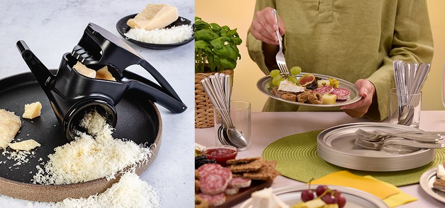

**Global Z – Global** edizione limitata che celebra il quarantesimo anniversario del marchio giapponese che ha fatto del coltello un’icona di design. Estetica extralusso e performance all’avanguardia grazie allo speciale trattamento Diamond-Like Carbon(DLC) che conferisce al coltello un’elegante superficie nera, rendendolo un oggetto dal design contemporaneo, ma anche uno strumento dalle performance straordinarie. 
Realizzato in acciaio inossidabile Cromova 18, temperato con ghiaccio e indurito a 56°- 58° C mediante un processo che mantiene la lama affilata più a lungo di qualsiasi altro acciaio, e la rende resistente alla ruggine, alle macchie e alla corrosione. Distribuito in Italia da Schönhuber.

**Vinum – Risolì** casseruola con coperchio in vetro realizzata interamente in alluminio pressofuso riciclato e riciclabile, ad alto spessore, rappresenta il perfetto equilibrio tra rispetto per l’ambiente e prestazioni eccellenti. Il rivestimento XR3 Bioceramic, privo di PFAS e arricchito con particelle minerali, garantisce una cottura ottimale, esaltando ogni sapore con una distribuzione uniforme del calore. La speciale finitura ruvida assicura un’eccezionale resistenza all’abrasione e un’antiaderenza superiore, per una cucina più sana e senza stress. I manici in bakelite bordeaux sono infatti un omaggio alla grande tradizione vinicola italiana. 

