# Tendenze e novità nel settore Beauty

>**Cosmoprof Worldwide Bologna 2026** si conferma come l'epicentro globale dell'**innovazione cosmetica**, delineando un futuro in cui la bellezza è sempre più **personalizzata, tecnologica e sostenibile** 

_a cura di Maria Rosa Sirotti e Elena Braschi_
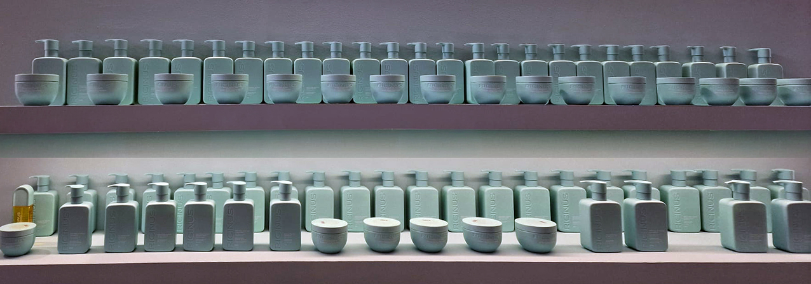

Dalle analisi emerse durante la 57esima edizione, l'industria del Beauty si evolve verso un **approccio olistico che fonde benessere psicofisico e risultati scientifici**, superando il concetto tradizionale di cura della pelle. Ecco le principali **tendenze e novità** che stanno ridefinendo il settore:

Il 2026 segna il passaggio definitivo **dall'anti-age alla skin longevity** (longevità della pelle). L'obiettivo non è più cancellare i segni del tempo, ma **sostenere la pelle nel tempo** rispettando i suoi ritmi naturali. Domina l’ **innovazione biotecnologica con formule a base di PDRN** (Polydeoxyribonucleotide), spesso definito come "DNA di salmone" o in alternative vegane bioingegnerizzate da piante, utilizzate per **riparare la barriera cutanea e promuovere la rigenerazione**. Si consolida la ricerca su **attivi che agiscono sul metabolismo cellulare** per ottimizzare la salute cutanea. Inoltre, le texture di mousse detergenti e blush sono chiamate a offrire **un'esperienza sensoriale oltre alla performance**.

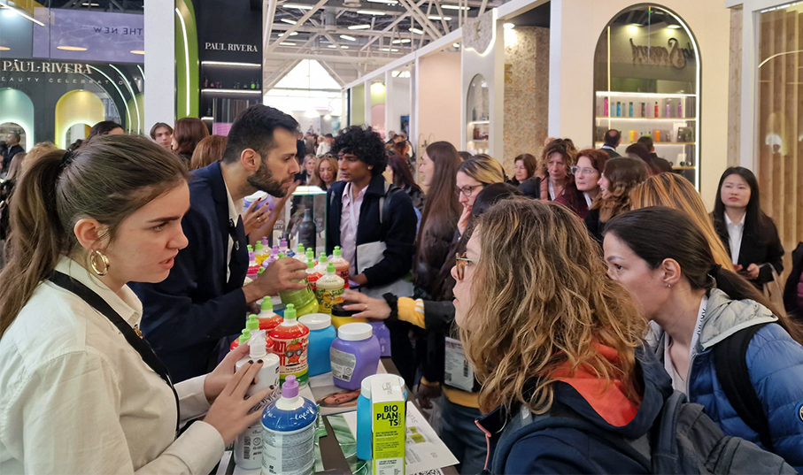

**Il trucco del 2026 è "ibrido"**: non si distingue più tra colore, cura e protezione e **i prodotti cosmetici diventano estensioni della skincare routine**. Le formule sono **altamente performanti**, come fondotinta con **alti fattori di protezione solare (SPF) e attivi trattanti**, primer funzionali e rossetti che offrono **idratazione profonda**. Per quanto riguarda i colori e i finish, dominano **rosa satinati, berry trasparenti, nude rosati e gloss luminosi** per un look naturale e sano.

Grande importanza riveste anche il settore **Haircare & Scalp Health** dove si parla di "skinification" dei capelli, ovvero **la cura della cute (scalp health) è fondamentale** per la salute del capello. Prodotti mirati tendono a **riequilibrare il microbioma** per garantire densità e vitalità a lungo termine. Tra gli ingredienti naturali avanzati nei trattamenti per capelli troviamo il **Matcha**, noto per le sue proprietà antiossidanti.
La sostenibilità evolve con le **Green Technologies**, il packaging essenziale e funzionale che riduce l'impatto ambientale.

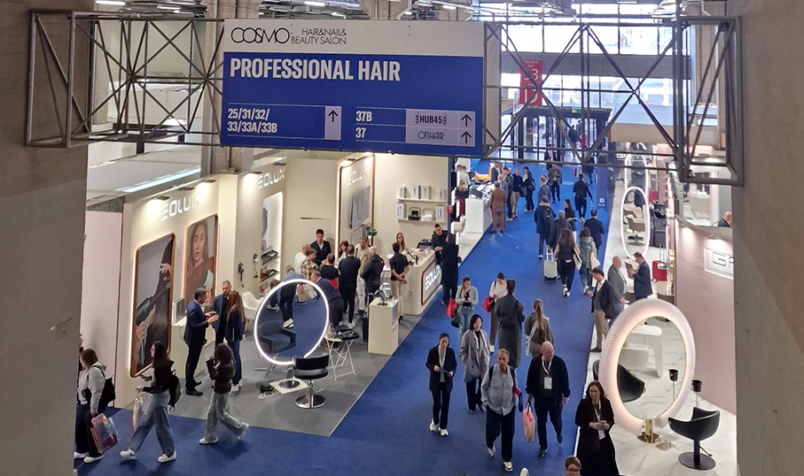

I consumatori richiedono sempre più **formule con una logica chiara, ingredienti riconoscibili e benefici comprensibili**, muovendosi verso un'estetica più "clinica" e tecnica. Per questo le aziende tendono ad essere il più trasparenti possibili, sia per i contenuti delle referenze, sia per la loro produzione.
La tecnologia gioca un ruolo chiave con **l'integrazione di AI e tool digitali** che permettono un'esperienza **su misura e personalizzata** per il tipo di pelle e il tipo di problema che si vuole risolvere. Si accorcia la distanza tra trattamenti estetici professionali  e usi domiciliari: molti centri estetici propongono formati destinati ai clienti finali che possono così **continuare a casa i trattamenti in scala maggiore ricevuti nelle beauty spa**.
**Dispositivi hi-tech per uso domiciliare** offrono risultati professionali (es. maschere a LED avanzate, strumenti di analisi cutanea).

In sintesi, Cosmoprof 2026 disegna un panorama in cui **il consumatore cerca credibilità, efficacia e sostenibilità**. Il beauty diventa un atto di gentilezza verso se stessi e il pianeta, supportato da una **scienza sempre più precisa e bio-intelligente**.

Ecco una **selezione di brand** che spaziano dalla cura della pelle professionale al make-up accessibile:

**NATURA e mondo delle API**

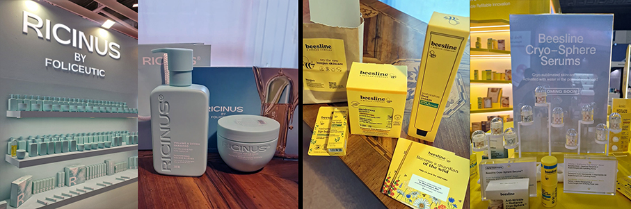

**Ricinus** (Francia): Brand francese che mette al centro l'olio di ricino biologico di alta qualità. Si focalizza su trattamenti rinforzanti e rigeneranti, ideali soprattutto per la cura di capelli, ciglia e unghie, puntando su formulazioni pure, efficaci e rispettose dell'ambiente.

**Beesline** (Libano): Fondato su principi farmaceutici, è un brand pioniere della cosmesi naturale in Medio Oriente. Si basa sull'uso terapeutico della cera d'api e della pappa reale per creare formule ipoallergeniche e prive di sostanze chimiche aggressive, mirate alla protezione e alla cura della pelle.

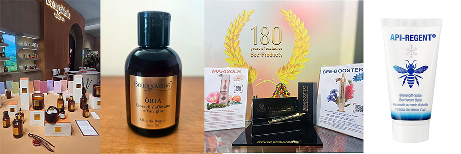

**Bottega Verde** (Italia): Storica azienda italiana nata come erboristeria a Pienza, in Toscana. Si distingue per l'uso di oltre 300 ingredienti naturali, molti dei quali coltivati direttamente nella propria tenuta (come avena, uva e olivo). Combina la tradizione erboristica con la ricerca scientifica, utilizzando tecniche come la iperfermentazione per potenziare l'efficacia degli attivi.

**Schlosswald** (Germania): È un marchio tedesco specializzato nella cosmesi apiterapica di lusso. Combina ingredienti tradizionali dell'alveare, come il miele e la propoli, con il veleno d'api, utilizzato come "botox naturale" per stimolare il collagene e rigenerare i tessuti in profondità.

**MAKE-UP e BEAUTY PROFESSIONALE**

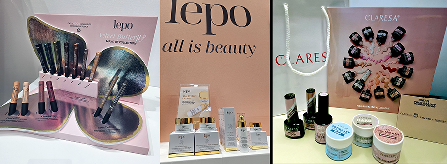

**Lepo** (Italia): Pionieri del make-up e skincare naturale e vegano ad alta tollerabilità per pelli delicate con oltre 30 anni di storia. Formule per pelli delicate, con una forte filosofia vegana e cruelty-free che non rinuncia alle performance del colore.

**Claresa** (Polonia): Specialista polacco in smalti semipermanenti e prodotti professionali per la cura delle unghie e manicure professionale. Offre una vastissima gamma di colori ad alta pigmentazione e formule a lunga durata (fino a 3 settimane). È molto apprezzato sia dai professionisti che dagli amanti del "fai da te" per l'ottimo rapporto qualità-prezzo e per la sicurezza delle sue formule ipoallergeniche.

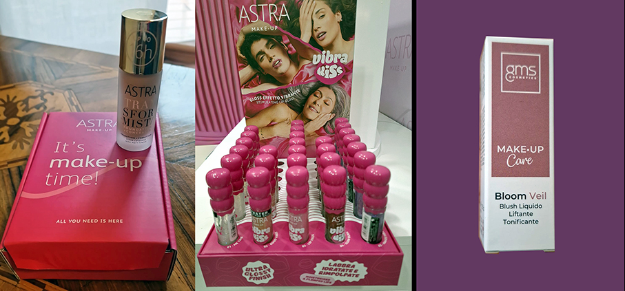

**Astra Make-Up** (Italia): Brand umbro che offre cosmetici di tendenza, accessibili e di alta qualità. Ha rivoluzionato il mercato low-cost, offrendo prodotti di tendenza, sicuri e di alta qualità a prezzi estremamente competitivi.

**GSM Cosmetics** (Italia): Marchio specializzato in forniture e cosmetici professionali per centri estetici e spa. Si concentra su prodotti professionali e attrezzature avanzate, puntando su efficacia tecnica e supporto ai professionisti.

**HAIRCARE**

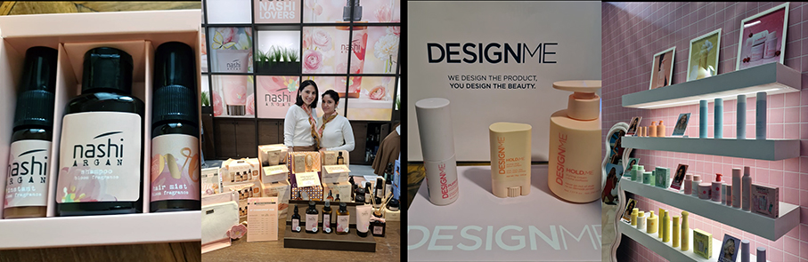

**Nashi Argan** (Italia): Trattamenti bio di alta gamma a base di olio di Argan bio, focalizzati sulla lucentezza e setosità del capello. Si distingue per l'esperienza sensoriale e olfattiva dei suoi prodotti e per un modello di vendita esclusivo basato su saloni e concept store.

**Design.ME** (Canada): Marchio di Montreal focalizzato sull'innovazione nello styling professionale. È diventato iconico grazie a Puff.ME, la prima polvere volumizzante in spray che garantisce volume immediato senza appesantire. Propone formule vegane e performanti, molto amate dai parrucchieri per la loro versatilità.

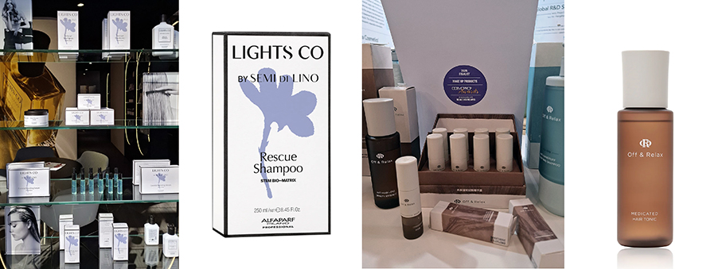

**Alfaparf Milano** (Italia): Leader globale ell'haircare e dell'acconciatura professionale, celebre per le sue linee di colorazione e cura. È sinonimo di eccellenza italiana nel colore e nella cura del capello, presente nei migliori saloni con linee tecnologiche e innovative.

**Off & Relax** (Giappone): Un brand che interpreta la cura dei capelli in chiave zen e curativa. Utilizza le proprietà minerali delle acque termali giapponesi (Onsen) per detergere delicatamente e lenire la cute, trasformando la routine del lavaggio in un rituale di rilassamento per corpo e mente. 

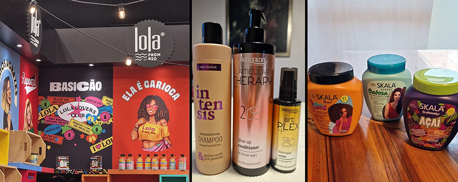

**Lola Cosmetics** (Brasile): Brand di Rio de Janeiro caratterizzato da un'anima vibrante e ironica. Offre prodotti vegani e cruelty-free con packaging colorati e nomi divertenti (come la celebre linea "Morte Súbita"). Le formule sono "pulite", prive di solfati e siliconi, e puntano a una bellezza consapevole e sostenibile.

**Prosalon** (Polonia): Linea professionale polacca molto diffusa nei saloni europei. Si concentra su soluzioni tecniche mirate, offrendo trattamenti specifici per la ricostruzione del capello, il mantenimento del colore e la cura della cute, unendo efficacia professionale a un approccio pragmatico.

**Skala** (Brasile): Marchio cult per chi cerca convenienza e qualità. È celebre per i suoi "potão" da 1kg, maschere multifunzionali 100% vegane che possono essere usate come balsamo, trattamento intensivo o leave-in. È uno dei pilastri per chi segue il Cronogramma Capillare, grazie a linee specifiche per idratazione, nutrizione e ricostruzione.

**SKINCARE E DERMOCOSMESI**

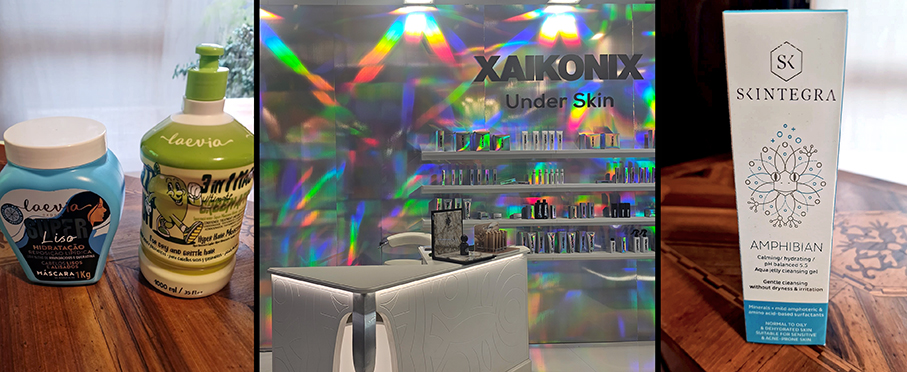

**Laevia** (Italia): Dermocosmesi specialistica che si focalizza su soluzioni specifiche per pelli ipersensibili, reattive o con problematiche dermatologiche, eliminando sostanze potenzialmente irritanti dalle formulazioni. 

**Xaikonix** (Italia): specializzato in trattamenti rigeneranti che utilizzano tecnologie come le spicole marine e i peptidi per ottenere una pelle levigata e luminosa . I suoi prodotti, inizialmente pensati per i centri estetici, includono polveri detergenti enzimatiche, sieri illuminanti e peeling innovativi per contrastare rughe e imperfezioni. E’ distribuito da Rigenera , brand tecnico che punta al rinnovamento cellulare profondo, spesso utilizzato in protocolli estetici professionali per contrastare l'invecchiamento. 

**Skintegra** (Croazia): Marchio cosmeceutico specializzato in formule minimaliste ma avanzate. È pensato per pelli difficili e sensibili (acne, rosacea, dermatiti), utilizzando attivi ad alta concentrazione ed eliminando ingredienti potenzialmente irritanti come profumi e coloranti sintetici, per garantire la massima tollerabilità cutanea.

**BENESSERE E FRAGRANZE**

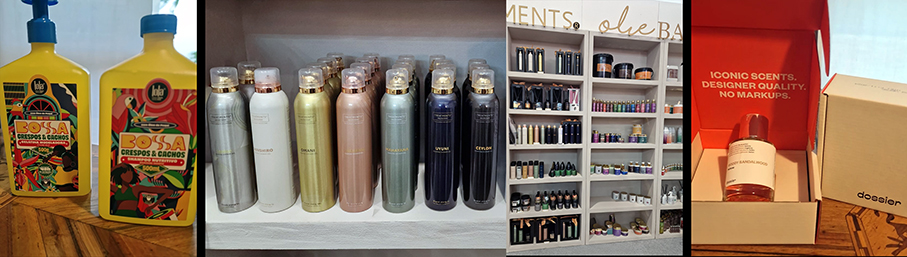

**Bossa** (Brasile): Linea ispirata allo stile di vita solare e alle atmosfere tropicali brasiliane della Bossa Nova di Rio de Janeiro. Le sue fragranze e prodotti corpo fondono note marine e solari con fiori tropicali come il frangipane e il tiarè. È un brand che punta sulla freschezza, la luminosità e l'eleganza rilassata.

**Treatments** (Paesi Bassi):  Un marchio olandese di benessere e cura del corpo ispirato ad antichi rituali di bellezza provenienti da tutto il mondo (come Bhutan, Ceylon e Giappone). I loro prodotti sono noti per le fragranze evocative e le formulazioni di alta qualità destinate a spa e uso domestico.

**Dossier** (USA/Francia): Profumeria di lusso accessibile prodotta a Grasse, che democratizza le fragranze d'alta gamma. Nasce con la missione di rendere la profumeria artistica accessibile. Indica chiaramente le note olfattiive e le ispirazioni ai grandi classici del lusso e ha un packaging minimalista ed ecosostenibile.

