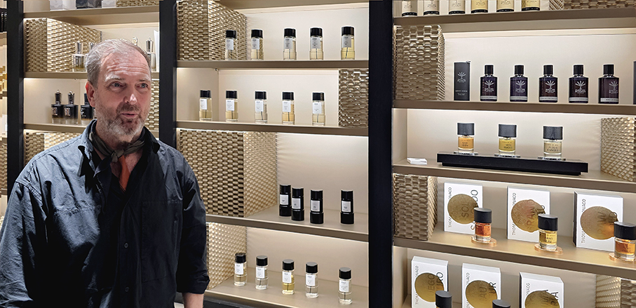
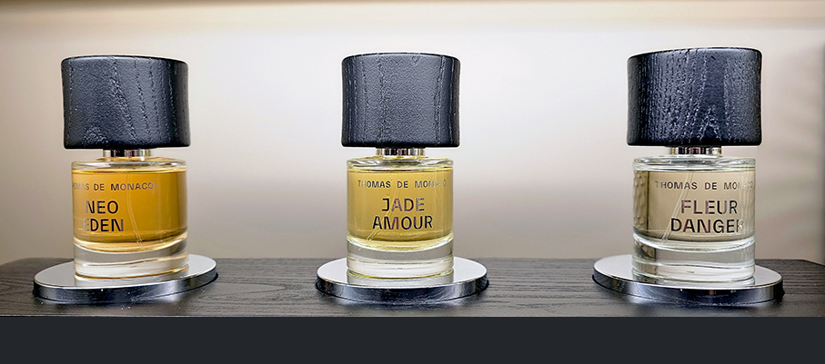
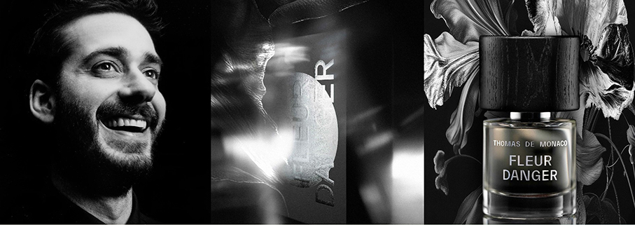
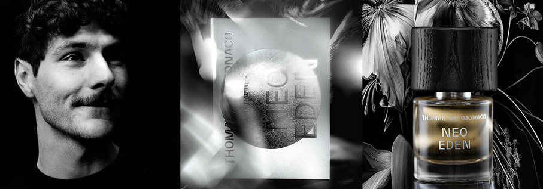
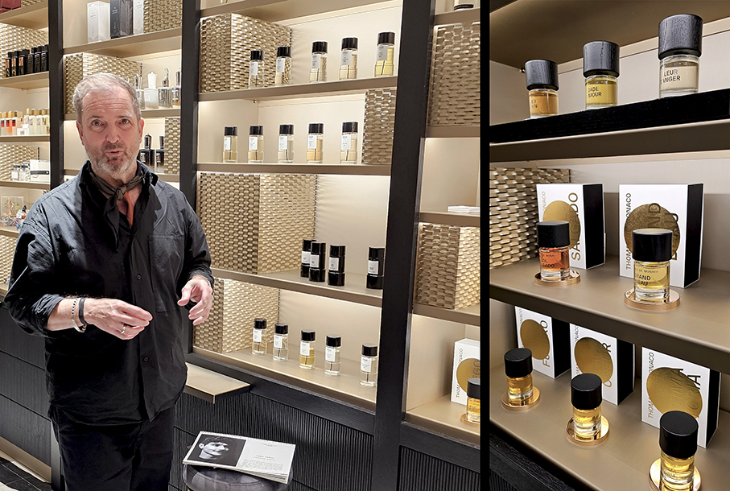

# EThe Artist Collection - Thomas De Monaco 

>Thomas De Monaco ha presentato la **nuova collezione** di fragranze del marchio nato cinque anni fa, **The Artist Collection**, ispirata dalla sua ricerca artistica

Questa edizione apre un nuovo capitolo: **uno spazio dedicato all'arte**, dove ogni creazione nasce dal rischio e da una curiosità instancabile. The Artist Collection diventa un parco giochi per l'inaspettato, sempre in movimento, sempre in continua reinvenzione, rivendicando la libertà di **creare qualcosa di nuovo** e il semplice piacere degli esperimenti che si compiono.

E' lo stesso **Thomas de Monaco** a parlarmi del **primo capitolo** della Artist Collection: **Flowers for Future** è un laboratorio di nuove forme, dove creatività e scienza si fondono. **Molecole e immaginazione** crescono fianco a fianco e il giardino fiorisce in modi che la natura da sola non potrebbe mai realizzare. Ciò che emerge non è solo un nuovo profumo, ma una visione: sconosciuta, luminosa e nata per il futuro. 

**Tre profumieri** del futuro hanno plasmato questa collezione **grezza, sorprendente, viva**. Un approccio contemporaneo alla nicchia, scritto nella poesia dell'aspettativa.

**JADE AMOUR (David Chieze)** Extrait de Parfum

Un profumo immaginato per un fiore che non ha mai avuto una fragranza. Ispirato alla **Liane de Jade**, dal colore surreale e dal profumo silenzioso, questo profumo **porta presenza nell'assenza**. Reinventa l'idea dei fiori attraverso **agrumi luminosi**, morbide curve fruttate e un **accordo verde vivido** che brilla come la vite stessa. Il sandalo cremoso e i muschi morbidi gli conferiscono un'intimità simile alla pelle, trasformando l'impossibile in qualcosa di tenero, sensuale e reale. 

**David Chieze è un sognatore, un esploratore, un creatore** di mondi invisibili. I suoi esperimenti vanno alla ricerca di qualcosa che andasse oltre il conosciuto, qualcosa di mai sentito prima. Jade Amour è il risultato: una fragranza così intrecciata, così sconosciuta, che **sembra di scoprire una nuova specie**. 

**Note olfattive**: Mandarino Giallo, Liane de Jade, Bergamotto, Ylang-ylang, Gelsomino Egiziano, Vaniglia del Madagascar, Vetiver di Haiti, Muscone, Legno di Sandalo Album dell’Australia.

**FLEUR DANGER (Ugo Charron)** Extrait de Parfum

Un fiore forgiato, non coltivato: nato dall'attrito, avvolto nell'acciaio. Questo **fiore astratto va oltre la natura**, modellato dalla tensione e protetto da un' armatura. Costruito con **aldeidi, metallo, pelle scamosciata**, calore e desiderio, bilancia la morbidezza con la struttura, il carattere con l'eleganza. È una fragranza che resiste alle aspettative, **provocatoria e precisa** allo stesso tempo. Fleur Danger non è un fiore che sboccia, ma che irrompe. 

**Ugo Charron è un artista, un performer, un musicista** attratto dalle pulsazioni del suono elettronico, ma plasmato da radici classiche. Un fiore ai confini dell'ignoto. Fleur Danger è un paradosso: **organico e sintetico, delicato e corazzato**, un profumo che rifiuta di essere domato.

**Note olfattive**: Accordo di Aldeide, Pepe Rosa, Assoluta di Rum, Accordo di Zafferano, Lampone Nat Neo, Suederal, Orcanox, Essenza di Balsamo Gurjum, Olio Indiano Legno di Sandalo.

**NEO EDEN (Augustine Lemiere)** Extrait de Parfum

Neo Eden è un sogno in mutazione: **un giardino proveniente da un'altra dimensione** dove i fiori risplendono, la natura si trasforma e i profumi diventano surreali. Progettato con **molecole futuristiche** e un istinto audace, fonde note fruttate, floreali e verdi in qualcosa di fluido, astratto e vivo. È un profumo che rappresenta la trasformazione: **insolito, luminoso, stratificato** e pieno di movimento. Non imita la natura, ma la riscrive.  

**Augustin Lemiere** è una scoperta, una forza che dà forma alla profumeria di domani. Ha qualcosa di psichedelico: un nuovo paradiso, dove la natura si riscrive, i colori si spostano come liquidi e i fiori sfidano le loro forme. Un **campo di fiori fluorescenti**, petali che brillano in tonalità impossibili, che si trasformano all'infinito, senza mai fermarsi. Con molecole all'avanguardia e una **fusione sconosciuta di fiori e verdi**.

**Note olfattive**: Rabarbaro, Pesca Ghiacciata, Magnolia, Mimosa, Cashmeran, Vetiver Haiti, Nympheal, Sclarene, Crema.  

Thomas De Monaco Parfums è distribuito in esclusiva per l'Italia da **Campomarzio70**

