# The Love Affair 2026 - Destinazione Paradiso

>**Dall’inferno al paradiso**, il wedding raccontato come un viaggio creativo nell’edizione 2026 di **The Love Affair**
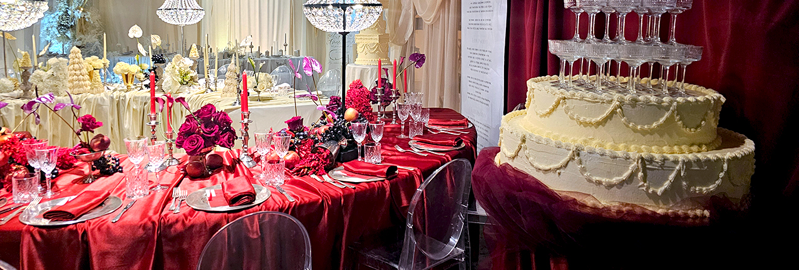

L’**undicesima edizione di The Love Affair**, la manifestazione - evento dedicata al **mondo del wedding** che dal 5 al 7 marzo ha animato gli spazi di **Spazio Fase**, ex cartiera ottocentesca in provincia di Bergamo, trasformata in una location suggestiva e affascinante.

**Nato nel 2014 da un’idea di Cristina di Giovanna e Sofia Barozzi**, The Love Affair è l’evento che ogni anno detta le **tendenze del matrimonio in Italia** e continua a consolidarsi come uno degli appuntamenti più riconoscibili del settore, capace di riunire **creativi, aziende e operatori**, ovvero
tutti i fornitori che lavorano all’interno della wedding industry, alle coppie e agli amanti dei matrimoni e della bellezza. 

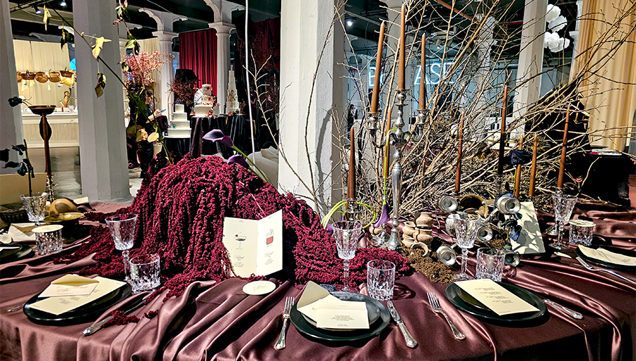

Per il 2026 la manifestazione ha scelto un immaginario fortemente simbolico: **la Divina Commedia, dove Inferno, Purgatorio e Paradiso sono diventate le tappe di un racconto** contemporaneo che ha interpretato, in chiave creativa, il percorso professionale e progettuale che attraversa l’industria del matrimonio, fatto di contenuti, incontri e suggestioni estetiche, in un clima di grande entusiasmo.

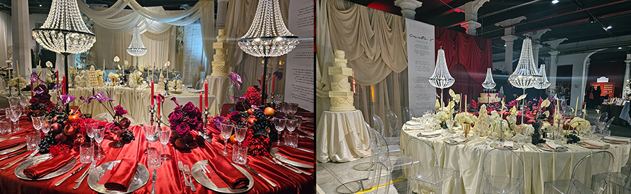

**Disco Inferno, la cocktail press preview riservata alla stampa**, ha dato forma al concept dell’edizione: dalla suggestiva “Selva Oscura” fino alla dimensione luminosa del Paradiso, attraverso **performance artistiche, musica e un itinerario gastronomico tematico**.

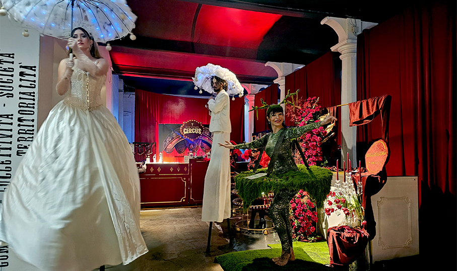

Durante le giornate aperte al pubblico, il **format Destinazione Paradiso** ha offerto presentazioni, talk e incontri dedicati ai temi più attuali della wedding industry. Professionisti e creativi si sono confrontati sull’intelligenza artificiale nei processi creativi e produttivi, le nuove estetiche bridal, l’evoluzione del beauty e la crescita del destination wedding, con un focus sulle destinazioni italiane emergenti.

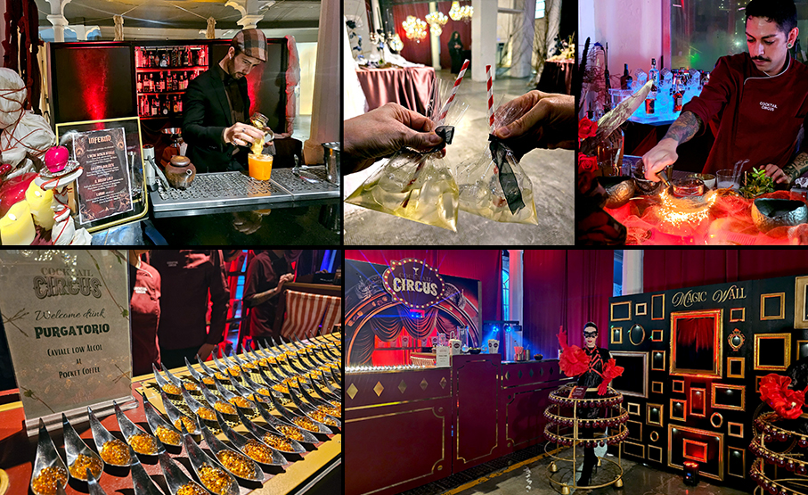

“_Questa edizione è stata un vero viaggio simbolico, che ci ha permesso di raccontare il wedding attraverso una narrazione nuova e profondamente evocativa. Vedere professionisti e visitatori attraversare insieme questo percorso, dall’Inferno al Paradiso, è stata per noi una grande emozione e la conferma che The Love Affair continua a essere uno spazio vivo, ricco di idee, relazioni e creatività_” hanno dichiarato le fondatrici **Cristina di Giovanna** e **Sofia Barozzi**.

Tra i brand che hanno partecipato:

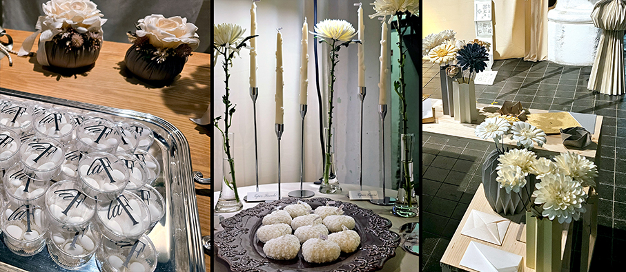

**CANDELEUX** è un brand artigianale di candele scultoree profumate, colate a mano in piccole quantità, utilizzando materiali selezionati e fragranze di alta qualità.

**ERNESTO BRUSA** è un marchio storico dell’alta confetteria, fedele ai valori del proprio fondatore e riconosciuta dal Gambero Rosso come una delle migliori confetterie d’Italia.

**ACTIVE TIMES** è un'azienda specializzata nella progettazione e realizzazione di allestimenti audio, video e light design, con una costante ricerca tecnologica e una selezione esclusiva dei migliori artisti e tecnici del settore. 

**LAMPA LAMPA** è un piccolo laboratorio artigianale che coniuga illuminazione, estetica e originalità grazie alla personalizzazione di lampade da tavolo a batteria e paralumi a sospensione.

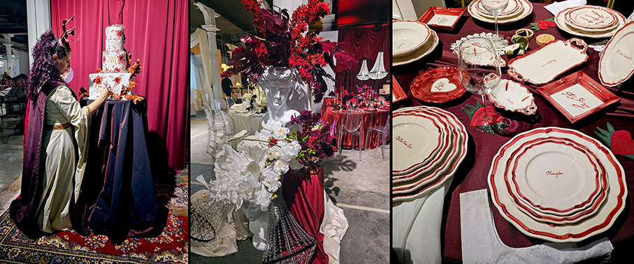

**NICOLÒ BRUNELLI** riesce a trovare la perfetta armonia tra una coppia e la bellezza del momento. Cattura l’essenza di ogni matrimonio concentrandosi su dettagli delicati, emozioni autentiche ed eleganza senza tempo.

**LA FAVORISTA** crede nei finali che sanno emozionare e nelle cerimonie che si chiudono come una favola. Si occupa della realizzazione di confettate e bomboniere dalla progettazione all’allestimento e alla gestione durante il ricevimento.

**LE DAHLIE** dà vita a creazioni che profumano di bellezza ed emozione. Nel suo laboratorio Tiziana realizza candele naturali, tavolette botaniche e accessori floreali.

**MUSAE STUDIO** nasce dal desiderio di dare vita a oggetti che parlano e a situazioni che si creano grazie a pezzi unici e ironici. Alla base della visione del brand c’è la volontà di creare un prodotto chic e contemporaneo, con un tocco vintage ma sempre irriverente.

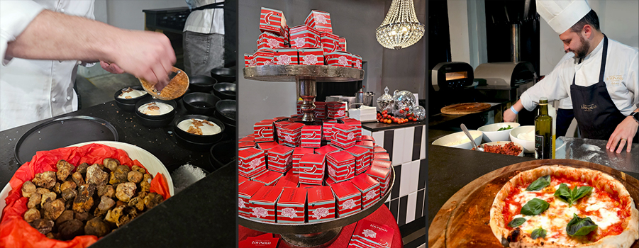

**OPIFICIO IMAGINARIUM** è un laboratorio di paper design e origami dove gli oggetti cartacei sono progettati come architetture leggere, per matrimoni, eventi e contesti corporate. 

**THE CANDLE CLUUB** è un progetto creativo dedicato all’arte della candela come esperienza di benessere, espressione personale e momento di connessione, attraverso workshop, eventi e collaborazioni con brand e location.

**FIOREVERO** è un laboratorio creativo che preserva i bouquet da sposa con una tecnica originale in cui ogni fiore viene preparato e ricomposto in quadri vetro su vetro dal design elegante e senza tempo.

Maddalena, in arte **IL LAPIS**, è una pittrice acquerellista specializzata in live painting e ritrattistica dal vivo, offrendo agli ospiti un intrattenimento originale durante tutto il ricevimento.

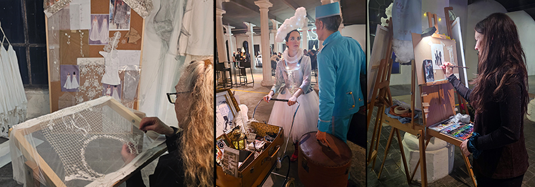

**MONJA PAINT YOUR DREAMS** si occupa di pittura dal vivo per eventi: pittura di tele, ritratti ad acquerello per gli ospiti e live painting su torta nuziale. 

**COCKTAIL CIRCUS** è l’arte del mixology che incontra la magia del circo. Un’azienda che trasforma ogni evento in uno spettacolo dove cocktail d’autore si fondono con acrobazie, effetti visivi sorprendenti e intrattenimento fuori dal comune. Dai matrimoni esclusivi alle feste private, dagli eventi aziendali ai party più eccentrici. 

**MOSAICO SPIRITS** è la prima azienda di spirits che permette di sviluppare linee personalizzate di gin artigianali anche in piccoli lotti rispondendo alle più diverse esigenze. 

**QUALITY EVENTS** nasce da una passione condivisa per il beverage e da un’idea precisa di servizio: il bar come esperienza: l’azienda progetta e realizza cocktail bar su misura per matrimoni ed eventi in tutta Italia, curando ogni elemento, dal concept dell’arredo alla drink list, fino alla presenza dietro al bancone di bartender e barlady altamente formati.

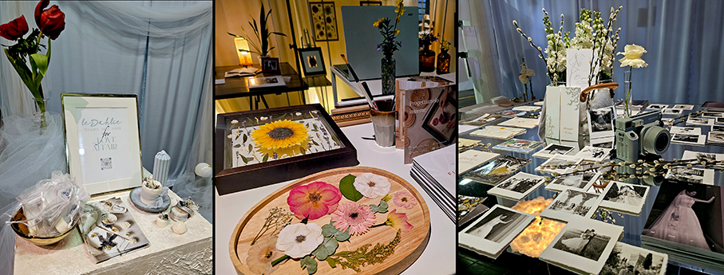

**CASEUS** è il brand di Vincenzo Troia, imprenditore e maestro casaro che, attraverso il suo Mozzarella Bar, propone un servizio artigianale dal vivo che unisce tecnica, gusto, attenzione estetica e intrattenimento. 

**LOVISOLO RICEVIMENTI** è una realtà dinamica nel mondo del catering: Alice si occupa della parte organizzativa, curando ogni aspetto dell’evento con precisione e passione, mentre Jacopo, chef di talento, è il cuore delle cucina sempre alla ricerca di nuovi sapori e combinazioni. 

**NICOLADEBARTOLO GROUP** è un riferimento nel settore della ristorazione e degli eventi, portando il meglio della tradizione culinaria e dell’ospitalità pugliese in giro in Italia e nel mondo (dalla Toscana alla Calabria, dal lago Maggiore a Paxos in Grecia). 

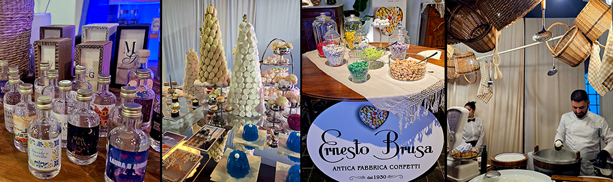

_Ph.credits: Maria Rosa Sirotti_

Maggiori informazioni: 
**https://www.theloveaffair.it/**
