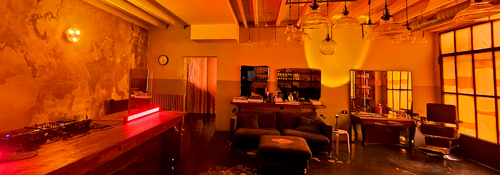
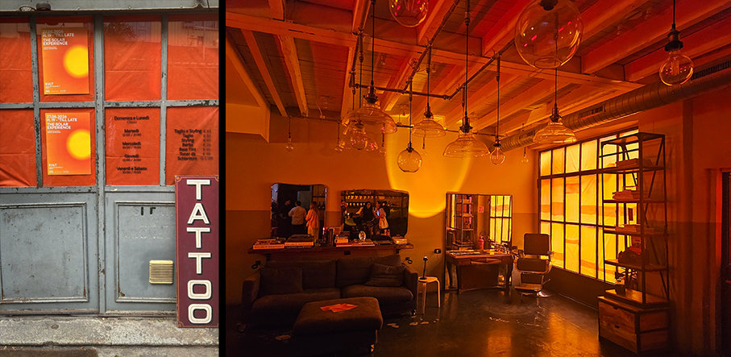
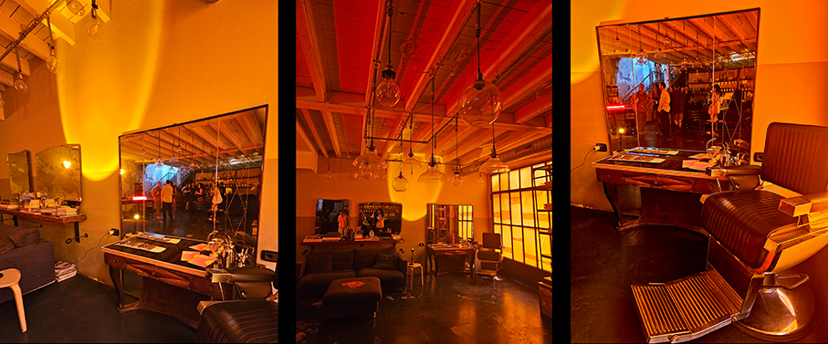
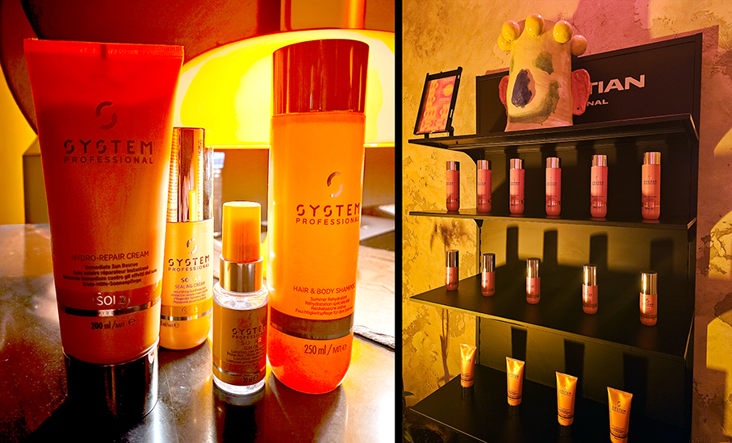
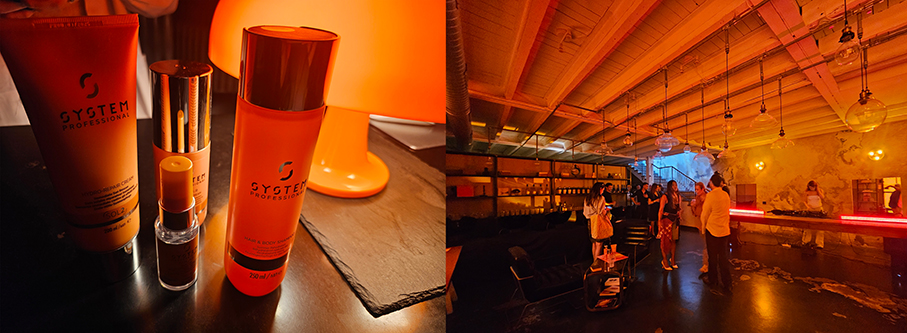
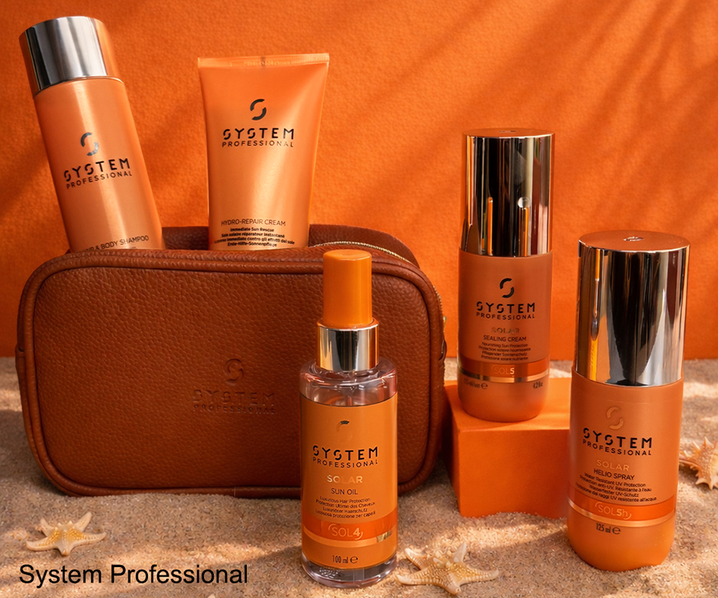

# The Solar Experience - System Professional & Kult 

>**Kult Milano** ha ospitato l’evento di presentazione della nuova linea **Solar di System Professional** e **Beauty Summer Essentials**, in collaborazione con **RoC®**

_di Maria Rosa Sirotti_

Il sole è energia: proprio da questa visione nasce la **collezione Solar pensata da System Professional** per proteggere capelli e cuoio capelluto dagli effetti del calore e dell’esposizione solare, mantenendo idratazione, luminosità e benessere durante tutta l’estate.

L’**evento di presentazione** è stato ospitato da **Kult Milano**, uno spazio particolarissimo all’interno di un cortile tra le **case di ringhiera** di Corso San Gottardo, un angolo perfetto di **Vecchia Milano**. 

Rispettoso dell’esistente e arredato con pezzi di modernariato, lo spazio sorprende per la sua dinamicità e per il mix di **atmosfere retro e d’avanguardia contemporanea**. In realtà, qui si trovano due diverse anime: un salone parrucchiere al piano terra con una postazione dedicata all’uomo e un tattoo studio al piano superiore. Il tutto collegato da una scala d’epoca. 

Kult Milano utilizza i prodotti System Professional e, conoscendone personalmente la qualità, ha proposto la nuova **linea Solar, un rituale haircare** indispensabile per l’estate. Pensata per proteggere e rigenerare i capelli esposti al sole, la linea accompagna **ogni momento della giornata**. Per proteggere i capelli **prima e durante l’esposizione al sole**, si utilizza Solar Helio Spray o Solar Sealing Cream.

**SOLAR HELIO SPRAY** 
_Protezione dai raggi UV_ 

Protegge i capelli dai danni del sole. Lo spray resistente all’acqua, con la sua formula non unta, riduce gli effetti dei raggi UV sui capelli e previene il danno proteico, lo sbiadimento e la disidratazione. Applicare generosamente su cute e capelli prima e durante l’esposizione al sole. Non risciacquare.

**SOLAR SEAILING CREAM** 
_Protezione solare nutriente_

Questa crema protettiva quotidiana offre un nutrimento profondo, che protegge dai raggi UV e dagli effetti dannosi del sale e dell’acqua clorata.  Riapplicare regolarmente dopo una nuotata. Si può usare come crema styling senza risciacquo per domare capelli crespi e ribelli.

Grazie a questi due prodotti **i raggi UV non aggrediscono il colore**, la cui intensità si mantiene più a lungo. Il complesso contiene: **filtri UV**, **polimeri cationici** per la riparazione delle parti danneggiate e **olio di avocado** contro la disidratazione. 

**Dopo l’esposizione al sole**, i residui di schermo solare, sale e acqua clorata dovrebbero essere rimossi da pelle e capelli con:

**SOLAR HAIR & BODY SHAMPOO** 
_Re-idratazione estiva_

Idrata dolcemente i capelli e la pelle, rimuovendo schermi solari, sale e residui di cloro su pelle e capelli. Contiene HelioRestore Complex e LipidCode Complex, glicerina, aminoacido istidina, DL-Panthenolo e polimeri cationici per il ripristino ** delle parti rovinate dei capelli.
	
**SOLAR HYDRO-REPAIR CONDITIONER** 
_Crema estiva ricostituente_

Il balsamo, con HelioRestore complex, aiuta a riparare i danni solari e ripristina l’idratazione persa a causa del sale e dell’acqua clorata. Aumenta all’istante la pettinabilità.

**A completamento della linea:**

**SOLAR  SUN OIL**
_Protezione UV della cheratina_

Aggiunge morbidezza istantanea durante e dopo l’esposizione al sole. I filtri UV, combinati con una lussuosa miscela di oli, proteggono la cheratina. Con: Olio di Argan, Olio di Camelia, Olio d’Oliva.
Con il conditioner: miscelare fino a 5 dosi di olio col conditioner solare, per una sensazione di capelli più soffici

**System Professional** ha presentato anche **BEAUTY SUMMER ESSENTIALS**, un Kit Solar Viso e Capelli **in collaborazione con RoC®**. Un’iniziativa esclusiva nei saloni aderenti per l’estate 2026, dedicata alla **cura completa di capelli e pelle** per garantire protezione, idratazione e bellezza a 360° e poter vivere il sole senza compromessi.

All’interno di una **elegante pochette** beauty in eco-pelle firmata System Professional, la **crema viso bestseller SPF 50 di RoC®** e il **Solar Sun Oil di System Professional** compongono un beauty set essenziale e sofisticato, perfetto da portare con sé in vacanza come in città.

