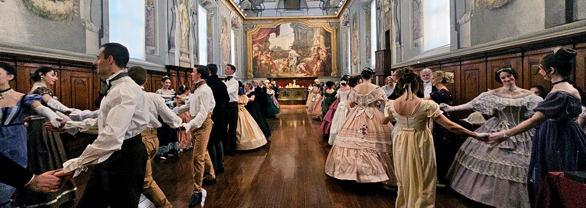
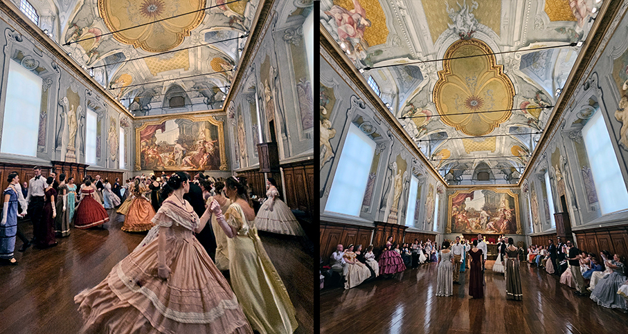
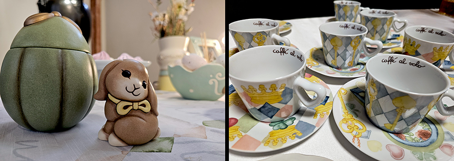
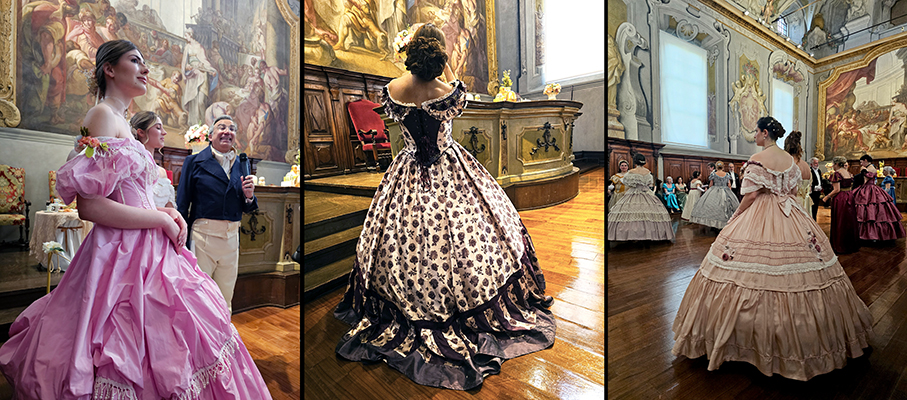
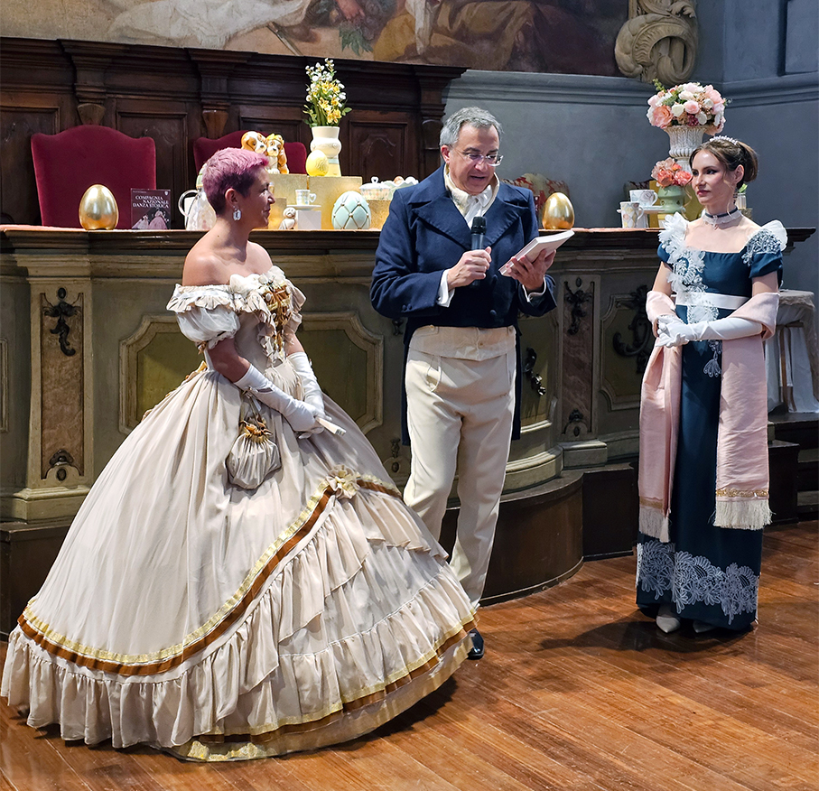
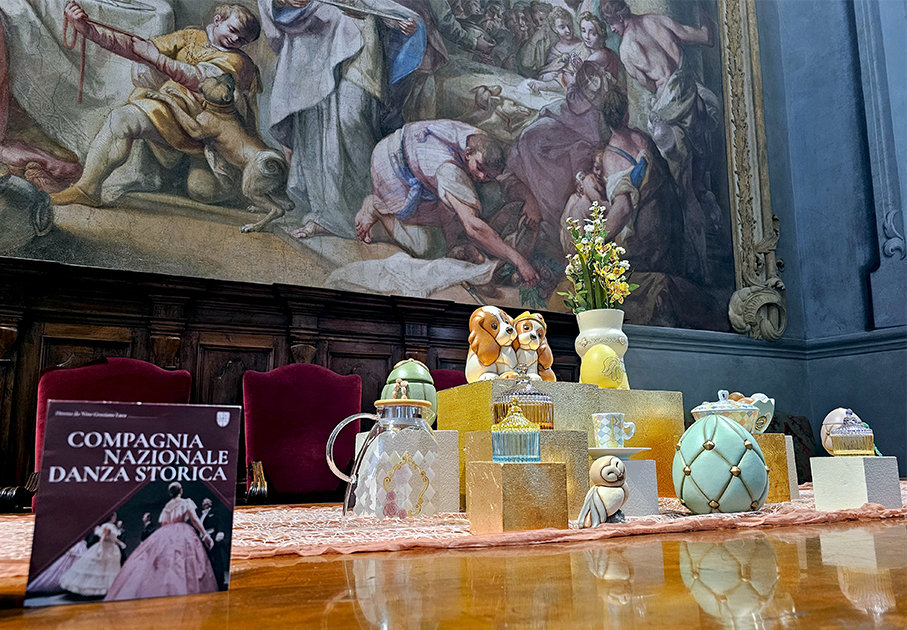
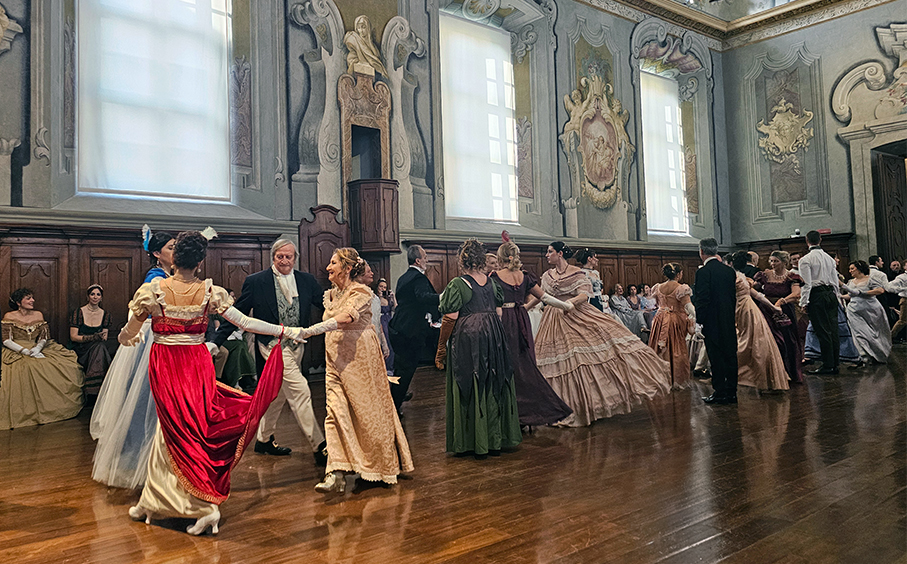

# THUN scopre l’Incanto di Primavera

>**Thun** apre i salotti più esclusivi per speciali **afternoon Regency Tea & Dance party**

Il 28 marzo, presso il Museo della Scienza e della Tecnica di Milano, **Thun ha celebrato la Primavera e la nuova collezione Incanto** aprendo le porte della Sala del Cenacolo ai tanti appassionati, attraverso simboli evocativi e dettagli poetici che ricordano la vecchia Inghilterra.

Nasce così **Un tè con THUN**, un elegante Regency afternoon tea dance party di tradizione inglese, pensato per i tanti amanti dell’estetica ottocentesca. Gli ospiti hanno avuto l’opportunità di scoprire da vicino le **nuove creazioni del brand** e vivere un’esperienza immersiva nel **mondo Thun tra musica, balli d’epoca e una raffinata pausa tè** in un’atmosfera elegante ispirata al fascino del **primo ‘800**.

**Incanto di Primavera** e **Incanto di Pasqua** sono i nomi delle nuove collezioni che raccontano la bellezza della rinascita attraverso **simboli preziosi, dettagli poetici e un immaginario senza tempo**. Chiavi che aprono il cuore, carte che disegnano il destino, corone che celebrano la forza interiore, uova che custodiscono la meraviglia della vita che nasce: ogni creazione è un invito a **riscoprire il proprio giardino segreto**, un luogo intimo dove emozioni, affetti e desideri trovano forma.

L’evento è organizzato in collaborazione con **Compagnia Nazionale di Danza Storica**, associazione culturale italiana leader nella ricerca e diffusione delle danze storiche dell’Ottocento, nota per i "Gran Balli" in costume. I ballerini hanno accompagnato gli ospiti in un viaggio tra **valzer, Pika e quadriglie** nell’atmosfera dei salotti europei dell’Ottocento, con **eleganti coreografie in autentici costumi d’epoca**, per rivivere il romanticismo dei grandi salotti europei. 

Il **soprano Maria Rita Combattelli** ha interpretato le più famose arie delle Opere Liriche del tempo. Tra un passo e l’altro, si sorseggiava un **tè servito nelle esclusive porcellane delle collezioni Thun**: un omaggio alla delicatezza dei dettagli e alla magia della stagione più fiorita dell’anno, per immergersi nell’Incanto di Primavera.

L’evento è stato il primo di una **serie di appuntamenti organizzati da Thun** nei salotti più esclusivi per i collezionisti e gli amanti dell’epoca Regency.

_Photo Cr. Maria Rosa Sirotti_

**ABOUT THUN** 
Fondata a Bolzano nel 1950 come laboratorio di ceramica, Thun è una realtà internazionale è leader di mercato dei prodotti ceramici e del regalo di qualità. Ogni pezzo è ideato e disegnato in Italia, con passione artigianale. Negli anni l’assortimento si è allargato dalla ceramica ai servizi tavola, dall’arredo casa agli accessori donna e bimbo. Conosciuta da molti per le sue storiche figure in ceramica, oggi è amata da tanti appassionati per le sue sempre nuove accattivanti collezioni e creazioni esclusive, vere e proprie capsule a tiratura limitata. Accanto ai grandi classici, come il celebre angelo si affiancano nuove icone come l’orsetto, il panda e il koala. Grande spazio è dato anche alla porcellana, con successo da anni declinata nella linea caffè al volo, e all’ innovazione con l’inserimento di nuovi materiali naturali e ecosostenibili come il vetro e il legno, eccellenti interpreti di uno stile più contemporaneo e di una proposta living più funzionale e moderna.

