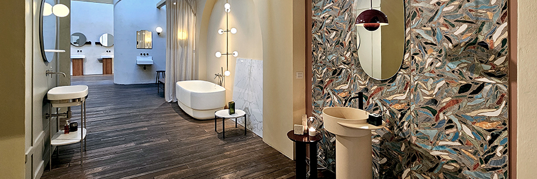
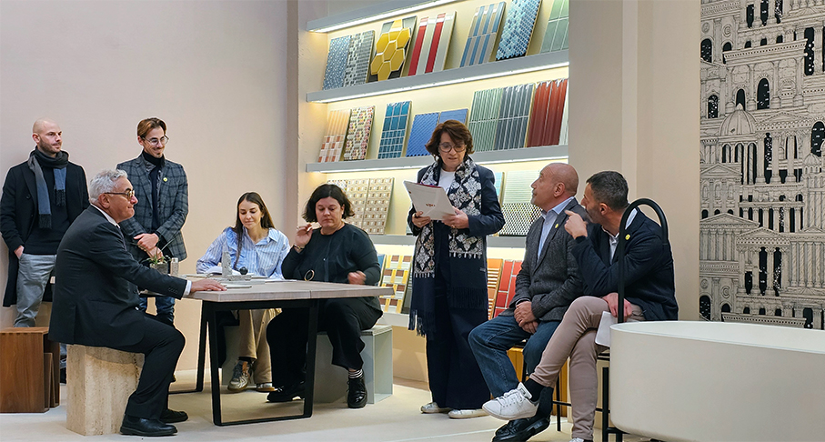
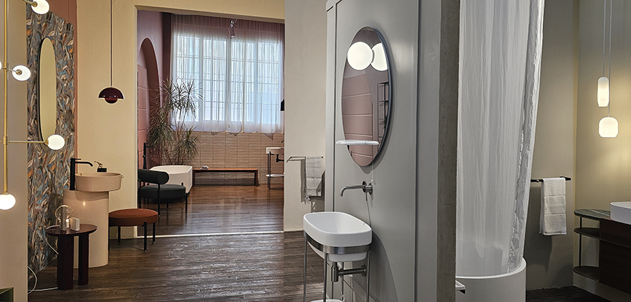
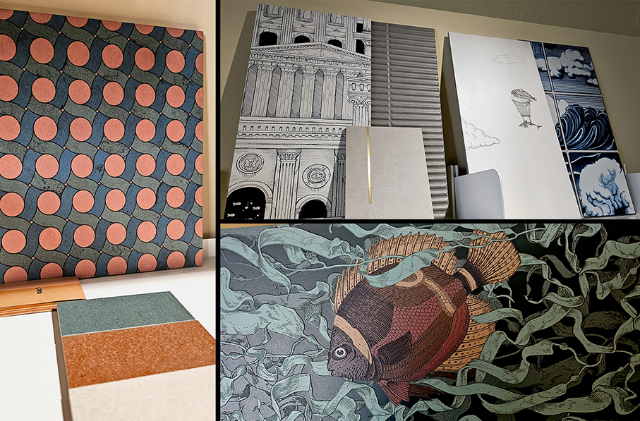
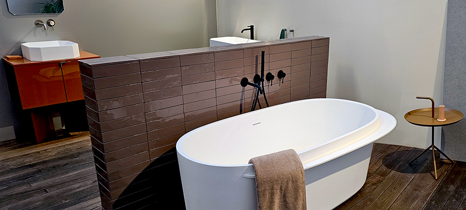
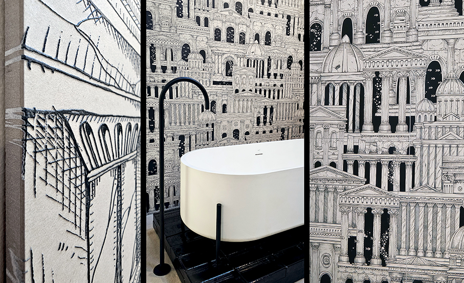
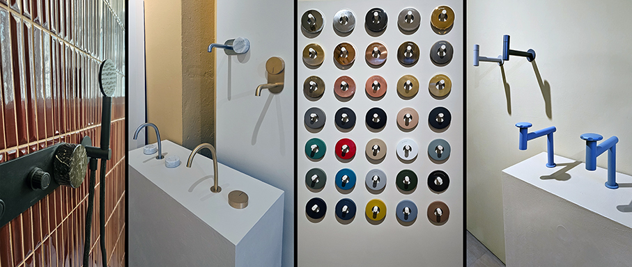
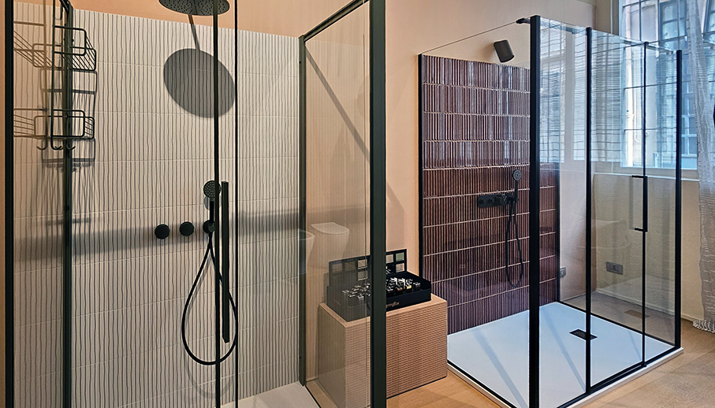
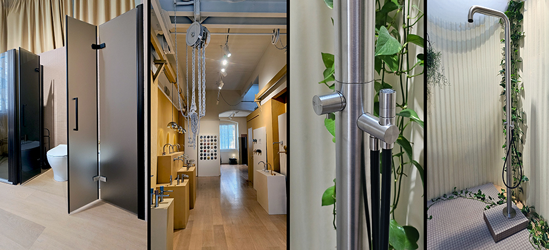

# Tortona Lab Milano “ambientoteca” del design

>**Design Meets Making** - La sinergia come metodo, la qualità come linguaggio comune: **4 aziende storiche**, eccellenze del design e dell’artigianato, sotto la guida di nuove generazioni, si uniscono per rispondere alle **nuove tendenze**

La filiera del design e dell’edilizia richiede oggi partner capaci di offrire **soluzioni integrate** e di gestire la c**omplessità dei progetti**. Da questa esigenza nasce **Tortona Lab**, un laboratorio che unisce competenze e aziende italiane d’eccellenza. Insieme al **Gruppo Bardelli**, con i suoi marchi **Ceramica Bardelli**, **Ceramica Vogue** e **Appiani**, a **Magistro Lab**, **Spring Box** e con il contributo diretto del brand **Ex.t** by Giulio Tanini, prende vita un modello collaborativo concreto, tutto italiano, costruito per rispondere in **modo sartoriale** a ogni visione d’architettura. Insieme per creare un **ecosistema collaborativo unico**, dedicato soprattutto alla progettazione della **zona bagno**. 

Lo spazio espositivo ricrea diversi ambienti, in cui compaiono e si rapportano i vari prodotti: una vera e propria **“ambientoteca”** dove tutto e tutti lavorano sinergicamente. In Tortona Lab le aziende non competono: collaborano. Il laboratorio si pone come unico interlocutore in un solo luogo, in grado di supportare e predisporre diverse competenze al servizio del progetto.
Durante l’evento di presentazione, abbiamo ascoltato gli interventi di: 

•	**Ingrid Tanini**, Titolare dello spazio Tortona Lab e del brand **Ex.T**, azienda di arredobagno contemporaneo
•	**Gianmaria Bardelli**, Amministratore delegato **Gruppo Bardelli**, azienda di superfici ceramiche con i tre marchi Ceramica Bardelli, Ceramica Vogue e Appiani
•	**Sonia Magistro e Alberto Magistro**, Titolari **Magistro Lab**, azienda di rubinetteria
•	**Piero Domenighini**, Titolare **Spring Box**, azienda di box doccia
•	**Daniele Seigneur**, Art Director & Sales Consultant

Guidato dal claim “_Dimmi cosa vuoi e noi lo realizziamo_”, Tortona Lab offre **supporto tecnico, operativo e logistico**, coordinando materiali, impiantistica e forniture per garantire installazioni senza problemi. Si propone come **unico interlocutore per architetti e designer**, trasformando idee e criticità in soluzioni su misura, per progetti **residenziali e contract**.
Le aziende partner non competono ma collaborano, offrendo un percorso integrato che va dal concept al mockup, dalla progettazione alla produzione custom, fino alla posa in opera. Tortona Lab diventa così un luogo dove design, tecnica e artigianato si uniscono per creare spazi in cui **estetica e funzione dialogano** in modo armonico. Dialogo, sinergia e personalizzazione: la soluzione per ogni progetto.

Le 4 eccellenze italiane dell’arredo bagno — ***Ex.t, Gruppo Bardelli, Magistro Lab e Spring Box** — creano un ecosistema integrato che combina **design, tecnica e artigianalità**.

**Ex.t** rappresenta l’arredobagno contemporaneo Made in Italy: con radici toscane e collaborazioni internazionali, unisce artigianalità e design moderno per trasformare il bagno in uno spazio coerente con il resto della casa.

**Gruppo Bardelli** porta la sua lunga tradizione ceramica, trasformando piastrelle e superfici in elementi di design artistico grazie ai marchi Ceramica Bardelli, Ceramica Vogue e Appiani, con una forte attenzione alla creatività e alla sostenibilità.

**Magistro Lab** dà voce all’acqua, reinterpretando la rubinetteria attraverso un approccio artigianale, sperimentale e altamente tecnico. La qualità nasce dal “saper fare” manuale unito alla ricerca continua.

**Spring Box** è specializzata in box doccia su misura, integrando precisione industriale e cura artigianale per creare soluzioni altamente personalizzate basate su alluminio e vetro.

Da questa collaborazione nasce **Team Bagno**, una **squadra multidisciplinare** che offre una soluzione completa per il **mondo contract**: dal concept alla posa finale. Il team coordina materiali, impianti, arredi e finiture, superando la frammentazione della filiera e garantendo qualità, tempi certi e coerenza estetica.
Il risultato è un nuovo modello di progettazione del bagno, dove competenze complementari lavorano come un’unica entità per offrire **soluzioni su misura totalmente Made in Italy**. Molto più di una somma di competenze, è un nuovo modo di progettare il bagno, in cui il design incontra la tecnica e la qualità diventa un risultato condiviso.

_Ph. Credits: Maria Rosa Sirotti_

