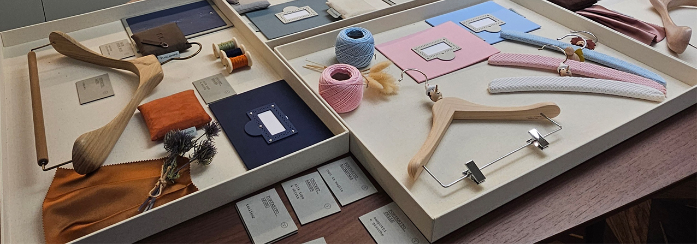
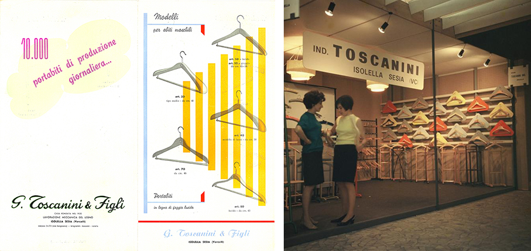
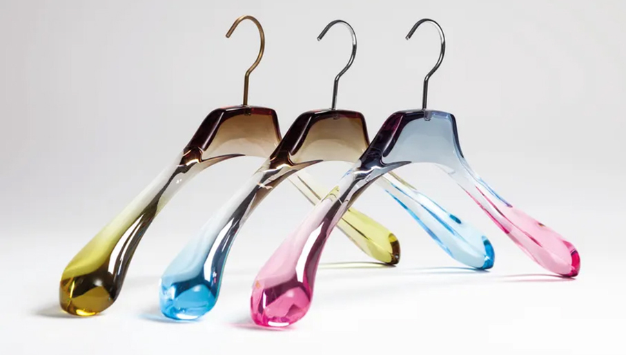
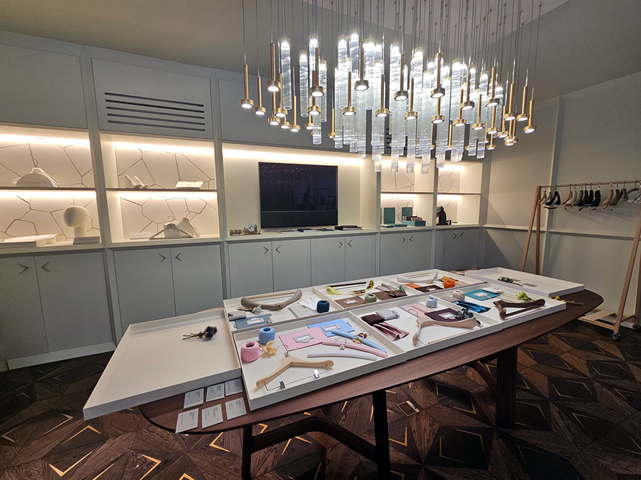
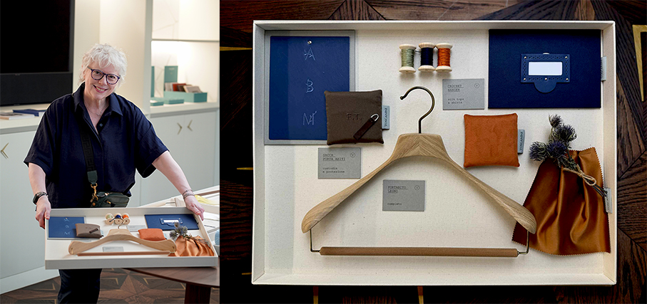
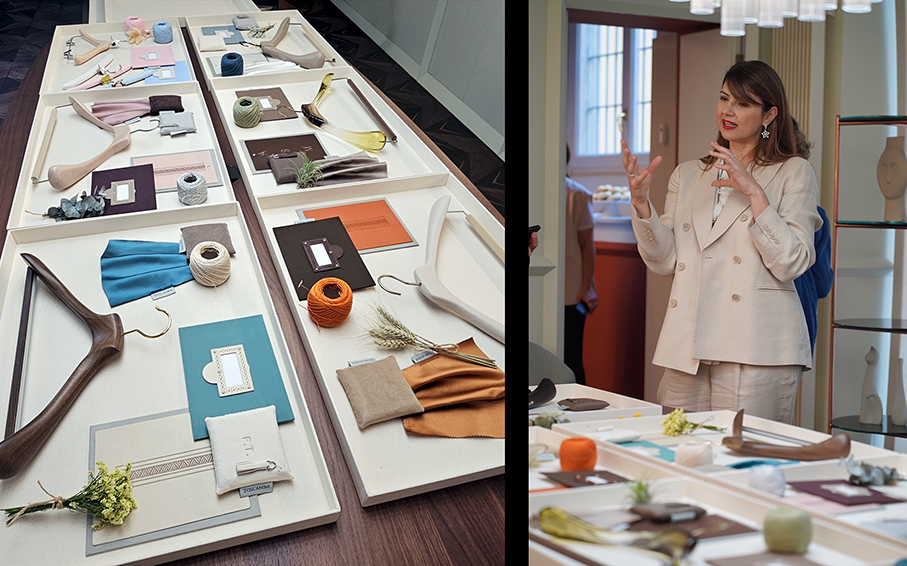
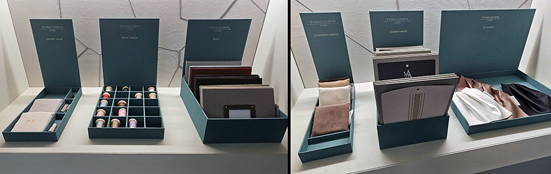
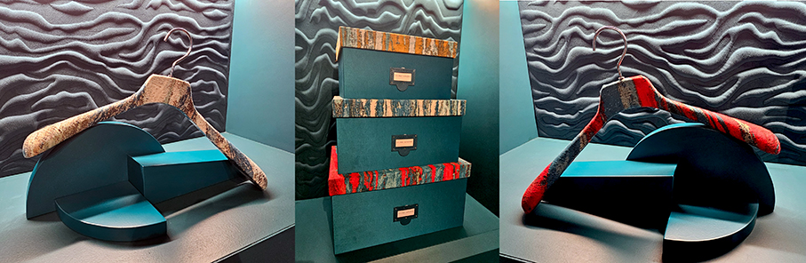
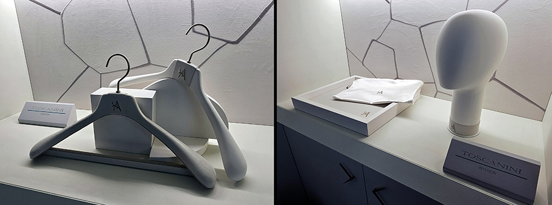

# Toscanini – L’eleganza dentro l’armadio

>Da oltre un secolo Toscanini interpreta **l’arte di appendere** con materiali, lavorazioni e personalizzazione, rendendo i portabiti parte integrante del progetto d’interni

_di Maria Rosa Sirotti_

La storia di Toscanini inizia nel **1920 a Isolella in Valsesia**, quando Giuseppe Toscanini avvia un commercio di legnami. Dopo la guerra, il figlio Ettore si concentra sulla **produzione di portabiti in legno**. È tra i primi a pensare all’industrializzazione di questi prodotti e a gettare così le basi del futuro del brand Toscanini.
Negli anni ’60, la produzione, tra le prime in serie, unisce **creatività e design funzionale**. 

Nei vibranti anni ’80, l’ingresso nel **mondo dell’alta moda** con collaborazioni prestigiose, tra cui quella con Valentino Garavani
Col nuovo millennio arriva il **plexiglass**, lavorato con una tecnica simile a quella impiegata dagli scultori con il marmo.

Negli anni 2010 nasce la **linea SuMisura** per i clienti privati egli interior designer: **configurare i portabiti** in base alle esigenze e ai gusti personali, scegliendo modello, taglia, colore, gancio e arrivando fino all’**incisione delle iniziali** sui portabiti e i complementi.

Oggi, l’azienda si concentra sullo sviluppo di **nuove collezioni dedicate a fashion retail, interior e hôtellerie** e a soluzioni personalizzabili per **architetti e professionisti**. 

_Un piccolo esperimento di **personalizzazione utilizzando le novità 2026** ci è stato proposto dalla stessa **Federica Toscanini**, durante la giornata dedicata alla stampa: abbiamo potuto scegliere i nostri materiali, colori e tessuti preferiti per comporre una **moodboard per allestire il nostro guardaroba** secondo i nostri gusti personali. Un’attività interessante e divertente che ci ha permesso di scoprire le corpose **palette disponibili** che garantiscono un risultato unico! Ho unito materiali naturali, i miei preferiti, come rovere e seta, con iniziali **Botanic Signature**. Mi piacciono i giochi di colore a contrasto e l’armonia diretta: utilizzo spesso gli accostamenti armonici di complementari e opposti. Per questo ho scelto un **blu marino e un arancione caldo**, aggiungendo, tra i filati in tinta, anche un **verde luminoso a contrasto**. Il risultato mi rappresentava perfettamente!_

**Novità 2026**

Le novità 2026 ampliano ulteriormente le possibilità progettuali per una **nuova idea di guardaroba**: un ambiente personale da progettare attraverso **materiali, finiture e dettagli** capaci di riflettere lo stile di chi lo vive. **Legno, pelle, tessuto e plexiglass** si combinano in una ricerca che mette al centro la qualità artigianale e la capacità di interpretare esigenze differenti per il mondo residenziale, contract di alta gamma, nautico e retail. 

**Italian Classic Collection Leather Touch| Ricamo su pelle**

Per i portabiti rivestiti in pelle della Italian Classic Collection Leather Touch, due proposte di ricamo come segno identitario di lusso:  
**Botanic Signature** si ispira agli antichi erbari e rielabora il tema del corredo attraverso lettere intrecciate a elementi botanici. 
****Deco Signature**, ispirato al linguaggio Art Déco e al motivo della greca, si traduce in un’estetica essenziale e contemporanea.

**Italian Classic Collection| Rivestimento in tessuto**

Selezione di portabiti rivestiti con **tessuti Rubelli** coordinati a una **gamma di scatole** personalizzate. Pensata per residenze private, boutique e spazi hospitality,
è realizzata con tecnica di **rivestimento a soletta incassata**. Sul retro, la **piega “a fazzoletto”** rimanda al mondo sartoriale e alla cultura del prodotto su misura artigianale.

**Accessori| Sistema coordinato**

Teste per manichino, vassoi, sacche copriabito e coprispalle, insieme a soluzioni dedicate alla conservazione dei maglioni e a scatole abbinate, compongono un **sistema articolato** in cui rivestimenti, finiture e dettagli possono essere declinati **in continuità con i portabiti**.
Una proposta pensata per ambienti residenziali, boutique e spazi hospitality, dove il dettaglio contribuisce a definire la qualità dell’ambiente.

