# Tutta la bellezza delle feste

>Crema, scrub, make-up, bagnoschiuma, candele, profumi ambiente e sali da bagno: sono sempre **alleati di bellezza**, anche per la nostra casa

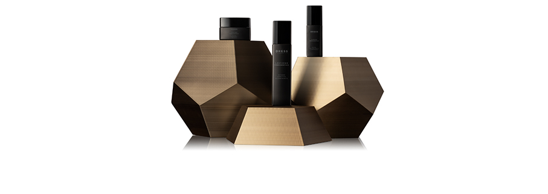

**Dignity in the Lavatory – Un Duo di Fragranze per la casa – Aesop** un Kit Regalo generosamente proporzionato anche per i bagni più piccoli. Include due doni indispensabili per chi desidera riportare un po' di serenità olfattiva. Il connubio tra fiori vivaci e Tabacco di Istros Aromatique Room Spray profuma l'ambiente per ore, mentre a eliminare gli odori meno graditi ci pensa Post Poo Drops, un deodorante botanico per il bagno dalle fresche note agrumate.

**Profumatore d'ambiente Note di Natale - Acqua Dell'Elba** la fragranza “Note di Natale”, con il suo morbido accordo speziato, attinge dalla semplicità della natura per ricreare l’atmosfera delle feste, l’incanto di un momento intimo e familiare, il calore di un abbraccio. Le inconfondibili note dell’arancia e del mandarino si uniscono con i sentori speziati tipici del Natale, come la cannella, mentre una armonia di fiori e legni della macchia mediterranea accompagna l’intero accordo come una delicata carezza.

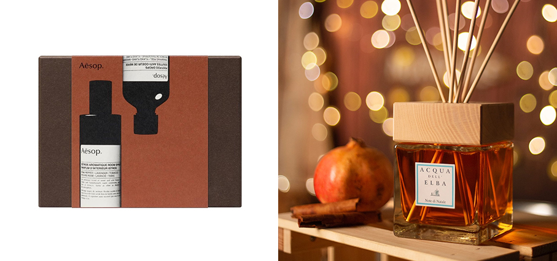

 **Arancia & Cannella - Le Maioliche Limited Edition - Rudy Profumi** un bagno e doccia schiuma da 1000 ml che celebra il calore delle festività invernali e il fascino delle tradizioni. Si presenta in un flacone dallo stile artistico ispirato alle ceramiche italiane, la fragranza unisce la freschezza agrumata dell’arancia al calore speziato della cannella, per un connubio avvolgente e sofisticato che trasforma ogni doccia in un momento di autentico benessere. La formula delicata e arricchita da ingredienti emollienti lascia la pelle morbida, vellutata e intensamente profumata. Un’edizione pensata per scaldare il cuore nei mesi più freddi, ma capace di affascinare in ogni stagione.

**Smooth.me – Esfoliante due fasi - Xaikonix** protocollo di esfoliazione delicata in due fasi, che associa un complesso di Vitamina C con oli nutrienti dello scrub gelee Fase 1, ad un mix acido a base di AHA e PHA dell'attivatore Fase 2. La combinazione delle due fasi comporta la liberazione di micro-bolle, che stimolano la pelle e la purificano eliminandone le tossine accumulate. La pelle risulta quindi levigata, rinnovata e illuminata. Adatto a tutti i tipi di pelle.

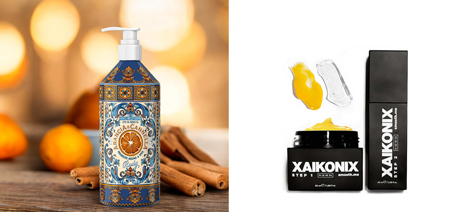

**Insuperabile – Milace** alla base della linea l’estratto di Zafferano Milace, ricavato con una tecnologia di estrazione esclusiva da tutto il fiore dello Zafferano Zaffran Ultra-Technology. Un vero trattamento sinergico anti-age che accompagna i processi di ringiovanimento della pelle, restituisce nuova luminosità e dona un incarnato uniforme. La linea Insuperabile è adatta a tutti i tipi di pelle, anche le più sensibili ed è composta da 5 prodotti essenziali e straordinari per una beauty routine completa per donna e uomo: Latte Detergente Viso Addolcente, Lozione Tonico Viso Uniformante, Siero Contorno Occhi Liftante, Siero Viso Anti-Age, Crema Viso Anti-Age.

**Shimmering Powder – Raysistant** per un tocco glam che illumina il viso e il corpo, arrivano le nuove shimmering powder in due varianti. Un regalo perfetto per brillare durante le feste con un pizzico di glam e impreziosire il beauty look con un finish luminoso e sensuale.

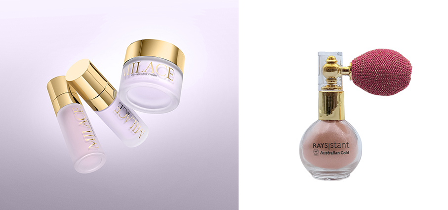

**Eyeliner Waterproof Defining Liner - Penna Eyeliner Lunga Tenuta - Face+** permette di creare un eyeliner duraturo e resistente all’acqua. Dal tratto fine è perfetto per un’applicazione precisa, veloce e ultra-definita. Colore nero intenso. La precisione dell’applicatore con l’innovativa punta in feltro, estremamente sottile, rende l’applicazione dell’eyeliner intuitiva e precisa, grazie alla tecnologia a flusso continuo di inchiostro. La sua punta extra-sottile, flessibile ed elastica, garantisce un colore più pieno e un finish lucido. La formula no-transfer garantisce una tenuta impeccabile, senza sbavature per tutto il giorno. Un gioiello da portare sempre con te. 

**Pralina Party - Candy Shop Collection – Freevola** EdP un profumo che celebra il piacere puro e l'indulgenza.
Le note gourmand di Caramello e Eliotropio aprono con una carezza cremosa, seguite dal cuore speziato e raffinato dell’Anice. Il fondo vanigliato aggiunge morbidezza e sensualità, rendendo Pralina Party il profumo ideale per chi ha una personalità dolce e unica.

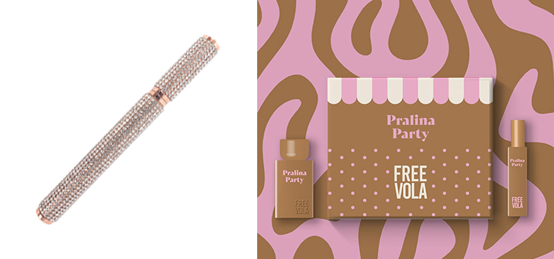

**Leggerissimo Discoginger - luce metallica rame- Mewe** un illuminante multiuso a lunga tenuta per un make-up facile e immediato. La formula contiene un concentrato innovativo di "special interference pigments" per effetti sparkling duochrome infusi in "orange blossom floral water" proveniente da fonti sostenibili, certificata Ecocert Greenlife al 99.6% di origine naturale. Innovativo applicatore: il lato piatto a spatola per depositare il prodotto direttamente sulla pelle e il lato a spazzola per pettinare e modellare ciglia, sopracciglia e capelli.

**Line Smoothing Gift Set - Rughe e Linee - RoC Skinkare** contiene 3 prodotti: Max Hydratation - Un trattamento antirughe intensivo formulato con puro retinolo RoC antietà e acido ialuronico idratante. Capsules - Un potente trattamento notte contenuto in una capsula vegetale biodegradabile, sigillata ermeticamente della linea Correxion al Retinolo. Eye Cream - Retinol Correxion® Line Smoothing Crema Contorno Occhi, illumina e sgonfia visibilmente gli occhi in 4 settimane, riduce la comparsa di rughe sottili del 50% in 12 settimane. 

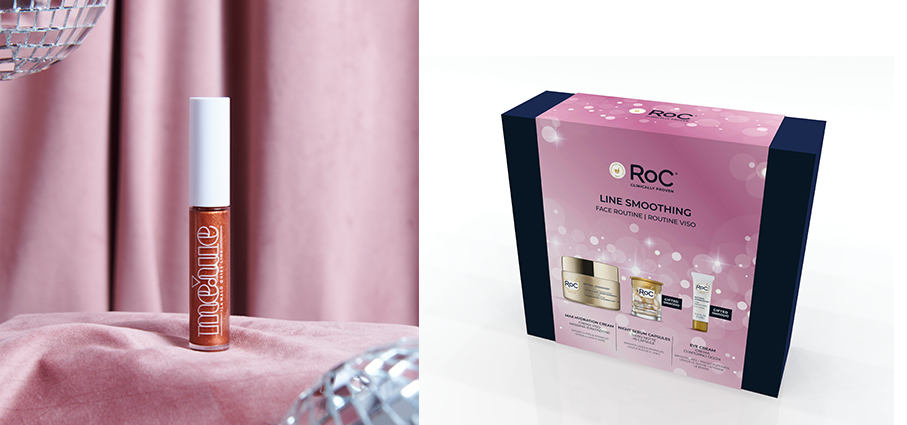

**Zuccotto - Linea Gourmand- Rudy Profumi** una collezione di cofanetti regalo ispirati alle fragranze più golose e raffinate. Il design elegante e dal gusto rétro, richiama le antiche scatole di dolci in alluminio, ricreando un’estetica vintage capace di risvegliare la nostalgia dei dolci ricordi d’infanzia. Zuccotto affonda le sue radici nella Firenze rinascimentale: un dolce pensato per sorprendere i principi e le dame alla Corte dei Medici. Caratterizzato da una cupola di pan di spagna, cacao, zucchero a velo e panna fresca, il risultato è un profumo cremoso e sontuoso.

**Gift Set Rose Rebel – Arrogance** Edt 50 ml + Shower Gel 100 ml + Body Lotion 100 ml –  kit completo e prezioso, in un’elegante confezione. Sottolineato da note gourmand di marshmallow, il bouquet goloso di Rose Rebel avvolge i sensi con la sua scia. A completamento della beauty routine, lo Shower Gel e la Body Lotion nel pratico formato travel size.

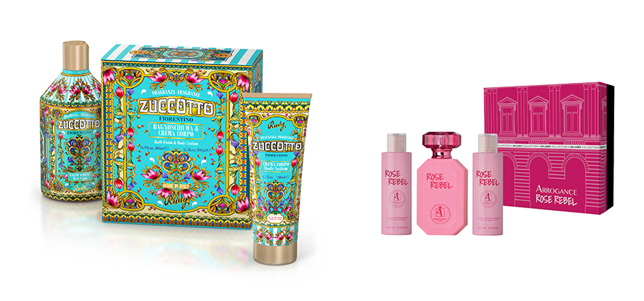

**Full Epicea – Christmas Tree - Chapel Factory** una candela che racchiude l’essenza autentica del Natale. Un inno all’abete di montagna, simbolo indiscusso delle feste, che con la sua fragranza fresca e balsamica trasporta immediatamente in una foresta innevata, tra aria pura e rami carichi di neve. Realizzata con cera di soia 100% vegetale, è una candela naturale e sostenibile, capace di diffondere calore e armonia. Accenderla significa portare in casa un’atmosfera intima e accogliente, perfetta per le serate in famiglia e i momenti di convivialità.

**Baïja – Nails & Glitter Party** cofanetto mani nelle profumazioni Minuit Chéri, Moana, Jardin Pallanca e Lost Paradise: per mani curate e profumate grazie a un kit completo racchiuso in una scatola in metallo decorata con illustrazioni esclusive Baïja. Colorata, creativa e irresistibilmente chic, per creare un’atmosfera festosa e sensoriale.

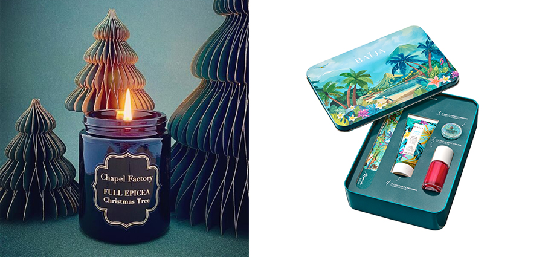

**Regenera – Crema intima - Alyval** premiata al prestigioso RCOG – Royal College of Obstetricians & Gynaecologists di Londra - è un trattamento rigenerante per tessuti fragili o atrofici, ideale come coadiuvante nella terapia del lichen sclerosus e dopo interventi o cure farmacologiche. L’innovazione scientifica incontra la dermocosmesi, trasformando la protezione delle zone più delicate in un rituale quotidiano di comfort, sicurezza e piacevolezza.

**Candela profumata Sapin (Abete) / Holiday Collection 2025 - Diptyque** come la pigna della fiaba, che si ricopre di una pellicola dorata, la candela Sapin si distingue per la decorazione impreziosita da una preziosa finitura dorata, applicata a mano. L’etichetta bianca e oro coniuga le lettere danzanti di Diptyque con l’illustrazione di un abete, catturando tutto lo splendore e la poesia dell’inverno. Tra le note: Pino siberiano, resina, cedro, muschio.

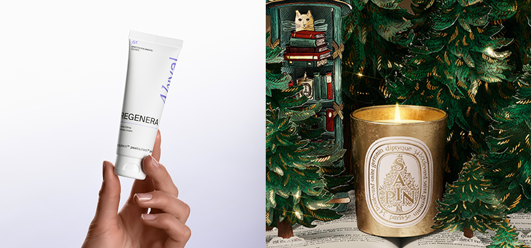

**Bath Sea Salt – Sali marini da bagno – Rigenera** (Maison Group) miscela naturale, ad azione esfoliante, a base di sale marino di alta qualità e di 33 oli essenziali diversi. La presenza dei sali marini favorisce l’eliminazione delle cellule morte, mentre la miscela di oli essenziali purissimi assicura un effetto rivitalizzante e al tempo stesso rilassante, sia per il corpo che per lo spirito.

**Vita Cura Gold Collection – Repêchage** il lusso del mare sotto l’albero: un alinea anti-age con Niacinamide/Vitamina B3, idealeper una pelle più compatta, levigata e luminosa. Pioniera nella cosmetica marina professionale, Repêchage firma una collezione di regali pensati per rivitalizzare la pelle e donarle nuova luce durante le feste. 

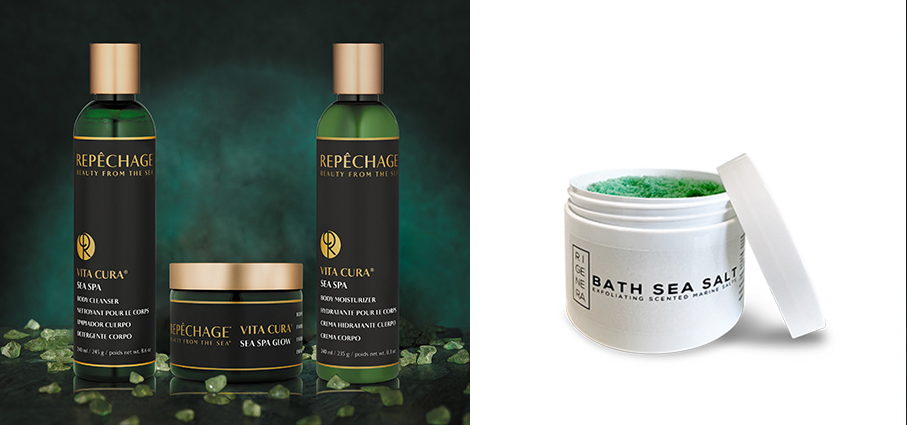

**Cofanetto - Drees cosmeetics** dalla finitura ottone stampato in 3D. Un oggetto iconico dalla forma pentagonale irregolare, che diventa protagonista d’arredo dal mood enigmatico e il linguaggio dei preziosi. Ogni cofanetto racchiude l’intera routine cosmetica del brand: Lozione, Siero e Crema. 

**The Perfect Cream Night – Lepo** la nuova crema notte appositamente formulata per rallentare e prevenire i segni del tempo mentre dormi. La notte, infatti, è il momento più prezioso per la tua beauty routine. La sua texture ricca e corposa dona un’idratazione profonda e un effetto rimpolpante visibile, lasciando la pelle levigata, compatta e rivitalizzata. Può essere utilizzata anche come maschera intensiva, per un’azione trattante ancora più potenziata. 

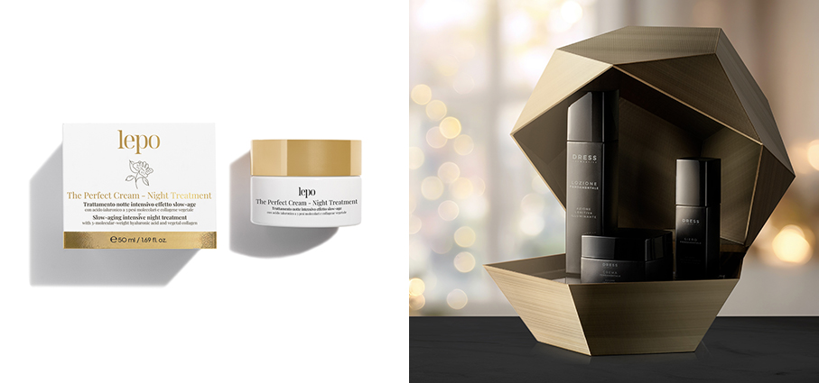

**Lift & Go Cream Face cream - Biomimetic Collagen - Histomer Milano** un'emulsione ricca e avvolgente con collagene, pullulano e alghe rosse, note per i loro effetti rassodanti, tensori e lifting. Dona alla pelle un aspetto tonico e giovanile per una bellezza senza pari.

**Ice Effect - Rigenera** sfere di ghiaccio sono realizzate in vetro resistente, adatto ad esaltare gli effetti benefici che il ghiaccio dona sulla pelle. Favoriscono l’attività linfatica e la circolazione per un aspetto più giovane e luminoso. Sfiammano, raffreddano e aiutano a ridurre l’intensità di inestetismi come rosacea, acne, brufoli e macchie. Agiscono per ridurre i pori dilatati, riducono il gonfiore intorno agli occhi e aiutano a migliorare l’aspetto delle rughe.

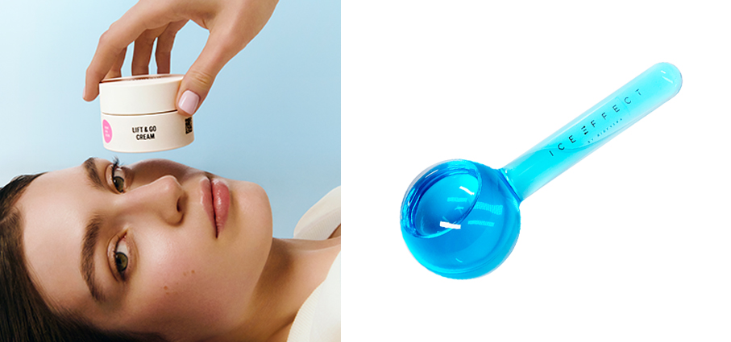

**Body Scrub – Esfoliante corpo – Rigenera** (Maison Group) con granuli di sale marino e zucchero, esfolia la pelle grazie alle diverse granulometrie. L’olio di mandorla, ricino e girasole nutrono la pelle; il miele, con proprietà idratanti, la rivitalizza. I tensioattivi contenuti in quantità misurata svolgono un’azione detergente. La pelle risulterà più liscia, tonica e idratata. Ottimo per cure anticellulite, smagliature e per prolungare l’abbronzatura.

**Christmas Gift Set - Rosalique** un’elegante confezione natalizia per testare e far scoprire la crema Rosalique 3-in-1 e il pratico pennello Miracle Brush.  Pensata proprio per le pelli più sensibili e soggette a rossori e contribuisce a migliorare istantaneamente l’aspetto grazie a un'esclusiva tecnologia di pigmenti micro-incapsulati in grado di ridurre rossori, abbinata ad attivi clinicamente testati tra cui Bisabololo, Zeolite, provitamina B5, Urea e Burro di Karité. Inoltre, contiene un fattore SPF50 che contrasta i danni a lungo termine causati da raggi UVA e UVB.

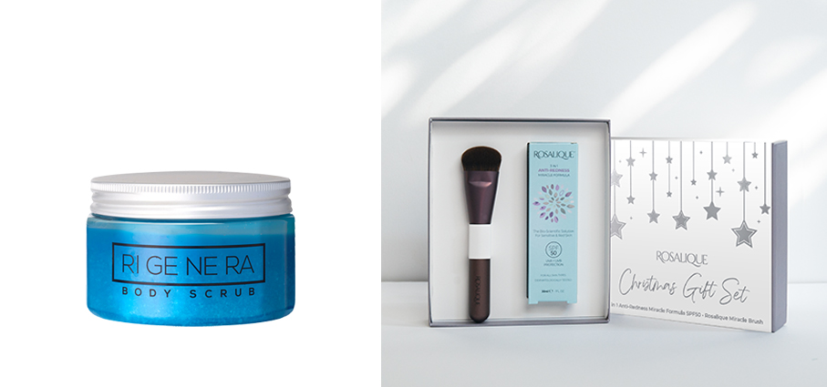
