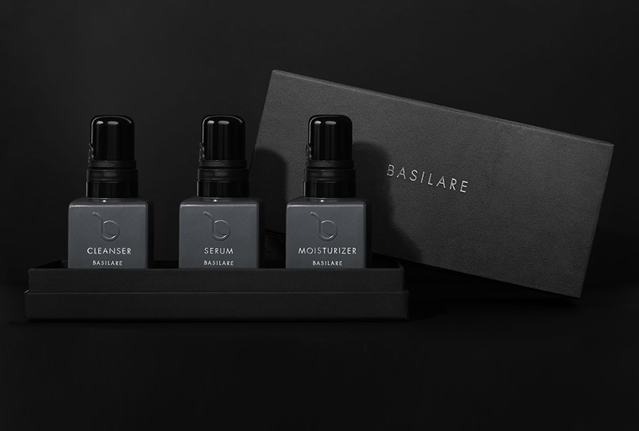
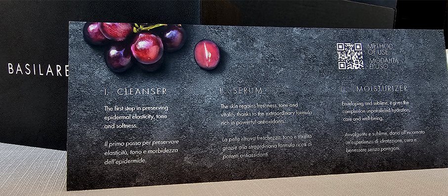
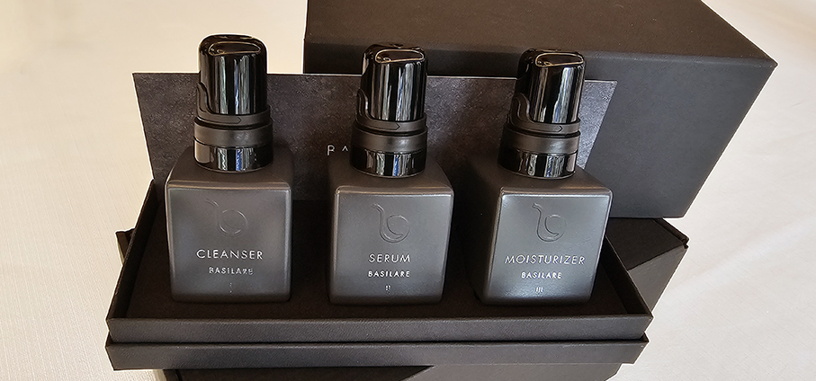

# Una Beauty Routine "Basilare"

> **Basilare** è la skin care quotidiana di cosmesi naturale creata da **Luisa Barbieri** in affinità con il suo territorio, il Triveneto
 

Un **brand italiano di cosmesi naturale** nato da un progetto sostenibile della sua fondatrice **Luisa Barbieri**, imprenditrice attenta alla cura per la persona e al benessere psicofisico. La formula è semplice, basilare: promuovere la bellezza attraverso **la cura di sé valorizzando il territorio**.  

Basilare, infatti,  trova il suo cuore pulsante nel **Triveneto**, tra Padova, Venezia e Trento, e sviluppa una ricercata formula di derivazione naturale (98%) che coglie l’essenza più profonda delle colture locali, tra cui gli **estratti della Vitis Vinifera** (uva) nella triplice forma di olio di vinaccioli; estratto glicerinato di vinaccia e cellule staminali da uva acerba; estratto idrolizzato del fiore di verbasco; acido ialuronico; resveratrolo e rosa canina.

Grazie a un'attenta attività e investimenti in Ricerca e Sviluppo, sono stati coinvolti professionisti **esperti cosmetologi, chimici e designer** del packaging che, con competenza e dedizione, hanno realizzato il prezioso cofanetto che custodisce i prodotti, coniugando **sapere scientifico e sensibilità estetica**. Nasce così una**linea premium dermocosmetica** pensata per la skincare quotidiana, basata su trattamenti formulati con rigore scientifico, conforme al regolamento cosmetico europeo. I prodotti sono dermatologicamente e oftalmologicamente testati e offrono massima delicatezza anche alle pelli sensibili. Inoltre, tutti i benefici propri di tali prodotti sono supportati da test clinici in vivo e in vitro nella costante ricerca della perfezione artigianale. 

**Luisa Barbieri, CEO e Founder di Basilare** afferma: “_La nostra linea di cosmetica è l’ideale per dare ai gesti di bellezza quotidiana un tocco di gentilezza e di eleganza, virtù senza tempo capaci di sigillare legami e che trasformano la routine in una carezza_” e sottolinea: “_Alla base della mia visione imprenditoriale la volontà di far rivivere l’autentico stile italiano, valorizzando il territorio ricco di risorse da cui provengo_”. Una filosofia che si basa sull’essenzialità nella purezza della formula, nella semplicità della forma e nell’equilibrio dell’estetica. 
Ogni fase del processo produttivo riflette l’impegno del brand per una **sostenibilità concreta** e legata al territorio a chilometro zero. Gli eleganti e lineari flaconi derivano per oltre l’80% da polimeri riciclati che rimangono isolati dal prodotto cosmetico grazie a uno strato di polimero vergine al fine di preservare l’integrità da contaminazione di eventuali metalli pesanti.

I prodotti sono destinati ad una **clientela premium** per una skincare con applicazione mattina e sera e sono **gender neutral** per la bellezza di viso, occhi e décolleté. Una routine articolata in tre gesti essenziali che accompagnano con rigore la cura quotidiana per valorizzare la pelle in modo efficace e delicato, favorendo **idratazione, protezione e luminosità** con un approccio dermocosmetico mirato. La linea si compone di:

**Crema Detergente**, un tocco di velluto, per preservare elasticità, tono e morbidezza dell’epidermide

**Siero Liquido**, che dona luminosità e splendore, e con il quale la pelle ritrova freschezza e vitalità grazie alla formula ricca di potenti antiossidanti

**Crema Idratante**, una carezza dalla texture setosa che prepara l’epidermide all’applicazione di eventuali prodotti dermo-cosmetici come la protezione solare e/o il trucco

Basilare si posiziona come un’azienda etica nel mercato del **soft luxury** a livello nazionale e internazionale: **hotel d’eccellenza, boutique al loro interno, resort, club, yachting e ville luxury**, dove l’esperienza dell’ospite è curata in ogni dettaglio.
I cofanetti, nati per essere un **cadeau di prestigio** destinato a clienti speciali e per occasioni importanti hanno una distribuzione orientata in modo selettivo al **mercato B2B** con la possibilità per il consumatore di **riacquisto anche online** tramite una “secret area”, una **sezione privata di un e-commerce dedicato**. 

_Ph.credits: Maria Rosa Sirotti_

