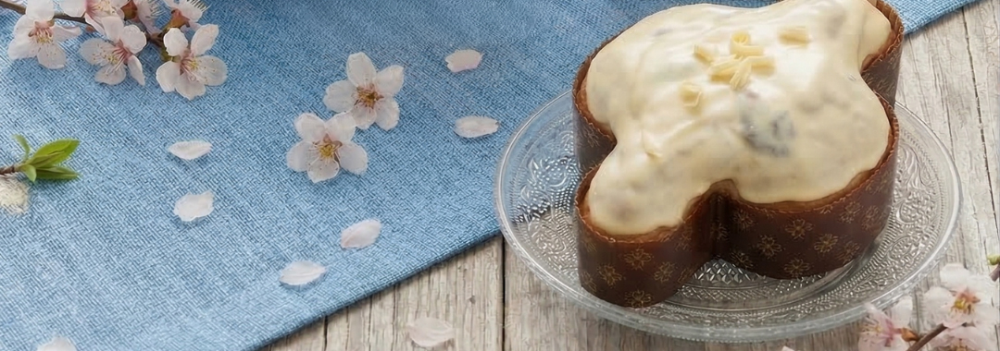
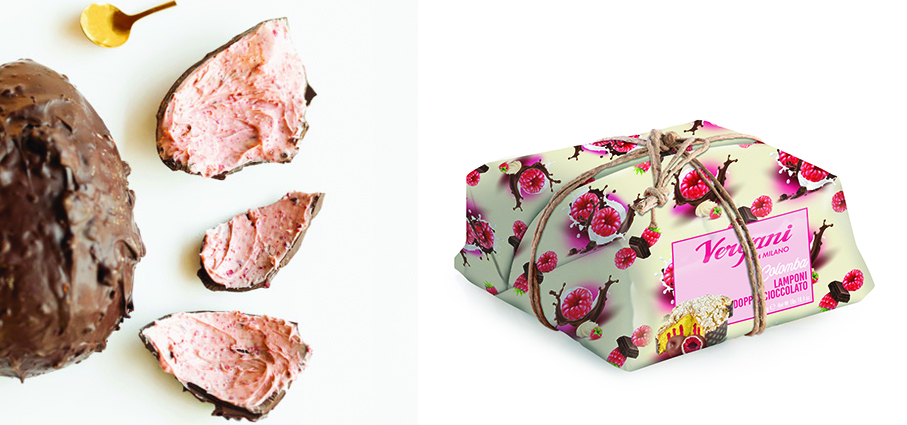
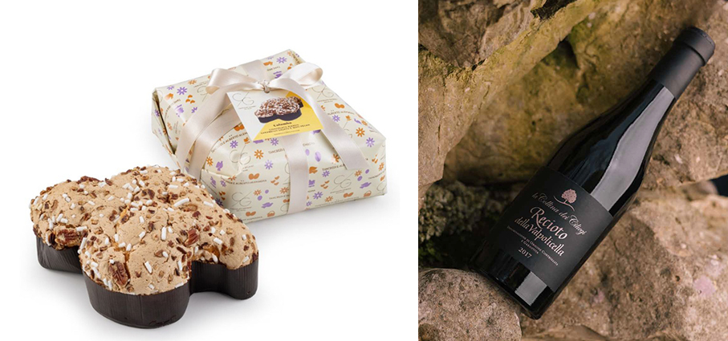
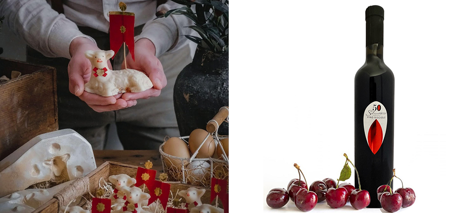
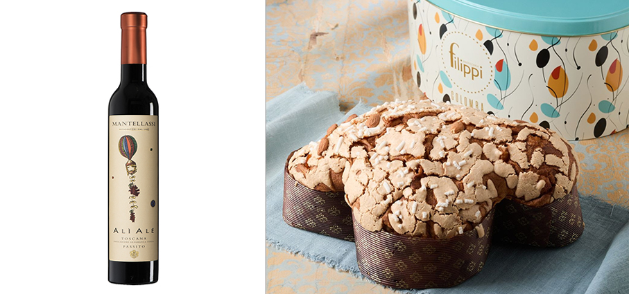
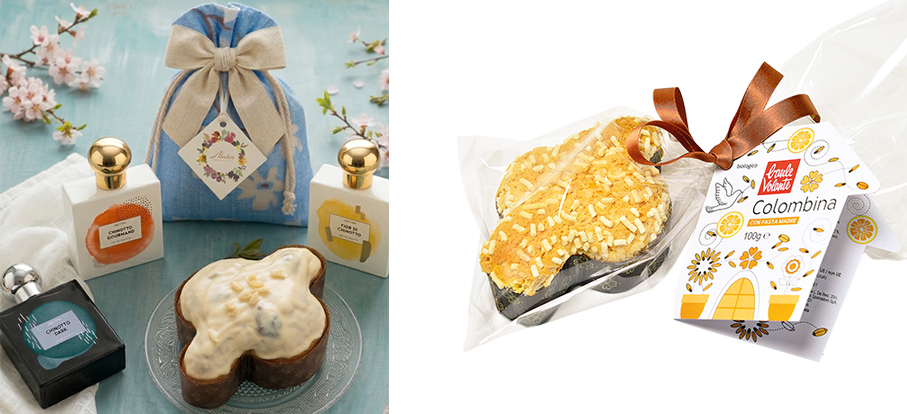
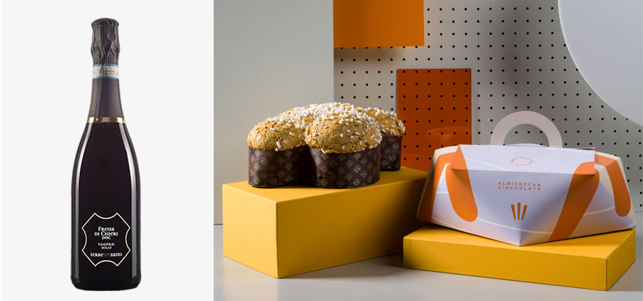

# Una Pasqua Gourmet

>Per questa festa primaverile, scegliamo **prodotti gourmet di qualità**, sia tradizionali, sia innovativi

**Uovo di cioccolato** - **Fratelli Sicilia** Extra fondente 72%, ripieno con cremino ai frutti rossi e pralinato con frutti rossi. Racconta l’incontro tra profondità aromatica e la delicatezza fruttata dei frutti rossi. Il guscio, realizzato con cacao selezionato al 72%, sprigiona note intense e persistenti, bilanciate da una naturale rotondità aromatica. La scelta di una percentuale importante di cacao non è solo una dichiarazione di stile, ma una precisa identità gustativa: un extra - fondente le cui note sono morbide, intense con un equilibrio nel mix note dolci, amare e acide.

**Colomba Lampone e Doppio Cioccolato** - **Vergani** Si arricchisce la linea Gourmet con un abbinamento ormai iconico nella pasticceria contemporanea: lampone e doppio cioccolato, al latte e fondente. Il contrasto tra la nota dolce-acidula della confettura di lampone e l’intensità del cioccolato dà vita a un equilibrio raffinato e avvolgente. Un vero e proprio inno alla golosità che conquisterà anche i palati più raffinati ed esigenti. Disponibile nel formato da 750 g.

**Colomba Cioccolato Bianco, Caramello Salato e Noci Pecan** - **T'a Milano** è realizzata solo con materie prime di qualità, lavorate artigianalmente per dare vita ad una Colomba golosa e sorprendente. L’impasto classico è farcito da deliziose gocce di caramello salato e gocce di cioccolato bianco e la granella è arricchita da noci pecan: un mix davvero irresistibile. 

**Recioto della Valpolicella DOCG** - **La Collina dei Ciliegi** Alla vista si presenta di un rosso rubino con riflessi granato. Al naso ricco di spezie dolci ed esotiche accompagnate dalla tipica nota di frutta candita. Tannino setoso ed avvolgente, finale lungo e balsamico. Un vino perfetto per dolci a base di cioccolato sia fondente che al latte, crostata e dolci a base di amarene. Da provare anche da solo.

**Agnello pasquale** - **Caffè di Sicilia 1926** Dolce iconico delle festività, l’Agnello racchiude nella sua forma un patrimonio di gesti antichi e lavorazioni pazienti. La base è costituita da pasta reale, ottenuta dalla lavorazione a caldo di mandorle finemente tritate, acqua e zucchero. Il cuore del dolce rivela un ripieno morbido e avvolgente di pasta di pistacchio, anch’essa lavorata a caldo con pistacchi tritati, acqua e zucchero, per preservarne intensità aromatica e fragranza.

**Vino di visciole** - **Casa Vinicola Silvestroni** Dal cuore della Regione Marche, una bevanda alcolica a base di vino e visciole, una varietà di ciliegia selvatica, simile alle amarene ma più dolci e di colore più scuro, preparata tramite macerazione delle visciole nel vino Montepulciano e Sangiovese con aggiunta di zucchero. Di  colore rosso rubino intenso con riflessi amaranto, odore, gradevole e intenso, come se fosse appena fatto, è dominato dalla fragola, con note sensuali e persistenti, lampone, frutti di bosco maturi e poi ancora marmellata, pesca e pera matura. Abbinamenti: vino da degustazione e da dessert, ottimo con il gelato e la  pasticceria. L’attenzione meticolosa e le più moderne tecniche di coltura fanno sì che l’amore per il buon vino si tramuti in risultati qualitativamente elevati. Gradazione Alcolica 12.5°.

**Alì Alè** - **Fattorie Mantellassi** Toscana IGT Passito. Quando Ezio Mantellassi comprò la fattoria nel lontano 1960 volle impiantare in quei primi ettari di vigneto, oltre all’Alicante e al Morellino, due filari di Aleatico. L’enologo Marco Stefanini, dietro suggerimento di Aleardo Mantellassi, ha proposto di farne un passito insieme alle uve Alicante, da qui il nome costruito sui due vitigni. Un prodotto veramente di nicchia e di alta qualità da apprezzare per i profumi di frutta rossa particolarmente intensi e piacevoli e per il suo gusto dolce e ricco di sfumature. Vitigni: 50% Alicante, 50% Aleatico. Zona di origine Maremma Toscana.

**Colomba Classica** – **Pasticceria Filippi** Il classico piace sempre moltissimo: è essenziale, rassicurante e non delude mai. Quest’anno la colomba classica è impreziosita dalla Cappelliera in latta: una confezione che, con la sua forma e i suoi colori, sta conquistando il cuore di tante e tanti. Una volta terminata la colomba, resta anche un bell’oggetto da conservare in casa: nella stanza dei bambini, in salotto o dove si vuole dare spazio a qualcosa di utile e piacevole da vedere.

**Mini Colomba Artigianale al Cioccolato Bianco e Chinotti Canditi di Savona** - **Abaton** celebra uno dei simboli più preziosi della Riviera Ligure con una creazione che unisce tradizione artigianale, gusto e identità territoriale. Una raffinata proposta pasquale ispirata alla celebre Collezione Chinotto del brand. Ma la sorpresa non finisce qui: utilizzando il codice MINICOLOMBA online, sarà possibile ricevere la mini colomba in omaggio con l'acquisto di un profumo da 100 ml della stessa collezione. Disponibile in quantità limitata sul sito Abaton Bros e presso i rivenditori della Collezione Chinotto.

**Colombina** - **Baule Volante** conferma la propria filosofia: portare in tavola il meglio dell’artigianalità, valorizzando il gusto e la tradizione in chiave biologica. Senza scorze di agrumi canditi, preparata con pasta madre, conquista con la sua consistenza soffice e fragrante. Il formato da 100 grammi la rende perfetta come piccolo dono o per un momento di dolcezza a fine pasto.

**Freisa Di Chieri D.O.C. Frizzante** – **Terre dei Santi** Vitigno coltivato esclusivamente in Piemonte, il Freisa di Chieri D.O.C. trova nella Collina Torinese, a due passi dal Capoluogo Piemontese, la zona classica di produzione. Localmente noto per lo più nella versione frizzante. Fruttato e floreale, con intense sensazioni che vanno dal lampone alla viola. In bocca è piacevolmente brioso, grazie ad una lunga rifermentazione in autoclave (metodo Charmat), leggermente amabile e fresco, con una nota tannica molto delicata e caratteristica.

**Colomba con albicocche e cioccolato bianco** - **Fratelli Sicilia** Niente scorze di agrumi canditi, nessuna copertura alle mandorle. Al loro posto, un incontro delicato e avvolgente tra albicocche e cioccolato bianco, in una ricetta che punta su rotondità, dolcezza equilibrata e pulizia aromatica. L’impasto, realizzato con lievito madre e lunghe fermentazioni naturali, mantiene la struttura soffice e la tessitura ariosa tipica dei grandi lievitati della tradizione. L’albicocca, selezionata per la sua naturale nota acidula e fragrante, dona freschezza e verticalità al morso; il cioccolato bianco, con la sua componente burrosa e lattica, avvolge e armonizza, creando un contrasto elegante e contemporaneo.
