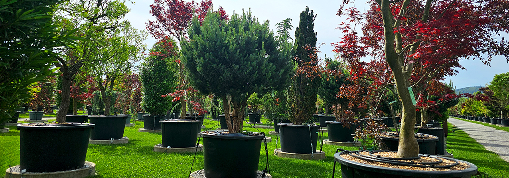
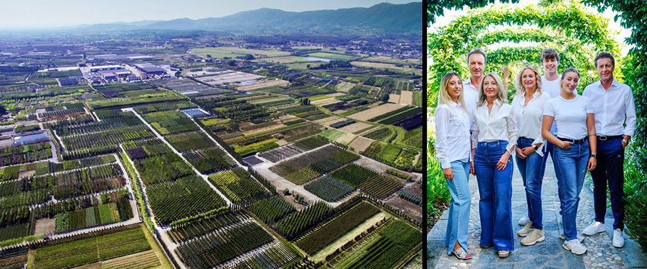
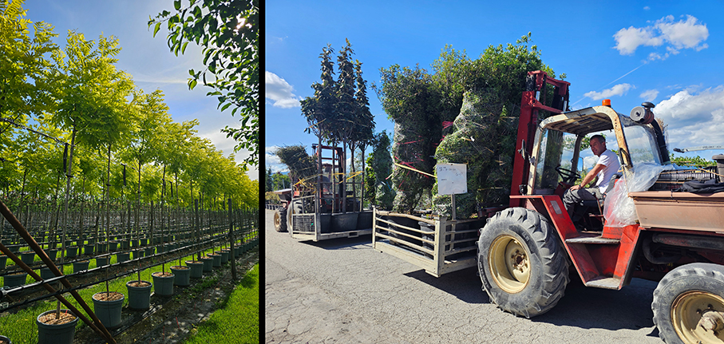
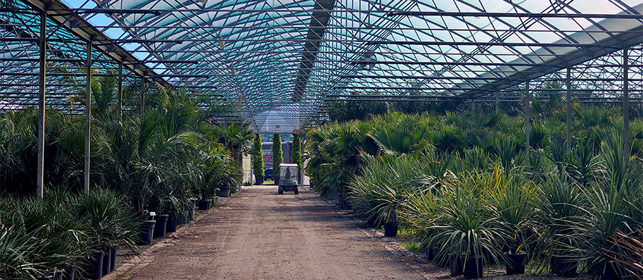
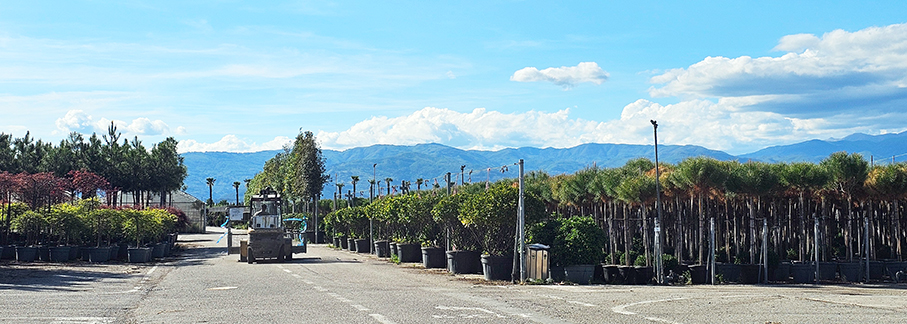
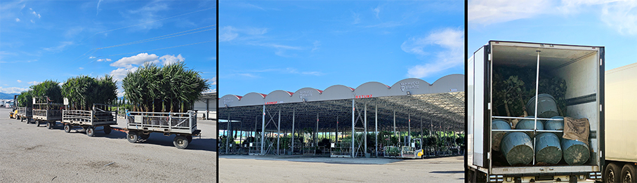
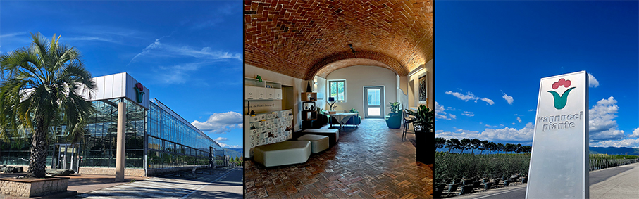
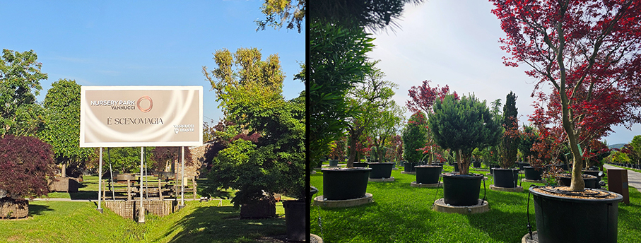
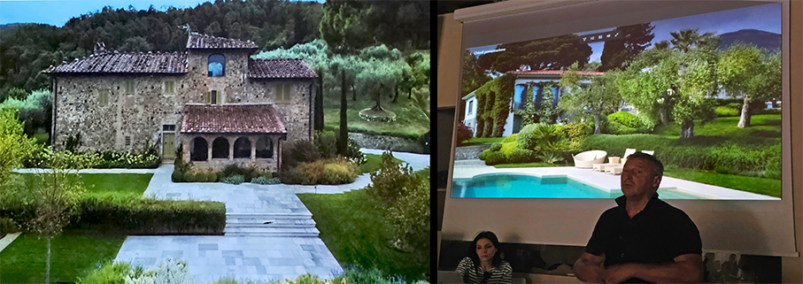
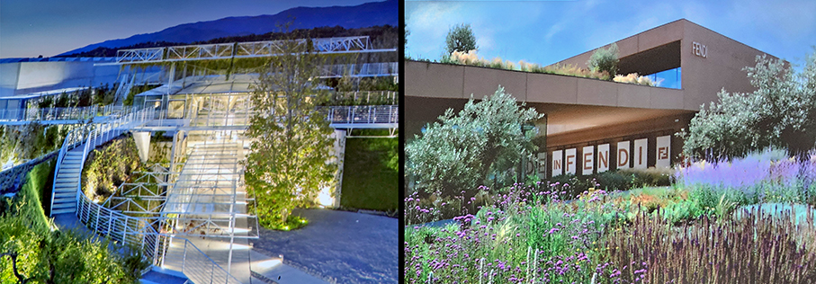

# Vannucci Piante – quando il Verde è “green”

>**Vannucci Piante**, eccellenza italiana del Distretto Vivaistico di Pistoia, produce **piante ornamentali con qualità e sostenibilità**

di _Maria Rosa Sirotti_

**"Green" significa ecosostenibilità**, rispetto dell'ambiente, riduzione dell'impatto negativo sul pianeta. Indica un **approccio ecologico** che mira a preservare le risorse naturali, spesso privilegiando **energie rinnovabili, riciclo e riduzione degli sprechi**.  Da quasi 90 anni, Vannucci Piante applica questi criteri alla sua attività di **produzione di piante ornamentali**, offrendo un Verde realmente green. 

Sotto la guida di **Vannino Vannucci** l’azienda coniuga tradizione e innovazione, ponendo al centro **eccellenza produttiva,  sostenibilità e  qualità**  per rispondere alle esigenze di mercati globali e clienti professionali. 

Con una offerta a catalogo di **oltre 3.000 varietà** che possono resistere da +40 fino a -20 C° e un **vivaio di 600 ettari** (suddivisi in 360 ettari di piante coltivate in contenitori, 240 ettari di vivai in piena terra, 60 ettari di coltivazioni sotto copertura), **Vannucci è l’azienda più visitata al mondo per le piante ornamentali**. 

Ogni anno compie un **ciclo completo delle piante a catalogo**, con l’aggiunta di **varietà nuove**, esito di attente sperimentazioni. Possiamo trovare: conifere, agrumi, graminacee, palme, succulente, rampicanti e alberi da frutto.

L'azienda è realmente impegnata in 4 punti focali:

**Riduzione dell'Impatto**: il processo di crescita e sostituzione delle piante cerca di inquinare meno rispetto ai metodi tradizionali
**Sostenibilità**: uso responsabile delle risorse con riciclo dell'acqua piovana e da irrigazione 
**Economia Circolare**: a partire dal 2024, i vasi sono prodotti con plastica riciclata, riutilizzati o smaltiti in modo ecologico
**Stile di Vita**: promuovere e sostenere il desiderio di godere di spazi verdi a livello privato e pubblico

Vannucci Piante si fa portavoce di queste nuove esigenze, tramite la valorizzazione della **cultura del verde ornamentale e paesaggistico**, seguendo le richieste di un mercato sempre più attento al **verde come qualità di vita** in ogni settore. Questo si traduce nella creazione di tre strutture pensate per amplificare il valore produttivo, culturale e paesaggistico dell'azienda e del territorio:

**Design Park** è un parco di 4 ettari dedicato alle piante semi-mature e nato per essere il punto di riferimento per Garden Center, Architetti del Paesaggio, Progettisti, Studi di Architettura e Designer. 

**Pistoia Nursery Park** è un’immensa area verde per rendere vivo e reale qualsiasi progetto immaginato dai professionisti del paesaggio immergendoli in una diversità di esemplari di pronto effetto per trovare la giusta ispirazione.

**Pistoia Nursery Campus** è un green resort a vocazione professionale con ristorazione. Uno spazio come strumento di apprendimento per lo sviluppo del settore e l’aggiornamento professionale anche attraverso la condivisione di esperienze internazionali, progetti ambientali, formazione giovanile e studio di nuove tecnologie

Tra i progetti di prestigio a livello mondiale, Vannucci Piante ha contribuito a eventi e fiere internazionali come **Expo Milano ed Expo Shanghai**, alla realizzazione di parchi tematici e di intrattenimento tra cui **Shanghai Disneyland, Eurodisney a Parigi** e Dubai Life Style City. Si occupa di fornitura e manutenzione di **giardini reali e storici** tra cui quelli di Londra e Amman. 

_Ph. Credits: Maria Rosa Sirotti_

**Vannucci Piante**

Via Moreno Vannucci (già Via della Dogaia), 

110 51039 Quarrata (loc. Piuvica)

Pistoia _ Italia

**www.vannuccipiante.it**
