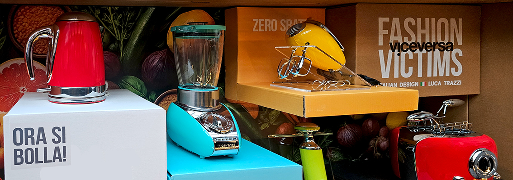
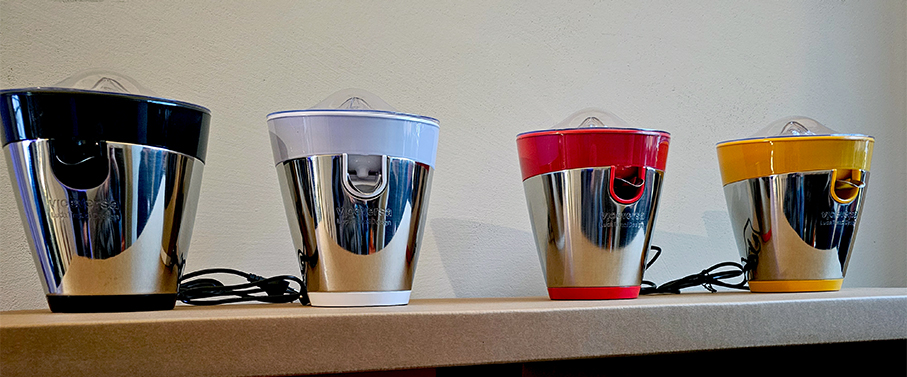
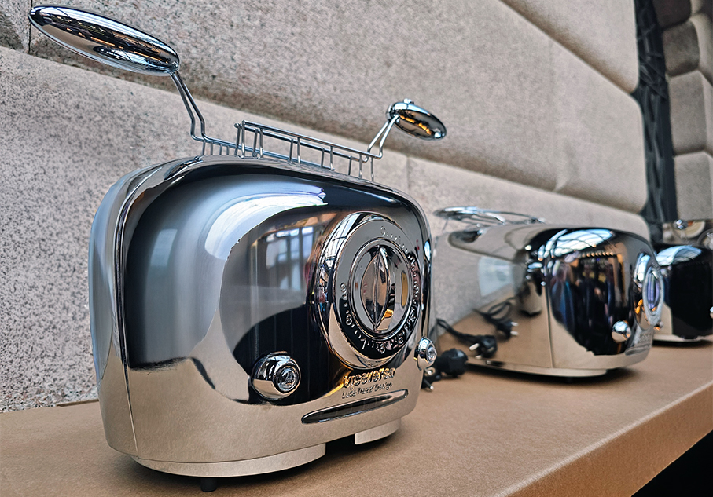
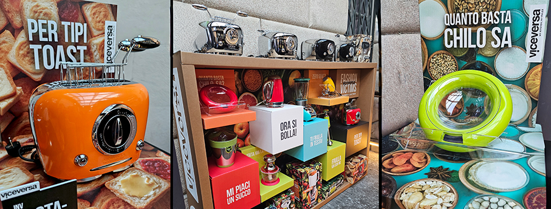
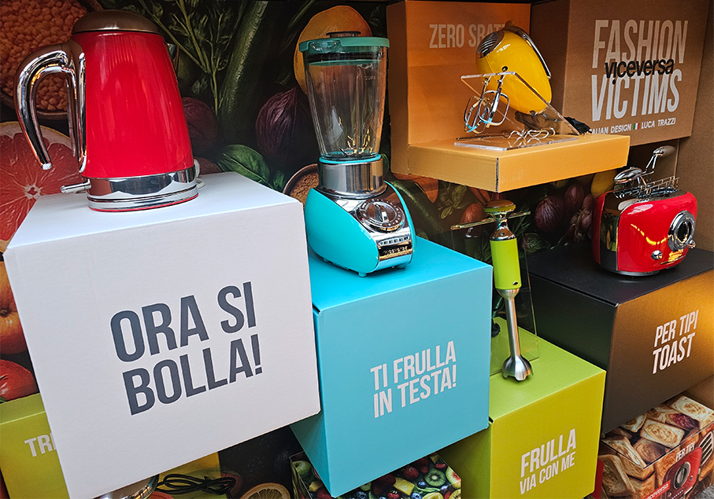
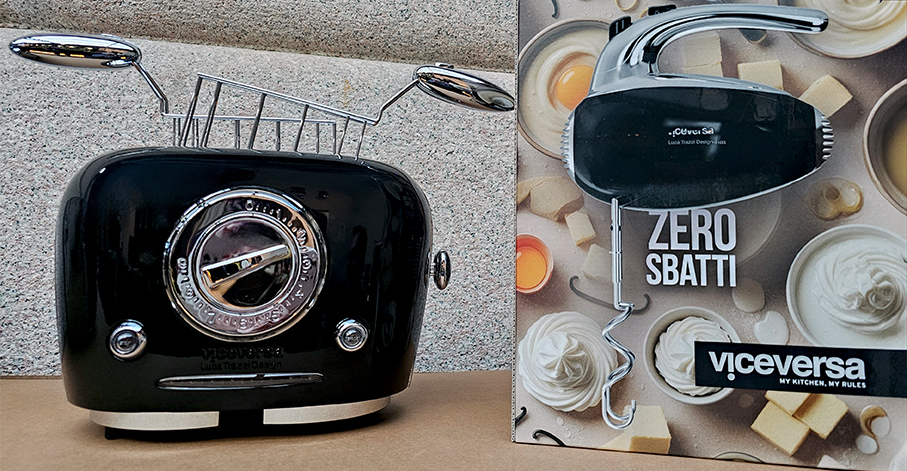
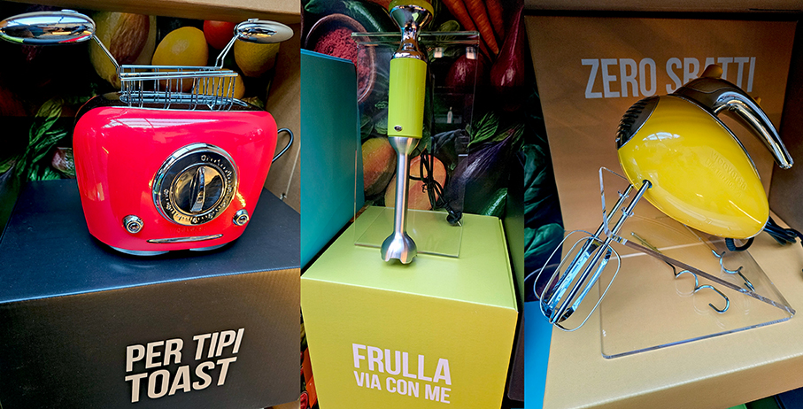

# Viceversa – eleganza e allegria in cucina

>Una nuova e divertente linea di **piccoli elettrodomestici** pensati per diventare anche oggetti di arredo

**Viceversa**, marchio italiano di piccoli elettrodomestici di design, presenta la nuova e divertente collezione composta da: **tostapane, bollitore, frullatore, bilancia da cucina, tritatutto e spremiagrumi**.  Una linea innovativa  e funzionale perfetta per arredare e personalizzare la cucina e l’home living con **prodotti eleganti, colorati e divertenti**. Heritage creativo e strategia industriale si fondono interpretando in chiave contemporanea l’identità distintiva del brand e rafforzandone il **posizionamento nel segmento premium**.

**Design, colore e funzionalità** definiscono l’offerta pensata per un consumatore sempre più attento non solo alle funzioni, ma anche al valore estetico degli oggetti che abitano la cucina e gli spazi living e ne interpretano la personalità. I nuovi modelli rappresentano un perfetto equilibrio tra **eleganza e praticità**; semplici da usare, sono progettati per accompagnare i momenti chiave della giornata, dalla colazione alla convivialità, con soluzioni evolute e immediatamente riconoscibili, che non seguono le mode ma le anticipano.

**Il colore non è un dettaglio ma un linguaggio**: ogni tonalità è scelta per l’emozione che suscita e per la sottile ironia che esprime. Nascono così **Biancandido, Giallo insolente, Rosso secco, Limetime, Solitario blu, Nero simile, Metacromo e Mandarino Malandrino**; nomi che raccontano uno stato d’animo prima ancora di una sfumatura e che esprimono un grande carattere. 

Il mood giocoso e ironico si legge anche dall’identità dei prodotti: “**Ti frulla in testa**” - frullatore da tavolo, “**Frulla via con Me**” - frullatore ad immersione, “**Zero Sbatti**” -  sbattitore elettrico, “**Trita Via la noia**” – chopper, “**Tipi Toast**” - tostapane a 2 e 4 vani con e senza pinze, “**Mi piaci un succo**”-  spremiagrumi elettrico, “**Ora si bolla**” - bollitore elettrico, “**Quanto basta chilo sa**” - bilancia da cucina digitale.

La personalità del brand si estende al **packaging, elemento distintivo** e coerente con l’identità visiva del marchio. Formato, sfondo ed espositori sono pensati per valorizzare il prodotto e rafforzarne la riconoscibilità, con un’attenzione concreta alla sostenibilità grazie all’utilizzo di **carta riciclata certificata FSC**.

Firmati dal talento artistico di Oliviero Toscani che, con il suo tocco unico, ne ha curato la direzione creativa nei primi anni, i prodotti Viceversa continuano oggi il loro percorso di successo grazie all’impronta stilistica del **designer Luca Trazzi**. Con questa collezione Viceversa conferma la propria missione: **sorprendere, reinterpretare e ribaltare il consueto**, dimostrando che anche l’oggetto più quotidiano può diventare straordinario. Basta saperlo guardare da una prospettiva nuova.

Viceversa, marchio di **Innoliving S.p.A**, nasce nel 1983 come marchio italiano di piccoli elettrodomestici di design. Nel tempo, ha costruito un’identità riconoscibile fondata sulla capacità di rileggere il quotidiano con uno sguardo anticonvenzionale. Oliviero Toscani, che ne è stato il direttore creativo, e lo chef Cristiano Tomei hanno contribuito a consolidarne il carattere unico e la vocazione sperimentale. Il marchio ha anche ricevuto riconoscimenti internazionali - tra cui il **Red Dot Design Award** (2012) e il **Compasso d’Oro** (2015 e 2017). Oggi prosegue il proprio percorso evolutivo sotto la direzione creativa di Luca Trazzi. 
**Molto apprezzato nei mercati esteri**, il brand premium possiede brevetti registrati in diverse parti del mondo e ha offerto a Innoliving l’opportunità di espandere la propria presenza a livello internazionale. 
Viceversa è **distribuito attraverso canali specifici e dedicati**, con accordi selettivi che ne valorizzano il posizionamento premium. Una strategia coerente con la natura del marchio, che punta a mantenere alta la percezione di **esclusività e contenuto progettuale**.

_Ph. credits: Maria Rosa Sirotti_