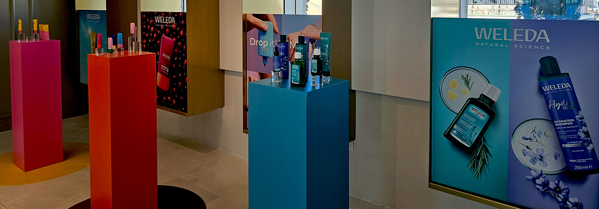
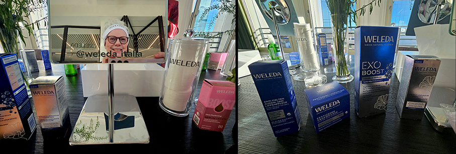
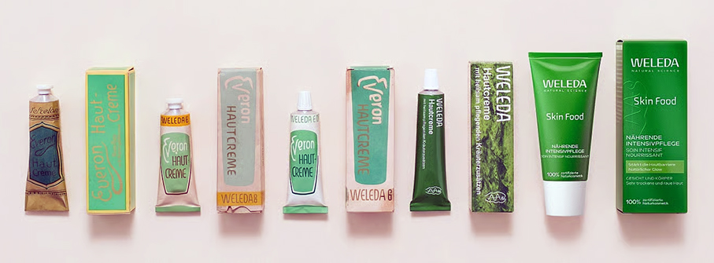
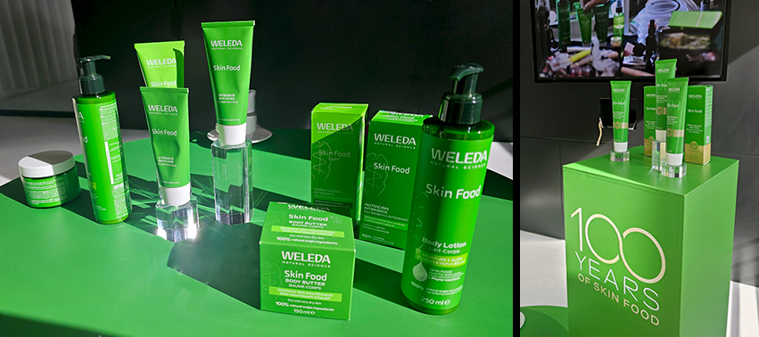
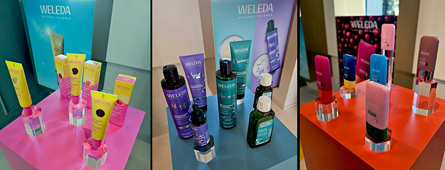
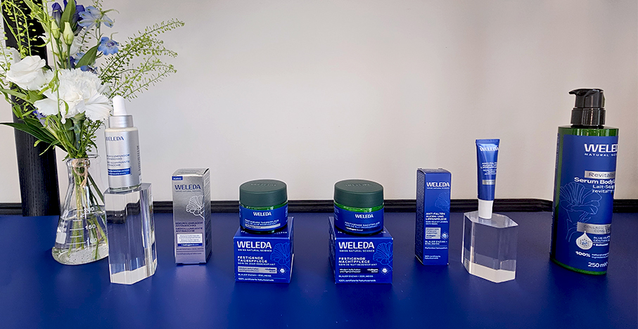
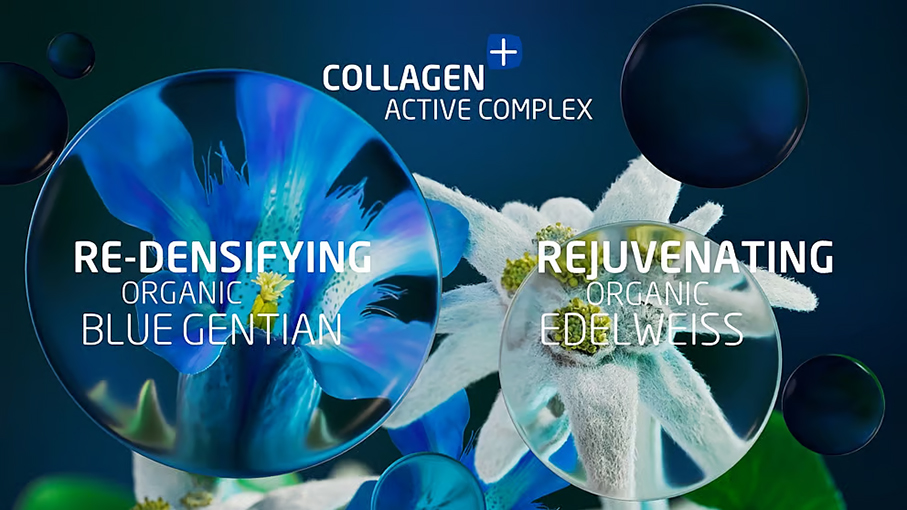

# Weleda – Bellezza e salute dal 1921

>Le nuove frontiere della **Skincare firmata Weleda**: attivi botanici selezionati con cura e texture che si fondono armoniosamente 

Sviluppare la **salute e la bellezza in armonia con la natura e l'essere umano** con ingredienti di origine naturale che siano efficaci, di alta qualità e innovativi: è questo l’obiettivo di Weleda. Nei cosmetici naturali Weleda, si combinano ingredienti attivi specifici come **estratti di piante, oli essenziali e oli vegetali** per soddisfare in modo ottimale le esigenze della pelle. Nel corso degli anni, il brand ha unito le **conoscenze acquisite dall'aromaterapia** alla **ricca esperienza nella formulazione di fragranze**. Inoltre, più dell'80% delle materie prime di origine vegetale e animale provengono da agricoltura biologica certificata.

Per parlare di questa filosofia e per presentare i nuovi prodotti,**Weleda ha organizzato una giornata dedicata alla stampa** con cui ha festeggiato anche i **100 anni di produzione della crema Skin Food**.

**SKIN FOOD**

Nata dalle piante, creata con cura, amata da generazioni: **dal 1926, l’iconica crema verde** ha conquistato la devozione di make-up artist e appassionati di bellezza in tutto il mondo. 

Ricca e nutriente, questa formula esclusiva rinforza la barriera cutanea e rivela un'inconfondibile luminosità. Un capolavoro che compie 100 anni e continua a entusiasmare gli amanti di Skin Food.

Un terzo della formula è composto da estratti naturali e preziosi oli vegetali, l'**esclusiva phyto-infusion**, una preziosa miscela 100% naturale di rosmarino, calendula, camomilla e viola del pensiero. Attraverso un processo di infusione lento e accurato, si preserva la potenza di queste piante per creare una formula che non solo nutre la pelle, ma ne restituisce anche la luminosità.

**BOOSTER DROPS**

Gli ingredienti naturali incontrano l’expertise scientifica. Questi booster possono essere utilizzati singolarmente per valorizzare le specifiche caratteristiche della pelle oppure **combinati tra loro, a seconda delle esigenze personali**. 
Disponibili in 6 varianti per ogni esigenza della pelle: **Siero Acido Ialuronico, Siero Multiomega, Siero Multivitaminico, Siero Glow, Siero Bronzing, Siero Antiossidante Protettivo**.

**TRATTAMENTO VISO CONTOURING**

La nuova Linea Viso Contouring per pelli mature aiuta ad attivare il **potere del collagene naturale** contro l’invecchiamento cutaneo. La sua formula unica con **Genziana Blu e Stella Alpina biologiche delle Alpi svizzere, unite a centella asiatica** ridensifica la pelle e riduce efficacemente le rughe profonde. 

Una formulazione innovativa con **Collagen+ Active Complex**, naturale al 100%,  che aumenta del 60% il collagene naturale della pelle, tonifica e rimpolpa la pelle, equilibrando la pigmentazione per un colorito uniforme.

**FLUIDO SOLARE UV GLOW SPF 30**

Il nuovo Fluido Solare unisce la prevenzione quotidiana all’SPF 30, donando alla pelle un finish naturalmente radioso. La soluzione perfetta per chi cerca **protezione e luminosità in un unico gesto**. La sua texture fluida e ultra leggera si fonde perfettamente con la pelle, senza lasciare aloni bianchi, offrendo una protezione immediata ad ampio spettro. Al cuore della formula si trova una **protezione ad ampio spettro UVA e UVB SPF 30**, basata su filtri 100% minerali. L’ossido di zinco e il biossido di titanio creano un film protettivo traspirante, leggero ed efficace, che difende la pelle senza appesantirla. Perfetto come base trucco.

**SIERO DOPPIO ESOSOMI**

Innovativo **siero bifasico 2 in 1 con applicatore esclusivo** e tecnologia **Peptide Exosoma** che rassoda, ridensifica, tonifica e illumina la pelle in modo duraturo, contrastando inoltre i segni della menopausa. Il segreto risiede nell’effetto di due fasi altamente efficaci:

**Fase 1**: Siero potenziatore di collagene
Un esclusivo Complesso Attivo Collagen+, composto da Genziana Blu biologica, Stella Alpina biologica e Centella Asiatica, è un potenziatore naturale di collagene. Aumenta i livelli di collagene di un impressionante 60%* per una maggiore compattezza ed elasticità della pelle. *Test in vitro.

**Fase 2**: Siero con Tecnologia Peptide Exosoma.
Weleda utilizza per la prima volta **esosomi di origine vegetale derivati dalla Centella Asiatica**. Questi innovativi principi attivi agiscono come vettori, trasportando potenti peptidi direttamente nelle cellule della pelle. 

_Ph. credits: Maria Rosa Sirotti_