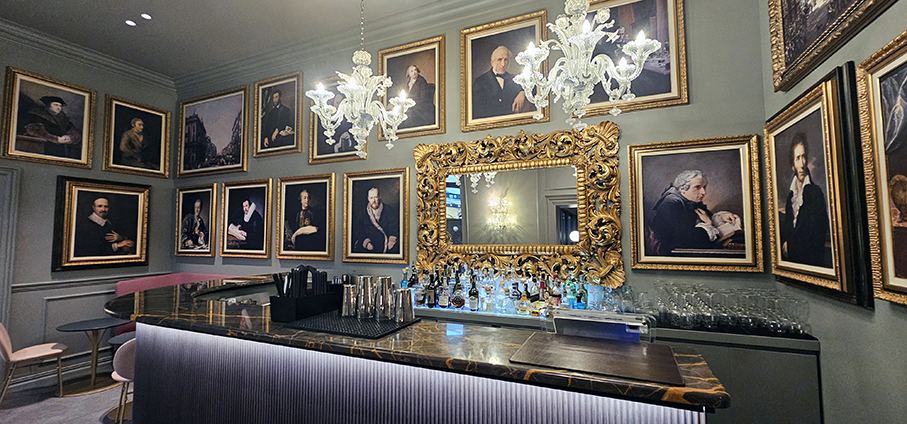
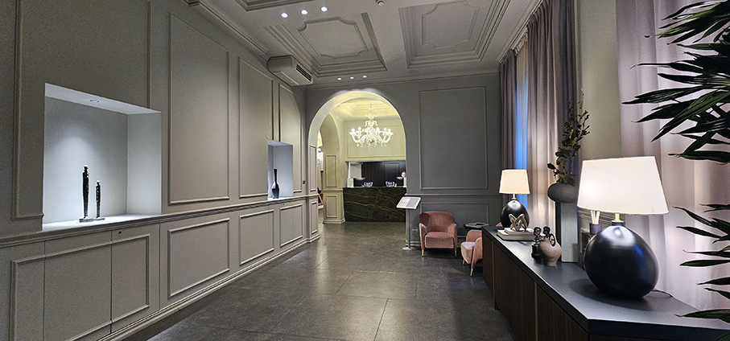
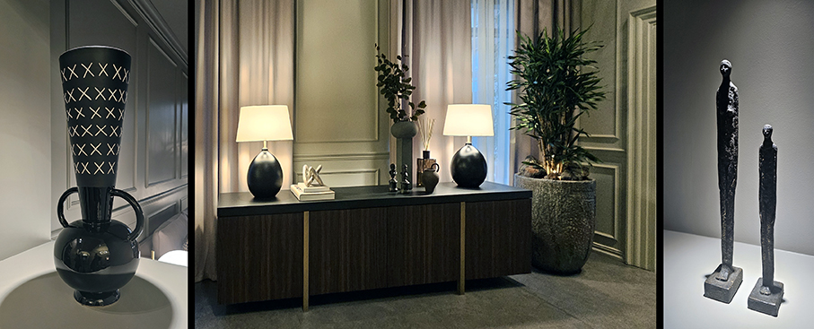
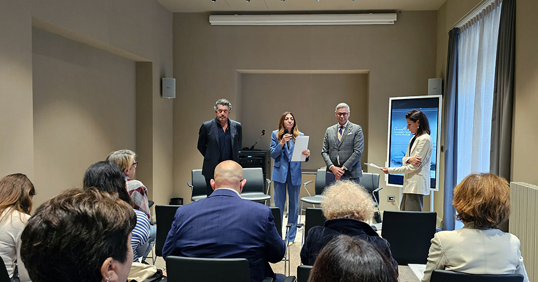
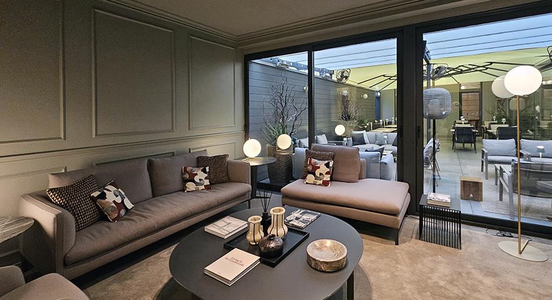
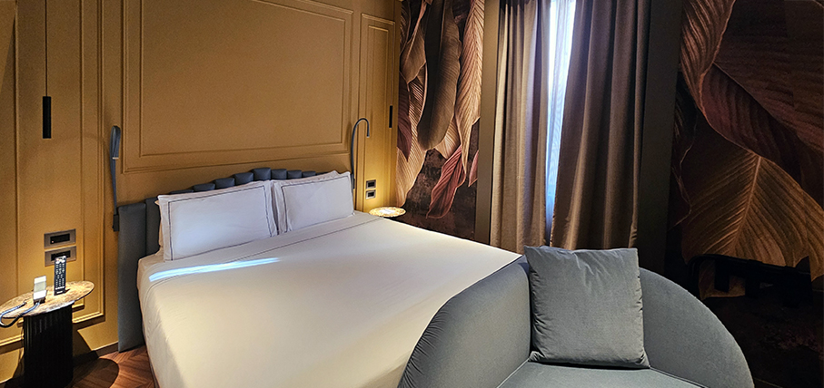
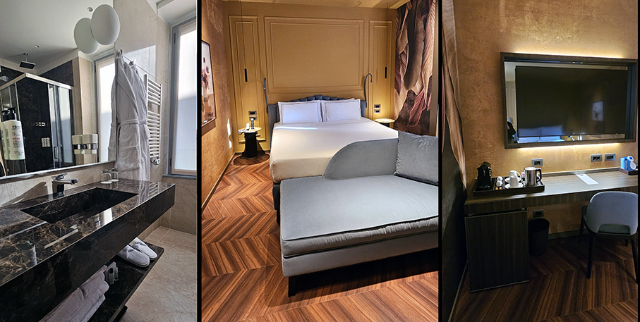
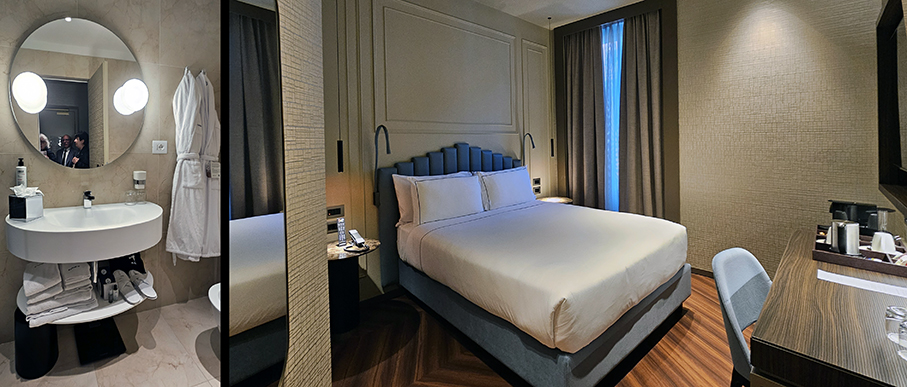

# Worldhotels Casati 18 - Milano 

> Dopo un profondo restyling, lo storico **Casati 18** entra nella **collezione Elite** by **BWH Hotels** 
 

Una nuova identità per **il WorldHotel Casati 18 situato a Milano**, nella zona di Porta Venezia. Protagonista di un profondo restyling interamente made in Italy curato dall’**architetto Max Minoja**, questo boutique hotel - già parte della collezione Distinctive del brand WorldHotels - entra ufficialmente nella prestigiosa **Elite Collection**, una delle più esclusive tra le quattro firmate BWH Hotels.

Un’evoluzione che consolida il posizionamento upper-upscale del brand e celebra l’eccellenza dell’ospitalità italiana, tra un **design ricercato, un’ospitalità sartoriale e uno spirito contemporaneo**. “_Il WorldHotel Casati 18 rappresenta una nuova tappa nel percorso di crescita di WorldHotels in Italia_ - commenta **Sara Digiesi, CEO di BWH Hotels Italy & South-East Europe** - _L’ingresso nella collezione Elite è il riconoscimento di una visione che mette al centro il valore dell’indipendenza, la qualità del servizio e la capacità di interpretare il territorio con stile e personalità”_.

WorldHotel Casati 18 non è solo un hotel: è **un luogo che racconta Milano attraverso il design, l’ospitalità e l’identità locale**. Le **80 camere e suite**, completamente ripensate, sono il risultato di un progetto curato da architetti e brand italiani di riferimento come **Molteni&C, Flos e Roda**. 

Materiali pregiati, atmosfere calde e dettagli sartoriali danno vita a spazi eleganti e accoglienti, pensati per chi cerca un’esperienza autentica. _”Il Casati 18 è pensato per chi desidera vivere Milano in modo autentico, con stile e comfort_ - dichiara **Luca Cellammare, Direttore del WorldHotel Casati 18** - _Abbiamo voluto creare un luogo che fosse espressione del design italiano e dell’anima vibrante di Porta Venezia. Ogni dettaglio, dagli arredi alla proposta gastronomica, è stato studiato per offrire un’esperienza memorabile e profondamente legata alla città”_.

La posizione è uno dei punti di forza: a pochi passi da Corso Buenos Aires e ben collegato con la rete metropolitana, il Casati 18 è il punto di partenza ideale per esplorare la città. Porta Venezia, con la sua architettura Liberty, la sua anima inclusiva e la sua vivace scena gastronomica e culturale, offre un contesto perfetto per un soggiorno urbano di charme. 

La **proposta food & beverage** si articola nel** ristorante 18 Contemporary**, che celebra la cucina mediterranea con ingredienti stagionali e tocchi creativi, e nella **lounge bar con terrazza esterna**, dove cocktail d’autore e piccoli piatti accompagnano momenti di relax e socialità. La colazione, servita ogni mattina, unisce **buffet continentale e proposte à la carte**, con specialità a base di uova, smoothie freschi e dolci artigianali. 

## BWH Hotels Italy and South-East Europe

**BWH Hotels è una realtà alberghiera** presente in tutto il mondo in oltre **100 Paesi con oltre 4000 strutture**. Gruppo leader in Italia, dove approda nel 1982, BWH Hotels Italy and South-East Europe conta oggi oltre **200 strutture presenti su tutto il territorio nazionale** e in altri 14 mercati. Da inizio 2024, è ufficiale la trasformazione in Società Benefit. I soci sono albergatori e possono contare su uno staff di 100 persone operative nella sede centrale di Milano e su tutto il territorio italiano. 
Alla guida del Gruppo **Sara Digiesi, Chief Executive Officer, e Walter Marcheselli, Presidente**.
Performance, capillarità, qualità, identità, innovazione e soluzioni personalizzate sono le keyword che BWH Hotels Italia & South-East Europe mette al servizio degli albergatori del suo network insieme a opportunità di marketing e distribuzione globali cui, altrimenti, gli hotel indipendenti non avrebbero accesso.
I loyalty program sono centrali per lo sviluppo del business. Best Western Rewards® e WorldHotels Rewards sono asset fondamentali sui quali il Gruppo può contare in tutto il mondo grazie ai 64 milioni di iscritti, clienti fedeli a quali sono offerti vantaggi, tariffe dedicate e benefit esclusivi. 
Al Gruppo fanno capo i brand: **WorldHotels®, Best Western Hotels & Resorts®, SureStay Hotels**.

